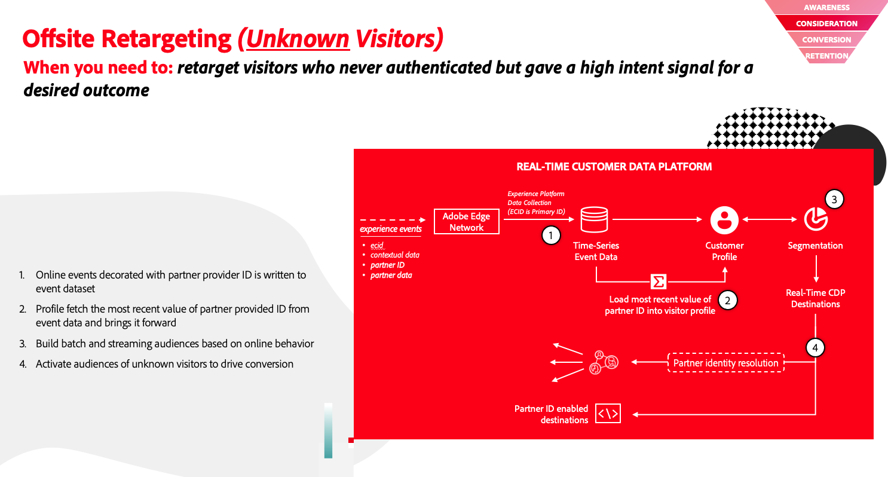

# Casi d’uso di esempio in Real-Time CDP

Visualizza esempi di casi di utilizzo cross-service per trarre il massimo dall’implementazione di Real-Time CDP. Questa pagina acquisisce alcuni casi d’uso resi possibili dall’utilizzo di vari servizi Adobe Experience Platform.

>[!IMPORTANT]
>
>I casi d’uso presentati in questa pagina sono un sottoinsieme dei casi d’uso aziendali che è possibile eseguire con Real-Time CDP. Stiamo lavorando all’aggiunta della documentazione per altri casi d’uso di esempio. Nel frattempo, contatta il rappresentante del tuo Adobe per esplorare altri casi d’uso oltre a quelli attualmente documentati sulla pagina.

## Supporto dati partner {#partner-data-support}

Con i cookie di terze parti impostati per scomparire nei prossimi anni, il supporto dei dati dei partner può riempire il vuoto lasciato dalla rimozione dei cookie di terze parti.

Adobe Real-Time CDP fornisce un supporto completo per gli identificatori dei partner, consentendoti di creare tipi di pubblico di potenziali clienti, arricchire i tipi di pubblico noti con attributi dei partner e molto altro.

I casi d’uso di esempio possono essere raggruppati in casi di acquisizione del cliente e casi di arricchimento del profilo. Per informazioni dettagliate sull’implementazione, consulta i collegamenti alla documentazione riportati di seguito.

### Acquisizione cliente {#customer-acquisition}

<table style="margin-top: 0 !important">
<tr>
  <td>
    
    

      <a href="../partner-data/prospecting.md">
    <strong>Nuova acquisizione cliente</strong>
    </a>
    

    

    <em>Coinvolgi e acquisisci nuovi clienti senza dipendere dai cookie di terze parti</em>
    

  </td>
  <td>
    
    

      <a href="../partner-data/onsite-personalization.md">
    <strong>Personalizzazione nel sito</strong>
    </a>
    

    

    <em>Personalizzare le esperienze nel sito di visitatori sconosciuti utilizzando il riconoscimento visitatori supportato dai partner</em>
    

  </td>
  <td>
    
    

      <a href="../partner-data/offsite-retargeting.md">
    <strong>Retargeting fuori sede di visitatori non autenticati</strong>
    </a>
    

    

    <em>Scopri come creare un pubblico di visitatori non autenticati ed effettuare il retargeting utilizzando gli ID duraturi forniti dai partner.</em>
    

  </td>
  </tr>
  </table>

### Arricchimento del profilo {#profile-enrichment}

<table style="margin-top: 0 !important">
<tr>
  <td>
    
    

      <a href="../partner-data/prospecting.md">
    <strong>Integrare i profili di prime parti con gli attributi forniti dai partner</strong>
    </a>
    

    

    <em>Puoi integrare i profili di prime parti con attributi provenienti da partner di dati affidabili, per migliorare la base di dati, ottenere nuove informazioni sulla base cliente e ottimizzare al meglio il pubblico.</em>
    

  </td>
  </tr>
  </table>

## Personalizzazione, approfondimenti, coinvolgimento {#personalization-insights-engagement}

<table style="margin-top: 0 !important">
<tr>
  <td>
    
    

      <a href="../partner-data/prospecting.md">
    <strong>Nuovo coinvolgimento intelligente</strong>
    </a>
    

    

    <em>Coinvolgi nuovamente i clienti che hanno abbandonato una conversione in modo intelligente e responsabile. Coinvolgi i clienti meno esperti con esperienze per aumentare la conversione e il valore del ciclo di vita del client.</em>
    

  </td>
  </tr>
  </table>
