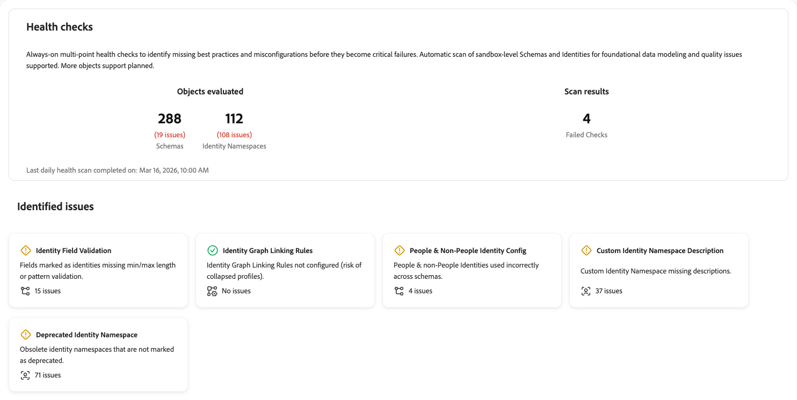
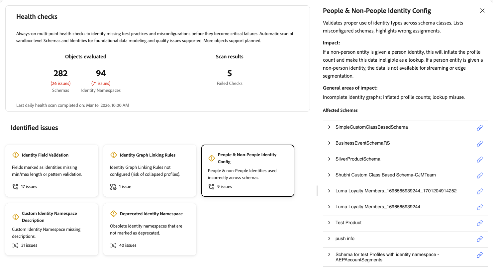
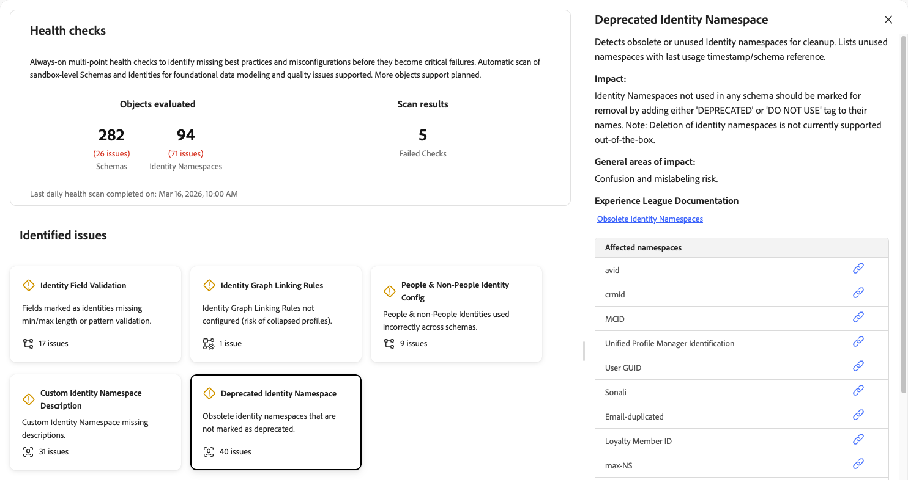

# Verifiche stato

I controlli di integrità analizzano gli schemi e le identità utilizzati nella sandbox e forniscono un riepilogo dei problemi che è possibile utilizzare per esplorare e risolvere i problemi con l’Assistente AI. In futuro, sarà possibile eseguire la scansione di un numero maggiore di oggetti per ottenere un rapporto più completo.

Configurazioni di schema e identità inadeguate causano significativi problemi a valle, tra cui creazione di profili errata, qualificazione dei segmenti non riuscita e attivazione imprecisa. Questi problemi sono difficili da rilevare e spesso richiedono competenze specialistiche da diagnosticare. I controlli di integrità spostano l&#39;approccio dalla risoluzione reattiva dei problemi alla manutenzione proattiva e preventiva.

I controlli di integrità consentono di:

* **Rileva problemi di configurazione in anticipo**: identifica best practice mancanti, configurazioni non corrette e pattern che causano inefficienze nella personalizzazione, nell&#39;attivazione e altro ancora.
* **Ricevi correzione guidata**: ottieni indicazioni chiare su ogni problema e su come risolverlo.
* **Monitoraggio continuo**: attualmente, i controlli di integrità eseguono scansioni automatiche giornaliere in modo da poter rilevare i problemi prima che diventino errori critici. La pianificazione potrebbe cambiare nelle versioni future.

## Prerequisiti {#prerequisites}

Per accedere ai controlli di integrità, è necessario disporre dell&#39;autorizzazione **[!UICONTROL View Health Checks]** [di controllo di accesso](/help/access-control/home.md#permissions). Contatta l’amministratore di sistema per assicurarti di disporre delle autorizzazioni appropriate.

## Accedere ai controlli di integrità {#access-health-checks}

Per accedere ai controlli di integrità dall&#39;interfaccia utente [!UICONTROL Experience Platform]:

1. Selezionare **[!UICONTROL Run and Operate]** dal menu di navigazione a sinistra.
1. Seleziona **[!UICONTROL Health Checks]**.

Nel dashboard dei controlli di integrità viene visualizzato un riepilogo dei risultati dell&#39;analisi più recente.

## Informazioni sul dashboard {#understanding-dashboard}

Il dashboard dei controlli di integrità fornisce tre aree di informazioni per aiutarti a valutare lo stato dell’implementazione.

### Oggetti valutati {#objects-evaluated}

La sezione **[!UICONTROL Objects evaluated]** mostra il numero totale di schemi e spazi dei nomi di identità analizzati, insieme al numero di problemi rilevati per ogni categoria. Questo offre una visualizzazione rapida dell’ambito e della gravità dei problemi di configurazione nella sandbox.

### Risultati dell’analisi {#scan-results}

Nella sezione **[!UICONTROL Scan results]** viene visualizzato il numero di controlli non riusciti. Un controllo non riuscito indica che uno o più controlli di integrità hanno rilevato problemi di configurazione che richiedono attenzione. L&#39;**ultima analisi dell&#39;integrità giornaliera completata il** timestamp indica quando è stata eseguita l&#39;analisi più recente.

### Problemi identificati {#identified-issues}

La sezione **[!UICONTROL Identified issues]** mostra una scheda per ogni controllo di integrità. Ogni scheda mostra:

* Il nome del controllo di integrità e una breve descrizione del problema.
* Il numero di problemi rilevati o una conferma dell’assenza di problemi.
* Un indicatore di stato che indica se il controllo è stato superato o richiede attenzione.

Seleziona una scheda per esplorare i dettagli di quel controllo di integrità.

## Controlli di integrità disponibili {#available-health-checks}

I controlli di integrità valutano attualmente cinque aree fondamentali della configurazione dello schema e dell’identità. Questi controlli riguardano i problemi di modellazione dei dati più incisivi in tutta la piattaforma.

### Convalida campo identità {#identity-field-validation}

Esegue la scansione per garantire che i campi di identità abbiano vincoli di lunghezza minima e massima e regole di pattern regex per l’integrità dei dati.

| Dettaglio | Descrizione |
| --- | --- |
| **Problema** | Nei campi contrassegnati come identità manca la lunghezza minima/massima o la convalida del pattern. |
| **Impatto** | Senza convalida, i valori di Garbage possono immettere [!DNL Identity Service]. Valori come &quot;0&quot;, &quot;Guest&quot; o maiuscole/minuscole non corrispondenti (ad esempio, &quot;xyz123&quot; versus &quot;XYZ123&quot;) compromettono l&#39;integrità del profilo assemblato durante la segmentazione e l&#39;attivazione. |
| **Rimedio** | Imposta la lunghezza minima/massima e i vincoli di pattern sui campi personalizzati contrassegnati come identità. Utilizza espressioni regolari per applicare regole quali solo cifre, lettere maiuscole o minuscole o combinazioni di caratteri specifiche. |

Quando selezioni la scheda **[!UICONTROL Identity Field Validation]**, a destra viene visualizzato un pannello dei dettagli. Il pannello mostra:

* **[!UICONTROL Description]**: esegue la scansione per verificare che i campi di identità abbiano lunghezza minima/massima e regole di pattern regex per l&#39;integrità dei dati. Elenca gli schemi e i campi interessati.
* **[!UICONTROL Impact]**: se i campi di identità negli schemi non hanno lunghezza minima/massima e le convalide dei modelli impostate, si potrebbero verificare dati incoerenti che potrebbero compromettere l&#39;integrità e la qualità dei dati.
* **[!UICONTROL General areas of impact]**: identificatori di bassa qualità in [!DNL Identity Service]; unione inaffidabile.
* **[!UICONTROL Experience League Documentation]**: collegamento alle best practice per la modellazione dei dati.
* **[!UICONTROL Affected Schemas]**: elenco degli schemi interessati, ciascuno con un modulo di espansione per visualizzare ulteriori dettagli e un collegamento per aprire lo schema.

Per ulteriori informazioni, vedere i [suggerimenti sull&#39;integrità dei dati](/help/xdm/schema/best-practices.md#data-integrity-tips) nella documentazione sulle best practice per gli schemi.

### Regole di collegamento del grafo identità {#identity-graph-linking-rules}

Verifica che le regole di collegamento del grafo delle identità siano configurate per una sandbox per impedire la compressione dei profili.

| Dettaglio | Descrizione |
| --- | --- |
| **Problema** | Le regole di collegamento del grafo delle identità non sono configurate per questa sandbox. |
| **Impatto** | Senza regole di collegamento, più profili diversi possono unirsi in un unico profilo (compressione del grafico). Alcuni dati provenienti da dispositivi condivisi o da identità non univoche possono attivare unioni indesiderate, che portano a una personalizzazione imprecisa. |
| **Rimedio** | Passare al menu **[!UICONTROL Identities]**, selezionare **[!UICONTROL Settings]** e selezionare almeno un&#39;identità univoca per ogni grafico. Questo abilita le regole di collegamento del grafo delle identità e impedisce la compressione del profilo. |

Quando selezioni la scheda **[!UICONTROL Identity Graph Linking Rules]**, a destra viene visualizzato un pannello dei dettagli. Il pannello mostra:

* **[!UICONTROL Description]**: verifica che le regole di collegamento corrette siano configurate per impedire la compressione dei profili. Mostra lo stato della regola corrente e identità univoche per grafico.
* **[!UICONTROL Impact]**: se le regole di collegamento del grafico delle identità non sono impostate, alcuni dati potrebbero tentare di unire più profili diversi in un unico profilo. Per evitare unioni indesiderate, è necessario utilizzare le configurazioni fornite tramite le regole di collegamento del grafico delle identità.
* **[!UICONTROL General areas of impact]**: profili compressi o uniti.
* **[!UICONTROL Experience League Documentation]**: collegamento alla panoramica delle regole di collegamento del grafico identità per ulteriori informazioni.
* **[!UICONTROL Configure linking rules]**: quando il controllo non riesce, viene visualizzato un pulsante che consente di configurare le regole di collegamento direttamente dal pannello.

Per ulteriori informazioni, consulta la [panoramica delle regole di collegamento del grafo delle identità](/help/identity-service/identity-graph-linking-rules/overview.md) e la [guida all&#39;implementazione](/help/identity-service/identity-graph-linking-rules/implementation-guide.md).

### Configurazione dell’identità di persone e non persone {#people-non-people-identity}

Convalida l’uso corretto dei tipi di identità persone e non persone nelle classi dello schema.

| Dettaglio | Descrizione |
| --- | --- |
| **Problema** | Gli identificatori non persone vengono utilizzati negli schemi di profilo individuale o di classe di Experience Event, oppure negli schemi di ricerca. |
| **Impatto** | Gli identificatori non persone negli schemi di profilo non partecipano al grafico delle identità, il che porta a una risoluzione incompleta delle identità. Gli identificatori delle persone negli schemi di ricerca aumentano il conteggio dei profili e rendono i dati non idonei per i casi di utilizzo della ricerca. Entrambi i casi rischiano di compromettere l’implementazione con miglioramenti futuri del prodotto. |
| **Rimedio** | Rivedi gli schemi con flag e correggi le assegnazioni del tipo di identità. Se possibile, rimuovi gli identificatori non relativi alle persone dagli schemi dei singoli profili. Per gli schemi già in uso dai set di dati, fai riferimento alle [regole di evoluzione dello schema](/help/xdm/schema/composition.md#evolution). |

Quando selezioni la scheda **[!UICONTROL People & Non-People Identity Config]**, a destra viene visualizzato un pannello dei dettagli. Il pannello mostra:

* **[!UICONTROL Description]**: convalida l&#39;uso corretto dei tipi di identità tra le classi dello schema. Elenca gli schemi non configurati correttamente ed evidenzia le assegnazioni errate.
* **[!UICONTROL Impact]**: se a un&#39;entità non-people viene assegnata un&#39;identità di persona, il conteggio dei profili verrà gonfiato e questi dati non saranno idonei per la ricerca. Se a un’entità persona viene assegnata un’identità non-people, i dati non sono disponibili per lo streaming o la segmentazione Edge.
* **[!UICONTROL General areas of impact]**: grafici di identità incompleti; conteggi di profili gonfiati; utilizzo errato della ricerca.
* **[!UICONTROL Affected Schemas]**: elenco di schemi con problemi. Espandi una riga di schema per visualizzare il percorso, il nome dell’identità e il tipo di schema per ogni configurazione errata. Utilizza l’icona del collegamento per aprire lo schema.

Per ulteriori informazioni, consulta la [documentazione sul tipo di identità](/help/identity-service/features/namespaces.md#identity-type) e le [best practice per gli schemi](/help/xdm/schema/best-practices.md).

### Descrizione dello spazio dei nomi dell’identità personalizzata {#namespace-missing-description}

Esegue la scansione per verificare che i metadati e le descrizioni dello spazio dei nomi delle identità personalizzate siano completi.

| Dettaglio | Descrizione |
| --- | --- |
| **Problema** | Il campo di descrizione degli spazi dei nomi di identità personalizzati non è presente. |
| **Impatto** | Le descrizioni mancanti possono causare confusione durante l’utilizzo e il debug. |
| **Rimedio** | Documenta ogni spazio dei nomi personalizzato compilando il campo di descrizione. Includi criteri di convalida (lunghezza minima/massima, modello) e informazioni sul ciclo di vita che identificano il sistema di origine esterno che crea tali identità. |

Quando selezioni la scheda **[!UICONTROL Custom Identity Namespace Description]**, a destra viene visualizzato un pannello dei dettagli. Il pannello mostra:

* **[!UICONTROL Description]**: esegue la scansione per verificare che i metadati e le descrizioni dello spazio dei nomi siano completi. Visualizza spazi dei nomi e proprietari con campi di descrizione vuoti.
* **[!UICONTROL Impact]**: l&#39;impostazione di una descrizione in uno spazio dei nomi di identità personalizzato migliora la chiarezza fornendo il contesto dello scopo di ogni spazio dei nomi. In questo modo i membri del team e le parti interessate possono comprendere rapidamente la funzione di ogni spazio dei nomi senza confusione.
* **[!UICONTROL General areas of impact]**: errore o confusione nell&#39;utilizzo; intento di convalida non chiaro.
* **[!UICONTROL Experience League Documentation]**: collegamento per creare spazi dei nomi personalizzati per ulteriori informazioni.
* **[!UICONTROL Affected namespaces]**: elenco di spazi dei nomi di identità personalizzati per i quali mancano descrizioni. Utilizza l’icona del collegamento accanto a ogni spazio dei nomi per visualizzarlo o modificarlo.

Per ulteriori informazioni, consulta la documentazione su [creazione di spazi dei nomi personalizzati](/help/identity-service/features/namespaces.md#create-namespaces).

### Spazio dei nomi identità obsoleto {#deprecated-namespace}

Rileva gli spazi dei nomi di identità obsoleti o non utilizzati che devono essere contrassegnati per la pulizia.

| Dettaglio | Descrizione |
| --- | --- |
| **Problema** | Gli spazi dei nomi di identità obsoleti non sono contrassegnati come obsoleti. |
| **Impatto** | Gli spazi dei nomi inutilizzati o obsoleti creano confusione su ciò che è attivamente in uso e aumentano il rischio di etichettatura errata dei campi di identità. |
| **Rimedio** | Rinomina gli spazi dei nomi inutilizzati per includere un prefisso &quot;Non utilizzare&quot; (ad esempio, &quot;Non utilizzare - [nome originale]&quot;). Adobe Experience Platform al momento non supporta l’eliminazione dello spazio dei nomi, pertanto l’approccio consigliato è la ridenominazione. |

Quando selezioni la scheda **[!UICONTROL Deprecated Identity Namespace]**, a destra viene visualizzato un pannello dei dettagli. Il pannello mostra:

* **[!UICONTROL Description]**: rileva spazi dei nomi di identità obsoleti o inutilizzati per la pulizia. Elenca gli spazi dei nomi inutilizzati con la marca temporale dell’ultimo utilizzo o il riferimento dello schema.
* **[!UICONTROL Impact]**: gli spazi dei nomi di identità non utilizzati in alcuno schema devono essere contrassegnati per la rimozione aggiungendo un tag &quot;DEPRECATED&quot; o &quot;DO NOT USE&quot; ai relativi nomi. L’eliminazione degli spazi dei nomi delle identità non è attualmente supportata.
* **[!UICONTROL General areas of impact]**: rischio di confusione e di etichettatura errata.
* **[!UICONTROL Experience League Documentation]**: collegamento agli spazi dei nomi delle identità obsolete per ulteriore documentazione.
* **[!UICONTROL Affected namespaces]**: elenco di spazi dei nomi di identità obsoleti o inutilizzati. Utilizza l’icona del collegamento accanto a ogni spazio dei nomi per visualizzarlo o gestirlo.

Per ulteriori informazioni, vedere l&#39;articolo [Experience Cloud knowledge base sugli spazi dei nomi obsoleti](https://experienceleague.adobe.com/it/docs/experience-cloud-kcs/kbarticles/ka-18155){target="_blank"}.

## Passaggi successivi {#next-steps}

Dopo aver esaminato i risultati del controllo di integrità, esplora le risorse seguenti per comprendere meglio:

* Scopri le [best practice per gli schemi](/help/xdm/schema/best-practices.md) per la progettazione di modelli di dati affidabili.
* Comprendere le [regole di collegamento del grafico delle identità](/help/identity-service/identity-graph-linking-rules/overview.md) per evitare la compressione del profilo.
* Consulta la [documentazione sullo spazio dei nomi delle identità](/help/identity-service/features/namespaces.md) per le best practice per la gestione dello spazio dei nomi.
* Esplora altri [strumenti di esecuzione e funzionamento](/help/run-and-operate/overview.md), tra cui [[!UICONTROL Job Schedules]](/help/run-and-operate/job-schedules.md) per la visibilità delle operazioni batch.
