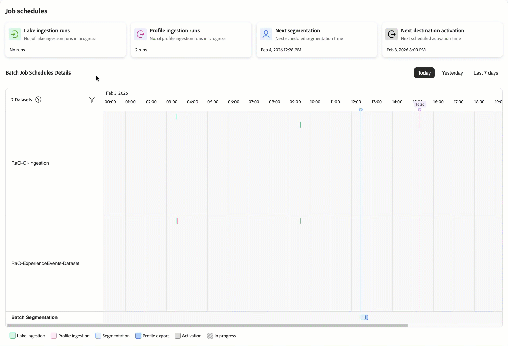
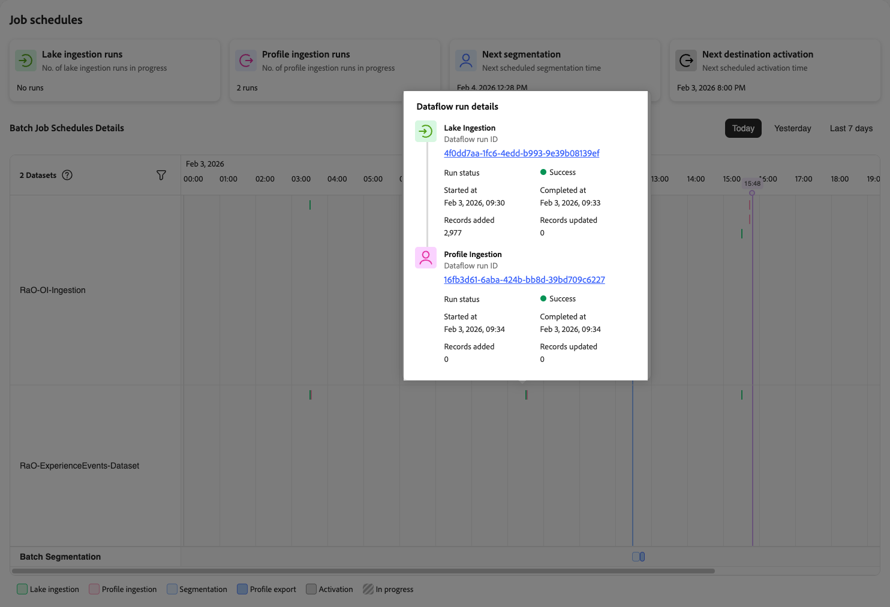

# Visualizza dettagli pianificazione processo

>[!AVAILABILITY]
>
>[!UICONTROL Job schedules] sono attualmente disponibili come versione limitata e solo per i seguenti processi Real-Time CDP:
>
> * Acquisizione di un data lake batch
> * Acquisizione profilo batch
> * Segmentazione batch
> * Attivazione della destinazione batch.

Per la risoluzione dei problemi relativi ai processi o l’analisi dei problemi di prestazioni, è necessario disporre di informazioni dettagliate su set di dati specifici ed esecuzioni dei relativi processi. L&#39;interfaccia [Pianificazioni processi](job-schedules.md) consente di eseguire il drill-down dalla visualizzazione della timeline in singoli set di dati e processi per comprendere la cronologia, la tempistica e lo stato dell&#39;esecuzione.

Utilizzare questa vista dettagliata per:

* Esaminare il motivo per cui un processo specifico non è riuscito o ha richiesto più tempo del previsto
* Rivedere la cronologia di esecuzione di un set di dati nel tempo
* Comprendere i modelli di tempistica e durata dei processi batch
* Identificare i batch specifici che causano problemi di pipeline
* Raccogli le informazioni necessarie per la risoluzione dei problemi con il supporto Adobe

## Prerequisiti {#prerequisites}

Prima di visualizzare i dettagli del processo, è necessario:

* Avere accesso a [!UICONTROL Job Schedules] con le autorizzazioni di controllo di accesso **[!UICONTROL View Job Schedules]** e **[!UICONTROL View Profile Management]** .
* Conoscere l&#39;interfaccia [Pianificazioni processi](job-schedules.md#understanding-interface) e la visualizzazione della timeline.
* Comprendi i diversi [tipi di processo](job-schedules.md#job-schedules-details) (acquisizione del lago, acquisizione del profilo, segmentazione, attivazione).

## Informazioni sulla gerarchia dei dettagli {#details-hierarchy}

Le pianificazioni dei processi forniscono tre livelli di dettaglio, consentendo di passare da modelli ampi a problemi specifici:

| Livello di visualizzazione | Cosa mostra | Quando utilizzarlo |
|------------|---------------|----------------|
| **Visualizzazione sequenza temporale** | Tutti i set di dati e i relativi processi pianificati nel periodo di tempo selezionato | Identificazione di pattern, individuazione di [anti-pattern](job-schedules-anti-patterns.md) e panoramica dell&#39;intera pipeline |
| **Dettagli set di dati** | Metriche aggregate e cronologia di esecuzione per un singolo set di dati | Monitoraggio delle prestazioni complessive di un set di dati, comprensione dei volumi di dati e revisione della frequenza dei processi |
| **Dettagli esecuzione processo** | Informazioni di esecuzione specifiche per una singola esecuzione di job | Analisi del motivo per cui un particolare processo non è riuscito, controllo della tempistica esatta e verifica dei record elaborati |

**Flusso di navigazione**: inizia con la visualizzazione timeline per identificare i problemi → Seleziona un set di dati per visualizzarne i dettagli → Seleziona un processo specifico da eseguire per analizzare i dettagli.

### Informazioni sulla vista timeline {#timeline-visualization}

La vista timeline utilizza un layout orizzontale e verticale per aiutarti a comprendere le pianificazioni dei processi e i tempi di elaborazione critici:

* **Asse orizzontale (progressione tempo)**: i set di dati e le relative esecuzioni dei processi vengono visualizzati nella sequenza temporale da sinistra a destra, indicando quando i processi vengono eseguiti nel periodo di tempo selezionato (oggi, ieri o gli ultimi 7 giorni). Ogni barra colorata rappresenta un&#39;esecuzione del processo, posizionata orizzontalmente in base all&#39;ora di inizio e di fine.

* **Asse verticale (orari di inizio pianificati)**: gli orari di inizio pianificati critici vengono visualizzati sotto forma di linee verticali che si estendono su tutti i set di dati, semplificando la visualizzazione della relazione temporale tra processi a monte ed elaborazione a valle:
   * **Linea verticale blu**: rappresenta l&#39;inizio pianificato della segmentazione
   * **Linea verticale nera**: indica quando è pianificato l&#39;inizio dell&#39;attivazione della destinazione

Questo layout consente di identificare rapidamente le relazioni temporali tra i processi della pipeline dei dati e l’elaborazione a valle. Idealmente, i processi a monte (come il data lake e l’acquisizione del profilo) dovrebbero essere completati a sinistra di questi marcatori verticali, garantendo che i dati siano pronti prima dell’inizio della segmentazione e dell’attivazione. I processi che si estendono oltre questi marcatori indicano potenziali problemi di tempistica in cui i processi a valle possono iniziare prima che i dati siano completamente preparati.

### Quale visualizzazione utilizzare? {#which-view}

Utilizzare la tabella seguente per scegliere la visualizzazione corretta per l&#39;attività. Fai corrispondere le operazioni necessarie con la visualizzazione consigliata per navigare in modo efficiente.

| Devo... | Usa questa visualizzazione |
|--------------|---------------|
| Visualizza contemporaneamente tutti i set di dati abilitati per il profilo e le relative pianificazioni | [Visualizzazione sequenza temporale](job-schedules.md) |
| Identificare conflitti di programmazione o anti-pattern | [Visualizzazione sequenza temporale](job-schedules.md) |
| Monitorare le prestazioni complessive di un set di dati | [Dettagli set di dati](#view-dataset-details) |
| Visualizzare il numero di record totali elaborati da un set di dati | [Dettagli set di dati](#view-dataset-details) |
| Confrontare le prestazioni del processo nel tempo per un set di dati | [Dettagli set di dati](#view-dataset-details) |
| Esaminare il motivo per cui un processo specifico non è riuscito | [Dettagli esecuzione processo](#view-job-details) |
| Controllare la tempistica esatta di una particolare esecuzione del processo | [Dettagli esecuzione processo](#view-job-details) |
| Verificare i record elaborati in una singola esecuzione | [Dettagli esecuzione processo](#view-job-details) |
| Accedere a messaggi di errore dettagliati | [Dettagli esecuzione processo](#view-job-details) → Seleziona ID esecuzione flusso di dati |

## Visualizzare i dettagli del set di dati {#view-dataset-details}

Per visualizzare i dettagli di un set di dati specifico:

1. Nella visualizzazione timeline **[!UICONTROL Job Schedules]**, individua il set di dati da esaminare.
2. Seleziona il nome del set di dati dalla colonna sinistra.

La vista Dettagli set di dati si apre in un pannello a destra, che mostra informazioni su tutti i processi associati a questo set di dati.

Il pannello dei dettagli del set di dati visualizza il nome del set di dati, l’ID e le metriche specifiche del processo organizzate per tipo di processo. Nella parte superiore del pannello, l’ID del set di dati viene visualizzato come collegamento cliccabile. Seleziona questo ID per passare alla pagina dei dettagli completa del set di dati.

Ogni pannello dei dettagli del set di dati include le metriche seguenti:

### Metriche di acquisizione del lago {#lake-ingestion-metrics}

Per i set di dati con processi di acquisizione del data lake, il pannello mostra le metriche seguenti:

| Metrica | Descrizione | Usa per |
|--------|-------------|---------|
| **[!UICONTROL Total runs]** | Numero totale di processi di acquisizione del data lake completati per questo set di dati | Tracciamento delle attività |
| **[!UICONTROL Runs in progress]** | Quanti processi di acquisizione sul lago sono attualmente in esecuzione | Rilevamento dei colli di bottiglia |
| **[!UICONTROL Total records added]** | Numero cumulativo di nuovi record aggiunti al data lake in tutte le esecuzioni di processi | Monitoraggio del volume |
| **[!UICONTROL Total ingestion time]** | Durata combinata di tutti i processi di acquisizione del data lake | Valutazione del tempo di elaborazione |
| **[!UICONTROL Total records updated]** | Numero cumulativo di record esistenti aggiornati durante l’acquisizione | Aggiorna analisi pattern |
| **[!UICONTROL Avg. ingestion speed (records/second)]** | Velocità effettiva media per i processi di acquisizione del data lake | Confronto delle prestazioni |

### Metriche di acquisizione del profilo {#profile-ingestion-metrics}

Per i set di dati con processi di acquisizione profilo, il pannello mostra le metriche seguenti:

| Metrica | Descrizione | Usa per |
|--------|-------------|---------|
| **[!UICONTROL Total runs]** | Numero totale di processi di acquisizione profilo completati per questo set di dati | Tracciamento delle attività |
| **[!UICONTROL Runs in progress]** | Quanti processi di acquisizione profilo sono attualmente in esecuzione | Rilevamento dei ritardi |
| **[!UICONTROL Total profiles created]** | Numero cumulativo di nuovi profili creati da questo set di dati in tutte le esecuzioni di processi | Monitoraggio della crescita dei profili |
| **[!UICONTROL Total profile ingestion time]** | La durata combinata di tutti i processi di acquisizione profilo | Identificazione problema di tempistica |
| **[!UICONTROL Total profiles updated]** | Numero cumulativo di profili esistenti aggiornati con i dati da questo set di dati | Tracciamento frequenza aggiornamenti |
| **[!UICONTROL Avg. profile ingestion speed (profiles/second)]** | Velocità effettiva media per processi di acquisizione profilo | Monitoraggio delle prestazioni |

>[!NOTE]
>
> Queste metriche mostrano i totali cumulativi in tutte le esecuzioni di processi per questo set di dati. Per visualizzare i dettagli di un’esecuzione specifica, seleziona un processo direttamente dalla timeline.

## Filtrare i set di dati nella timeline {#filter-datasets}

Se disponi di molti set di dati con processi pianificati, puoi concentrarti su set di dati specifici anziché visualizzarli tutti contemporaneamente. Il filtro set di dati consente di selezionare i set di dati da visualizzare nella vista timeline.

Per filtrare i set di dati visualizzati nella timeline:

1. Cerca il contatore di set di dati in alto a sinistra nella vista timeline (ad esempio, &quot;2 set di dati&quot;).
2. Seleziona l’icona del filtro accanto al contatore dei set di dati.
3. Viene aperto un pannello di selezione del set di dati, che mostra tutti i set di dati abilitati per il profilo disponibili con processi pianificati.
4. Seleziona o deseleziona i set di dati per mostrarli o nasconderli nella vista timeline.
5. La timeline si aggiorna immediatamente e mostra solo i set di dati selezionati.

Utilizza il filtro per:

* **Concentrati su origini dati specifiche**: per risolvere i problemi relativi a una particolare pipeline di dati, filtra per visualizzare solo i set di dati rilevanti.
* **Riduci l&#39;ingombro visivo**: se hai molti set di dati, il filtro ti aiuta a visualizzare più chiaramente i pattern per un sottoinsieme di dati.
* **Confronta set di dati correlati**: seleziona solo i set di dati correlati per comprenderne la relazione di pianificazione.
* **Analizza gli anti-pattern**: quando identifichi un potenziale [problema di configurazione](job-schedules-anti-patterns.md), filtra i set di dati interessati per esaminarli più da vicino.

Il filtro persiste durante la sessione, per consentirti di navigare tra i periodi di tempo (oggi, ieri, ultimi 7 giorni) mantenendo la selezione del set di dati.

## Visualizzare i dettagli dell&#39;esecuzione di singoli job {#view-job-details}

Quando è necessario analizzare un&#39;esecuzione di job specifica, selezionarla dalla timeline per visualizzare informazioni dettagliate sull&#39;esecuzione per tale esecuzione.

### Accedere ai dettagli dell’esecuzione del processo {#access-job-details}

Per visualizzare i dettagli di un job specifico, effettuare le operazioni riportate di seguito.

1. Nella visualizzazione timeline [!UICONTROL Job Schedules], individuare l&#39;esecuzione del processo specifica da analizzare.
2. Selezionare l&#39;indicatore del job sulla timeline (la barra colorata che rappresenta il job).

Viene aperto il pannello **[!UICONTROL Dataflow run details]**, con le informazioni sull&#39;esecuzione del processo specifica.

### Dettagli dell’esecuzione del flusso di dati {#dataflow-run-details}

Il pannello dei dettagli dell’esecuzione del flusso di dati visualizza informazioni sull’esecuzione specifica del processo, organizzate per tipo di processo. Per i processi di acquisizione, vedrai i dettagli sia per le fasi di acquisizione del lago che per quelle di acquisizione del profilo.

#### Dettagli del processo di acquisizione Lake {#lake-ingestion-job-details}

| Campo | Descrizione |
|-------|-------------|
| **[!UICONTROL Dataflow run ID]** | L’identificatore univoco per questa specifica esecuzione del processo di acquisizione lake. Seleziona l’ID per visualizzare i dettagli completi del monitoraggio del flusso di dati. |
| **[!UICONTROL Run status]** | Risultato del processo (Completato, Non riuscito, In corso, In coda). Un indicatore verde mostra il completamento riuscito. |
| **[!UICONTROL Started at]** | La data e l’ora in cui è iniziata l’esecuzione del processo di acquisizione del lago. |
| **[!UICONTROL Completed at]** | La data e l’ora in cui il processo di acquisizione del lago ha completato l’esecuzione. |
| **[!UICONTROL Records added]** | Il numero di nuovi record aggiunti al data lake durante l&#39;esecuzione del processo. |
| **[!UICONTROL Records updated]** | Il numero di record esistenti che sono stati aggiornati nel data lake durante l’esecuzione del processo. |

#### Dettagli del processo di acquisizione del profilo {#profile-ingestion-job-details}

| Campo | Descrizione |
|-------|-------------|
| **[!UICONTROL Dataflow run ID]** | L’identificatore univoco per questa esecuzione del processo di acquisizione profilo specifica. Seleziona l’ID per visualizzare i dettagli completi del monitoraggio del flusso di dati. |
| **[!UICONTROL Run status]** | Risultato del processo (Completato, Non riuscito, In corso, In coda). Un indicatore verde mostra il completamento riuscito. |
| **[!UICONTROL Started at]** | La data e l’ora in cui è iniziata l’esecuzione del processo di acquisizione del profilo. |
| **[!UICONTROL Completed at]** | La data e l’ora in cui il processo di acquisizione del profilo è stato completato. |
| **[!UICONTROL Records added]** | Il numero di nuovi profili creati durante l’esecuzione del processo. |
| **[!UICONTROL Records updated]** | Il numero di profili esistenti che sono stati aggiornati durante l’esecuzione del processo. |

### Informazioni sul flusso di esecuzione dei processi {#job-execution-flow}

Quando visualizzi un’esecuzione di processo specifica, puoi vedere la relazione tra l’acquisizione del lago e l’acquisizione del profilo:

* **L&#39;acquisizione del lago viene eseguita per prima**: i dati vengono caricati nel data lake e convalidati.
* **L&#39;acquisizione del profilo segue**: al termine dell&#39;acquisizione sul lago, i record idonei vengono elaborati nell&#39;archivio dei profili.
* **Il tempo è importante**: tieni presente la differenza di tempo tra il completamento dell&#39;acquisizione del lago e l&#39;inizio dell&#39;acquisizione del profilo. Eventuali lacune possono influire sui processi a valle, come la segmentazione.

**Utilizza i dettagli di esecuzione processo per**:

* Verificare che un processo specifico sia stato completato correttamente
* Calcolare la durata effettiva di un&#39;esecuzione del processo (tempo di completamento meno tempo di avvio)
* Comprendere quanti record sono stati elaborati in una specifica esecuzione
* Confronto delle prestazioni tra diverse esecuzioni dei processi
* Accesso al monitoraggio dettagliato dei flussi di dati per la risoluzione dei problemi
* Identificare i problemi di tempistica tra le fasi di acquisizione del lago e del profilo

## Risoluzione dei problemi con i dettagli processo {#troubleshooting}

Utilizza i dettagli del processo per analizzare i problemi e determinare i passaggi successivi:

**Processi non riusciti**: seleziona l&#39;ID di esecuzione del flusso di dati per visualizzare i dettagli dell&#39;errore nel dashboard di monitoraggio. Controlla i [dettagli set di dati](#view-dataset-details) per individuare pattern ricorrenti, controlla la [timeline](job-schedules.md) per il conflitto di risorse e identifica [anti-pattern](job-schedules-anti-patterns.md) nella configurazione.

**Processi lenti**: confronta la durata con le medie storiche in [metriche del set di dati](#view-dataset-details). Le cause più comuni includono [sovrapposizione pianificazione](job-schedules-anti-patterns.md#schedule-overlap-pattern), [stacking batch denso](job-schedules-anti-patterns.md#scheduled-density) o aumento del volume dei dati.

**Mancata corrispondenza record**: confronta i record di acquisizione del lake con i record di acquisizione del profilo nei dettagli di esecuzione del processo. L’acquisizione del profilo in genere mostra un numero inferiore di record a causa dei requisiti di identità e delle regole di qualità dei dati.

Per informazioni dettagliate sullo stato del flusso di dati, consulta [Monitorare l&#39;acquisizione del data lake](../dataflows/ui/monitor-sources.md), [Monitorare i flussi di dati per i profili](../dataflows/ui/monitor-profiles.md), [Monitorare i flussi di dati per i tipi di pubblico](../dataflows/ui/monitor-audiences.md) e [Monitorare i flussi di dati per le destinazioni](../dataflows/ui/monitor-destinations.md).

## Passaggi successivi {#next-steps}

Dopo aver appreso come visualizzare i dettagli del processo:

* Rivedi la [Panoramica sugli Schedules per i processi](job-schedules.md) per comprendere la visualizzazione della timeline e l&#39;interfaccia.
* Scopri [anti-pattern](job-schedules-anti-patterns.md) per evitare problemi di configurazione comuni.
* Comprendi l&#39;[acquisizione batch](../ingestion/batch-ingestion/overview.md) per ottimizzare le pianificazioni di caricamento dei dati.
* Esplora [il monitoraggio dei flussi di dati di destinazione](../dataflows/ui/monitor-destinations.md) per la visibilità della pipeline end-to-end.
