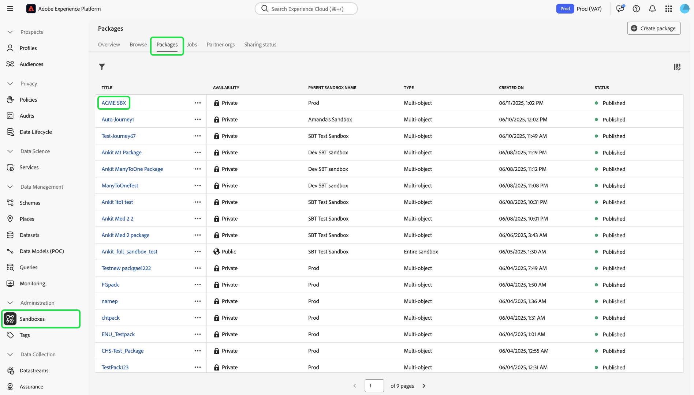
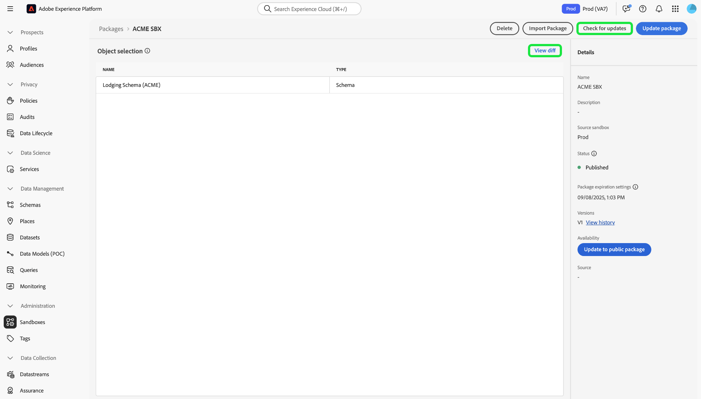
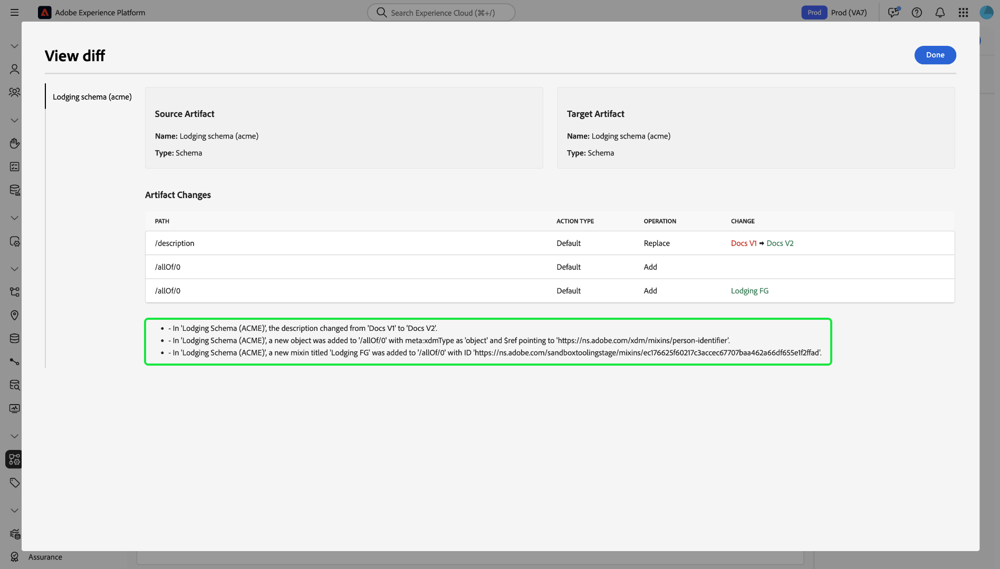

# Strumenti sandbox

>[!NOTE]
>
>Gli strumenti sandbox sono una funzionalità fondamentale che supporta sia [!DNL Real-Time Customer Data Platform] che [!DNL Journey Optimizer] per migliorare l&#39;efficienza del ciclo di sviluppo e la precisione della configurazione.  Per utilizzare la funzionalità strumenti sandbox, è necessario disporre delle due autorizzazioni di controllo dell&#39;accesso basate sul ruolo seguenti: - `manage-sandbox` o `view-sandbox` - `manage-package`

Migliora la precisione della configurazione nelle sandbox ed esporta e importa facilmente le configurazioni sandbox tra sandbox con la funzione di strumenti sandbox. Utilizza gli strumenti sandbox per ridurre il time-to-value per il processo di implementazione e spostare le configurazioni corrette tra le sandbox.

È possibile utilizzare la funzione degli strumenti sandbox per selezionare oggetti diversi ed esportarli in un pacchetto. Un pacchetto può essere costituito da uno o più oggetti. <!--or an entire sandbox.-->Tutti gli oggetti inclusi in un pacchetto devono appartenere alla stessa sandbox.

## Oggetti supportati per gli strumenti sandbox {#supported-objects}

La funzionalità di strumenti sandbox consente di esportare [!DNL Adobe Real-Time Customer Data Platform] e [!DNL Adobe Journey Optimizer] oggetti in un pacchetto.

### Oggetti di Real-time Customer Data Platform {#real-time-cdp-objects}

>[!BEGINSHADEBOX]

### Modifiche alle importazioni di tipi di pubblico con più entità

Con gli aggiornamenti dell&#39;architettura [B2B](../../rtcdp/b2b-architecture-upgrade.md), non sarà più possibile importare tipi di pubblico con più entità con attributi B2B ed eventi di esperienza se un pacchetto che includeva tali tipi di pubblico è stato pubblicato prima dell&#39;aggiornamento. Questi tipi di pubblico non verranno importati e non potranno essere convertiti automaticamente nella nuova architettura.

Per ovviare a questo limite, è necessario creare un nuovo pacchetto con i tipi di pubblico aggiornati e quindi importarli nelle rispettive sandbox di destinazione utilizzando gli strumenti sandbox.

>[!ENDSHADEBOX]

Nella tabella seguente sono elencati [!DNL Adobe Real-Time Customer Data Platform] oggetti attualmente supportati per gli strumenti sandbox:

| Piattaforma | Oggetto | Dettagli |
| --- | --- | --- |
| Customer Data Platform | Origini | <ul><li>Le credenziali dell’account di origine non vengono replicate nella sandbox di destinazione per motivi di sicurezza e sarà necessario aggiornarle manualmente.</li><li>Per impostazione predefinita, il flusso di dati di origine viene copiato in stato di bozza.</li></ul> **NOTA:** Attualmente, gli strumenti sandbox supportano solo flussi di dati di origine basati su batch. I flussi di dati di origine basati su streaming non sono supportati. |
| Customer Data Platform | Tipi di pubblico | <ul><li>È supportato solo il tipo **[!UICONTROL Customer Audience]** **[!UICONTROL Segmentation service]**.</li><li>Le etichette esistenti per il consenso e la governance verranno copiate nello stesso processo di importazione.</li><li> Il sistema selezionerà automaticamente il criterio di unione predefinito nella sandbox di destinazione con la stessa classe XDM durante il controllo delle dipendenze dei criteri di unione.</li><li>Se durante l’importazione di tipi di pubblico viene rilevato un oggetto esistente con lo stesso nome, gli strumenti Sandbox riutilizzeranno sempre l’oggetto esistente per evitare la proliferazione degli oggetti.</li></ul> |
| Customer Data Platform | Identità | <ul><li>Durante la creazione nella sandbox di destinazione, il sistema deduplica automaticamente gli spazi dei nomi di identità standard di Adobe.</li><li>I tipi di pubblico possono essere copiati solo quando tutti gli attributi nelle regole del pubblico sono abilitati nello schema di unione. Gli schemi necessari devono prima essere spostati e abilitati per il profilo unificato.</li></ul> |
| Customer Data Platform | Schemi/Gruppi di campi/Tipi di dati | <ul><li>Le etichette esistenti per il consenso e la governance verranno copiate nello stesso processo di importazione.</li><li>Puoi importare gli schemi in modo flessibile anche se l’opzione Profilo unificato non è abilitata. Il caso edge delle relazioni di schema non è incluso nel pacchetto.</li><li>Se durante l’importazione di schemi o gruppi di campi viene rilevato un oggetto esistente con lo stesso nome, gli strumenti Sandbox riutilizzeranno sempre l’oggetto esistente per evitare la proliferazione degli oggetti.</li></ul> |
| Customer Data Platform | Set di dati | I set di dati vengono copiati con l’impostazione di profilo unificato disabilitata per impostazione predefinita. |
| Customer Data Platform | Criteri di consenso e governance | Aggiungi a un pacchetto i criteri personalizzati creati da un utente e spostali tra le diverse sandbox. |

I seguenti oggetti vengono importati ma sono in stato bozza o disabilitato:

| Funzione | Oggetto | Stato |
| --- | --- | --- |
| Stato importazione | Flusso di dati di Source | Bozza |
| Stato importazione | Percorso | Bozza |
| Profilo unificato | Set di dati | Profilo unificato disabilitato |
| Criteri | Criteri di governance dei dati | Disabilitata |

### Oggetti Adobe Journey Optimizer {#abobe-journey-optimizer-objects}

Nella tabella seguente sono elencati [!DNL Adobe Journey Optimizer] oggetti attualmente supportati per gli strumenti e le limitazioni della sandbox:

| Piattaforma | Oggetto | Oggetti dipendenti supportati | Dettagli |
| --- | --- | --- | --- |
| [!DNL Adobe Journey Optimizer] | Pubblico | | Un pubblico può essere copiato come oggetto dipendente dell’oggetto percorso. Puoi selezionare Crea un nuovo pubblico o riutilizzarne uno esistente nella sandbox di destinazione. |
| [!DNL Adobe Journey Optimizer] | Schema | | Gli schemi utilizzati nel percorso possono essere copiati come oggetti dipendenti. Puoi selezionare Crea un nuovo schema o riutilizzarne uno esistente nella sandbox di destinazione. |
| [!DNL Adobe Journey Optimizer] | Criterio di unione | | I criteri di unione utilizzati nel percorso possono essere copiati come oggetti dipendenti. Nella sandbox di destinazione **non puoi** creare un nuovo criterio di unione. Puoi utilizzarne solo uno esistente. |
| [!DNL Adobe Journey Optimizer] | Percorso | I seguenti oggetti utilizzati nel percorso vengono copiati come oggetti dipendenti. Durante il flusso di lavoro di importazione, puoi scegliere **[!UICONTROL Create new]** o **[!UICONTROL Use existing]** per ciascuno: <ul><li>Tipi di pubblico</li><li>Dettagli area di lavoro</li><li>Modelli di contenuto</li><li>Azioni personalizzate</li><li>Origini dati</li><li>Eventi</li><li>Gruppi di campi</li><li>Frammenti</li><li>Schemi</li></ul> | Quando selezioni **[!UICONTROL Use existing]** durante il processo di importazione per copiare un percorso in un&#39;altra sandbox, le azioni personalizzate esistenti che scegli **devono** corrispondere esattamente all&#39;azione personalizzata di origine. Se non corrispondono, il nuovo percorso genererà errori irrisolvibili. Il percorso copia gli eventi e i dettagli dell&#39;evento utilizzati e crea una nuova versione nella sandbox di destinazione. |
| [!DNL Adobe Journey Optimizer] | Azione | | I messaggi e-mail e push utilizzati nel percorso possono essere copiati come oggetti dipendenti. Le attività di azione del canale utilizzate nei campi del percorso, che vengono utilizzate per la personalizzazione nel messaggio, non vengono controllate per completezza. I blocchi di contenuto non vengono copiati.  È possibile copiare l&#39;azione di aggiornamento del profilo utilizzata nel percorso. Le azioni personalizzate possono essere aggiunte a un pacchetto in modo indipendente. Vengono copiati anche i dettagli delle azioni utilizzati nel percorso. Crea sempre una nuova versione nella sandbox di destinazione. |
| [!DNL Adobe Journey Optimizer] | Azioni personalizzate |  | Le azioni personalizzate possono essere aggiunte a un pacchetto in modo indipendente. Una volta assegnata a un percorso, un’azione personalizzata non può più essere modificata. Per apportare aggiornamenti alle azioni personalizzate, devi: <ul><li>spostare le azioni personalizzate prima di eseguire la migrazione di un percorso</li><li>aggiorna le configurazioni (come intestazioni di richiesta, parametri di query e autenticazione) per le azioni personalizzate dopo la migrazione</li><li>esegui la migrazione degli oggetti percorso con le azioni personalizzate aggiunte durante il primo passaggio</li></ul> |
| [!DNL Adobe Journey Optimizer] | Modello di contenuto | | Un modello di contenuto può essere copiato come oggetto dipendente dell&#39;oggetto percorso. I modelli autonomi consentono di riutilizzare facilmente i contenuti personalizzati nelle campagne e nei percorsi Journey Optimizer. |
| [!DNL Adobe Journey Optimizer] | Frammento | Tutti i frammenti nidificati. | Un frammento può essere copiato come oggetto dipendente dell’oggetto percorso. I frammenti sono componenti riutilizzabili a cui è possibile fare riferimento in una o più e-mail in campagne e percorsi Journey Optimizer. |
| [!DNL Adobe Journey Optimizer] | Campagne | I seguenti oggetti utilizzati nella campagna vengono copiati come oggetti dipendenti: <ul><li>Campagne</li><li>Tipi di pubblico</li><li>Schemi</li><li>Modelli di contenuto</li><li>Frammenti</li><li>Messaggio/Contenuto</li><li>Configurazione dei canali</li><li>Oggetti decisionali unificati</li><li>Impostazioni/varianti esperimento</li></ul> | <ul><li>Le campagne possono essere copiate insieme a tutti gli elementi relativi al profilo, al pubblico, allo schema, ai messaggi in linea e agli oggetti dipendenti. Alcuni elementi non vengono copiati, ad esempio le etichette di utilizzo dei dati e le impostazioni della lingua. Per un elenco completo degli oggetti che non possono essere copiati, fare riferimento alla guida [esportazione di oggetti in un&#39;altra sandbox](https://experienceleague.adobe.com/it/docs/journey-optimizer/using/configuration/copy-objects-to-sandbox).</li><li>Se esiste una configurazione identica, il sistema rileva e riutilizza automaticamente un oggetto di configurazione del canale esistente nella sandbox di destinazione. Se non viene trovata alcuna configurazione corrispondente, la configurazione del canale viene ignorata durante l’importazione e gli utenti devono aggiornare manualmente le impostazioni del canale nella sandbox di destinazione per questo percorso.</li><li>Gli utenti possono riutilizzare gli esperimenti e i tipi di pubblico esistenti nella sandbox di destinazione come oggetti dipendenti delle campagne selezionate.</li></ul> |
| [!DNL Adobe Journey Optimizer] | Funzione Decisioni | Prima di copiare gli oggetti Decisioning, nella sandbox di destinazione devono essere presenti i seguenti oggetti: <ul><li>Attributi di profilo utilizzati negli oggetti Decisioning</li><li>Gruppo di campi di Attributi offerta personalizzati</li><li>Gli schemi di flussi di dati utilizzati per gli attributi di contesto tra regole, classificazione o limite.</li></ul> | <ul><li>La copia delle formule di classificazione che utilizzano modelli AI non è attualmente supportata.</li><li>Gli elementi decisionali (elementi offerta) non vengono inclusi automaticamente. Per assicurarsi che siano trasferiti, aggiungili manualmente utilizzando l&#39;opzione **Aggiungi al pacchetto**.</li><li>I criteri che utilizzano una strategia di selezione richiedono l’aggiunta manuale degli elementi decisionali associati durante il processo di copia. I criteri che utilizzano elementi di decisione manuali o di fallback includeranno automaticamente tali elementi come dipendenze dirette.</li><li>Gli elementi decisionali devono essere copiati prima di qualsiasi altro oggetto correlato.</li></ul> |

Attributi di profilo utilizzati negli oggetti Decisioning,
Il gruppo di campi Attributi offerta personalizzati,
Gli schemi di flussi di dati utilizzati per gli attributi di contesto tra regole, classificazione o limite.

Le superfici (ad esempio i predefiniti) non vengono copiate. Il sistema seleziona automaticamente la corrispondenza più simile possibile nella sandbox di destinazione in base al tipo di messaggio e al nome della superficie. Se nella sandbox di destinazione non è presente alcuna superficie, la copia della superficie avrà esito negativo e la copia del messaggio avrà esito negativo perché un messaggio richiede che una superficie sia disponibile per l’impostazione. In questo caso, affinché la copia funzioni, è necessario creare almeno una superficie per il canale destro del messaggio.

I tipi di identità personalizzati non sono supportati come oggetti dipendenti durante l’esportazione di un percorso.

## Esportare oggetti in un pacchetto {#export-objects}

>[!NOTE]
>
>Tutte le azioni di esportazione vengono registrate nei registri di audit.

>[!CONTEXTUALHELP]
>id="platform_sandbox_tooling_remove_object"
>title="Rimuovere un oggetto"
>abstract="Per rimuovere un oggetto dal pacchetto, seleziona la riga da rimuovere e quindi utilizza l’opzione elimina, disponibile al momento della selezione. Non è possibile rimuovere oggetti dai pacchetti pubblicati."

>[!CONTEXTUALHELP]
>id="platform_sandbox_package_expiry"
>title="Impostazioni di scadenza pacchetto"
>abstract="I pacchetti sono impostati per scadere dopo un periodo di inattività in stato di bozza. La data predefinita è impostata a 90 giorni a partire da oggi. Questa data continua a cambiare fino alla pubblicazione del pacchetto. Se un utente visita il pacchetto in stato di bozza domani, la data viene spostata di 1 giorno (a meno che non venga impostata manualmente)."

>[!CONTEXTUALHELP]
>id="platform_sandbox_tooling_package_status"
>title="Stato pacchetto"
>abstract="Per impostazione predefinita, lo stato è impostato su bozza. Dopo la pubblicazione del pacchetto, lo stato viene modificato in pubblicato. Non è possibile apportare modifiche dopo la pubblicazione del pacchetto."

>[!NOTE]
>
>È possibile importare un pacchetto solo se si dispone dell&#39;autorizzazione per accedere agli oggetti.

Questo esempio documenta il processo di esportazione di uno schema e di aggiunta a un pacchetto. È possibile utilizzare lo stesso processo per esportare altri oggetti, ad esempio set di dati, percorsi e molto altro.

### Aggiungi oggetto a un nuovo pacchetto {#add-object-to-new-package}

Selezionare **[!UICONTROL Schemas]** dal menu di navigazione a sinistra, quindi selezionare la scheda **[!UICONTROL Browse]** in cui sono elencati gli schemi disponibili. Quindi, selezionare i puntini di sospensione (`...`) accanto allo schema selezionato e un menu a discesa visualizza i controlli. Seleziona **[!UICONTROL Add to package]** dal menu a discesa.

![Elenco di schemi che mostrano il menu a discesa che evidenzia il controllo [!UICONTROL Add to package].](../images/ui/sandbox-tooling/add-to-package.png)

Dalla finestra di dialogo **[!UICONTROL Add to package]**, seleziona l&#39;opzione **[!UICONTROL Create new package]**. Fornisci [!UICONTROL Name] per il pacchetto e un [!UICONTROL Description] facoltativo, quindi seleziona **[!UICONTROL Add]**.

![Finestra di dialogo [!UICONTROL Add to package] con [!UICONTROL Create new package] selezionato ed evidenziazione di [!UICONTROL Add].](../images/ui/sandbox-tooling/create-new-package.png)

Sei tornato all&#39;ambiente **[!UICONTROL Schemas]**. È ora possibile aggiungere altri oggetti al pacchetto creato seguendo i passaggi successivi elencati di seguito.

### Aggiungere un oggetto a un pacchetto esistente e pubblicarlo {#add-object-to-existing-package}

Per visualizzare un elenco degli schemi disponibili, selezionare **[!UICONTROL Schemas]** dal menu di navigazione a sinistra, quindi selezionare la scheda **[!UICONTROL Browse]**. Selezionare quindi i puntini di sospensione (`...`) accanto allo schema selezionato per visualizzare le opzioni di controllo in un menu a discesa. Seleziona **[!UICONTROL Add to package]** dal menu a discesa.

![Elenco di schemi che mostrano il menu a discesa che evidenzia il controllo [!UICONTROL Add to package].](../images/ui/sandbox-tooling/add-to-package.png)

Viene visualizzata la finestra di dialogo **[!UICONTROL Add to package]**. Seleziona l&#39;opzione **[!UICONTROL Existing package]**, quindi seleziona il menu a discesa **[!UICONTROL Package name]** e il pacchetto richiesto. Infine, selezionare **[!UICONTROL Add]** per confermare le scelte.

Finestra di dialogo ![[!UICONTROL Add to package], visualizzazione di un pacchetto selezionato dal menu a discesa.](../images/ui/sandbox-tooling/add-to-existing-package.png)

Viene elencato l&#39;elenco degli oggetti aggiunti al pacchetto. Per pubblicare il pacchetto e renderlo disponibile per l&#39;importazione in sandbox, selezionare **[!UICONTROL Publish]**.

![Elenco di oggetti nel pacchetto, con evidenziazione dell&#39;opzione [!UICONTROL Publish].](../images/ui/sandbox-tooling/publish-package.png)

Selezionare **[!UICONTROL Publish]** per confermare la pubblicazione del pacchetto.

![Finestra di dialogo di conferma della pubblicazione del pacchetto, con evidenziazione dell&#39;opzione [!UICONTROL Publish].](../images/ui/sandbox-tooling/publish-package-confirmation.png)

>[!NOTE]
>
>Una volta pubblicato, il contenuto del pacchetto non può essere modificato. Per evitare problemi di compatibilità, accertati che siano state selezionate tutte le risorse necessarie. Se è necessario apportare modifiche, è necessario creare un nuovo pacchetto.

Si è tornati alla scheda **[!UICONTROL Packages]** nell&#39;ambiente [!UICONTROL Sandboxes], dove è possibile visualizzare il nuovo pacchetto pubblicato.

## Importare un pacchetto in una sandbox di destinazione {#import-package-to-target-sandbox}

>[!NOTE]
>
>Tutte le azioni di importazione vengono registrate nei registri di audit.

Per importare il pacchetto in una sandbox di destinazione, passa alla scheda Sandbox **[!UICONTROL Browse]** e seleziona l’opzione più (+) accanto al nome della sandbox.

![Scheda sandbox **[!UICONTROL Browse]** che evidenzia la selezione del pacchetto di importazione.](../images/ui/sandbox-tooling/browse-sandboxes.png)

Utilizzando il menu a discesa, seleziona **[!UICONTROL Package name]** da importare nella sandbox di destinazione. Aggiungi **[!UICONTROL Job name]**, che verrà utilizzato per il monitoraggio futuro. Per impostazione predefinita, il profilo unificato viene disabilitato quando vengono importati gli schemi del pacchetto. Attiva **Abilita gli schemi per il profilo** per abilitare questo, quindi seleziona **[!UICONTROL Next]**.

![La pagina dei dettagli di importazione che mostra la selezione a discesa [!UICONTROL Package name]](../images/ui/sandbox-tooling/import-package-to-sandbox.png)

La pagina [!UICONTROL Package object and dependencies] fornisce un elenco di tutte le risorse incluse in questo pacchetto. Il sistema rileva automaticamente gli oggetti dipendenti necessari per la corretta importazione degli oggetti padre selezionati. Eventuali attributi mancanti vengono visualizzati nella parte superiore della pagina. Seleziona **[!UICONTROL View details]** per un raggruppamento più dettagliato.

![Nella pagina [!UICONTROL Package object and dependencies] sono presenti attributi mancanti.](../images/ui/sandbox-tooling/missing-attributes.png)

>[!NOTE]
>
>Gli oggetti dipendenti possono essere sostituiti con quelli esistenti nella sandbox di destinazione, consentendo di riutilizzare gli oggetti esistenti anziché creare una nuova versione. Ad esempio, quando importi un pacchetto che include schemi, puoi riutilizzare gli spazi dei nomi dei gruppi di campi personalizzati e delle identità esistenti nella sandbox di destinazione. In alternativa, quando importi un pacchetto che include Percorsi, puoi riutilizzare i segmenti esistenti nella sandbox di destinazione.
>
>Gli strumenti sandbox non supportano attualmente l’aggiornamento o la sovrascrittura di oggetti esistenti. È possibile scegliere di creare un nuovo oggetto o continuare a utilizzare l&#39;oggetto esistente senza modifiche. Se viene rilevato un oggetto esistente con lo stesso nome, gli strumenti Sandbox riutilizzeranno sempre l&#39;oggetto esistente, anche se si seleziona l&#39;opzione [!UICONTROL Create new] per evitare la proliferazione degli oggetti.

Per utilizzare un oggetto esistente, selezionare l&#39;icona della matita accanto all&#39;oggetto dipendente.

![Nella pagina [!UICONTROL Package object and dependencies] è visualizzato l&#39;elenco delle risorse incluse nel pacchetto.](../images/ui/sandbox-tooling/package-objects-and-dependencies.png)

Vengono visualizzate le opzioni per creare nuovi o utilizzare quelli esistenti. Seleziona **[!UICONTROL Use existing]**.

![La pagina [!UICONTROL Package object and dependencies] mostra le opzioni dell&#39;oggetto dipendente [!UICONTROL Create new] e [!UICONTROL Use existing].](../images/ui/sandbox-tooling/use-existing-object.png)

La finestra di dialogo **[!UICONTROL Field group]** mostra un elenco di gruppi di campi disponibili per l&#39;oggetto. Selezionare i gruppi di campi richiesti, quindi selezionare **[!UICONTROL Save]**.

![Elenco di campi visualizzato nella finestra di dialogo [!UICONTROL Field group], che evidenzia la selezione [!UICONTROL Save].](../images/ui/sandbox-tooling/field-group-list.png)

Sei tornato alla pagina [!UICONTROL Package object and dependencies]. Da qui, selezionare **[!UICONTROL Finish]** per completare l&#39;importazione del pacchetto.

![Nella pagina [!UICONTROL Package object and dependencies] è visualizzato l&#39;elenco delle risorse incluse nel pacchetto, con l&#39;evidenziazione di [!UICONTROL Finish].](../images/ui/sandbox-tooling/finish-object-dependencies.png)

## Esportare e importare un’intera sandbox

>[!NOTE]
>
>Attualmente, durante l’esportazione o l’importazione di un’intera sandbox sono supportati solo gli oggetti Real-time Customer Data Platform. Al momento, oggetti Adobe Journey Optimizer come i percorsi non sono supportati.

Puoi esportare tutti i tipi di oggetto supportati in un pacchetto sandbox completo, quindi importare il pacchetto in varie sandbox per replicare le configurazioni degli oggetti. Ad esempio, questa funzionalità consente di:

- Se devi reimpostare la sandbox, reimporta una sandbox per riprodurre tutte le configurazioni dell’oggetto
- Importa il pacchetto in altre sandbox e utilizzalo come sandbox blueprint per accelerare il processo di sviluppo.

### Esportare un’intera sandbox {#export-entire-sandbox}

Per esportare un&#39;intera sandbox, passare alla scheda [!UICONTROL Sandboxes] **[!UICONTROL Packages]** e selezionare **[!UICONTROL Create package]**.

![La scheda [!UICONTROL Sandboxes] **[!UICONTROL Packages]** evidenzia [!UICONTROL Create package].](../images/ui/sandbox-tooling/create-sandbox-package.png)

Selezionare **[!UICONTROL Entire sandbox]** per [!UICONTROL Type of package] nella finestra di dialogo [!UICONTROL Create package]. Fornisci [!UICONTROL Package name] per il nuovo pacchetto e seleziona **[!UICONTROL Sandbox]** dal menu a discesa. Infine, selezionare **[!UICONTROL Create]** per confermare i dati immessi.

![La finestra di dialogo [!UICONTROL Create package] mostra i campi completati ed evidenzia [!UICONTROL Create].](../images/ui/sandbox-tooling/create-package-dialog.png)

Creazione del pacchetto completata. Selezionare **[!UICONTROL Publish]** per pubblicare il pacchetto.

Si è tornati alla scheda **[!UICONTROL Packages]** nell&#39;ambiente [!UICONTROL Sandboxes], dove è possibile visualizzare il nuovo pacchetto pubblicato.

### Importare l’intero pacchetto sandbox {#import-entire-sandbox-package}

>[!NOTE]
>
>Tutti gli oggetti verranno importati nella sandbox di destinazione come nuovi oggetti. È consigliabile importare un pacchetto sandbox completo in una sandbox vuota.

Per importare il pacchetto in una sandbox di destinazione, passa alla scheda [!UICONTROL Sandboxes] **[!UICONTROL Browse]** e seleziona l&#39;opzione più (+) accanto al nome della sandbox.

![Scheda sandbox **[!UICONTROL Browse]** che evidenzia la selezione del pacchetto di importazione.](../images/ui/sandbox-tooling/browse-entire-package-sandboxes.png)

Utilizzando il menu a discesa, seleziona la sandbox completa utilizzando il menu a discesa **[!UICONTROL Package name]**. Aggiungi un **[!UICONTROL Job name]**, che verrà utilizzato per il monitoraggio futuro e un **[!UICONTROL Job description]** facoltativo, quindi seleziona **[!UICONTROL Next]**.

![La pagina dei dettagli di importazione che mostra la selezione a discesa [!UICONTROL Package name]](../images/ui/sandbox-tooling/import-full-sandbox-package.png)

>[!NOTE]
>
>È necessario disporre delle autorizzazioni complete per tutti gli oggetti inclusi nel pacchetto. Se non disponi delle autorizzazioni necessarie, l’operazione di importazione non riuscirà e verranno visualizzati messaggi di errore.

Viene visualizzata la pagina [!UICONTROL Package object and dependencies] in cui è possibile visualizzare il numero di oggetti e dipendenze importati ed esclusi. Da qui, selezionare **[!UICONTROL Import]** per completare l&#39;importazione del pacchetto.

![Nella pagina [!UICONTROL Package object and dependencies] è visualizzato il messaggio in linea di tipi di oggetto non supportati, con l&#39;evidenziazione di [!UICONTROL Import].](../images/ui/sandbox-tooling/finish-dependencies-entire-sandbox.png)

Attendere il completamento dell&#39;importazione. Il tempo necessario per il completamento può variare a seconda del numero di oggetti nel pacchetto. È possibile monitorare il processo di importazione dalla scheda [!UICONTROL Sandboxes] **[!UICONTROL Jobs]**.

## Monitorare i dettagli di importazione {#view-import-details}

Per visualizzare i dettagli importati, passare alla scheda [!UICONTROL Sandboxes] **[!UICONTROL Jobs]** e selezionare il pacchetto dall&#39;elenco. In alternativa, utilizza la barra di ricerca per cercare il pacchetto.

![La scheda sandbox [!UICONTROL Jobs] evidenzia la selezione del pacchetto di importazione.](../images/ui/sandbox-tooling/imports-tab.png)

<!--### View imported objects {#view-imported-objects}

On the **[!UICONTROL Jobs]** tab in the [!UICONTROL Sandboxes] environment, select **[!UICONTROL View imported objects]** from the right details pane.

Select **[!UICONTROL View imported objects]** from the right details pane on the **[!UICONTROL Jobs]** tab in the [!UICONTROL Sandboxes] environment.

![The sandboxes [!UICONTROL Imports] tab highlights the [!UICONTROL View imported objects] selection in the right pane.](../images/ui/sandbox-tooling/view-imported-objects.png)

Use the arrows to expand objects to view the full list of fields that have been imported into the package.

![The sandboxes [!UICONTROL Imported objects] showing a list of objects imported into the package.](../images/ui/sandbox-tooling/expand-imported-objects.png)-->

Seleziona **[!UICONTROL View import summary]** dal riquadro dei dettagli a destra nella scheda **[!UICONTROL Jobs]** nell&#39;ambiente Sandbox.

![La scheda sandbox [!UICONTROL Imports] evidenzia la selezione di [!UICONTROL View import details] nel riquadro di destra.](../images/ui/sandbox-tooling/view-import-details.png)

La finestra di dialogo **[!UICONTROL Import summary]** mostra un raggruppamento delle importazioni con avanzamento in percentuale.

>[!NOTE]
>
>È possibile visualizzare un elenco di oggetti passando a pagine di inventario specifiche.

![La finestra di dialogo [!UICONTROL Import details] mostra un raggruppamento dettagliato delle importazioni.](../images/ui/sandbox-tooling/import-details.png)

Al termine dell’importazione, viene ricevuta una notifica nell’interfaccia utente di Experience Platform. Puoi accedere a queste notifiche dall’icona degli avvisi. Se un processo non riesce, puoi passare alla risoluzione dei problemi da qui.

## Trasferimento degli aggiornamenti delle configurazioni di oggetti iterativi tra sandbox tramite strumenti sandbox {#move-configs}

È possibile utilizzare gli strumenti sandbox per trasferire le configurazioni degli oggetti tra sandbox diverse. In precedenza, per poter essere trasferiti ad altre sandbox, gli aggiornamenti della configurazione degli oggetti (come schemi, gruppi di campi e tipi di dati) dovevano essere ricreati o importati manualmente. Con questa funzionalità, puoi utilizzare gli strumenti sandbox per accelerare i flussi di lavoro e ridurre i potenziali errori trasferendo facilmente gli aggiornamenti della configurazione tra diverse sandbox.

>[!TIP]
>
> Prima di tentare di trasferire le configurazioni dell’oggetto tra sandbox diverse, assicurati di disporre dei seguenti prerequisiti.
>
>- Le autorizzazioni appropriate per accedere agli strumenti sandbox.
>- Un oggetto appena creato o aggiornato (ad esempio uno schema) nella sandbox di origine.

>[!BEGINSHADEBOX]

### Tipi di oggetto supportati per l&#39;operazione di aggiornamento

Di seguito sono riportati i tipi di oggetto supportati per l&#39;aggiornamento:

- Schemi
- Gruppi di campi
- Tipi di dati

| Aggiornamenti supportati | Aggiornamenti non supportati |
| --- | --- |
| <ul><li>Aggiunta di nuovi campi o gruppi di campi alla risorsa.</li><li>Impostazione di un campo obbligatorio come facoltativo.</li><li>Introduzione di nuovi campi obbligatori.</li><li>Introduzione di un nuovo campo di relazione.</li><li>Introduzione di un nuovo campo di identità.</li><li>Modifica del nome visualizzato e della descrizione della risorsa.</li></ul> | <ul><li>Rimozione dei campi definiti in precedenza.</li><li>Ridefinizione dei campi esistenti quando lo schema è abilitato per Real-Time Customer Profile.</li><li>Rimozione o limitazione dei valori dei campi precedentemente supportati.</li><li>Spostamento dei campi esistenti in una posizione diversa nella struttura dello schema: questo comando crea un nuovo campo nella sandbox di destinazione, ma il campo precedente non viene rimosso.</li><li>Abilitazione o disabilitazione dello schema per la partecipazione al profilo: questa operazione verrà ignorata nel confronto delle differenze.</li><li>Etichette per il controllo degli accessi.</li></ul> |

>[!ENDSHADEBOX]

Segui i passaggi seguenti per scoprire come utilizzare gli strumenti sandbox per trasferire le configurazioni degli oggetti tra diverse sandbox.

### Oggetti importati in precedenza

Segui questi passaggi se il caso d’uso coinvolge oggetti esistenti nella sandbox di origine che richiedono aggiornamenti della configurazione, dopo essere già stati assemblati e importati in altre sandbox.

Innanzitutto, aggiorna l’oggetto nella sandbox di origine. Passare ad esempio all&#39;area di lavoro **[!UICONTROL Schemas]**, selezionare lo schema e aggiungere un nuovo gruppo di campi.

Dopo aver aggiornato lo schema, passa a **[!UICONTROL Sandboxes]**, seleziona **[!UICONTROL Packages]**, quindi individua il pacchetto esistente.

Utilizza l’interfaccia dei pacchetti per verificare le modifiche. Seleziona **[!UICONTROL Check for updates]** per visualizzare eventuali modifiche agli artefatti nel pacchetto. Quindi, seleziona **[!UICONTROL View diff]** per ricevere un riepilogo dettagliato di tutte le modifiche eseguite sugli artefatti.

Viene visualizzata l&#39;interfaccia [!UICONTROL View diff]. Per informazioni sugli artefatti di origine e di destinazione e sulle modifiche da applicare, consulta questo pedaggio.

Durante questo passaggio, puoi anche selezionare [!UICONTROL Summarize with AI] per un riepilogo dettagliato di tutte le modifiche.

Al termine, selezionare **[!UICONTROL Update package]** e quindi **[!UICONTROL Confirm]** nella finestra popup visualizzata. Una volta completato il processo, puoi aggiornare la pagina e selezionare **[!UICONTROL View history]** per verificare la versione del pacchetto.

Per importare le modifiche, tornare alla directory [!UICONTROL Packages] e selezionare i puntini di sospensione (`...`) accanto al pacchetto, quindi selezionare **[!UICONTROL Import package]**. Experience Platform seleziona automaticamente [!UICONTROL Update existing objects]. Verificare le modifiche, quindi selezionare **[!UICONTROL Finish]**.

>[!NOTE]
>
>Tutti gli oggetti dipendenti vengono aggiornati automaticamente nella sandbox di destinazione come parte di questo flusso di lavoro.

Per convalidare ulteriormente il processo di importazione, accedi alla sandbox di destinazione e visualizza manualmente l’oggetto aggiornato all’interno di tale sandbox.

### Oggetti creati manualmente nella sandbox di destinazione

Segui questi passaggi se il tuo caso d’uso prevede l’applicazione di modifiche alla configurazione a oggetti creati manualmente in sandbox separate.

Innanzitutto, crea e pubblica un nuovo pacchetto con l’oggetto aggiornato.

Quindi, importa il pacchetto nella sandbox di destinazione che contiene gli oggetti che desideri aggiornare. Durante il processo di importazione, selezionare **[!UICONTROL Update existing objects]**, quindi utilizzare il Navigatore oggetti per selezionare manualmente gli oggetti di destinazione a cui si desidera applicare gli aggiornamenti.

>[!NOTE]
>
>- È facoltativo selezionare una mappatura di destinazione in una sandbox diversa per gli oggetti dipendenti. Se non è selezionato alcun elemento, ne viene creato uno nuovo.
>- Per lo spazio dei nomi delle identità, il sistema rileva automaticamente se è necessario creare una nuova identità se una esistente deve essere riutilizzata nella sandbox di destinazione.

Dopo aver identificato gli oggetti di destinazione da aggiornare, selezionare **[!UICONTROL Finish]**.

## Tutorial video

Il video seguente illustra gli strumenti della sandbox e spiega come creare un nuovo pacchetto, pubblicarlo e importarlo.

>[!VIDEO](https://video.tv.adobe.com/v/3446095/?captions=ita&learn=on)

## Passaggi successivi

Questo documento illustra come utilizzare la funzione di strumenti sandbox nell’interfaccia utente di Experience Platform. Per informazioni sulle sandbox, consulta la [guida utente sulle sandbox](../ui/user-guide.md).

Per i passaggi relativi all&#39;esecuzione di diverse operazioni tramite l&#39;API Sandbox, consulta la [guida per gli sviluppatori di sandbox](../api/getting-started.md). Per una panoramica di alto livello delle sandbox in Experience Platform, consulta la [documentazione sulla panoramica](../home.md).
