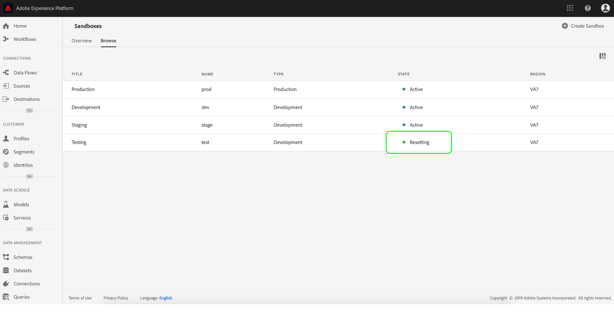

# Guida utente sandbox

In questo documento sono descritti i passaggi necessari per eseguire varie operazioni relative alle sandbox nell&#39;interfaccia utente del Adobe Experience Platform .

## Visualizzare le sandbox

Nell’interfaccia  di Experience Platform, fate clic su **Sandbox** nella barra di navigazione a sinistra per aprire il dashboard _Sandbox_ . Il dashboard elenca tutte le sandbox disponibili per l’organizzazione, incluso il tipo di sandbox (produzione o sviluppo) e lo stato (attivo, creazione, eliminazione o non riuscito).

## Passaggio tra le sandbox

Il controllo **dello switcher** sandbox in alto a sinistra dello schermo visualizza la sandbox attualmente attiva.

Per passare da una sandbox all’altra, fate clic sul commutatore sandbox e selezionate la sandbox desiderata dall’elenco a discesa.

Dopo aver selezionato una sandbox, la schermata si aggiorna con la sandbox selezionata ora disponibile nello switcher della sandbox.

## Creare una nuova sandbox

Per creare una nuova sandbox nell’interfaccia utente, fate clic su **Sandbox** nella barra di navigazione a sinistra, quindi fate clic su **Crea sandbox**.

Viene visualizzata la finestra di dialogo _Crea sandbox_ che richiede di specificare un titolo e un nome da visualizzare per la sandbox. Il titolo **del** display deve essere leggibile dall&#39;uomo e deve essere sufficientemente descrittivo per essere facilmente identificabile. Il **nome** sandbox è un identificatore in lettere minuscole da usare nelle chiamate API e deve pertanto essere univoco e conciso.

Al termine, fate clic su **Crea**.

>[!NOTE]
>
>Poiché vi limitate a creare solo tipi di sandbox non di produzione, l&#39;opzione **tipo** è bloccata in &quot;Non produzione&quot; e non può essere manipolata.

Dopo aver creato la sandbox, aggiornate la pagina e la nuova sandbox appare nel dashboard _Sandbox_ con lo stato &quot;Creating&quot; (Creazione). Il provisioning delle nuove sandbox richiede circa 15 minuti, dopo di che il loro stato diventa &quot;Attivo&quot;.

## Reimpostare una sandbox

>[!NOTE]
>
>Questa funzionalità è disponibile solo per sandbox non di produzione. Impossibile ripristinare le sandbox di produzione.

Reimpostando una sandbox non di produzione, vengono eliminate tutte le risorse associate a tale sandbox (schemi, set di dati e così via), mantenendo il nome della sandbox e le relative autorizzazioni. Questa sandbox &quot;pulita&quot; continua a essere disponibile con lo stesso nome per gli utenti che hanno accesso ad essa.

Per ripristinare una sandbox nell’interfaccia utente, fate clic su **Sandbox** nella barra di navigazione a sinistra, quindi fate clic sulla sandbox da reimpostare. Nella finestra di dialogo visualizzata sul lato destro della schermata, fate clic su **Ripristina sandbox**.

Viene visualizzata una finestra di dialogo che richiede di confermare la scelta. Click **Reset** to continue.

 

Viene visualizzato un messaggio di conferma e lo stato della sandbox diventa &quot;Reetting&quot;. Dopo il provisioning da parte del sistema, il relativo stato verrà aggiornato su &quot;Attivo&quot; o &quot;Non riuscito&quot;.

## Eliminare una sandbox

>[!NOTE]
>
>Questa funzionalità è disponibile solo per sandbox non di produzione. Impossibile eliminare le sandbox di produzione.

Se eliminate una sandbox non di produzione, vengono rimosse in modo permanente tutte le risorse associate a tale sandbox, comprese le autorizzazioni.

Per eliminare una sandbox nell’interfaccia utente, fate clic su **Sandbox** nella barra di navigazione a sinistra, quindi fate clic sulla sandbox da eliminare. Nella finestra di dialogo visualizzata sul lato destro della schermata, fate clic su **Elimina sandbox**.

Viene visualizzata una finestra di dialogo che richiede di confermare la scelta. Click **Delete** to continue.

 

Viene visualizzato un messaggio di conferma e la sandbox viene rimossa dall’area di lavoro _Sandbox_ .

## Passaggi successivi

Questo documento illustra come gestire le sandbox nell’interfaccia utente  di Experience Platform. Per informazioni su come gestire le sandbox tramite l&#39;API Sandbox, consultate la guida [per gli sviluppatori di](../api/getting-started.md)sandbox.