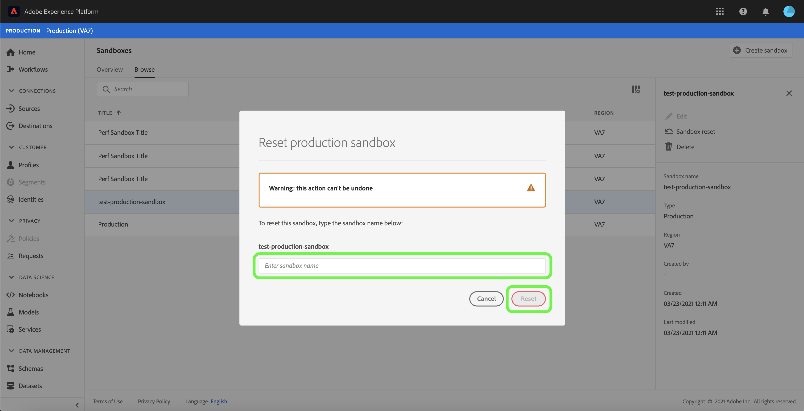

# Guida all’interfaccia utente sandbox

Questo documento fornisce passaggi su come eseguire varie operazioni relative alle sandbox nell’interfaccia utente di Adobe Experience Platform.

## Visualizzare le sandbox

Nell’interfaccia utente di Experience Platform, seleziona **[!UICONTROL Sandboxes]** nel menu di navigazione a sinistra per aprire il dashboard **[!UICONTROL Sandboxes]**. Il dashboard elenca tutte le sandbox disponibili per la tua organizzazione, inclusi il tipo di sandbox (produzione o sviluppo) e lo stato (attivo, creazione, eliminato o non riuscito).

## Passa da una sandbox all’altra

Il controllo **commutatore sandbox** in alto a sinistra dello schermo visualizza la sandbox attualmente attiva.

Per passare da una sandbox all’altra, seleziona il commutatore sandbox e seleziona la sandbox desiderata dall’elenco a discesa.

Una volta selezionata una sandbox, la schermata si aggiorna con la sandbox selezionata ora presente nel commutatore sandbox.

## Cercare una sandbox

Puoi navigare nell’elenco delle sandbox disponibili utilizzando la funzione di ricerca dal menu del commutatore sandbox. Digita il nome della sandbox a cui desideri accedere per filtrare tutte le sandbox disponibili per la tua organizzazione.

## Creare una nuova sandbox

>[!NOTE]
>
>La funzione Sandbox di produzione multipla è in versione beta.

Utilizza il seguente video per una rapida panoramica sull’utilizzo delle sandbox in Experience Platform.

>[!VIDEO](https://video.tv.adobe.com/v/29838/?quality=12&learn=on)

Per creare una nuova sandbox, seleziona il pulsante **[!UICONTROL Create Sandbox]** in alto a destra nella schermata .

Viene visualizzata la finestra di dialogo **[!UICONTROL Create Sandbox]** in cui viene richiesto di specificare un tipo, un titolo e un nome per la sandbox. Se stai creando una sandbox di sviluppo, seleziona **[!UICONTROL Development]** nel pannello a discesa che viene visualizzato. Se stai creando una sandbox di produzione, seleziona **[!UICONTROL Production]**.

Il titolo deve essere leggibile dall’uomo e deve essere sufficientemente descrittivo da essere facilmente identificabile. Il nome della sandbox è un identificatore in minuscolo da utilizzare nelle chiamate API e dovrebbe pertanto essere univoco e conciso. Il nome della sandbox deve essere composto solo da caratteri alfanumerici e trattini (`-`), deve iniziare con una lettera e deve contenere un massimo di 256 caratteri.

Al termine, seleziona **[!UICONTROL Create]**.

Una volta completata la creazione della sandbox, aggiorna la pagina e la nuova sandbox viene visualizzata nel dashboard **[!UICONTROL Sandboxes]** con lo stato &quot;[!UICONTROL Creating]&quot;. Il provisioning delle nuove sandbox richiede circa 15 minuti dal sistema, dopodiché il loro stato cambia in &quot;[!UICONTROL Active]&quot;.

## Reimpostare una sandbox

>[!NOTE]
>
>Puoi ripristinare qualsiasi sandbox di produzione o sviluppo nell’organizzazione, eccetto la sandbox di produzione predefinita.

Se si reimposta una sandbox di produzione o sviluppo, vengono eliminate tutte le risorse associate a tale sandbox (schemi, set di dati e così via), mantenendo il nome della sandbox e le relative autorizzazioni. Questa sandbox &quot;pulita&quot; continua a essere disponibile con lo stesso nome per gli utenti che vi hanno accesso.

Seleziona la sandbox da reimpostare dall’elenco delle sandbox. Nel pannello di navigazione a destra visualizzato, seleziona **[!UICONTROL Sandbox reset]**.

Viene visualizzata una finestra di dialogo che richiede di confermare la scelta. Selezionare **[!UICONTROL Continue]** per continuare.

Nella finestra di conferma finale, immetti il nome della sandbox nella finestra di dialogo e seleziona **[!UICONTROL Reset]**

## Eliminare una sandbox

>[!NOTE]
>
>È possibile eliminare qualsiasi sandbox di produzione o di sviluppo nell’organizzazione, ad eccezione della sandbox di produzione predefinita.

L’eliminazione di una sandbox di produzione o di sviluppo comporta la rimozione definitiva di tutte le risorse associate a tale sandbox, comprese le autorizzazioni.

Seleziona la sandbox da eliminare dall’elenco delle sandbox. Nel pannello di navigazione a destra visualizzato, seleziona **[!UICONTROL Delete]**.

Viene visualizzata una finestra di dialogo che richiede di confermare la scelta. Selezionare **[!UICONTROL Continue]** per continuare.

Nella finestra di conferma finale, immetti il nome della sandbox nella finestra di dialogo e seleziona **[!UICONTROL Delete]**

## Passaggi successivi

Questo documento illustra come gestire le sandbox all’interno dell’interfaccia utente di Experience Platform. Per informazioni su come gestire le sandbox utilizzando l’API Sandbox, consulta la [guida per gli sviluppatori di sandbox](../api/getting-started.md).