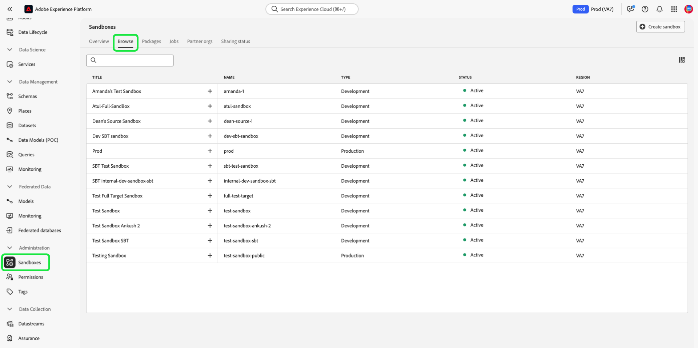

# Guida all’interfaccia utente sandbox

Questo documento fornisce passaggi su come eseguire varie operazioni relative alle sandbox nell’interfaccia utente di Adobe Experience Platform.

## Visualizzare le sandbox

Nell’interfaccia utente di Experience Platform, seleziona **[!UICONTROL Sandboxes]** nel menu di navigazione a sinistra per aprire il dashboard **[!UICONTROL Sandboxes]**. Il dashboard elenca tutte le sandbox disponibili per la tua organizzazione, inclusi il tipo di sandbox (produzione o sviluppo) e lo stato (attivo, creazione, eliminato o non riuscito).

## Passa da una sandbox all’altra

Il controllo **commutatore sandbox** in alto a sinistra dello schermo visualizza la sandbox attualmente attiva.

Per passare da una sandbox all’altra, seleziona il commutatore sandbox e seleziona la sandbox desiderata dall’elenco a discesa.

Una volta selezionata una sandbox, la schermata si aggiorna con la sandbox selezionata ora presente nel commutatore sandbox.

## Cercare una sandbox

Puoi navigare nell’elenco delle sandbox disponibili utilizzando la funzione di ricerca dal menu del commutatore sandbox. Digita il nome della sandbox a cui desideri accedere per filtrare tutte le sandbox disponibili per la tua organizzazione.

## Creare una nuova sandbox

Utilizza il seguente video per una rapida panoramica sull’utilizzo delle sandbox in Experience Platform.

>[!VIDEO](https://video.tv.adobe.com/v/29838/?quality=12&learn=on)

Per creare una nuova sandbox nell’interfaccia utente, seleziona il pulsante **[!UICONTROL Create Sandbox]** in alto a destra nella schermata.

Viene visualizzata la finestra di dialogo **[!UICONTROL Create Sandbox]** in cui viene richiesto di specificare un titolo e un nome da visualizzare per la sandbox. Il **titolo di visualizzazione** deve essere leggibile dall&#39;uomo e deve essere sufficientemente descrittivo da essere facilmente identificabile. La sandbox **[!UICONTROL Name]** è un identificatore in minuscolo da utilizzare nelle chiamate API e deve pertanto essere univoca e concisa. La sandbox **[!UICONTROL Name]** deve essere costituita solo da caratteri alfanumerici e trattini **(-)**, deve iniziare con una lettera e deve contenere un massimo di 256 caratteri.

Al termine, seleziona **[!UICONTROL Create]**.

>[!NOTE]
>
>Poiché sei limitato alla creazione di soli tipi di sandbox non di produzione, l’opzione **[!UICONTROL type]** è bloccata in &quot;Non produzione&quot; e non può essere manipolata.

Una volta completata la creazione della sandbox, aggiorna la pagina e la nuova sandbox viene visualizzata nel dashboard **[!UICONTROL Sandboxes]** con lo stato &quot;[!UICONTROL Creating]&quot;. Il provisioning delle nuove sandbox richiede circa 15 minuti dal sistema, dopodiché il loro stato cambia in &quot;[!UICONTROL Active]&quot;.

## Reimpostare una sandbox

>[!NOTE]
>
>Questa funzionalità è disponibile solo per sandbox non di produzione. Impossibile ripristinare le sandbox di produzione.

Se si reimposta una sandbox non di produzione, vengono eliminate tutte le risorse associate a tale sandbox (schemi, set di dati e così via), mantenendo il nome della sandbox e le relative autorizzazioni. Questa sandbox &quot;pulita&quot; continua a essere disponibile con lo stesso nome per gli utenti che vi hanno accesso.

Per ripristinare una sandbox nell’interfaccia utente, seleziona **[!UICONTROL Sandboxes]** nel menu di navigazione a sinistra, quindi seleziona la sandbox da reimpostare. Nella finestra di dialogo visualizzata sul lato destro dello schermo, seleziona **[!UICONTROL Reset Sandbox]**.

Viene visualizzata una finestra di dialogo che richiede di confermare la scelta. Seleziona **[!UICONTROL Reset]** per continuare.

Viene visualizzato un messaggio di conferma e lo stato della sandbox diventa &quot;**[!UICONTROL Resetting]&quot;**. Una volta effettuato il provisioning dal sistema, il relativo stato verrà aggiornato a **&quot;[!UICONTROL Active]&quot;** o **&quot;[!UICONTROL Failed]&quot;**.

## Eliminare una sandbox

>[!NOTE]
>
>Questa funzionalità è disponibile solo per sandbox non di produzione. Non è possibile eliminare le sandbox di produzione.

L’eliminazione di una sandbox non di produzione rimuove definitivamente tutte le risorse associate a tale sandbox, comprese le autorizzazioni.

Per eliminare una sandbox nell’interfaccia utente, seleziona **[!UICONTROL Sandboxes]** nel menu di navigazione a sinistra, quindi seleziona la sandbox da eliminare. Nella finestra di dialogo visualizzata sul lato destro dello schermo, seleziona **[!UICONTROL Delete Sandbox]**.

Viene visualizzata una finestra di dialogo che richiede di confermare la scelta. Seleziona **[!UICONTROL Delete]** per continuare.

Viene visualizzato un messaggio di conferma e la sandbox viene rimossa dall’area di lavoro **[!UICONTROL Sandboxes]**.

## Passaggi successivi

Questo documento illustra come gestire le sandbox all’interno dell’interfaccia utente di Experience Platform. Per informazioni su come gestire le sandbox utilizzando l’API Sandbox, consulta la [guida per gli sviluppatori di sandbox](../api/getting-started.md).
