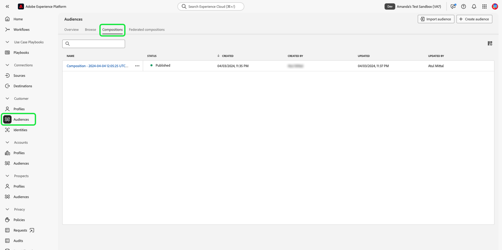

# Guida all’interfaccia utente Sandbox

In questo documento sono descritti i passaggi necessari per eseguire varie operazioni relative alle sandbox nell’interfaccia utente di Adobe Experience Platform.

## Visualizza sandbox

Nell&#39;interfaccia utente di Experience Platform, selezionare **[!UICONTROL Sandboxes]** nel menu di navigazione a sinistra, quindi selezionare la scheda **[!UICONTROL Browse]** per aprire il dashboard [!UICONTROL Sandboxes]. Il dashboard elenca tutte le sandbox disponibili per la tua organizzazione, compresi i rispettivi tipi (produzione o sviluppo).

## Passare da una sandbox all’altra

L’indicatore della sandbox si trova nell’intestazione superiore dell’interfaccia utente di Experience Platform e mostra il titolo, l’area e il tipo della sandbox in cui ti trovi attualmente.

Per passare da una sandbox all’altra, seleziona l’indicatore sandbox e quindi seleziona la sandbox desiderata dall’elenco a discesa. In alternativa, puoi cercare la sandbox desiderata utilizzando la funzione di ricerca nel menu a discesa.

Una volta selezionata una sandbox, la schermata si aggiorna e si aggiorna alla sandbox selezionata.

## Creare una nuova sandbox {#create}

>[!CONTEXTUALHELP]
>id="platform_sandboxes_sandboxname"
>title="Nome sandbox"
>abstract="Il nome della sandbox è il testo utilizzato nel back-end per creare un ID univoco per questa sandbox."

>[!CONTEXTUALHELP]
>id="platform_sandboxes_sandboxtitle"
>title="Titolo sandbox"
>abstract="Il titolo della sandbox è il nome visualizzato che rappresenta la sandbox nei menu e nei menu a discesa nell’interfaccia di Experience Platform."

>[!WARNING]
>
>Per creare una nuova sandbox è necessario aggiungerla a un ruolo in [[!UICONTROL Permissions]](../../access-control/abac/ui/permissions.md) prima di poter iniziare a utilizzarla. Per informazioni su come eseguire il provisioning di una sandbox per un ruolo, consulta la documentazione [gestione delle sandbox per un ruolo](../../access-control/abac/ui/permissions.md#managing-sandboxes-for-role).

Il video seguente offre una rapida panoramica sull’utilizzo delle Sandbox in Experience Platform.

>[!VIDEO](https://video.tv.adobe.com/v/3430300/?captions=ita&quality=12&learn=on)

Per creare una nuova sandbox, seleziona **[!UICONTROL Create sandbox]** nell&#39;angolo in alto a destra dello schermo.

Verrà visualizzata la finestra di dialogo **[!UICONTROL Create sandbox]**. Seleziona il menu a discesa **[!UICONTROL Type]** e scegli il tipo di sandbox [!UICONTROL Development] o [!UICONTROL Production].

Dopo aver selezionato il tipo, fornisci un nome per la sandbox nel campo **[!UICONTROL Name]**. Il nome della sandbox è un identificatore tutto minuscolo da utilizzare nelle chiamate API e deve quindi essere univoco e conciso. Il nome della sandbox deve iniziare con una lettera, contenere un massimo di 256 caratteri e contenere solo caratteri alfanumerici e trattini (-). Quindi, fornisci un titolo per la sandbox nel campo **[!UICONTROL Title]**. Il titolo deve essere leggibile e sufficientemente descrittivo da essere facilmente identificabile.

Al termine, selezionare **[!UICONTROL Create]**.

Dopo aver completato la creazione della sandbox, aggiorna la pagina e la nuova sandbox viene visualizzata nel dashboard **[!UICONTROL Sandboxes]** con lo stato &quot;[!UICONTROL Creating]&quot;. Il provisioning di nuove sandbox richiede circa 30 secondi dal sistema, dopo di che il loro stato cambia in &quot;[!UICONTROL Active]&quot;.

## Ripristinare una sandbox

>[!WARNING]
>
>Di seguito è riportato un elenco di eccezioni che possono impedire la reimpostazione della sandbox di produzione predefinita o di una sandbox di produzione creata dall&#39;utente:
>
>* Una sandbox di produzione creata dall’utente e utilizzata per la condivisione bidirezionale dei segmenti con Adobe Audience Manager o Audience Core Service può essere reimpostata dopo un messaggio di avviso.
>* Prima di avviare il ripristino di una sandbox, ti verrà richiesto di eliminare manualmente le composizioni per assicurarti che i dati del pubblico associato siano puliti correttamente.
>* Al termine del ripristino, l’ID della sandbox cambia.
>* Per [Journey Optimizer B2B edition](https://experienceleague.adobe.com/it/docs/journey-optimizer-b2b/user/guide-overview), il ripristino della sandbox **non è attualmente supportato**. Il ripristino o l’eliminazione di una sandbox mappata su Journey Optimizer B2B edition può causare la perdita permanente di dati in Journey Optimizer B2B edition e richiedere il provisioning di una nuova istanza di Journey Optimizer B2B edition.

### Eliminare le composizioni del pubblico

La composizione del pubblico non è attualmente integrata con la funzionalità di ripristino della sandbox, pertanto i tipi di pubblico dovranno essere eliminati manualmente prima di eseguire il ripristino della sandbox.

Selezionare **[!UICONTROL Audiences]** dalla sezione **[!UICONTROL Customers]** nel menu di navigazione a sinistra, quindi selezionare la scheda **[!UICONTROL Compositions]**.

Quindi, seleziona i puntini di sospensione (`...`) accanto al primo pubblico, quindi seleziona **[!UICONTROL Delete]**.

![Il menu del pubblico evidenzia l&#39;opzione [!UICONTROL Delete].](../images/ui/delete-composition.png)

Viene visualizzata una conferma dell&#39;eliminazione e si ritorna alla scheda **[!UICONTROL Compositions]**.

Ripeti i passaggi precedenti con tutte le tue composizioni. Questo eliminerà tutti i tipi di pubblico dall’inventario dei tipi di pubblico. Una volta rimossi tutti i tipi di pubblico, puoi continuare a reimpostare la sandbox.

### Reimpostazione di una sandbox

Se si ripristina una sandbox di produzione o di sviluppo, vengono eliminate anche tutte le risorse associate a tale sandbox (schemi, set di dati e così via), mantenendo il nome della sandbox e le autorizzazioni associate. Questa sandbox &quot;pulita&quot; continua a essere disponibile con lo stesso nome per gli utenti che vi hanno accesso.

Seleziona la sandbox da reimpostare dall’elenco delle sandbox. Nel pannello di navigazione a destra visualizzato, selezionare **[!UICONTROL Sandbox reset]**.

Viene visualizzata una finestra di dialogo in cui viene richiesto di confermare la scelta. Selezionare **[!UICONTROL Continue]** per continuare.

Nella finestra di conferma finale, immettere il nome della sandbox nella finestra di dialogo e selezionare **[!UICONTROL Reset]**.

## Eliminare una sandbox

>[!WARNING]
>
>Non è possibile eliminare la sandbox di produzione predefinita. Tuttavia, qualsiasi sandbox di produzione creata dall&#39;utente e utilizzata per la condivisione bidirezionale dei segmenti con [!DNL Audience Manager] o [!DNL Audience Core Service] può essere eliminata dopo un messaggio di avviso.

L’eliminazione di una sandbox di produzione o di sviluppo comporta la rimozione definitiva di tutte le risorse associate a tale sandbox, incluse le autorizzazioni.

Seleziona la sandbox da eliminare dall’elenco delle sandbox. Nel pannello di navigazione a destra visualizzato, selezionare **[!UICONTROL Delete]**.

Viene visualizzata una finestra di dialogo in cui viene richiesto di confermare la scelta. Selezionare **[!UICONTROL Continue]** per continuare.

Nella finestra di conferma finale, immettere il nome della sandbox nella finestra di dialogo e selezionare **[!UICONTROL Continue]**.

## Passaggi successivi

Questo documento illustra come gestire le sandbox nell’interfaccia utente di Experience Platform. Ora che sai come gestire le sandbox, scopri come migliorare la precisione della configurazione tra le sandbox ed esportare e importare facilmente le configurazioni sandbox tra sandbox con la guida alla [funzione per gli strumenti sandbox](./sandbox-tooling.md).

Per informazioni su come gestire le sandbox utilizzando l&#39;API Sandbox, consulta la [guida per gli sviluppatori di sandbox](../api/getting-started.md).
