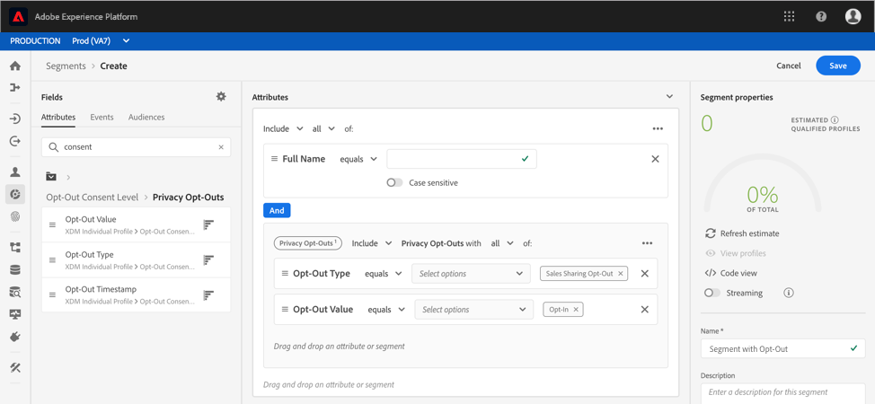

# Rispetto delle richieste di rifiuto nei segmenti

[!DNL Experience Platform] consente ai clienti di inviare richieste di rifiuto relative all&#39;utilizzo e all&#39;archiviazione dei dati all&#39;interno [!DNL Real-time Customer Profile]. Queste richieste di rifiuto fanno parte dell&#39; [!DNL California Consumer Privacy Act] (CCPA), che conferisce ai residenti della California il diritto di accedere ai propri dati personali ed eliminarli e di sapere se i loro dati personali sono venduti o divulgati (e a chi).

Una volta che un cliente ha rinunciato, è importante che l&#39;organizzazione rispetti tali rinunce quando genera audience per attività di marketing. Questo documento descrive importanti dettagli relativi al rispetto delle richieste di rifiuto.

## Introduzione

Il rispetto delle richieste di non partecipazione richiede la comprensione dei vari [!DNL Adobe Experience Platform] servizi interessati. Prima di utilizzare le richieste di rifiuto, consulta la documentazione relativa ai seguenti servizi:

- [!DNL Real-time Customer Profile](../profile/home.md): Fornisce un profilo cliente unificato in tempo reale basato su dati aggregati provenienti da più origini.
- [!DNL Adobe Experience Platform Segmentation Service](./home.md): Consente di creare segmenti di pubblico dai [!DNL Real-time Customer Profile] dati.
- [!DNL Experience Data Model (XDM)](../xdm/home.md): Framework standard con cui Platform organizza i dati sull&#39;esperienza dei clienti.
- [!DNL Adobe Experience Platform Privacy Service](../privacy-service/home.md): Consente alle organizzazioni di automatizzare la conformità alle normative sulla privacy dei dati che riguardano i dati dei clienti all&#39;interno [!DNL Platform].

## Mixine di rinunce

Per soddisfare le richieste di rifiuto CCPA, uno degli schemi che fa parte dello schema di unione deve contenere i campi di rifiuto [!DNL Experience Data Model] (XDM) necessari. Esistono due mixin che possono essere utilizzati per aggiungere campi di rinuncia a uno schema, ciascuno dei quali è trattato in modo più dettagliato nelle sezioni seguenti:

- [Privacy](#profile-privacy)profilo: Utilizzato per acquisire tipi di rinuncia diversi (generali o vendite/condivisione).
- [Dettagli](#profile-preferences-details)preferenze profilo: Utilizzato per acquisire le richieste di rifiuto per canali XDM specifici.

Per istruzioni dettagliate su come aggiungere un mixin a uno schema, fare riferimento alla sezione &quot;Add a mixin&quot; nella seguente documentazione XDM:
- [Esercitazione](../xdm/api/getting-started.md)sulle API del Registro di sistema dello schema.: Creazione di uno schema tramite l&#39;API del Registro di sistema dello schema.
- [Esercitazione](../xdm/tutorials/create-schema-ui.md)sull&#39;Editor di schema: Creazione di uno schema tramite l&#39;interfaccia utente di Platform.

Di seguito è riportata un&#39;immagine di esempio con i mixin di rinuncia aggiunti a uno schema nell&#39;interfaccia utente:


La struttura di ciascun mixin, nonché una descrizione dei campi che contribuiscono allo schema, sono descritti più dettagliatamente nelle sezioni seguenti.

### [!DNL Profile Privacy]

Il [!DNL Profile Privacy] mixin consente di acquisire due tipi di richieste di disattivazione CCPA da parte dei clienti:

1. Rifiuto generale
2. Rinuncia alla vendita/condivisione


Il [!DNL Profile Privacy] mixin contiene i campi seguenti:

- Rifiuto privacy (`privacyOptOuts`): Un array contenente un elenco di oggetti di rinuncia.
- Tipo di rifiuto (`optOutType`): Tipo di rifiuto. Questo campo è un enum con due possibili valori:
   - Rifiuto generale (`general_opt_out`)
   - Rinuncia alla condivisione delle vendite (`sales_sharing_opt_out`)
- Valore rifiuto (`optOutValue`): Lo stato attivo della rinuncia, noto anche come valore del segnale di rifiuto, in base al tipo di rifiuto specificato. Questo campo è un enum con quattro possibili valori:
   - Non fornito (`not_provided`): Non è stata fornita una richiesta di rifiuto.
   - Verifica in sospeso (`pending`): La richiesta di rifiuto è in attesa di verifica.
   - Rifiuto (`out`): Il cliente ha rinunciato.
   - Consenso (`in`): Il cliente ha acconsentito.
- Timestamp rifiuto (`timestamp`): Timestamp del segnale di rifiuto ricevuto.

Per visualizzare l&#39;intera struttura del [!DNL Profile Privacy] mixin, fare riferimento all&#39;archivio [GitHub pubblico](https://github.com/adobe/xdm/blob/master/schemas/context/profile-privacy.schema.json) XDM oppure visualizzare l&#39;anteprima del mixin utilizzando l&#39;interfaccia utente di Platform.

### Dettagli preferenze profilo

Il mixin Dettagli preferenze profilo offre diversi campi che rappresentano le preferenze per i profili cliente (ad esempio il formato e-mail, la lingua preferita e il fuso orario). Uno dei campi inclusi in questo mixin, OptInOut (`optInOut`), consente di impostare i valori di rifiuto per i singoli canali.


Il mixin Dettagli preferenze profilo contiene i seguenti campi relativi alle rinunce:

- OptInOut (`optInOut`): Un oggetto in cui ogni chiave rappresenta un URI valido e noto per un canale di comunicazione e lo stato attivo della rinuncia per ciascun canale. Ogni canale può avere uno dei quattro valori possibili:
   - Non fornito (`not_provided`): Per questo canale non è stata fornita una richiesta di rifiuto.
   - Verifica in sospeso (`pending`): La richiesta di rifiuto per questo canale è in attesa di verifica.
   - Rifiuto (`out`): Il cliente ha rinunciato a questo canale.
   - Consenso (`in`): Il cliente ha scelto questo canale.
- Rinuncia globale (`globalOptout`): Un valore booleano che, se impostato su true, imposta una sostituzione di rifiuto globale per il profilo. Il valore predefinito per questo campo è false.

L&#39;esempio JSON riportato di seguito evidenzia come l&#39;oggetto OptInOut possa acquisire più segnali di rifiuto per diversi canali di comunicazione:

```json
{
  "xdm:optInOut": {
    "https://ns.adobe.com/xdm/channels/email": "pending",
    "https://ns.adobe.com/xdm/channels/phone": "out",
    "https://ns.adobe.com/xdm/channels/sms": "in",
    "https://ns.adobe.com/xdm/channels/fax": "not_provided",
    "https://ns.adobe.com/xdm/channels/direct-mail": "not_provided",
    "https://ns.adobe.com/xdm/channels/apns": "not_provided",
    "xdm:globalOptout": false
  }
}
```

Per visualizzare l&#39;intera struttura del mixin Dettagli preferenze profilo, visitate l&#39;archivio [GitHub pubblico](https://github.com/adobe/xdm/blob/master/schemas/context/profile-preferences-details.schema.json) XDM oppure visualizzate l&#39;anteprima del mixin utilizzando l&#39; [!DNL Platform] interfaccia utente.

## Gestione delle opzioni di rifiuto nella segmentazione

Per garantire che i profili contrassegnati con flag di rifiuto CCPA non siano inclusi nei segmenti, è necessario aggiungere campi speciali ai segmenti esistenti o includerli durante la creazione del segmento.

Le sezioni seguenti mostrano come aggiungere i campi appropriati per i due tipi di flag di rifiuto:
1. Rifiuto generale
2. Rinuncia alla vendita/condivisione

### Rifiuto generale

[!DNL Segmentation] rispetta automaticamente tutti i profili contenenti il flag &quot;[!UICONTROL General Opt-Out]&quot;, il che significa che tali profili non saranno inclusi nel pubblico o nelle esportazioni per impostazione predefinita. Tuttavia, è consigliabile aggiungere i campi appropriati per garantire che i profili di rinuncia non siano inclusi nelle attività di audience e marketing.

Questo può essere fatto utilizzando l&#39;interfaccia utente aggiungendo **[!UICONTROL Privacy Opt-Outs]** attributi. In questo caso, il segmento è impostato per includere solo coloro che hanno acconsentito (ovvero non hanno un flag generale di rifiuto sul profilo). Ciò viene fatto dichiarando che &quot;[!UICONTROL Opt-Out Type]&quot; è uguale a &quot;[!UICONTROL General Opt-Out]&quot; e &quot;[!UICONTROL Opt-Out Value]&quot; è uguale a &quot;[!UICONTROL Opt-in]&quot;.


### Rinuncia alla vendita/condivisione

Se un utente ha un flag di rinuncia alla vendita/condivisione impostato sul suo profilo, questo profilo non deve più essere utilizzato per la creazione di segmenti o per le attività di marketing. Per garantire che questa bandiera sia rispettata, la &quot;[!UICONTROL Opt-Out Type]&quot; deve essere uguale a &quot;[!UICONTROL Sales Sharing Opt-Out]&quot; e la &quot;[!UICONTROL Opt-Out Value]&quot; deve essere uguale a &quot;[!UICONTROL Opt-in]&quot;.



<!-- ### Overriding default exclusions

In some instances, such as building a segment of people who have opted out, it may be necessary to override the default exclusion of opted-out profiles. This override can be done via the API or in the Segment Builder user interface. -->

## Passaggi successivi

Per ulteriori informazioni sulla segmentazione, comprese quelle relative alle definizioni dei segmenti e alle audience mediante l&#39;API e l&#39;interfaccia utente, si prega di iniziare leggendo la panoramica [della](./home.md)segmentazione.

Per ulteriori informazioni sulla privacy dei dati all&#39;interno [!DNL Platform], compreso come [!DNL Privacy Service] facilitare la conformità automatizzata alle normative sulla privacy legali e organizzative, fare riferimento alla documentazione [!DNL Privacy Service](../privacy-service/home.md).
