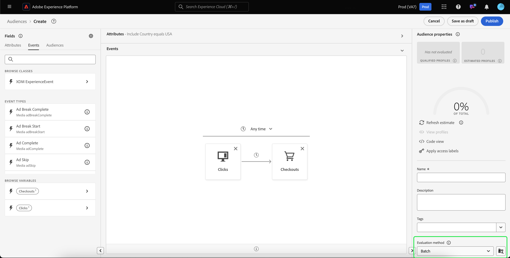

# Guida alla segmentazione batch

La segmentazione batch è un metodo di valutazione della segmentazione che consente di spostare i dati di profilo in una sola volta per creare tipi di pubblico corrispondenti.

Con la segmentazione in batch, puoi creare tipi di pubblico dettagliati e avanzati ed eseguire processi di segmentazione per determinare quando propagare i dati ai servizi a valle.

## Tipi di query idonei {#query-types}

Tutte le query sono idonee per la segmentazione batch.

## Crea pubblico {#create-audience}

Puoi creare un pubblico valutato utilizzando la segmentazione batch utilizzando l’API del servizio di segmentazione o tramite Audience Portal nell’interfaccia utente.

>[!BEGINTABS]

>[!TAB API servizio di segmentazione]

**Formato API**

```http
POST /segment/definitions
```

**Richiesta**

+++ Una richiesta di esempio per creare una definizione di segmento abilitata per la segmentazione batch

```shell
curl -X POST https://platform.adobe.io/data/core/ups/segment/definitions
 -H 'Authorization: Bearer {ACCESS_TOKEN}' \
 -H 'Content-Type: application/json' \
 -H 'x-gw-ims-org-id: {ORG_ID}' \
 -H 'x-api-key: {API_KEY}' \
 -H 'x-sandbox-name: {SANDBOX_NAME}'
 -d '{
        "name": "People in the USA",
        "description: "An audience that looks for people who live in the USA",
        "expression": {
            "type": "PQL",
            "format": "pql/text",
            "value": "homeAddress.country = \"US\""
        },
        "evaluationInfo": {
            "batch": {
                "enabled": true
            },
            "continuous": {
                "enabled": false
            },
            "synchronous": {
                "enabled": false
            }
        },
        "schema": {
            "name": "_xdm.context.profile"
        }
     }'
```

+++

**Risposta**

In caso di esito positivo, la risposta restituisce lo stato HTTP 200 con i dettagli della definizione del segmento appena creata.

+++Risposta di esempio durante la creazione di una definizione di segmento.

```json
{
    "id": "4afe34ae-8c98-4513-8a1d-67ccaa54bc05",
    "schema": {
        "name": "_xdm.context.profile"
    },
    "profileInstanceId": "ups",
    "imsOrgId": "{ORG_ID}",
    "sandbox": {
        "sandboxId": "28e74200-e3de-11e9-8f5d-7f27416c5f0d",
        "sandboxName": "prod",
        "type": "production",
        "default": true
    },
    "name": "People in the USA",
    "description": "An audience that looks for people who live in the USA",
    "expression": {
        "type": "PQL",
        "format": "pql/text",
        "value": "homeAddress.country = \"US\""
    },
    "evaluationInfo": {
        "batch": {
            "enabled": true
        },
        "continuous": {
            "enabled": false
        },
        "synchronous": {
            "enabled": false
        }
    },
    "dataGovernancePolicy": {
        "excludeOptOut": true
    },
    "creationTime": 0,
    "updateEpoch": 1579292094,
    "updateTime": 1579292094000
}
```

+++

Ulteriori informazioni sull&#39;utilizzo di questo endpoint sono disponibili nella [guida dell&#39;endpoint di definizione del segmento](../api/segment-definitions.md).

>[!TAB Audience Portal]

In Audience Portal, seleziona **[!UICONTROL Crea pubblico]**.


Viene visualizzata una finestra a comparsa. Seleziona **[!UICONTROL Genera regole]** per accedere al Generatore di segmenti.


Dopo aver creato la definizione del segmento, seleziona **[!UICONTROL Batch]** come **[!UICONTROL Metodo di valutazione]**.



Per ulteriori informazioni sulla creazione delle definizioni dei segmenti, consulta la [guida del Generatore di segmenti](../ui/segment-builder.md)

>[!ENDTABS]

## Recuperare i tipi di pubblico {#retrieve-audiences}

Puoi recuperare tutti i tipi di pubblico valutati utilizzando la segmentazione batch utilizzando l’API del servizio di segmentazione o tramite Audience Portal nell’interfaccia utente.

>[!BEGINTABS]

>[!TAB API servizio di segmentazione]

Recupera un elenco di tutte le definizioni di segmenti valutate utilizzando la segmentazione batch all&#39;interno della tua organizzazione effettuando una richiesta GET all&#39;endpoint `/segment/definitions`.

**Formato API**

È necessario includere il parametro query `evaluationInfo.batch.enabled=true` nel percorso della richiesta per recuperare le definizioni dei segmenti valutate utilizzando la segmentazione batch.

```http
GET /segment/definitions?evaluationInfo.batch.enabled=true
```

**Richiesta**

+++ Una richiesta di esempio per elencare tutte le definizioni di segmenti abilitati per il batch

```shell
curl -X GET \
  'https://platform.adobe.io/data/core/ups/segment/definitions?evaluationInfo.batch.enabled=true' \
  -H 'Authorization: Bearer {ACCESS_TOKEN}' \
  -H 'Content-Type: application/json' \
  -H 'x-api-key: {API_KEY}' \
  -H 'x-gw-ims-org-id: {ORG_ID}' \
  -H 'x-sandbox-name: {SANDBOX_NAME}'
```

+++

**Risposta**

In caso di esito positivo, la risposta restituisce lo stato HTTP 200 con un array di definizioni di segmenti nell’organizzazione che vengono valutate utilizzando la segmentazione batch.

+++Una risposta di esempio contenente un elenco di tutte le definizioni di segmenti valutati per la segmentazione batch all’interno dell’organizzazione

```json
{
    "segments": [
        {
            "id": "15063cb-2da8-4851-a2e2-bf59ddd2f004",
            "schema": {
                "name": "_xdm.context.profile"
            },
            "ttlInDays": 30,
            "imsOrgId": "{ORG_ID}",
            "sandbox": {
                "sandboxId": "",
                "sandboxName": "",
                "type": "production",
                "default": true
            },
            "name": " People who are NOT on their homepage ",
            "expression": {
                "type": "PQL",
                "format": "pql/text",
                "value": "select var1 from xEvent where var1._experience.analytics.endUser.firstWeb.webPageDetails.isHomePage = false"
            },
            "evaluationInfo": {
                "batch": {
                    "enabled": true
                },
                "continuous": {
                    "enabled": false
                },
                "synchronous": {
                    "enabled": false
                }
            },
            "creationTime": 1572029711000,
            "updateEpoch": 1572029712000,
            "updateTime": 1572029712000
        },
        {
            "id": "f15063cb-2da8-4851-a2e2-bf59ddd2f004",
            "schema": {
                "name": "_xdm.context.profile"
            },
            "ttlInDays": 30,
            "imsOrgId": "{ORG_ID}",
            "sandbox": {
                "sandboxId": "",
                "sandboxName": "",
                "type": "production",
                "default": true
            },
            "name": "Homepage_continuous",
            "description": "People who are on their homepage - continuous",
            "expression": {
                "type": "PQL",
                "format": "pql/text",
                "value": "select var1 from xEvent where var1._experience.analytics.endUser.firstWeb.webPageDetails.isHomePage = true"
            },
            "evaluationInfo": {
                "batch": {
                    "enabled": true
                },
                "continuous": {
                    "enabled": true
                },
                "synchronous": {
                    "enabled": false
                }
            },
            "creationTime": 1572021085000,
            "updateEpoch": 1572021086000,
            "updateTime": 1572021086000
        }
    ],
    "page": {
        "totalCount": 2,
        "totalPages": 1,
        "sortField": "creationTime",
        "sort": "desc",
        "pageSize": 2,
        "limit": 100
    },
    "link": {}
}
```

Informazioni più dettagliate sulla definizione del segmento restituita sono disponibili nella [guida dell&#39;endpoint per le definizioni dei segmenti](../api/segment-definitions.md).

+++

>[!TAB Audience Portal]

Puoi recuperare tutti i tipi di pubblico abilitati per la segmentazione in batch all’interno della tua organizzazione utilizzando i filtri in Audience Portal. Seleziona l&#39;icona  per visualizzare l&#39;elenco dei filtri.


All&#39;interno dei filtri disponibili, vai a **[!UICONTROL Frequenza di aggiornamento]** e seleziona &quot;[!UICONTROL Batch]&quot;. Utilizzando questo filtro vengono visualizzati tutti i tipi di pubblico dell’organizzazione valutati mediante segmentazione batch.


Per ulteriori informazioni sulla visualizzazione dei tipi di pubblico in Platform, consulta la [guida di Audience Portal](../ui/audience-portal.md).

>[!ENDTABS]

## Passaggi successivi

Questa guida spiega come creare una definizione di segmento che può essere valutata utilizzando la segmentazione batch in Adobe Experience Platform.

Per ulteriori informazioni sull&#39;utilizzo dell&#39;interfaccia utente di Experience Platform, leggere la [Guida utente per la segmentazione](../ui/overview.md).

Per le domande frequenti sulla segmentazione batch, leggi la sezione [segmentazione batch delle domande frequenti](../faq.md#batch-segmentation).
