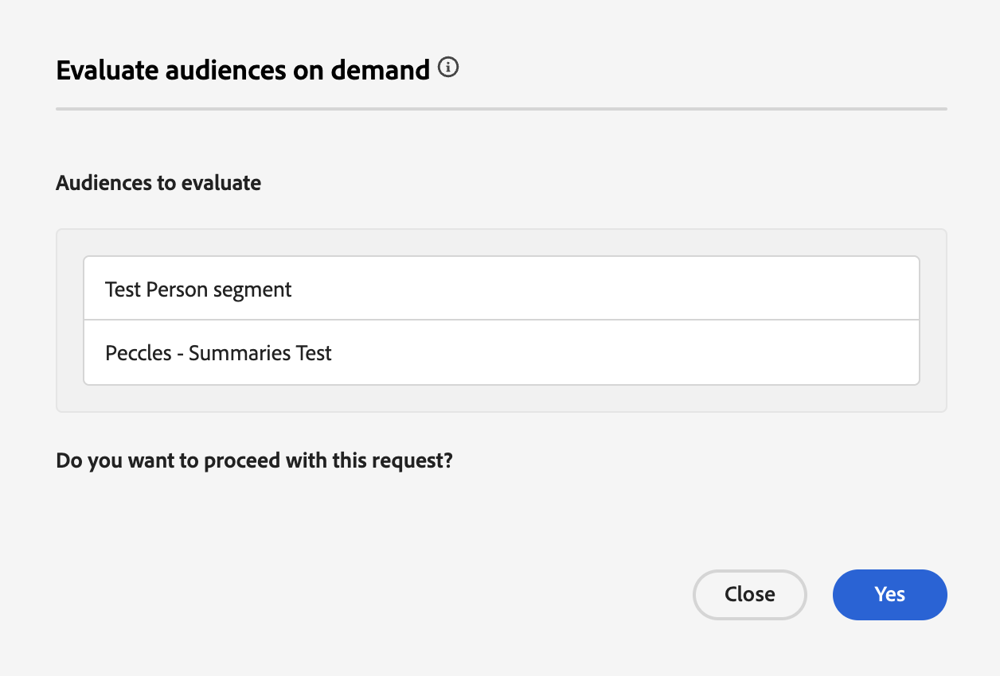

# Guida alla valutazione flessibile del pubblico

La valutazione flessibile del pubblico consente di eseguire un processo di segmentazione batch su richiesta. Con una valutazione flessibile del pubblico, puoi eseguire campagne ad hoc, comunicazioni just-in-time o altre attività che richiedono tempo.

## Guardrail {#guardrails}

>[!CONTEXTUALHELP]
>id="platform_segmentation_browse_flexibleaudienceevaluation"
>title="Limiti flessibili per la valutazione del pubblico"
>abstract="È possibile valutare fino a 20 tipi di pubblico in un’unica esecuzione di valutazione del pubblico flessibile.<br/><br/>Inoltre, mentre il processo di valutazione viene eseguito il prima possibile, potrebbero verificarsi ritardi di sistema poiché le valutazioni su richiesta <b>non possono</b> essere eseguite contemporaneamente a un’altra valutazione su richiesta o in batch."

Quando esegui una valutazione flessibile del pubblico, tieni presente le seguenti condizioni:

- Puoi utilizzare solo la valutazione flessibile del pubblico **due** al giorno per sandbox. Questo limite viene ripristinato alla mezzanotte (UTC).
- Hai un **massimo** di 50 esecuzioni flessibili di valutazione del pubblico all&#39;anno per **sandbox di produzione**.
- Hai un **massimo** di 100 esecuzioni flessibili di valutazione del pubblico all&#39;anno per sandbox **sviluppo**.
- Tutti i tipi di pubblico **must** hanno origine &quot;Servizio di segmentazione&quot;.
- Tutti i tipi di pubblico **devono** essere valutati utilizzando la segmentazione batch.
- Tutti i tipi di pubblico **devono** essere basati sulle persone.
- Puoi selezionare solo un massimo di 20 tipi di pubblico per ogni esecuzione di valutazione flessibile del pubblico.

## Accesso {#access}

Per utilizzare la valutazione flessibile del pubblico, è necessario disporre delle seguenti autorizzazioni:

- **[!UICONTROL Valuta il segmento in un pubblico]** nella sezione **[!DNL Profile Management]**.

Per ulteriori informazioni sul controllo degli accessi basato sui ruoli, leggere la [panoramica sul controllo degli accessi](../../access-control/home.md).

## Esecuzione di una valutazione flessibile del pubblico

Puoi eseguire una valutazione flessibile del pubblico utilizzando le API o l’interfaccia utente di Experience Platform.

>[!BEGINTABS]

>[!TAB API di Experience Platform]

Per eseguire una valutazione flessibile del pubblico nelle API di Experience Platform, è necessario creare un processo di segmentazione che contenga gli ID di tutte le definizioni di segmento (pubblico) che desideri valutare.

>[!NOTE]
>
>Puoi aggiungere solo un **massimo** di 20 ID di definizione segmento per chiamata API del processo di segmento.

Per creare un nuovo processo di segmento, devi eseguire una richiesta POST all&#39;endpoint `/segment/jobs` e includere gli ID delle definizioni dei segmenti nel corpo della richiesta.

+++Richiesta di esempio per la creazione di un nuovo processo di segmentazione

```shell
curl -X POST https://platform.adobe.io/data/core/ups/segment/jobs \
 -H 'Authorization: Bearer {ACCESS_TOKEN}' \
 -H 'Content-Type: application/json' \
 -H 'x-gw-ims-org-id: {ORG_ID}' \
 -H 'x-api-key: {API_KEY}' \
 -H 'x-sandbox-name: {SANDBOX_NAME}' \
 -d '[
    {
        "segmentId": "7863c010-e092-41c8-ae5e-9e533186752e"
    },
    {
        "segmentId": "07d39471-05d1-4083-a310-d96978fd7c85"
    }
 ]'
```

| Proprietà | Descrizione |
| -------- | ----------- |
| `segmentId` | ID della definizione del segmento che desideri valutare. Queste definizioni dei segmenti possono appartenere a diversi criteri di unione. |

+++

In caso di esito positivo, la risposta restituisce lo stato HTTP 200 con informazioni sul processo di segmentazione appena creato.

+++ Una risposta di esempio durante la creazione di un nuovo processo di segmentazione.

```json
{
    "id": "b31aed3d-b3b1-4613-98c6-7d3846e8d48f",
    "imsOrgId": "{ORG_ID}",
    "sandbox": {
        "sandboxId": "28e74200-e3de-11e9-8f5d-7f27416c5f0d",
        "sandboxName": "prod",
        "type": "production",
        "default": true
    },
    "profileInstanceId": "ups",
    "source": "api",
    "status": "PROCESSING",
    "batchId": "678f53bc-e21d-4c47-a7ec-5ad0064f8e4c",
    "computeJobId": 8811,
    "computeGatewayJobId": "9ea97b25-a0f5-410e-ae87-b2d85e58f399",
    "segments": [
        {
            "segmentId": "7863c010-e092-41c8-ae5e-9e533186752e",
            "segment": {
                "id": "7863c010-e092-41c8-ae5e-9e533186752e",
                "expression": {
                    "type": "PQL",
                    "format": "pql/json",
                    "value": "workAddress.country = \"US\""
                },
                "mergePolicyId": "25c548a0-ca7f-4dcd-81d5-997642f178b9",
                "mergePolicy": {
                    "id": "25c548a0-ca7f-4dcd-81d5-997642f178b9",
                    "version": 1
                }
            }
        },
        {
            "segmentId": "07d39471-05d1-4083-a310-d96978fd7c85",
            "segment": {
                "id": "07d39471-05d1-4083-a310-d96978fd7c85",
                "expression": {
                    "type": "PQL",
                    "format": "pql/json",
                    "value": "workAddress.country = \"US\""
                },
                "mergePolicyId": "25c548a0-ca7f-4dcd-81d5-997642f178b9",
                "mergePolicy": {
                    "id": "25c548a0-ca7f-4dcd-81d5-997642f178b9",
                    "version": 1
                }
            }
        }
    ],
    "metrics": {
        "totalTime": {
            "startTimeInMs": 1573203617195,
            "endTimeInMs": 1573204395655,
            "totalTimeInMs": 778460
        },
        "profileSegmentationTime": {
            "startTimeInMs": 1573204266727,
            "endTimeInMs": 1573204395655,
            "totalTimeInMs": 128928
        },
        "segmentedProfileCounter":{
            "7863c010-e092-41c8-ae5e-9e533186752e":1033
        },
        "segmentedProfileByNamespaceCounter":{
            "7863c010-e092-41c8-ae5e-9e533186752e":{
                "tenantiduserobjid":1033,
                "campaign_profile_mscom_mkt_prod2":1033
            }
        },
        "segmentedProfileByStatusCounter":{
            "7863c010-e092-41c8-ae5e-9e533186752e":{
                "exited":144646,
                "realized":2056
            }
        },
        "totalProfiles":13146432,
        "totalProfilesByMergePolicy":{
            "25c548a0-ca7f-4dcd-81d5-997642f178b9":13146432
        }
    },
    "requestId": "4e538382-dbd8-449e-988a-4ac639ebe72b-1573203600264",
    "schema": {
        "name": "_xdm.context.profile"
    },
    "properties": {
        "scheduleId": "4e538382-dbd8-449e-988a-4ac639ebe72b",
        "runId": "e6c1308d-0d4b-4246-b2eb-43697b50a149"
    },
    "_links": {
        "cancel": {
            "href": "/segment/jobs/b31aed3d-b3b1-4613-98c6-7d3846e8d48f",
            "method": "DELETE"
        },
        "checkStatus": {
            "href": "/segment/jobs/b31aed3d-b3b1-4613-98c6-7d3846e8d48f",
            "method": "GET"
        }
    },
    "updateTime": 1573204395000,
    "creationTime": 1573203600535,
    "updateEpoch": 1573204395
}
```

+++

Dopo aver creato il processo di segmentazione, puoi controllarne lo stato effettuando una richiesta GET all&#39;endpoint `/segment/jobs`, fornendo l&#39;ID del nuovo processo di segmentazione creato nel percorso della richiesta.

+++Richiesta di esempio per recuperare un processo di segmentazione

```shell
curl -X GET https://platform.adobe.io/data/core/ups/segment/jobs/b31aed3d-b3b1-4613-98c6-7d3846e8d48f \
 -H 'Authorization: Bearer {ACCESS_TOKEN}' \
 -H 'x-gw-ims-org-id: {ORG_ID}' \
 -H 'x-api-key: {API_KEY}' \
 -H 'x-sandbox-name: {SANDBOX_NAME}'
```

+++

In caso di esito positivo, la risposta restituisce lo stato HTTP 200 con informazioni dettagliate sul processo di segmentazione specificato.


+++ Risposta di esempio per recuperare un processo di segmentazione.

```json
{
    "id": "b31aed3d-b3b1-4613-98c6-7d3846e8d48f",
    "imsOrgId": "{ORG_ID}",
    "sandbox": {
        "sandboxId": "28e74200-e3de-11e9-8f5d-7f27416c5f0d",
        "sandboxName": "prod",
        "type": "production",
        "default": true
    },
    "profileInstanceId": "ups",
    "source": "api",
    "status": "SUCCEEDED",
    "batchId": "678f53bc-e21d-4c47-a7ec-5ad0064f8e4c",
    "computeJobId": 8811,
    "computeGatewayJobId": "9ea97b25-a0f5-410e-ae87-b2d85e58f399",
    "segments": [
        {
            "segmentId": "7863c010-e092-41c8-ae5e-9e533186752e",
            "segment": {
                "id": "7863c010-e092-41c8-ae5e-9e533186752e",
                "expression": {
                    "type": "PQL",
                    "format": "pql/text",
                    "value": "workAddress.country = \"US\""
                },
                "mergePolicyId": "25c548a0-ca7f-4dcd-81d5-997642f178b9",
                "mergePolicy": {
                    "id": "25c548a0-ca7f-4dcd-81d5-997642f178b9",
                    "version": 1
                }
            }
        },
        {
            "segmentId": "07d39471-05d1-4083-a310-d96978fd7c85",
            "segment": {
                "id": "07d39471-05d1-4083-a310-d96978fd7c85",
                "expression": {
                    "type": "PQL",
                    "format": "pql/json",
                    "value": "workAddress.country = \"US\""
                },
                "mergePolicyId": "25c548a0-ca7f-4dcd-81d5-997642f178b9",
                "mergePolicy": {
                    "id": "25c548a0-ca7f-4dcd-81d5-997642f178b9",
                    "version": 1
                }
            }
        }
    ],
    "metrics": {
        "totalTime": {
            "startTimeInMs": 1579304313411
        },
        "profileSegmentationTime": {}
    },
    "requestId": "4e538382-dbd8-449e-988a-4ac639ebe72b-1573203600264",
    "schema": {
        "name": "_xdm.context.profile"
    },
    "_links": {
        "cancel": {
            "href": "/segment/jobs/d3b4a50d-dfea-43eb-9fca-557ea53771fd",
            "method": "DELETE"
        },
        "checkStatus": {
            "href": "/segment/jobs/d3b4a50d-dfea-43eb-9fca-557ea53771fd",
            "method": "GET"
        }
    },
    "updateTime": 1579304339000,
    "creationTime": 1579304260897,
    "updateEpoch": 1579304339
}
```

+++

>[!TAB Interfaccia utente di Experience Platform]

Per eseguire una valutazione flessibile del pubblico nell&#39;interfaccia utente di Experience Platform, seleziona **[!UICONTROL Tipi di pubblico]** nella sezione **[!UICONTROL Clienti]**.


Viene visualizzato il Portale dei tipi di pubblico, con un elenco di tutti i tipi di pubblico relativi all’organizzazione. In Audience Portal, puoi scegliere i tipi di pubblico da valutare e selezionare **[!UICONTROL Valuta pubblico]**.


Viene visualizzato il popover **[!UICONTROL Valuta i tipi di pubblico su richiesta]**, in cui viene visualizzato l&#39;elenco dei tipi di pubblico che verranno valutati con il processo di segmentazione su richiesta. Se un pubblico non è idoneo per la valutazione su richiesta, verrà rimosso automaticamente dal processo di valutazione. Verifica che i tipi di pubblico elencati siano quelli che desideri valutare.



Dopo aver confermato che sono elencati i tipi di pubblico corretti, puoi procedere con la richiesta e verrà avviata la valutazione flessibile del pubblico. È possibile visualizzare lo stato di questa valutazione del pubblico nella [visualizzazione di monitoraggio dei processi di valutazione](../../dataflows/ui/monitor-audiences.md#evaluation-job-details).

>[!NOTE]
>
>Se esegui una valutazione flessibile del pubblico, assicurati che la frequenza sia impostata su **[!UICONTROL Dopo la valutazione del segmento]**. L&#39;esecuzione della valutazione flessibile del pubblico su tipi di pubblico già impostati per essere attivati [dopo la valutazione del segmento](../../destinations/ui/activate-batch-profile-destinations.md#export-full-files), attiverà i tipi di pubblico al termine del processo di valutazione flessibile del pubblico, indipendentemente da eventuali processi di attivazione giornalieri precedenti.

>[!ENDTABS]

## Passaggi successivi {#next-steps}

## Domande frequenti {#faq}

Nella sezione seguente sono elencate le domande frequenti relative alla valutazione flessibile del pubblico.

### È possibile eseguire la pianificazione con una valutazione flessibile del pubblico?

+++ Risposta

No, la pianificazione non è disponibile per l’utilizzo con la valutazione flessibile del pubblico.

+++

### È necessario eseguire un processo di esportazione aggiuntivo quando si utilizza la valutazione flessibile del pubblico?

+++ Risposta

No, il processo di esportazione viene eseguito automaticamente dopo il completamento del processo di segmento corrispondente.

+++

### Quali servizi posso utilizzare per i tipi di pubblico valutati con una valutazione flessibile?

+++ Risposta

Puoi utilizzare i tipi di pubblico in tutti i servizi a valle, comprese le destinazioni e i percorsi Adobe Journey Optimizer.

+++

### Quando vengono ripristinati i limiti di valutazione del pubblico flessibile?

+++ Risposta

Il limite giornaliero viene ripristinato alla mezzanotte (UTC). Il limite annuale viene reimpostato nella data dell’anniversario del contratto.

+++

### Quali tipi di pubblico sono supportati con la valutazione flessibile del pubblico?

+++ Risposta

Per una valutazione flessibile del pubblico sono supportati solo i tipi di pubblico con l’origine del servizio di segmentazione. Altri tipi di pubblico, come composizioni, caricamento personalizzato o Data Distiller, non sono supportati per una valutazione flessibile del pubblico.

+++

### Quali esecuzioni contribuiscono al conteggio flessibile delle esecuzioni di valutazione del pubblico?

+++ Risposta

Versioni di valutazione del pubblico flessibili che sono state create utilizzando l’API o il conteggio dell’interfaccia utente verso il limite massimo. Tuttavia, l&#39;esecuzione del processo di segmentazione batch giornaliera su base notturna **non** contribuisce a questo limite.

+++

