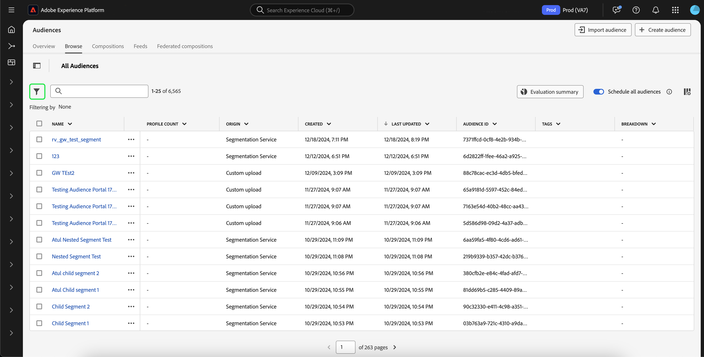

# Guida alla segmentazione in streaming

La segmentazione in streaming è la capacità di valutare i tipi di pubblico in Adobe Experience Platform in tempo quasi reale concentrandosi sulla ricchezza dei dati.

Con la segmentazione in streaming, la qualificazione del pubblico ora avviene quando i dati in streaming arrivano in Experience Platform, alleviando la necessità di pianificare ed eseguire processi di segmentazione. Questo consente di valutare i dati trasmessi in Experience Platform, e di mantenere automaticamente aggiornata l’iscrizione al pubblico.

## Tipi di query idonei {#query-types}

Una query è idonea alla segmentazione in streaming se soddisfa uno dei criteri descritti nella tabella seguente.

>[!NOTE]
>
>Affinché la segmentazione in streaming funzioni, devi abilitare la segmentazione pianificata per l’organizzazione. Per informazioni dettagliate sull&#39;abilitazione della segmentazione pianificata, consulta [la panoramica di Audience Portal](../ui/audience-portal.md#scheduled-segmentation).

| Tipo di query | Dettagli | Query | Esempio |
| ---------- | ------- | ----- | ------- |
| Singolo evento entro un intervallo di tempo inferiore a 24 ore | Qualsiasi definizione di segmento che fa riferimento a un singolo evento in arrivo entro un intervallo di tempo inferiore a 24 ore. | `CHAIN(xEvent, timestamp, [C0: WHAT(eventType.equals("commerce.checkouts", false)) WHEN(today)])` |  |
| Solo profilo | Qualsiasi definizione di segmento che fa riferimento solo a un attributo di profilo. | `homeAddress.country.equals("US", false)` |  |
| Singolo evento con un attributo di profilo entro un intervallo di tempo relativo inferiore a 24 ore | Qualsiasi definizione di segmento che si riferisce a un singolo evento in arrivo, con uno o più attributi di profilo, e si verifica entro un intervallo di tempo relativo inferiore a 24 ore. | `workAddress.country.equals("US", false) and CHAIN(xEvent, timestamp, [C0: WHAT(eventType.equals("commerce.checkouts", false)) WHEN(today)])` |  |
| Segmento di segmenti | Qualsiasi definizione di segmento che contiene uno o più segmenti batch o in streaming. **Nota:** se si utilizza un segmento di segmenti, l&#39;annullamento del profilo avverrà **ogni 24 ore**. | `inSegment("a730ed3f-119c-415b-a4ac-27c396ae2dff") and inSegment("8fbbe169-2da6-4c9d-a332-b6a6ecf559b9")` |  |
| Più eventi con un attributo di profilo | Qualsiasi definizione di segmento che fa riferimento a più eventi **nelle ultime 24 ore** e (facoltativamente) ha uno o più attributi di profilo. | `workAddress.country.equals("US", false) and CHAIN(xEvent, timestamp, [C0: WHAT(eventType.equals("directMarketing.emailClicked", false)) WHEN(today), C1: WHAT(eventType.equals("commerce.checkouts", false)) WHEN(today)])` |  |

Una definizione di segmento **non** sarà idonea per la segmentazione in streaming nei seguenti scenari:

- La definizione del segmento include segmenti o caratteristiche di Adobe Audience Manager (AAM).
- La definizione del segmento include più entità (query con più entità).
- La definizione del segmento include una combinazione di un singolo evento e un evento `inSegment`.
   - Tuttavia, se la definizione del segmento contenuta nell&#39;evento `inSegment` è solo di profilo, la definizione del segmento **sarà** abilitata per la segmentazione in streaming.
- La definizione del segmento utilizza &quot;Ignora anno&quot; come parte dei vincoli di tempo.

Tieni presente le seguenti linee guida applicabili alle query di segmentazione in streaming:

| Tipo di query | Linea guida |
| ---------- | -------- |
| Query evento singolo | Non ci sono limiti all’intervallo di lookback. |
| Query con cronologia eventi | <ul><li>L&#39;intervallo di lookback è limitato a **un giorno**.</li><li>Tra gli eventi è presente una condizione di ordinamento temporale **must**.</li><li>Sono supportate le query con almeno un evento negato. L&#39;intero evento **non può** essere una negazione.</li></ul> |

Se una definizione di segmento viene modificata in modo da non soddisfare più i criteri per la segmentazione in streaming, la definizione del segmento passerà automaticamente da &quot;Streaming&quot; a &quot;Batch&quot;.

Inoltre, l’annullamento del riconoscimento del segmento, in modo simile alla qualificazione del segmento, avviene in tempo reale. Di conseguenza, se un pubblico non è più idoneo per un segmento, non sarà immediatamente qualificato. Ad esempio, se la definizione del segmento richiede &quot;Tutti gli utenti che hanno acquistato scarpe rosse nelle ultime tre ore&quot;, dopo tre ore tutti i profili che si sono inizialmente qualificati per la definizione del segmento non saranno qualificati.

## Crea pubblico {#create-audience}

Puoi creare un pubblico valutato utilizzando la segmentazione in streaming utilizzando l’API del servizio di segmentazione o tramite Audience Portal nell’interfaccia utente.

Una definizione di segmento può essere abilitata per lo streaming se corrisponde a uno dei [tipi di query idonei](#eligible-query-types).

>[!BEGINTABS]

>[!TAB API servizio di segmentazione]

**Formato API**

```http
POST /segment/definitions
```

**Richiesta**

+++ Una richiesta di esempio per creare una definizione di segmento abilitata per la segmentazione in streaming

```shell
curl -X POST https://platform.adobe.io/data/core/ups/segment/definitions
 -H 'Authorization: Bearer {ACCESS_TOKEN}' \
 -H 'Content-Type: application/json' \
 -H 'x-gw-ims-org-id: {ORG_ID}' \
 -H 'x-api-key: {API_KEY}' \
 -H 'x-sandbox-name: {SANDBOX_NAME}'
 -d '{
        "name": "People in the USA",
        "description: "An audience that looks for people who live in the USA",
        "expression": {
            "type": "PQL",
            "format": "pql/text",
            "value": "homeAddress.country = \"US\""
        },
        "evaluationInfo": {
            "batch": {
                "enabled": false
            },
            "continuous": {
                "enabled": true
            },
            "synchronous": {
                "enabled": false
            }
        },
        "schema": {
            "name": "_xdm.context.profile"
        }
     }'
```

+++

**Risposta**

In caso di esito positivo, la risposta restituisce lo stato HTTP 200 con i dettagli della definizione del segmento appena creata.

+++Risposta di esempio durante la creazione di una definizione di segmento.

```json
{
    "id": "4afe34ae-8c98-4513-8a1d-67ccaa54bc05",
    "schema": {
        "name": "_xdm.context.profile"
    },
    "profileInstanceId": "ups",
    "imsOrgId": "{ORG_ID}",
    "sandbox": {
        "sandboxId": "28e74200-e3de-11e9-8f5d-7f27416c5f0d",
        "sandboxName": "prod",
        "type": "production",
        "default": true
    },
    "name": "People in the USA",
    "description": "An audience that looks for people who live in the USA",
    "expression": {
        "type": "PQL",
        "format": "pql/text",
        "value": "homeAddress.country = \"US\""
    },
    "evaluationInfo": {
        "batch": {
            "enabled": false
        },
        "continuous": {
            "enabled": true
        },
        "synchronous": {
            "enabled": false
        }
    },
    "dataGovernancePolicy": {
        "excludeOptOut": true
    },
    "creationTime": 0,
    "updateEpoch": 1579292094,
    "updateTime": 1579292094000
}
```

+++

Ulteriori informazioni sull&#39;utilizzo di questo endpoint sono disponibili nella [guida dell&#39;endpoint di definizione del segmento](../api/segment-definitions.md).

>[!TAB Audience Portal]

In Audience Portal, seleziona **[!UICONTROL Crea pubblico]**.


Viene visualizzata una finestra a comparsa. Seleziona **[!UICONTROL Genera regole]** per accedere al Generatore di segmenti.


In Segment Builder (Generatore di segmenti), crea una definizione di segmento che corrisponda a uno dei [tipi di query idonei](#eligible-query-types). Se la definizione del segmento è idonea per la segmentazione in streaming, potrai selezionare **[!UICONTROL Streaming]** come **[!UICONTROL metodo di valutazione]**.


Per ulteriori informazioni sulla creazione delle definizioni dei segmenti, consulta la [guida del Generatore di segmenti](../ui/segment-builder.md)

>[!ENDTABS]

## Recuperare i tipi di pubblico {#retrieve-audiences}

Puoi recuperare tutti i tipi di pubblico valutati utilizzando la segmentazione in streaming utilizzando l’API del servizio di segmentazione o tramite Audience Portal nell’interfaccia utente.

>[!BEGINTABS]

>[!TAB API servizio di segmentazione]

Recupera un elenco di tutte le definizioni di segmenti valutate utilizzando la segmentazione in streaming all&#39;interno della tua organizzazione effettuando una richiesta GET all&#39;endpoint `/segment/definitions`.

**Formato API**

È necessario includere il parametro query `evaluationInfo.synchronous.enabled=true` nel percorso della richiesta per recuperare le definizioni dei segmenti valutate utilizzando la segmentazione in streaming.

```http
GET /segment/definitions?evaluationInfo.continuous.enabled=true
```

**Richiesta**

+++ Una richiesta di esempio per elencare tutte le definizioni di segmenti abilitati per lo streaming

```shell
curl -X GET 'https://platform.adobe.io/data/core/ups/segment/definitions?evaluationInfo.continuous.enabled=true' \
  -H 'Authorization: Bearer {ACCESS_TOKEN}' \
  -H 'Content-Type: application/json' \
  -H 'x-api-key: {API_KEY}' \
  -H 'x-gw-ims-org-id: {ORG_ID}' \
  -H 'x-sandbox-name: {SANDBOX_NAME}'
```

+++

**Risposta**

In caso di esito positivo, la risposta restituisce lo stato HTTP 200 con un array di definizioni di segmenti nell’organizzazione abilitate per la segmentazione in streaming.

+++Una risposta di esempio contenente un elenco di tutte le definizioni di segmenti abilitati per la segmentazione in streaming nell’organizzazione

```json
{
    "segments": [
        {
            "id": "15063cb-2da8-4851-a2e2-bf59ddd2f004",
            "schema": {
                "name": "_xdm.context.profile"
            },
            "ttlInDays": 30,
            "imsOrgId": "{ORG_ID}",
            "sandbox": {
                "sandboxId": "",
                "sandboxName": "",
                "type": "production",
                "default": true
            },
            "name": " People who are NOT on their homepage ",
            "expression": {
                "type": "PQL",
                "format": "pql/text",
                "value": "select var1 from xEvent where var1._experience.analytics.endUser.firstWeb.webPageDetails.isHomePage = false"
            },
            "evaluationInfo": {
                "batch": {
                    "enabled": false
                },
                "continuous": {
                    "enabled": true
                },
                "synchronous": {
                    "enabled": false
                }
            },
            "creationTime": 1572029711000,
            "updateEpoch": 1572029712000,
            "updateTime": 1572029712000
        },
        {
            "id": "f15063cb-2da8-4851-a2e2-bf59ddd2f004",
            "schema": {
                "name": "_xdm.context.profile"
            },
            "ttlInDays": 30,
            "imsOrgId": "{ORG_ID}",
            "sandbox": {
                "sandboxId": "",
                "sandboxName": "",
                "type": "production",
                "default": true
            },
            "name": "Homepage_continuous",
            "description": "People who are on their homepage - continuous",
            "expression": {
                "type": "PQL",
                "format": "pql/text",
                "value": "select var1 from xEvent where var1._experience.analytics.endUser.firstWeb.webPageDetails.isHomePage = true"
            },
            "evaluationInfo": {
                "batch": {
                    "enabled": true
                },
                "continuous": {
                    "enabled": true
                },
                "synchronous": {
                    "enabled": false
                }
            },
            "creationTime": 1572021085000,
            "updateEpoch": 1572021086000,
            "updateTime": 1572021086000
        }
    ],
    "page": {
        "totalCount": 2,
        "totalPages": 1,
        "sortField": "creationTime",
        "sort": "desc",
        "pageSize": 2,
        "limit": 100
    },
    "link": {}
}
```

Informazioni più dettagliate sulla definizione del segmento restituita sono disponibili nella [guida dell&#39;endpoint per le definizioni dei segmenti](../api/segment-definitions.md).

+++

>[!TAB Audience Portal]

Puoi recuperare tutti i tipi di pubblico abilitati per la segmentazione in streaming all’interno della tua organizzazione utilizzando i filtri in Audience Portal. Seleziona l&#39;icona  per visualizzare l&#39;elenco dei filtri.



All&#39;interno dei filtri disponibili, vai a **[!UICONTROL Frequenza di aggiornamento]** e seleziona &quot;[!UICONTROL Streaming]&quot;. Utilizzando questo filtro vengono visualizzati tutti i tipi di pubblico dell’organizzazione valutati mediante la segmentazione in streaming.


Per ulteriori informazioni sulla visualizzazione dei tipi di pubblico in Experience Platform, consulta la [guida di Audience Portal](../ui/audience-portal.md).

>[!ENDTABS]

## Dettagli del pubblico {#audience-details}

Puoi visualizzare i dettagli di un pubblico specifico valutato utilizzando la segmentazione in streaming selezionandola all’interno di Audience Portal.

Dopo aver selezionato un pubblico su Audience Portal, viene visualizzata la pagina dei dettagli del pubblico. Visualizza informazioni sul pubblico, tra cui un riepilogo dei dettagli del pubblico, la quantità di profili qualificati nel tempo, nonché le destinazioni in cui il pubblico è stato attivato.


Per i tipi di pubblico abilitati per lo streaming, viene visualizzata la scheda **[!UICONTROL Profili nel tempo]**, che mostra il totale delle metriche qualificate e le nuove metriche di aggiornamento del pubblico.

La metrica **[!UICONTROL Totale qualificato]** rappresenta il numero totale di tipi di pubblico qualificati, in base alle valutazioni in batch e in streaming per questo pubblico.

La metrica **[!UICONTROL Nuovo pubblico aggiornato]** è rappresentata da un grafico a linee che mostra la modifica nella dimensione del pubblico tramite la segmentazione in streaming. Puoi regolare il menu a discesa per visualizzare le ultime 24 ore, l’ultima settimana o gli ultimi 30 giorni.


Per ulteriori dettagli sui dettagli del pubblico, consulta la [Panoramica di Audience Portal](../ui/audience-portal.md#audience-details).

## Passaggi successivi

Questa guida spiega come le definizioni dei segmenti abilitati per lo streaming funzionano in Adobe Experience Platform e come monitorare le definizioni dei segmenti abilitati per lo streaming.

Per ulteriori informazioni sull&#39;utilizzo dell&#39;interfaccia utente di Adobe Experience Platform, leggere la [Guida utente per la segmentazione](./overview.md).

Per le domande frequenti sulla segmentazione in streaming, leggi la sezione [segmentazione in streaming delle domande frequenti](../faq.md#streaming-segmentation).
