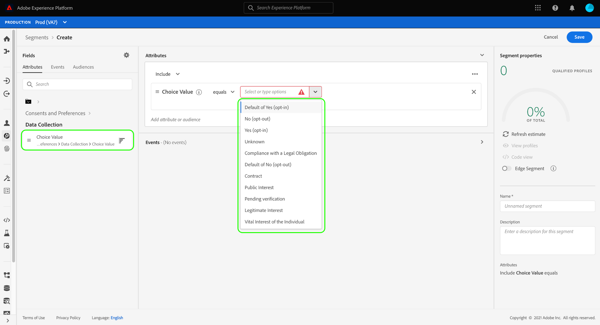

# Rispetto del consenso nelle definizioni dei segmenti

>[!NOTE]
>
>Questa guida spiega come rispettare i consensi all&#39;interno di **definizioni segmento**.

Le normative legali sulla privacy, come il [!DNL California Consumer Privacy Act] (CCPA), conferiscono ai consumatori il diritto di non richiedere la raccolta o la condivisione dei propri dati personali con terze parti. Adobe Experience Platform fornisce componenti Experience Data Model (XDM) standard che hanno lo scopo di acquisire queste preferenze di consenso del cliente nei dati del profilo cliente in tempo reale.

Se un cliente ha revocato o negato il consenso alla condivisione dei propri dati personali, è importante che la tua organizzazione rispetti tale preferenza durante la generazione di tipi di pubblico per le attività di marketing. Questo documento descrive come integrare i valori di consenso dei clienti nelle definizioni dei segmenti utilizzando l’interfaccia utente di Experience Platform.

## Introduzione

Per rispettare i valori di consenso del cliente è necessario conoscere i vari servizi [!DNL Adobe Experience Platform] coinvolti. Prima di iniziare questo tutorial, assicurati di avere familiarità con i seguenti servizi:

* [[!DNL Experience Data Model (XDM)]](../../xdm/home.md): framework standardizzato tramite il quale Experience Platform organizza i dati sull&#39;esperienza del cliente.
* [[!DNL Real-Time Customer Profile]](../../profile/home.md): fornisce un profilo cliente unificato in tempo reale basato su dati aggregati provenienti da più origini.
* [[!DNL Adobe Experience Platform Segmentation Service]](../home.md): consente di creare tipi di pubblico dai dati di [!DNL Real-Time Customer Profile].

## Campi schema di consenso

Per rispettare i consensi e le preferenze del cliente, uno degli schemi che fanno parte dello schema di unione [!UICONTROL Profilo individuale XDM] deve contenere il gruppo di campi standard **[!UICONTROL Consensi e preferenze]**.

Per informazioni dettagliate sulla struttura e sul caso di utilizzo previsto di ciascuno degli attributi forniti dal gruppo di campi, consulta la [guida di riferimento per consensi e preferenze](../../xdm/field-groups/profile/consents.md). Per istruzioni dettagliate su come aggiungere un gruppo di campi a uno schema, consulta la [guida dell&#39;interfaccia utente XDM](../../xdm/ui/resources/schemas.md#add-field-groups).

Dopo aver aggiunto il gruppo di campi a uno schema [abilitato per il profilo](../../xdm/ui/resources/schemas.md#profile) e aver utilizzato i campi per acquisire i dati sul consenso dall&#39;applicazione Experience, puoi utilizzare gli attributi del consenso raccolti nelle regole del segmento.

## Gestione del consenso nella segmentazione

Per garantire che i profili di rinuncia non siano inclusi nelle definizioni dei segmenti, è necessario aggiungere campi speciali alle definizioni dei segmenti esistenti e includerli durante la creazione di nuove definizioni dei segmenti.

I passaggi seguenti mostrano come aggiungere i campi appropriati per due tipi di flag di rinuncia:

1. [!UICONTROL Raccolta dati]
1. [!UICONTROL Condividi dati]

>[!NOTE]
>
>Mentre questa guida si concentra sui due flag di rinuncia di cui sopra, puoi configurare le definizioni dei segmenti per incorporare anche segnali di consenso aggiuntivi. La [guida di riferimento per i consensi e le preferenze](../../xdm/field-groups/profile/consents.md) fornisce ulteriori informazioni su ciascuna di queste opzioni e sui casi d&#39;uso previsti.

Durante la creazione di una definizione di segmento nell&#39;interfaccia utente, in **[!UICONTROL Attributi]**, passa a **[!UICONTROL Profilo individuale XDM]**, quindi seleziona **[!UICONTROL Consensi e preferenze]**, seguito da **[!UICONTROL Id specifico]**. Da qui puoi vedere le opzioni per **[!UICONTROL Raccolta dati]** e **[!UICONTROL Condividi dati]**.

Inizia selezionando la categoria **[!UICONTROL Raccolta dati]**, quindi trascina **[!UICONTROL Valore scelta]** nel generatore di segmenti. Quando aggiungi l&#39;attributo alla definizione del segmento, puoi specificare i [valori di consenso](../../xdm/field-groups/profile/consents.md#choice-values) che devono essere inclusi o esclusi.

Un approccio consiste nell’escludere tutti i clienti che hanno rinunciato alla raccolta dei loro dati. Per eseguire questa operazione, impostare l&#39;operatore su **[!UICONTROL è diverso da]** e scegliere i valori seguenti:

* **[!UICONTROL No (rinuncia)]**
* **[!UICONTROL Impostazione predefinita No (rinuncia)]**
* **[!UICONTROL Sconosciuto]** (se si presume che il consenso venga negato, se non altrimenti noto)

In **[!UICONTROL Attributi]** nella barra a sinistra, torna alla sezione **[!UICONTROL Consensi e preferenze]**, quindi seleziona **[!UICONTROL Condividi dati]**. Trascinare il valore di scelta **[!UICONTROL Valore scelta]** corrispondente nell&#39;area di lavoro e selezionare gli stessi valori di quelli per il valore di scelta [!UICONTROL Raccolta dati]. Assicurarsi che tra i due attributi sia stabilita una relazione **[!UICONTROL Or]**.

Con l&#39;aggiunta dei valori di consenso **[!UICONTROL Raccolta dati]** e **[!UICONTROL Condividi dati]** alla definizione del segmento, tutti i clienti che hanno rinunciato all&#39;utilizzo dei propri dati verranno esclusi dal pubblico risultante. Da qui puoi continuare a personalizzare la definizione del segmento prima di selezionare **[!UICONTROL Salva]** per completare il processo.

## Passaggi successivi

Seguendo questa esercitazione, avrai una migliore comprensione di come rispettare i consensi e le preferenze del cliente durante la creazione delle definizioni dei segmenti in Experience Platform.

Per ulteriori informazioni sulla gestione del consenso in Experience Platform, consulta la seguente documentazione:

* [Elaborazione del consenso tramite lo standard Adobe](../../landing/governance-privacy-security/consent/adobe/overview.md)
* [Elaborazione del consenso utilizzando lo standard IAB TCF 2.0](../../landing/governance-privacy-security/consent/iab/overview.md)