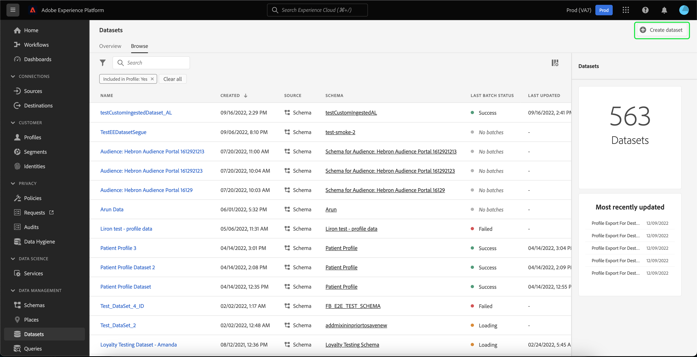

# Creare un set di dati per esportare un segmento di pubblico

[!DNL Adobe Experience Platform] consente di segmentare i profili dei clienti in audience in base ad attributi specifici. Una volta creato un segmento, puoi esportare il pubblico in un set di dati a cui è possibile accedervi e su cui agisce. Affinché l’esportazione abbia successo, il set di dati deve essere configurato correttamente.

Questa esercitazione descrive i passaggi necessari per creare un set di dati che può essere utilizzato per esportare un segmento di pubblico utilizzando [!DNL Experience Platform] Interfaccia utente.

Questa esercitazione è direttamente correlata ai passaggi descritti nell’esercitazione su [valutazione e accesso ai risultati dei segmenti](./evaluate-a-segment.md). L’esercitazione sulla valutazione dei segmenti fornisce passaggi per creare un set di dati utilizzando [!DNL Catalog Service] API, mentre questa esercitazione descrive i passaggi per creare un set di dati utilizzando [!DNL Experience Platform] Interfaccia utente.

## Introduzione

Per esportare un segmento, il set di dati deve essere basato su [!DNL XDM Individual Profile Union Schema]. Uno schema di unione è uno schema generato dal sistema e di sola lettura che aggrega i campi di tutti gli schemi che condividono la stessa classe. Per ulteriori informazioni sugli schemi di unione, consulta la guida su [nozioni di base sulla composizione dello schema](../../xdm/schema/composition.md#union).

Per visualizzare gli schemi di unione nell’interfaccia utente, seleziona **[!UICONTROL Profili]** nella navigazione a sinistra, seleziona **[!UICONTROL Schema dell&#39;unione]** come mostrato di seguito.

## Area di lavoro dei set di dati

La [!UICONTROL Set di dati] workspace consente di visualizzare e gestire tutti i set di dati dell’organizzazione.

Seleziona **[!UICONTROL Set di dati]** nella navigazione a sinistra per accedere all’area di lavoro, quindi seleziona **[!UICONTROL Sfoglia]**. In questa scheda viene visualizzato un elenco dei set di dati e dei relativi dettagli. A seconda della larghezza di ogni colonna, potrebbe essere necessario scorrere a sinistra o a destra per visualizzare tutte le colonne.

>[!NOTE]
>
>Seleziona l’icona del filtro accanto alla barra di ricerca per utilizzare le funzionalità di filtro per visualizzare solo i set di dati abilitati per [!DNL Real-time Customer Profile].

## Creare un set di dati

Per creare un set di dati, seleziona **[!UICONTROL Crea set di dati]**.

Nella schermata successiva, seleziona **[!UICONTROL Crea set di dati da schema]**.

## Seleziona schema di unione profili individuale XDM

Per selezionare la [!DNL XDM Individual Profile Union Schema] per l’utilizzo nel set di dati, trova il &quot;[!UICONTROL Profilo individuale XDM]&quot; schema nel **[!UICONTROL Seleziona schema]** schermo. Una volta selezionato lo schema, puoi verificare se si tratta dello schema di unione in **[!UICONTROL Utilizzo API]** nella barra a destra. Se la [!UICONTROL Schema] termina con `_union`, è uno schema di unione.

>[!NOTE]
>
>Nonostante gli schemi di unione partecipino per definizione al Profilo del cliente in tempo reale, vengono elencati come &quot;Non abilitati&quot; a causa del fatto che non sono abilitati per il profilo allo stesso modo degli schemi tradizionali.

Seleziona il pulsante di scelta accanto a **[!UICONTROL Profilo individuale XDM]**, quindi seleziona **[!UICONTROL Successivo]**.

## Configurare il set di dati

Nella schermata successiva, devi assegnare un nome al set di dati. Puoi anche aggiungere una descrizione facoltativa.

**Note sui nomi dei set di dati:**

* I nomi dei set di dati devono essere brevi e descrittivi in modo che il set di dati possa essere facilmente trovato nella libreria in un secondo momento.
* I nomi dei set di dati devono essere univoci, il che significa che devono anche essere sufficientemente specifici da non essere riutilizzati in futuro.
* È consigliabile fornire informazioni aggiuntive sul set di dati utilizzando il campo descrizione, in quanto potrebbe aiutare altri utenti a distinguere tra set di dati in futuro.

Una volta che il set di dati ha un nome e una descrizione, seleziona **[!UICONTROL Fine]**.

## Attività set di dati

Una volta creato il set di dati, ti viene portata la pagina di attività per quel set di dati. Dovresti visualizzare il nome del set di dati nell’angolo in alto a sinistra dell’area di lavoro, insieme a una notifica che indica che non sono stati aggiunti batch. Questo è da aspettarsi, in quanto non hai ancora aggiunto batch a questo set di dati.

La barra a destra contiene informazioni relative al nuovo set di dati quali ID set di dati, nome, descrizione, schema e altro ancora. Si prega di prendere nota del **[!UICONTROL ID set di dati]**, poiché questo valore è necessario per completare il flusso di lavoro di esportazione del segmento di pubblico.

## Passaggi successivi

Ora che hai creato un set di dati basato su [!DNL XDM Individual Profile Union Schema], puoi utilizzare l’ID set di dati per continuare la [valutazione e accesso ai risultati dei segmenti](./evaluate-a-segment.md) esercitazione.

A questo punto, torna all’esercitazione sui risultati del segmento di valutazione e seleziona dal [generazione di profili per i membri del pubblico](./evaluate-a-segment.md#generate-profiles) passaggio del flusso di lavoro di esportazione di un segmento.
