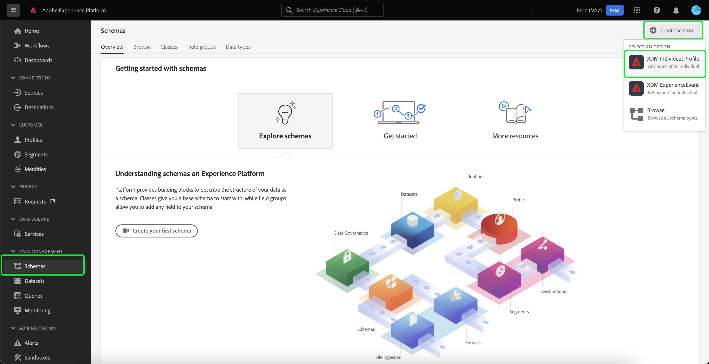

# Importazione e utilizzo di tipi di pubblico esterni

Adobe Experience Platform supporta la possibilità di importare tipi di pubblico esterni, che possono essere successivamente utilizzati come componenti per una nuova definizione di segmento. Questo documento fornisce un tutorial per configurare Experience Platform per importare e utilizzare tipi di pubblico esterni.

## Introduzione

Questo tutorial richiede una buona conoscenza delle varie [!DNL Adobe Experience Platform] servizi coinvolti nella creazione di segmenti di pubblico. Prima di iniziare questo tutorial, consulta la documentazione dei seguenti servizi:

- [Servizio di segmentazione](../home.md): consente di creare segmenti di pubblico dai dati Profilo cliente in tempo reale.
- [Profilo cliente in tempo reale](../../profile/home.md): fornisce un profilo consumer unificato e in tempo reale basato su dati aggregati provenienti da più origini.
- [Experience Data Model (XDM)](../../xdm/home.md): framework standardizzato tramite il quale Platform organizza i dati sull’esperienza del cliente. Per utilizzare al meglio la segmentazione, assicurati che i dati vengano acquisiti come profili ed eventi in base alla [best practice per la modellazione dei dati](../../xdm/schema/best-practices.md).
- [Set di dati](../../catalog/datasets/overview.md): il costrutto di archiviazione e gestione per la persistenza dei dati in Experience Platform.
- [Acquisizione in streaming](../../ingestion/streaming-ingestion/overview.md): come Experience Platform acquisisce e memorizza in tempo reale i dati da dispositivi lato client e lato server.

### Dati dei segmenti e metadati dei segmenti

Prima di iniziare a importare e utilizzare tipi di pubblico esterni, è importante comprendere la differenza tra i dati dei segmenti e i metadati dei segmenti.

I dati dei segmenti si riferiscono ai profili che soddisfano i criteri di qualificazione dei segmenti e che fanno quindi parte del pubblico.

I metadati del segmento sono informazioni sul segmento stesso, che includono il nome, la descrizione, l’espressione (se applicabile), la data di creazione, la data dell’ultima modifica e un ID. L’ID collega i metadati del segmento ai singoli profili che soddisfano la qualifica del segmento e che fanno parte del pubblico risultante.

| Dati del segmento | Metadati del segmento |
| ------------ | ---------------- |
| Profili che soddisfano la qualifica del segmento | Informazioni sul segmento stesso |

## Creare uno spazio dei nomi delle identità per il pubblico esterno

Il primo passaggio per utilizzare tipi di pubblico esterni consiste nella creazione di uno spazio dei nomi delle identità. Gli spazi dei nomi di identità consentono a Platform di associare da dove ha origine un segmento.

Per creare uno spazio dei nomi delle identità, segui le istruzioni riportate nella sezione [guida allo spazio dei nomi delle identità](../../identity-service/namespaces.md#manage-namespaces). Durante la creazione dello spazio dei nomi dell’identità, aggiungi i dettagli dell’origine allo spazio dei nomi dell’identità e contrassegnala [!UICONTROL Tipo] as a **[!UICONTROL Identificatore non persone]**.


## Creare uno schema per i metadati del segmento

Dopo aver creato uno spazio dei nomi delle identità, devi creare un nuovo schema per il segmento che creerai.

Per iniziare a comporre uno schema, seleziona innanzitutto **[!UICONTROL Schemi]** sulla barra di navigazione a sinistra, seguita da **[!UICONTROL Crea schema]** nell’angolo in alto a destra dell’area di lavoro Schemi. Da qui, seleziona **[!UICONTROL Sfoglia]** per visualizzare una selezione completa dei tipi di schema disponibili.


Poiché stai creando una definizione di segmento, che è una classe predefinita, seleziona **[!UICONTROL Usa classe esistente]**. Ora, seleziona la **[!UICONTROL Definizione del segmento]** class, seguito da **[!UICONTROL Assegna classe]**.


Ora che lo schema è stato creato, dovrai specificare quale campo conterrà l’ID del segmento. Questo campo deve essere contrassegnato come identità primaria e assegnato agli spazi dei nomi creati in precedenza.


Dopo aver contrassegnato `_id` come identità primaria, seleziona il titolo dello schema, seguito dall’opzione etichettata **[!UICONTROL Profilo]**. Seleziona **[!UICONTROL Abilita]** per abilitare lo schema per [!DNL Real-Time Customer Profile].


Ora questo schema è abilitato per il profilo, con l’identificazione principale assegnata allo spazio dei nomi dell’identità non persona creato. Di conseguenza, i metadati del segmento importati in Platform utilizzando questo schema verranno acquisiti in Profile senza essere uniti ad altri dati di profilo relativi alle persone.

## Creare un set di dati per lo schema

Dopo aver configurato lo schema, dovrai creare un set di dati per i metadati del segmento.

Per creare un set di dati, segui le istruzioni riportate nella sezione [guida utente del set di dati](../../catalog/datasets/user-guide.md#create). È necessario seguire i **[!UICONTROL Crea set di dati dallo schema]** utilizzando lo schema creato in precedenza.


Dopo aver creato il set di dati, continua a seguire le istruzioni riportate nella sezione [guida utente del set di dati](../../catalog/datasets/user-guide.md#enable-profile) per abilitare questo set di dati per Real-Time Customer Profile.


## Impostare e importare i dati sul pubblico

Con il set di dati abilitato, ora i dati possono essere inviati a Platform tramite l’interfaccia utente o utilizzando le API Experience Platform. Puoi acquisire questi dati tramite una connessione in batch o in streaming.

### Acquisire dati utilizzando una connessione batch

Per creare una connessione batch, è possibile seguire le istruzioni riportate nella sezione generica [guida dell’interfaccia utente per il caricamento di file locali](../../sources/tutorials/ui/create/local-system/local-file-upload.md). Per un elenco completo delle sorgenti disponibili con cui è possibile utilizzare i dati di acquisizione, leggi [panoramica sulle origini](../../sources/home.md).

### Acquisire dati utilizzando una connessione in streaming

Per creare una connessione in streaming, è possibile seguire le istruzioni [Esercitazione API](../../sources/tutorials/api/create/streaming/http.md) o [Esercitazione sull’interfaccia utente](../../sources/tutorials/ui/create/streaming/http.md).

Dopo aver creato la connessione in streaming, potrai accedere all’endpoint di streaming univoco a cui inviare i dati. Per scoprire come inviare dati a questi endpoint, leggi la sezione [esercitazione sullo streaming dei dati dei record](../../ingestion/tutorials/streaming-record-data.md#ingest-data).


## Struttura dei metadati del pubblico

Dopo aver creato una connessione, ora puoi acquisire i dati in Platform.

Di seguito è riportato un esempio dei metadati del payload del pubblico esterno:

```json
{
    "header": {
        "schemaRef": {
            "id": "https://ns.adobe.com/{TENANT_ID}/schemas/{SCHEMA_ID}",
            "contentType": "application/vnd.adobe.xed-full+json;version=1"
        },
        "imsOrgId": "{ORG_ID}",
        "datasetId": "{DATASET_ID}",
        "source": {
            "name": "Sample External Audience"
        }
    },
    "body": {
        "xdmMeta": {
            "schemaRef": {
                "id": "https://ns.adobe.com/{TENANT_ID}/schemas/{SCHEMA_ID}",
                "contentType": "application/vnd.adobe.xed-full+json;version=1"
            }
        },
        "xdmEntity": {
            "_id": "{SEGMENT_ID}",
            "description": "Sample description",
            "identityMap": {
                "{IDENTITY_NAMESPACE}": [{
                    "id": "{}"
                }]
            },
            "segmentName" : "{SEGMENT_NAME}",
            "segmentStatus": "ACTIVE",
            "version": "1.0"
        }
    }
}
```

| Proprietà | Descrizione |
| -------- | ----------- |
| `schemaRef` | Lo schema **deve** fai riferimento allo schema creato in precedenza per i metadati del segmento. |
| `datasetId` | ID del set di dati **deve** fai riferimento al set di dati creato in precedenza per lo schema appena creato. |
| `xdmEntity._id` | ID **deve** fai riferimento allo stesso ID segmento che utilizzi come pubblico esterno. |
| `xdmEntity.identityMap` | Questa sezione **deve** contiene l’etichetta di identità utilizzata durante la creazione dello spazio dei nomi creato in precedenza. |
| `{IDENTITY_NAMESPACE}` | Questa è l’etichetta dello spazio dei nomi dell’identità creato in precedenza. Quindi, per esempio, se hai chiamato il tuo spazio dei nomi di identità &quot;externalAudience&quot;, lo utilizzerai come chiave dell’array. |
| `segmentName` | Il nome del segmento in base al quale vuoi segmentare il pubblico esterno. |

## Creazione di segmenti utilizzando tipi di pubblico importati

Una volta configurati, i tipi di pubblico importati possono essere utilizzati come parte del processo di segmentazione. Per trovare tipi di pubblico esterni, passa al Generatore di segmenti e seleziona **[!UICONTROL Tipi di pubblico]** scheda in **[!UICONTROL Campi]** sezione.


## Passaggi successivi

Ora che puoi utilizzare i tipi di pubblico esterni nei segmenti, puoi utilizzare il Generatore di segmenti per creare i segmenti. Per informazioni su come creare i segmenti, leggi [tutorial sulla creazione di segmenti](./create-a-segment.md).

## Appendice

Oltre a utilizzare i metadati di pubblico esterno importati e a utilizzarli per la creazione di segmenti, puoi anche importare le appartenenze a segmenti esterni in Platform.

### Configurare uno schema di destinazione di iscrizione a un segmento esterno

Per iniziare a comporre uno schema, seleziona innanzitutto **[!UICONTROL Schemi]** sulla barra di navigazione a sinistra, seguita da **[!UICONTROL Crea schema]** nell’angolo in alto a destra dell’area di lavoro Schemi. Da qui, seleziona **[!UICONTROL Profilo individuale XDM]**.



Ora che lo schema è stato creato, è necessario aggiungere il gruppo di campi di iscrizione al segmento come parte dello schema. A questo scopo, seleziona [!UICONTROL Dettagli sull’iscrizione al segmento], seguito da [!UICONTROL Aggiungi gruppi di campi].


Inoltre, assicurati che lo schema sia contrassegnato per **[!UICONTROL Profilo]**. A questo scopo, devi contrassegnare un campo come identità primaria.


### Impostare il set di dati

Dopo aver creato lo schema, dovrai creare un set di dati.

Per creare un set di dati, segui le istruzioni riportate nella sezione [guida utente del set di dati](../../catalog/datasets/user-guide.md#create). È necessario seguire i **[!UICONTROL Crea set di dati dallo schema]** utilizzando lo schema creato in precedenza.


Dopo aver creato il set di dati, continua a seguire le istruzioni riportate nella sezione [guida utente del set di dati](../../catalog/datasets/user-guide.md#enable-profile) per abilitare questo set di dati per Real-Time Customer Profile.


## Impostare e importare i dati di iscrizione del pubblico esterno

Con il set di dati abilitato, ora i dati possono essere inviati a Platform tramite l’interfaccia utente o utilizzando le API Experience Platform. Puoi acquisire questi dati tramite una connessione in batch o in streaming.

### Acquisire dati utilizzando una connessione batch

Per creare una connessione batch, è possibile seguire le istruzioni riportate nella sezione generica [guida dell’interfaccia utente per il caricamento di file locali](../../sources/tutorials/ui/create/local-system/local-file-upload.md). Per un elenco completo delle sorgenti disponibili con cui è possibile utilizzare i dati di acquisizione, leggi [panoramica sulle origini](../../sources/home.md).

### Acquisire dati utilizzando una connessione in streaming

Per creare una connessione in streaming, è possibile seguire le istruzioni [Esercitazione API](../../sources/tutorials/api/create/streaming/http.md) o [Esercitazione sull’interfaccia utente](../../sources/tutorials/ui/create/streaming/http.md).

Dopo aver creato la connessione in streaming, potrai accedere all’endpoint di streaming univoco a cui inviare i dati. Per scoprire come inviare dati a questi endpoint, leggi la sezione [esercitazione sullo streaming dei dati dei record](../../ingestion/tutorials/streaming-record-data.md#ingest-data).


## Struttura di iscrizione al segmento

Dopo aver creato una connessione, ora puoi acquisire i dati in Platform.

Di seguito è riportato un esempio del payload di iscrizione al pubblico esterno:

```json
{
    "header": {
        "schemaRef": {
            "id": "https://ns.adobe.com/{TENANT_ID}/schemas/{SCHEMA_ID}",
            "contentType": "application/vnd.adobe.xed-full+json;version=1"
        },
        "imsOrgId": "{ORG_ID}",
        "datasetId": "{DATASET_ID}",
        "source": {
            "name": "Sample External Audience Membership"
        }
    },
    "body": {
        "xdmMeta": {
            "schemaRef": {
                "id": "https://ns.adobe.com/{TENANT_ID}/schemas/{SCHEMA_ID}",
                "contentType": "application/vnd.adobe.xed-full+json;version=1"
            }
        },
        "xdmEntity": {
            "_id": "{UNIQUE_ID}",
            "description": "Sample description",
            "{TENANT_NAME}": {
                "identities": {
                    "{SCHEMA_IDENTITY}": "sample-id"
                }
            },
            "personId" : "sample-name",
            "segmentMembership": {
                "{IDENTITY_NAMESPACE}": {
                    "{EXTERNAL_IDENTITY}": {
                        "status": "realized",
                        "lastQualificationTime": "2022-03-14T:00:00:00Z"
                    }
                }
            }
        }
    }
}
```

| Proprietà | Descrizione |
| -------- | ----------- |
| `schemaRef` | Lo schema **deve** fai riferimento allo schema creato in precedenza per i dati di iscrizione al segmento. |
| `datasetId` | ID del set di dati **deve** fai riferimento al set di dati creato in precedenza per lo schema di appartenenza appena creato. |
| `xdmEntity._id` | ID appropriato utilizzato per identificare in modo univoco il record all’interno del set di dati. |
| `{TENANT_NAME}.identities` | Questa sezione viene utilizzata per collegare il gruppo di campi delle identità personalizzate con gli utenti importati in precedenza. |
| `segmentMembership.{IDENTITY_NAMESPACE}` | Questa è l’etichetta dello spazio dei nomi dell’identità personalizzata creato in precedenza. Quindi, per esempio, se hai chiamato il tuo spazio dei nomi di identità &quot;externalAudience&quot;, lo utilizzerai come chiave dell’array. |

>[!NOTE]
>
>Per impostazione predefinita, le appartenenze a un pubblico esterno vengono mantenute solo per 30 giorni. Per conservarli per più di 30 giorni, utilizzare il `validUntil` durante l’acquisizione dei dati sul pubblico. Per ulteriori informazioni su questo campo, consulta la guida su [Gruppi di campi dello schema dei dettagli di iscrizione al segmento](../../xdm/field-groups/profile/segmentation.md).