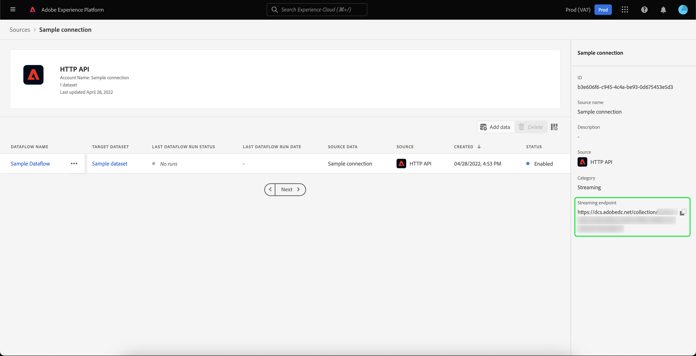

# Importazione e utilizzo di tipi di pubblico esterni

Adobe Experience Platform supporta la possibilità di importare tipi di pubblico esterni, che possono essere successivamente utilizzati come componenti per una nuova definizione di segmento. Questo documento fornisce un’esercitazione per configurare Experience Platform per importare e utilizzare tipi di pubblico esterni.

## Introduzione

- [Servizio](../home.md) di segmentazione: Consente di creare segmenti di pubblico dai dati Profilo cliente in tempo reale.
- [Profilo](../../profile/home.md) cliente in tempo reale: Fornisce un profilo di consumatore unificato e in tempo reale basato su dati aggregati provenienti da più origini.
- [Experience Data Model (XDM)](../../xdm/home.md): Il framework standardizzato tramite il quale Platform organizza i dati sulla customer experience.
- [Set di dati](../../catalog/datasets/overview.md): Il costrutto di archiviazione e gestione per la persistenza dei dati in Experience Platform.
- [Acquisizione](../../ingestion/streaming-ingestion/overview.md) in streaming: In che modo Experience Platform acquisisce e memorizza in tempo reale i dati da dispositivi lato client e lato server.

## Creare uno spazio dei nomi di identità per il pubblico esterno

Il primo passaggio per l’utilizzo di tipi di pubblico esterni consiste nella creazione di uno spazio dei nomi di identità. I namespace di identità consentono a Platform di associare la posizione di origine di un segmento.

Per creare uno spazio dei nomi di identità, segui le istruzioni contenute nella [guida allo spazio dei nomi di identità](../../identity-service/namespaces.md#manage-namespaces). Durante la creazione dello spazio dei nomi di identità, aggiungi i dettagli di origine allo spazio dei nomi di identità e contrassegna il relativo [!UICONTROL Type] come **[!UICONTROL Non-people identifier]**.

## Creare uno schema per i metadati del segmento

Dopo aver creato uno spazio dei nomi di identità, devi creare un nuovo schema per il segmento che creerai.

Per iniziare a comporre uno schema, seleziona prima **[!UICONTROL Schemas]** nella barra di navigazione a sinistra, seguita da **[!UICONTROL Create schema]** nell’angolo in alto a destra dell’area di lavoro Schemi. Da qui, seleziona **[!UICONTROL Browse]** per visualizzare una selezione completa dei tipi di schema disponibili.

Poiché stai creando una definizione di segmento, che è una classe predefinita, seleziona **[!UICONTROL Use existing class]**. A questo punto, seleziona la classe **[!UICONTROL Segment definition]** , seguita da **[!UICONTROL Assign class]**.

Dopo la creazione dello schema, dovrai specificare quale campo conterrà l’ID del segmento. Questo campo deve essere contrassegnato come identità principale e assegnato agli spazi dei nomi creati in precedenza.

Dopo aver contrassegnato il campo `_id` come identità principale, seleziona il titolo dello schema, seguito dall’interruttore **[!UICONTROL Profile]**. Selezionare **[!UICONTROL Enable]** per abilitare lo schema per [!DNL Real-time Customer Profile].

Ora, questo schema è abilitato per Profilo, con l’identificazione principale assegnata allo spazio dei nomi dell’identità non persona creato. Di conseguenza, i metadati del segmento importati in Platform utilizzando questo schema verranno acquisiti in Profilo senza essere uniti ad altri dati di profilo relativi alle persone.

## Creare un set di dati per lo schema

Dopo aver configurato lo schema, dovrai creare un set di dati per i metadati del segmento.

Per creare un set di dati, segui le istruzioni contenute nella [guida utente del set di dati](../../catalog/datasets/user-guide.md#create). Segui l’opzione **[!UICONTROL Create dataset from schema]** , utilizzando lo schema creato in precedenza.

Dopo aver creato il set di dati, continua a seguire le istruzioni contenute nella [guida utente del set di dati](../../catalog/datasets/user-guide.md#enable-profile) per abilitare questo set di dati per il profilo cliente in tempo reale.

## Configurazione e importazione di dati sul pubblico

Con il set di dati abilitato, i dati possono ora essere inviati in Platform tramite l’interfaccia utente o utilizzando le API di Experience Platform. Per acquisire questi dati in Platform, dovrai creare una connessione in streaming.

Per creare una connessione in streaming, puoi seguire le istruzioni contenute nell’ [esercitazione API](../../sources/tutorials/api/create/streaming/http.md) o nell’ [esercitazione sull’interfaccia utente](../../sources/tutorials/ui/create/streaming/http.md).

Una volta creata la connessione streaming, avrai accesso all&#39;endpoint streaming univoco a cui puoi inviare i tuoi dati. Per informazioni su come inviare dati a questi endpoint, leggi l&#39; [esercitazione sullo streaming di dati di record](../../ingestion/tutorials/streaming-record-data.md#ingest-data).

## Creazione di segmenti utilizzando i tipi di pubblico importati

Una volta configurati i tipi di pubblico importati, possono essere utilizzati come parte del processo di segmentazione. Per trovare tipi di pubblico esterni, vai a Generatore di segmenti e seleziona la scheda **[!UICONTROL Audiences]** nella sezione **[!UICONTROL Fields]** .

## Passaggi successivi

Ora che puoi utilizzare tipi di pubblico esterni nei segmenti, puoi utilizzare il Generatore di segmenti per creare segmenti. Per scoprire come creare i segmenti, leggi l’ [esercitazione sulla creazione di segmenti](./create-a-segment.md).