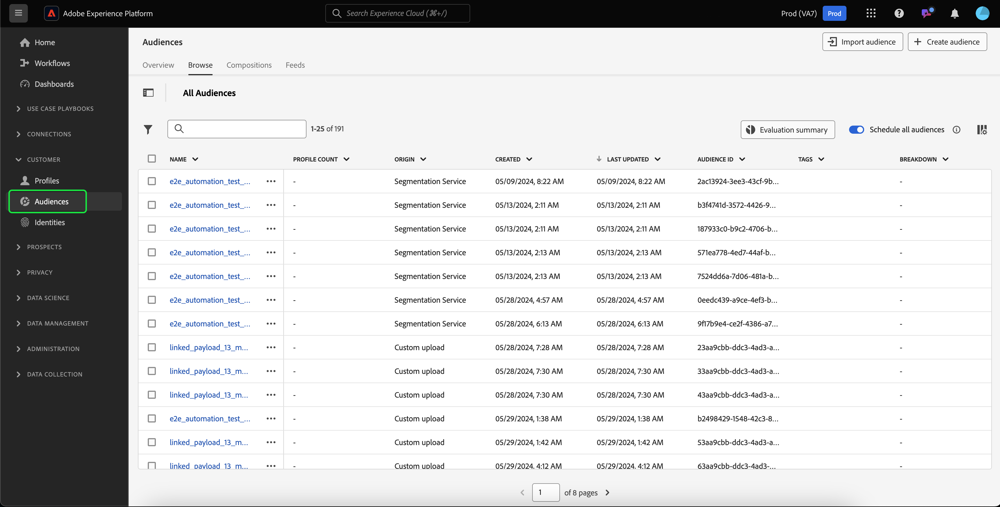
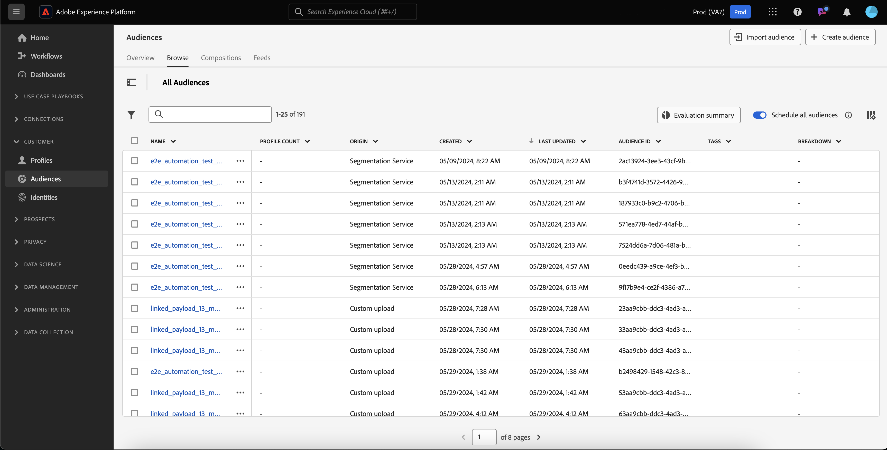

# Guida ai tipi di pubblico per le persone

In Adobe Experience Platform, i tipi di pubblico basati sulle persone ti consentono di eseguire il targeting di gruppi specifici di persone per le campagne di marketing.

Il pubblico di persone utilizza i dati del profilo del cliente per eseguire il targeting di mercati specifici, consentendoti di eseguire meglio il targeting di dati demografici specifici che desideri pubblicizzare.

## Terminologia {#terminology}

Prima di iniziare a usare il pubblico, esamina le differenze tra i diversi tipi di pubblico:

- **Tipi di pubblico dell&#39;account**: un pubblico dell&#39;account è un pubblico creato utilizzando i dati del profilo **account**. I dati del profilo account possono essere utilizzati per creare tipi di pubblico mirati alle persone negli account a valle. Per ulteriori informazioni sui tipi di pubblico dell&#39;account, leggere la [panoramica sul pubblico dell&#39;account](./account-audiences.md).
- **Pubblico persone**: un pubblico persone è un pubblico creato utilizzando i dati del profilo **cliente**. I dati del profilo cliente possono essere utilizzati per creare tipi di pubblico mirati alla clientela della tua azienda.
- **Pubblico potenziale**: un pubblico potenziale è un pubblico creato utilizzando i dati del profilo **prospect**. I dati del profilo del potenziale cliente possono essere utilizzati per creare tipi di pubblico da utenti non autenticati. Per ulteriori informazioni sui tipi di pubblico potenziali, leggere la [panoramica sul pubblico potenziale](./prospect-audiences.md).

## Accesso {#access}

Per accedere ai tipi di pubblico, seleziona **[!UICONTROL Tipi di pubblico]** nella sezione **[!UICONTROL Clienti]**.

Viene visualizzato il Portale dei tipi di pubblico, con un elenco di tutti i tipi di pubblico per l’organizzazione.

Questa vista elenca informazioni sul pubblico, tra cui nome, conteggio dei profili, origine, stato del ciclo di vita, data di creazione e data dell’ultimo aggiornamento.

Puoi anche utilizzare la funzionalità di ricerca e filtro per cercare e ordinare rapidamente tipi di pubblico specifici per l’account. Ulteriori informazioni su questa funzione sono disponibili nella [Panoramica di Audience Portal](../ui/audience-portal.md#manage-audiences).

## Dettagli del pubblico {#details}

Per visualizzare i dettagli su un pubblico specifico di persone, seleziona un pubblico in Audience Portal.

Viene visualizzata la pagina dei dettagli del pubblico. Vengono visualizzate informazioni quali descrizione, origine e stato del ciclo di vita.

Per ulteriori informazioni sulla pagina dei dettagli del pubblico, consulta la sezione [dettagli del pubblico nella panoramica di Audience Portal](../ui/audience-portal.md#audience-details).

## Crea pubblico {#create}

Puoi creare un pubblico di tipo persone utilizzando il Compositore pubblico o il Generatore di segmenti. Per iniziare a creare un pubblico di tipo Persone, seleziona Crea pubblico sul Portale pubblico.

Viene visualizzato un popover che consente di scegliere se comporre un pubblico o creare regole.

Per informazioni più dettagliate sulla creazione di tipi di pubblico, consulta la [Panoramica di Audience Portal](../ui/audience-portal.md#create-audience).

## Attiva pubblico {#activate}

Dopo aver creato il pubblico di persone, puoi attivarlo in altri servizi a valle.

Seleziona il pubblico da attivare, seguito da **[!UICONTROL Attiva nella destinazione]**.

Viene visualizzata la pagina [!UICONTROL Attiva destinazione], con l&#39;elenco delle destinazioni disponibili a seconda della frequenza di aggiornamento del pubblico. Per ulteriori informazioni sul processo di attivazione, leggere la [panoramica sull&#39;attivazione](../../destinations/ui/activation-overview.md).

## Passaggi successivi

Dopo aver letto questa guida, sai come creare e gestire i tipi di pubblico delle persone in Adobe Experience Platform. Per informazioni sui diversi tipi di pubblico, leggi la [panoramica sui tipi di pubblico](./overview.md).
