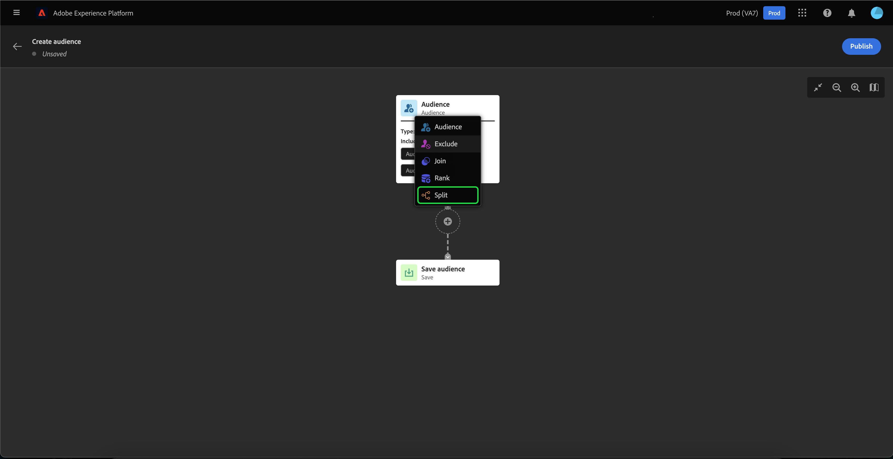
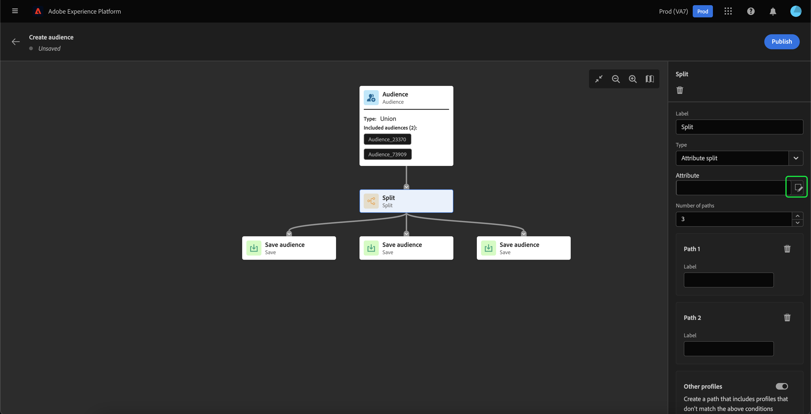
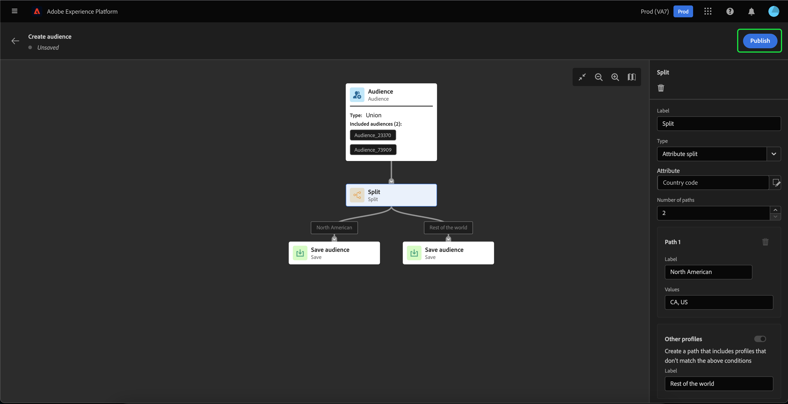

# Guida all’interfaccia utente di Audience Builder

>[!IMPORTANT]
>
>Audience Builder è attualmente in versione beta e non è disponibile per tutti gli utenti. La documentazione e le funzionalità sono soggette a modifiche.

Audience Builder fornisce un’area di lavoro per creare e modificare i tipi di pubblico, utilizzando i blocchi utilizzati per rappresentare azioni diverse.

L’area di lavoro della composizione del pubblico è composta da cinque diversi tipi di blocchi: **[[!UICONTROL Pubblico]](#audience-block)**, **[[!UICONTROL Escludi]](#exclude-block)**, **[[!UICONTROL Iscriviti]](#join-block)**, **[[!UICONTROL Classificazione]](#rank-block)** e **[[!UICONTROL Divisione]](#split-block)**.

## [!UICONTROL Destinatari] {#audience-block}

La **[!UICONTROL Pubblico]** il tipo di blocco ti consente di aggiungere i tipi di pubblico secondari che desideri comporre per il nuovo pubblico più grande. Per impostazione predefinita, un **[!UICONTROL Pubblico]** il blocco è incluso nella parte superiore dell&#39;area di composizione.

Quando selezioni la **[!UICONTROL Pubblico]** nella barra a destra sono visualizzati i controlli per l’etichettatura e l’aggiunta di tipi di pubblico al blocco .

Dopo aver selezionato **[!UICONTROL Aggiungi pubblico]**, viene visualizzato un elenco di tipi di pubblico. Seleziona il pubblico da includere, seguito da **[!UICONTROL Aggiungi]** per aggiungerli al blocco del pubblico.

I tipi di pubblico selezionati vengono ora visualizzati nella barra a destra quando **[!UICONTROL Pubblico]** blocco selezionato. Da qui puoi modificare il tipo di unione dei tipi di pubblico combinati.

| Tipo di unione | Descrizione |
| ---------- | ----------- |
| [!UICONTROL Unione] | I tipi di pubblico vengono combinati in un unico pubblico. Equivale a un&#39;operazione OR. |
| [!UICONTROL Intersection] | I tipi di pubblico vengono combinati, con solo i tipi di pubblico condivisi in **tutto** di essere aggiunti. Equivale a un&#39;operazione AND. |
| [!UICONTROL Escludi sovrapposizione] | I tipi di pubblico vengono combinati, con solo i tipi di pubblico condivisi in **uno, ma non tutti** di essere aggiunti. Equivale a un&#39;operazione XOR. |

## [!UICONTROL Escludi] {#exclude-block}

La **[!UICONTROL Escludi]** il tipo di blocco ti consente di escludere tipi di pubblico o attributi specifici dal nuovo pubblico più grande.

Per aggiungere un **[!UICONTROL Escludi]** blocco, seleziona **+** , seguita da **[!UICONTROL Escludi]**.

La **[!UICONTROL Escludi]** viene aggiunto il blocco . Quando questo blocco è selezionato, i dettagli relativi all’esclusione vengono visualizzati nella barra a destra. Questo include l’etichetta e il tipo di esclusione del blocco. Puoi escludere [per pubblico](#exclude-audience) o [per attributo](#exclude-attribute).

### Escludi per pubblico {#exclude-audience}

Se escludi per pubblico, puoi selezionare i tipi di pubblico da escludere selezionando **[!UICONTROL Aggiungi pubblico]**.

Viene visualizzato un elenco di tipi di pubblico. Seleziona **[!UICONTROL Aggiungi]** per aggiungere i tipi di pubblico da escludere al blocco exclude.

### Escludi per attributo {#exclude-attribute}

Se escludi per attributo, puoi selezionare gli attributi da escludere selezionando la  all’interno dell’icona **[!UICONTROL Regola di esclusione]** sezione .

Viene visualizzato un elenco di attributi di profilo. Seleziona il tipo di attributo da escludere, seguito da **[!UICONTROL Seleziona]** per aggiungerli al blocco di esclusione.

## [!UICONTROL Iscriversi] {#join-block}

La **[!UICONTROL Iscriviti]** il tipo di blocco consente di aggiungere tipi di pubblico esterni da set di dati non ancora elaborati da Adobe Experience Platform.

Per aggiungere una **[!UICONTROL Iscriviti]** blocco, seleziona **+** , seguita da **[!UICONTROL Iscriviti]**.

Quando selezioni il blocco , i dettagli sul join vengono visualizzati nella barra a destra, inclusa l’etichetta del blocco e l’opzione per aggiungere tipi di pubblico al set di dati di arricchimento.

Dopo aver selezionato **[!UICONTROL Aggiungi pubblico]**, viene visualizzato un elenco di tipi di pubblico. Seleziona il pubblico da includere, seguito da **[!UICONTROL Aggiungi]** per aggiungerli al blocco di join.

I tipi di pubblico selezionati vengono ora visualizzati nella barra a destra quando **[!UICONTROL Iscriviti]** blocco selezionato.

## [!UICONTROL Classificazione] {#rank-block}

La **[!UICONTROL Classificazione]** il tipo di blocco ti consente di classificare e ordinare i tipi di pubblico prima che il nuovo pubblico venga pubblicato.

Per aggiungere una **[!UICONTROL Classificazione]** blocco, seleziona **+** , seguita da **[!UICONTROL Classificazione]**.

Quando selezioni il blocco , i dettagli sulla classificazione vengono visualizzati nella barra a destra, inclusa l’etichetta del blocco, l’attributo da classificare, l’ordine di classificazione e un interruttore per limitare il numero di profili alla classificazione.

Per selezionare l&#39;attributo per cui classificare i tipi di pubblico, seleziona la  icona.

Viene visualizzato un elenco di attributi di profilo. Su questo pover, puoi selezionare il tipo di attributo per il quale vuoi classificare il pubblico. Seleziona **[!UICONTROL Seleziona]** per aggiungerlo al blocco di rango. L&#39;attributo selezionato può essere **only** essere di tipo `int`.

Dopo aver selezionato l’attributo, puoi selezionare l’ordine in cui classificarlo. In ordine crescente (dal più basso al più alto) o decrescente (dal più alto al più basso).

Inoltre, puoi limitare il numero di tipi di pubblico restituiti abilitando il **[!UICONTROL Aggiungi limite profilo]** alternare. Quando questa opzione è attivata, puoi impostare il numero massimo di tipi di pubblico restituiti all’interno della **[!UICONTROL Profili inclusi]** campo .

## [!UICONTROL Dividere] {#split-block}

La **[!UICONTROL Divisione]** il tipo di blocco ti consente di suddividere il nuovo pubblico in vari sottotipi di pubblico. Puoi suddividere questo pubblico in base alla percentuale o a un attributo.

Per aggiungere una **[!UICONTROL Divisione]** blocco, seleziona **+** , seguita da **[!UICONTROL Divisione]**.

### Suddivisione per percentuale {#split-percentage}

Quando si suddivide in percentuale, i tipi di pubblico vengono suddivisi in modo casuale, in base al numero di percorsi e alle percentuali fornite.

Ad esempio, puoi avere tre percorsi, ciascuno con una percentuale diversa di profili.

Inoltre, puoi contrassegnare uno dei tipi di pubblico suddivisi come gruppo di controllo.

### Divisione per attributo {#split-attribute}

Quando si suddivide per attributo, i tipi di pubblico vengono suddivisi in base agli attributi forniti. Per selezionare l&#39;attributo per il quale eseguire la suddivisione, selezionare la **[!UICONTROL Divisione]** blocco, seguito dal  icona.

Viene visualizzato un elenco di attributi di profilo. Seleziona il tipo di attributo, seguito da **[!UICONTROL Seleziona]** per aggiungerlo al blocco di divisione.

Dopo aver selezionato l’attributo , puoi scegliere i profili a cui appartiene il sottopubblico aggiungendo i valori all’interno del **[!UICONTROL Valori]** campo .

Inoltre, puoi abilitare il **[!UICONTROL Altri profili]** per creare un pubblico secondario composto da tutti i profili non selezionati.

## Pubblicazione del pubblico

Dopo aver creato il pubblico, puoi salvarlo e pubblicarlo selezionando **[!UICONTROL Pubblica]**.

In caso di errori durante la creazione del pubblico, viene visualizzato un avviso che ti informa su come risolvere il problema.

## Passaggi successivi

Audience Builder fornisce un flusso di lavoro ricco che consente di creare tipi di pubblico dai diversi tipi di blocchi. Per ulteriori informazioni su altre parti dell’interfaccia utente del servizio di segmentazione, consulta la sezione [Guida utente al servizio di segmentazione](./overview.md).
