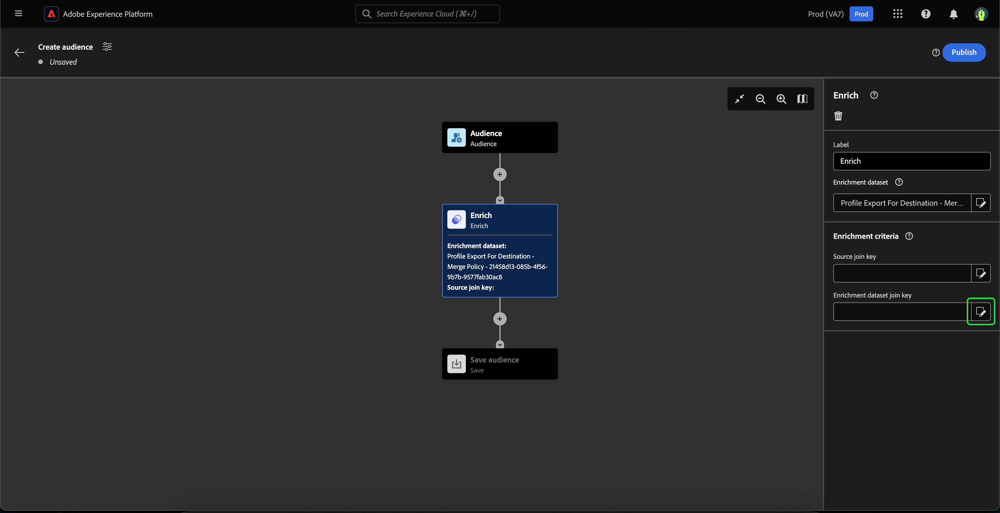

# Guida dell’interfaccia utente di Audience Composition

>[!NOTE]
>
>Questa guida spiega come creare tipi di pubblico utilizzando Composizione pubblico. Per informazioni su come creare tipi di pubblico tramite le definizioni dei segmenti utilizzando il Generatore di segmenti, consulta la [guida dell&#39;interfaccia utente del Generatore di segmenti](./segment-builder.md).

La funzione Composizione pubblico fornisce un’area di lavoro per creare e modificare i tipi di pubblico, utilizzando blocchi che rappresentano azioni diverse.

Per modificare i dettagli della composizione, inclusi il titolo e la descrizione, selezionare il pulsante .

Viene visualizzato il popover **[!UICONTROL Proprietà composizione]**. È possibile inserire i dettagli della composizione, inclusi il titolo e la descrizione qui.

>[!NOTE]
>
>Se **non** assegna un titolo alla composizione, per impostazione predefinita il titolo sarà &quot;Composizione&quot; seguito dalla data e dall&#39;ora di creazione. Inoltre, ogni composizione **deve** avere un proprio nome univoco.

Dopo aver aggiornato i dettagli della composizione, seleziona **[!UICONTROL Salva]** per confermare questi aggiornamenti. L’area di lavoro per la composizione del pubblico viene nuovamente visualizzata.

L&#39;area di lavoro per la composizione del pubblico è composta da quattro diversi tipi di blocchi: **[[!UICONTROL Pubblico]](#audience-block)**, **[[!UICONTROL Escludi]](#exclude-block)**, **[[!UICONTROL Classifica]](#rank-block)** e **[[!UICONTROL Dividi]](#split-block)**.

## [!UICONTROL Pubblico] {#audience-block}

Il tipo di blocco **[!UICONTROL Pubblico]** ti consente di aggiungere i sottogruppi di pubblico che desideri comporre il nuovo pubblico più grande. Per impostazione predefinita, un blocco **[!UICONTROL Pubblico]** è incluso nella parte superiore dell&#39;area di lavoro della composizione.

Quando selezioni il blocco **[!UICONTROL Pubblico]**, nella barra a destra vengono visualizzati i controlli per etichettare il pubblico, aggiungere tipi di pubblico al blocco e creare regole personalizzate per il blocco di pubblico.

>[!NOTE]
>
>Puoi aggiungere tipi di pubblico **o** per creare una regola personalizzata. Queste due funzionalità **non possono** essere utilizzate insieme.

### [!UICONTROL Aggiungi pubblico] {#add-audience}

Aggiungere tipi di pubblico al blocco Pubblico. selezionare **[!UICONTROL Aggiungi pubblico]**.

>[!IMPORTANT]
>
>Tieni presente che verranno visualizzati **solo** tipi di pubblico definiti utilizzando il criterio di unione predefinito.
>
>Inoltre, è possibile utilizzare solo i tipi di pubblico **pubblicati** creati con Segment Builder. I tipi di pubblico creati mediante Composizione pubblico e quelli generati esternamente sono **non** disponibili.

Viene visualizzato un elenco di tipi di pubblico. Seleziona i tipi di pubblico da includere, seguito da **[!UICONTROL Aggiungi]** per aggiungerli al blocco di pubblico.

I tipi di pubblico selezionati vengono ora visualizzati nella barra a destra quando è selezionato il blocco **[!UICONTROL Pubblico]**. Da qui, puoi modificare il tipo di unione dei tipi di pubblico combinati.

| Tipo di unione | Descrizione |
| ---------- | ----------- |
| [!UICONTROL Union] | I tipi di pubblico vengono combinati in un unico pubblico. Equivale a un&#39;operazione OR. |
| [!UICONTROL Intersection] | I tipi di pubblico vengono combinati e vengono aggiunti solo quelli condivisi in **tutti**. Equivale a un&#39;operazione AND. |
| [!UICONTROL Escludi sovrapposizione] | I tipi di pubblico vengono combinati, con solo quelli condivisi in **uno, ma non tutti**. Equivale a un&#39;operazione XOR. |

### [!UICONTROL Genera regola] {#build-rule}

Per aggiungere una regola personalizzata al blocco Pubblico, seleziona **[!UICONTROL Genera regola]**.

Viene visualizzato il Generatore di segmenti. Puoi utilizzare il Generatore di segmenti per creare una regola personalizzata che il pubblico dovrà seguire. Ulteriori informazioni sull&#39;utilizzo del Generatore di segmenti sono disponibili nella [guida del Generatore di segmenti](./segment-builder.md).

Dopo aver aggiunto una regola personalizzata, seleziona **[!UICONTROL Salva]** per aggiungere la regola al pubblico.

## [!UICONTROL Escludi] {#exclude-block}

Il tipo di blocco **[!UICONTROL Escludi]** ti consente di escludere pubblici secondari o attributi specifici dal tuo nuovo pubblico più grande.

Per aggiungere un blocco **[!UICONTROL Escludi]**, seleziona l&#39;icona **+**, seguita da **[!UICONTROL Escludi]**.

Il blocco **[!UICONTROL Escludi]** è stato aggiunto. Quando questo blocco è selezionato, i dettagli sull’esclusione vengono visualizzati nella barra a destra. Questo include l’etichetta del blocco e il tipo di esclusione. È possibile escludere [per pubblico](#exclude-audience) o [per attributo](#exclude-attribute).

### Escludi per pubblico {#exclude-audience}

Se escludi per pubblico, puoi selezionare i tipi di pubblico da escludere selezionando **[!UICONTROL Aggiungi pubblico]**.

![È selezionato il pulsante [!UICONTROL Aggiungi pubblico], che consente di scegliere il pubblico da escludere.](../images/ui/audience-composition/add-excluded-audience.png)

>[!IMPORTANT]
>
>È possibile utilizzare solo i tipi di pubblico **pubblicati** creati con Segment Builder. I tipi di pubblico creati mediante Composizione pubblico e quelli generati esternamente sono **non** disponibili.

Viene visualizzato un elenco di tipi di pubblico. Seleziona **[!UICONTROL Aggiungi]** per aggiungere i tipi di pubblico da escludere al blocco di esclusione.

### Escludi per attributo {#exclude-attribute}

Se escludi per attributo, puoi selezionare gli attributi da escludere selezionando l&#39;icona  nella sezione **[!UICONTROL Regola di esclusione]**.

Viene visualizzato un elenco di attributi di profilo. Seleziona il tipo di attributo da escludere, seguito da **[!UICONTROL Seleziona]** per aggiungerlo al blocco di esclusione.

>[!IMPORTANT]
>
>Quando si esclude per attributo, è possibile specificare solo **un** valore da escludere. L&#39;utilizzo di qualsiasi tipo di separatore, ad esempio una virgola o un punto e virgola, determina l&#39;esclusione del valore esatto. Se ad esempio si imposta il valore come `red, blue`, il termine `red, blue` verrà escluso dall&#39;attributo, ma **non** comporterà l&#39;esclusione del termine `red` o `blue`.

## [!UICONTROL Arricchisci] {#enrich-block}

>[!IMPORTANT]
>
>Al momento, gli attributi di arricchimento possono **solo** essere utilizzati in scenari Adobe Journey Optimizer a valle.

Il tipo di blocco **[!UICONTROL Arricchisci]** ti consente di arricchire il pubblico con attributi aggiuntivi da un set di dati. Puoi utilizzare questi attributi nei casi di utilizzo di personalizzazione.

Per aggiungere un blocco **[!UICONTROL Arricchisci]**, seleziona l&#39;icona **+**, seguita da **[!UICONTROL Arricchisci]**.

![L&#39;opzione [!UICONTROL Arricchisci] è selezionata.](../images/ui/audience-composition/add-enrich-block.png)

Blocco **[!UICONTROL Arricchisci]** aggiunto. Quando questo blocco è selezionato, i dettagli sull’arricchimento vengono visualizzati nella barra a destra. Questo include l’etichetta del blocco e il set di dati di arricchimento.

Per selezionare il set di dati con cui arricchire il pubblico, seleziona l&#39;icona .

![Il pulsante del filtro è evidenziato. Selezionando questa opzione si accede al popover [!UICONTROL Seleziona set di dati].](../images/ui/audience-composition/enrich-select-dataset.png)

Viene visualizzato il popover **[!UICONTROL Seleziona set di dati]**. Seleziona il set di dati da aggiungere per l&#39;arricchimento, seguito da **[!UICONTROL Seleziona]** per aggiungere il set di dati per l&#39;arricchimento.

>[!IMPORTANT]
>
>Il set di dati selezionato **deve** soddisfare i seguenti criteri:
>
>- Il set di dati **deve** essere di tipo record.
>   - Il set di dati **non può** essere di tipo evento, generato dal sistema o contrassegnato per il profilo.
>- Il set di dati **deve** essere di almeno 1 GB.

La sezione **[!UICONTROL Criteri di arricchimento]** è ora visualizzata nella barra a destra. In questa sezione è possibile selezionare la **[!UICONTROL chiave di join di Source]** e la **[!UICONTROL chiave di join del set di dati di arricchimento]**, che consente di collegare il set di dati di arricchimento al pubblico che si sta tentando di creare.

![L&#39;area [!UICONTROL Criteri di arricchimento] è evidenziata.](../images/ui/audience-composition/enrichment-criteria.png)

Per selezionare la **[!UICONTROL chiave di join di Source]**, selezionare l&#39;icona .

![L&#39;icona del filtro per la [!UICONTROL chiave di join di Source] è evidenziata.](../images/ui/audience-composition/enrich-select-source-join-key.png)

Viene visualizzato il popover **[!UICONTROL Seleziona un attributo di profilo]**. Seleziona l&#39;attributo di profilo che desideri utilizzare come chiave di join di origine, seguito da **[!UICONTROL Seleziona]** per scegliere tale attributo come chiave di join di origine.

Per selezionare la chiave di join del set di dati **[!UICONTROL Enrichment]**, selezionare l&#39;icona .

Viene visualizzato il popover **[!UICONTROL Attributi di arricchimento]**. Seleziona l&#39;attributo da utilizzare come chiave di join del set di dati di arricchimento, seguito da **[!UICONTROL Seleziona]** per scegliere tale attributo come chiave di join del set di dati di arricchimento.

Dopo aver aggiunto entrambe le chiavi di join, viene visualizzata la sezione **[!UICONTROL Attributi di arricchimento]**. Ora puoi aggiungere l’attributo con cui desideri migliorare il pubblico. Per aggiungere questi attributi, selezionare **[!UICONTROL Aggiungi attributo]**.

![Il pulsante [!UICONTROL Aggiungi attributo] è evidenziato.](../images/ui/audience-composition/enrich-select-add-attribute.png)

Viene visualizzato il popover **[!UICONTROL Attributi di arricchimento]**. Puoi selezionare gli attributi dal set di dati con cui arricchire il pubblico, seguito da **[!UICONTROL Seleziona]** per aggiungere gli attributi al pubblico.

<!-- ## [!UICONTROL Join] {#join-block}

The **[!UICONTROL Join]** block type allows you to add in external audiences from datasets that have not yet been processed by Adobe Experience Platform.

To add a **[!UICONTROL Join]** block, select the **+** icon, followed by **[!UICONTROL Join]**.

When you select the block, details about the join are shown in the right rail, including the block's label and the option to add audiences to the enrichment dataset.

After selecting **[!UICONTROL Add Audience]**, a list of audiences appears. Select the audiences you want to include, followed by **[!UICONTROL Add]** to add them to your join block.

Your selected audiences now appear within the right rail when the **[!UICONTROL Join]** block is selected. 

 -->

## [!UICONTROL Classifica] {#rank-block}

Il tipo di blocco **[!UICONTROL Classifica]** consente di classificare e ordinare i profili in base a un attributo specificato e di includerli nella composizione.

Per aggiungere un blocco **[!UICONTROL Classifica]**, seleziona l&#39;icona **+**, seguita da **[!UICONTROL Classifica]**.

Quando selezioni il blocco, i dettagli sulla classificazione vengono visualizzati nella barra a destra, tra cui l’etichetta del blocco, l’attributo in base al quale eseguire la classificazione, l’ordine di classificazione e un interruttore per limitare il numero di profili da classificare.

Per selezionare l&#39;attributo in base al quale classificare i tipi di pubblico, seleziona l&#39;icona .

Viene visualizzato un elenco di attributi di profilo. In questo popover, puoi selezionare il tipo di attributo in base al quale classificare il pubblico. Seleziona **[!UICONTROL Seleziona]** per aggiungerlo al tuo blocco di classificazione. Tieni presente che l&#39;attributo selezionato può essere **solo** numeri.

Dopo aver selezionato l’attributo, puoi selezionare l’ordine in base al quale classificarlo. In ordine crescente (dal più basso al più alto) o decrescente (dal più alto al più basso).

Inoltre, puoi limitare il numero di profili restituiti abilitando l&#39;interruttore **[!UICONTROL Aggiungi limite profilo]**. Quando questa opzione è abilitata, puoi impostare il numero massimo di profili restituiti all&#39;interno del campo **[!UICONTROL Profili inclusi]**.

## [!UICONTROL Divisione] {#split-block}

Il tipo di blocco **[!UICONTROL Dividi]** ti consente di suddividere il nuovo pubblico in vari sottogruppi. Puoi suddividere questo pubblico in base alla percentuale o a un attributo. Durante la suddivisione del pubblico in sottotargeting, la suddivisione è **non** persistente. Ciò significa che i profili possono trovarsi in diversi sottotipi di pubblico per ogni valutazione.

Per aggiungere un blocco **[!UICONTROL Split]**, seleziona l&#39;icona **+**, seguita da **[!UICONTROL Split]**.

Quando dividi il pubblico, puoi dividerlo per percentuale o per attributo.

### Dividi per percentuale {#split-percentage}

Quando si suddivide in percentuale, il pubblico viene suddiviso in modo casuale, in base al numero di percorsi e alle percentuali fornite.

Ad esempio, puoi avere tre percorsi, ciascuno con una percentuale diversa di profili.

### Dividi per attributo {#split-attribute}

Quando si divide per attributo, il pubblico viene diviso in base agli attributi forniti. Per selezionare l&#39;attributo da dividere, selezionare il blocco **[!UICONTROL Dividi]**, seguito dall&#39;icona .

Viene visualizzato un elenco di attributi di profilo. Seleziona il tipo di attributo, seguito da **[!UICONTROL Seleziona]** per aggiungerlo al blocco di suddivisione.

Dopo aver selezionato l&#39;attributo, puoi scegliere quali profili apparterranno a quale pubblico secondario aggiungendo i valori all&#39;interno del campo **[!UICONTROL Valori]**.

Inoltre, puoi abilitare l&#39;interruttore **[!UICONTROL Altri profili]** per creare un pubblico secondario composto da tutti i profili non selezionati.

## Pubblicazione del pubblico

>[!IMPORTANT]
>
>Quando pubblichi la composizione del pubblico, tieni presente che potrebbero essere necessarie fino a 48 ore per valutarla e attivarla per l’utilizzo in servizi a valle come una destinazione Real-Time CDP o un canale Adobe Journey Optimizer.

Dopo aver creato la composizione, puoi salvarla e pubblicarla selezionando **[!UICONTROL Publish]**.

In caso di errori nella creazione del pubblico, viene visualizzato un avviso che informa su come risolvere il problema.

## Passaggi successivi

La funzione Composizione pubblico offre un flusso di lavoro avanzato che consente di creare composizioni da diversi tipi di blocchi. Per ulteriori informazioni su altre parti dell&#39;interfaccia utente di Segmentation Service, consulta la [Guida utente di Segmentation Service](./overview.md).
