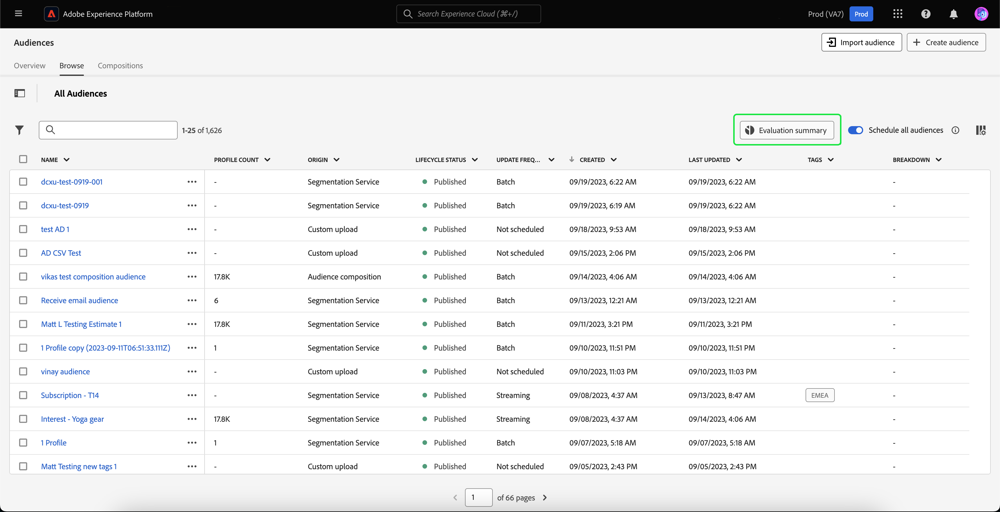
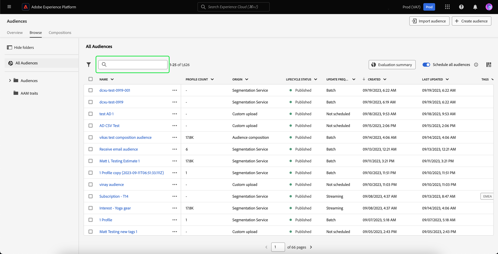
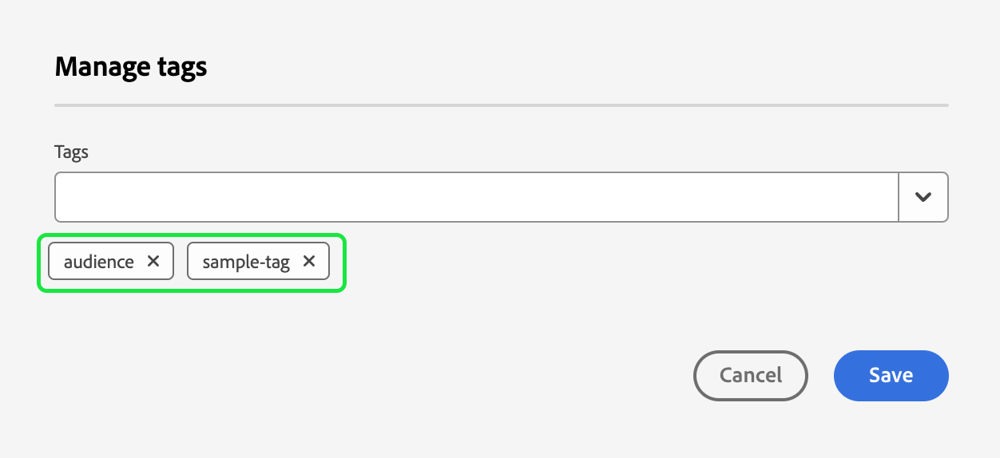
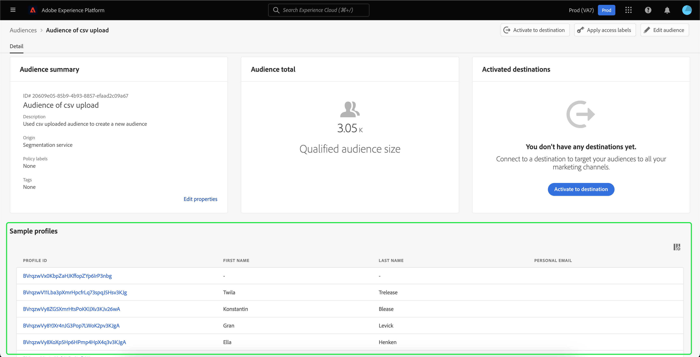
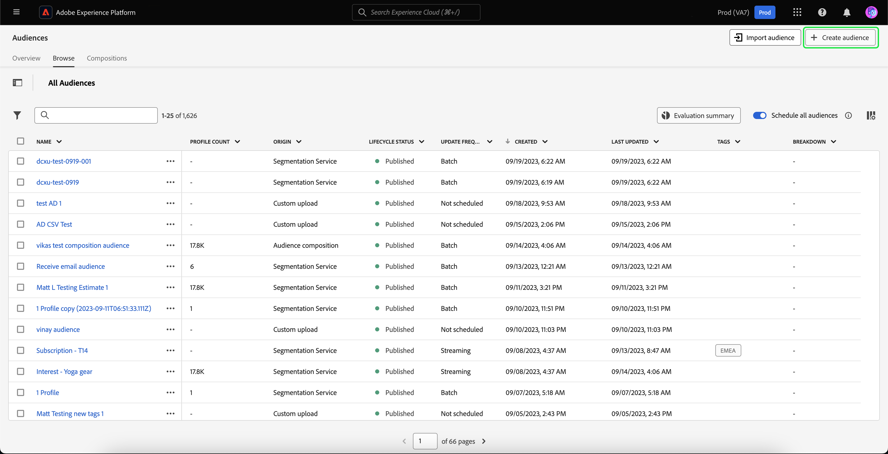

# Panoramica di Audience Portal

Audience Portal è un hub centrale, all&#39;interno di Adobe Experience Platform, che consente di visualizzare, gestire e creare audience.

All&#39;interno di Audience Portal, puoi eseguire le seguenti attività:

>[!BEGINSHADEBOX]

- [Visualizza un elenco dei tuoi tipi di pubblico](#list)
   - [Utilizzare azioni rapide sui tipi di pubblico](#quick-actions)
   - [Personalizzare le proprietà visualizzate nell&#39;elenco dei tipi di pubblico](#customize)
   - [Utilizzare filtri, cartelle e tag per organizzare i tipi di pubblico](#manage-audiences)
- [Visualizzare i dettagli sul pubblico](#audience-details)
   - [Visualizza un riepilogo sul pubblico](#audience-summary)
- [Abilita i tipi di pubblico per la segmentazione pianificata](#scheduled-segmentation)
- [Creazione di un pubblico](#create-audience)
   - [Utilizza Segment Builder (Generatore di segmenti) per creare un pubblico](#segment-builder)
   - [Utilizzare la composizione del pubblico per creare un pubblico](#audience-composition)
   - [Utilizza Federated Audience Composition per creare un pubblico utilizzando i dati del data warehouse esistente](#fac)
   - [Utilizzare Data Distiller per creare un&#39;audience](#data-distiller)
- [Importare tipi di pubblico generati esternamente](#import-audience)

>[!ENDSHADEBOX]

Per aprire Audience Portal, seleziona il **[!UICONTROL scheda Sfoglia]** nella sezione Segmentazione.

## Elenco dei tipi di pubblico {#list}

>[!CONTEXTUALHELP]
>id="platform_segments_browse_churncolumnname"
>title="Abbandono"
>abstract="L’abbandono rappresenta la percentuale di profili che cambiano all’interno di un pubblico rispetto all’ultima esecuzione del processo di segmentazione."

>[!CONTEXTUALHELP]
>id="platform_segments_browse_evaluationmethodcolumnname"
>title="Metodo di valutazione"
>abstract="I metodi di valutazione per i tipi di pubblico includono batch, streaming e Edge."

Per impostazione predefinita, Audience Portal visualizza un elenco di tutti i tipi di pubblico nell’organizzazione e nella sandbox, inclusi il conteggio dei profili, l’origine, la data di creazione, la data dell’ultima modifica, i tag e il raggruppamento.

### Azioni rapide {#quick-actions}

Accanto a ogni pubblico è presente un’icona con i puntini di sospensione. Selezionando questa opzione viene visualizzato un elenco delle azioni rapide disponibili per il pubblico. Questo elenco di azioni è diverso in base all’origine del pubblico.

[L&#39;elenco delle azioni rapide viene visualizzato per i tipi di pubblico con l&#39;origine della composizione] del ![[!UICONTROL pubblico.]](../images/ui/audience-portal/browse-audience-composition-details.png)

| Azione | Origini | Descrizione |
| ------ | ------- | ----------- |
| [!UICONTROL Modifica] | Servizio di segmentazione | Apre Segment Builder (Generatore di segmenti) per modificare il pubblico. Tieni presente che se il pubblico è stato creato tramite l&#39;API, **non** sarà in grado di modificarlo utilizzando Segment Builder. Per ulteriori informazioni sull&#39;utilizzo del Generatore di segmenti, consulta la [guida all&#39;interfaccia di Generatore di segmenti](./segment-builder.md). |
| [!UICONTROL Composizione aperta] | Composizione del pubblico | Apre la composizione Pubblico per vedere il pubblico. Per ulteriori informazioni sulla composizione del pubblico, leggi la guida[&#128279;](./audience-composition.md) interfaccia alla composizione del pubblico. |
| [!UICONTROL Attiva nella destinazione] | Servizio di segmentazione | Attiva il pubblico in una destinazione. Per informazioni più dettagliate sull&#39;attivazione di un pubblico in una destinazione, leggere la [panoramica sull&#39;attivazione](../../destinations/ui/activation-overview.md). |
| [!UICONTROL Condividi con i partner] | Composizione del pubblico, caricamento personalizzato, servizio di segmentazione | Condivide il tuo pubblico con altri utenti Experience Platform. Per ulteriori informazioni su questa funzione, leggi la panoramica[&#128279;](./segment-match/overview.md) di Segment Match. |
| [!UICONTROL Gestisci tag] | Composizione del pubblico, caricamento personalizzato, servizio di segmentazione | Gestisce i tag definiti dal utente che appartengono al pubblico. Per ulteriori informazioni su questa funzione, leggi la sezione su filtri [e assegnazione tag](#manage-audiences). |
| [!UICONTROL Sposta nella cartella] | Composizione del pubblico, caricamento personalizzato, servizio di segmentazione | Gestisce la cartella a cui appartiene il pubblico. Per ulteriori informazioni su questa funzione, leggere la sezione relativa al filtro e all&#39;assegnazione di tag [1.](#manage-audiences) |
| [!UICONTROL Copia] | Servizio di segmentazione | Duplica il pubblico selezionato. Ulteriori informazioni su questa funzione sono disponibili nelle [Domande frequenti sulla segmentazione](../faq.md#copy). |
| [!UICONTROL Applica etichette di accesso] | Composizione del pubblico, caricamento personalizzato, servizio di segmentazione | Gestisce le etichette di accesso che appartengono al pubblico. Per ulteriori informazioni sulle etichette di accesso, consulta la documentazione su [gestione delle etichette](../../access-control/abac/ui/labels.md). |
| [!UICONTROL Pubblica] | Caricamento personalizzato, servizio di segmentazione | Pubblica il pubblico selezionato. Per ulteriori informazioni sulla gestione dello stato del ciclo di vita, leggi la [sezione sullo stato del ciclo di vita delle domande frequenti](../faq.md#lifecycle-states) sulla segmentazione. |
| [!UICONTROL Disattivare] | Caricamento personalizzato, servizio di segmentazione | Disattiva il pubblico selezionato. Tieni presente che per disattivare un pubblico, **non può** essere attivato in **qualsiasi** destinazione (comprese le destinazioni non Experience Platform) o far parte di **qualsiasi** altro pubblico. Per ulteriori informazioni sulla gestione dello stato del ciclo di vita, consulta la sezione [stato del ciclo di vita nelle Domande frequenti sulla segmentazione](../faq.md#lifecycle-states). |
| [!UICONTROL Elimina] | Composizione del pubblico, caricamento personalizzato, servizio di segmentazione | Elimina il pubblico selezionato. I tipi di pubblico utilizzati nelle destinazioni a valle o dipendenti in altri tipi di pubblico **non possono** essere eliminati. Per ulteriori informazioni sull&#39;eliminazione del pubblico, leggere le [domande frequenti sulla segmentazione](../faq.md#lifecycle-states). |
| [!UICONTROL Aggiungi al pacchetto] | Composizione del pubblico, caricamento personalizzato, servizio di segmentazione | Sposta il pubblico da una sandbox all’altra. Per ulteriori informazioni su questa funzione, leggi la guida[&#128279;](../../sandboxes/ui/sandbox-tooling.md) agli strumenti sandbox. |

>[!IMPORTANT]
>
>Prima di eliminare il pubblico, assicurati che non venga **&#x200B;**&#x200B;utilizzato come componente in un pubblico basato su account o in Adobe Systems Journey Optimizer.

Nella parte superiore della pagina sono presenti le opzioni per aggiungere tutti i tipi di pubblico a un programmare, importare un pubblico, creare un nuovo pubblico e visualizzare un riepilogo della valutazione del pubblico.

L&#39;attivazione di **[!UICONTROL Pianifica tutti i tipi di pubblico]** abiliterà la segmentazione pianificata. Ulteriori informazioni sulla segmentazione pianificata sono disponibili nella sezione [segmentazione pianificata di questa guida utente](#scheduled-segmentation).

Selezionando **[!UICONTROL Importa pubblico]** potrai importare un pubblico generato esternamente. Per ulteriori informazioni sull&#39;importazione di tipi di pubblico, leggere la sezione relativa all&#39;[importazione di un pubblico nella guida utente](#import-audience).

Selezionando **[!UICONTROL Crea pubblico]** potrai creare un pubblico. Per ulteriori informazioni sulla creazione di tipi di pubblico, consulta la sezione relativa alla [creazione di un pubblico nella guida utente](#create-audience).

È possibile selezionare **[!UICONTROL Riepilogo valutazione]** per visualizzare un grafico a torta che mostra un riepilogo delle valutazioni del pubblico.

Viene visualizzato il grafico a torta, con una suddivisione dei tipi di pubblico in base alla valutazione del pubblico. Il grafico mostra il numero totale di tipi di pubblico al centro e il tempo di valutazione batch giornaliero in UTC nella parte inferiore. Se passi il cursore del mouse sulle diverse parti del pubblico, viene visualizzato il numero di tipi di pubblico che appartengono a ciascun tipo di frequenza di aggiornamento.

### Personalizza {#customize}

Puoi aggiungere ulteriori campi a Portale pubblico selezionando  dell&#39;attributo filtro. Questi campi aggiuntivi includono lo stato del ciclo di vita, la frequenza di aggiornamento, l&#39;ultimo aggiornamento da, la descrizione, la creazione da e le etichette accesso.

| Campo | Descrizione |
| ----- | ----------- |
| [!UICONTROL Nome] | Nome del pubblico. |
| [!UICONTROL Conteggio dei profili] | Il numero totale di profili idonei per il pubblico. |
| [!UICONTROL Origin] | L&#39;origine del pubblico. Questo indica da dove proviene il pubblico. I valori possibili includono [Servizio](#segment-builder) di segmentazione, [Caricamento](#import-audience) personalizzato, [Composizione](#audience-composition) pubblico, [Audience Manager](https://experienceleague.adobe.com/en/docs/audience-manager/user-guide/aam-home), [pubblico](../types/lookalike-audiences.md) simile Look, [Composizione](#fac) pubblico federato, [Customer Journey Analytics](https://experienceleague.adobe.com/en/docs/analytics-platform/using/cja-overview/cja-overview), [Distiller](#data-distiller) dati e [AJO B2B](https://experienceleague.adobe.com/it/docs/journey-optimizer-b2b/user/guide-overview). |
| [!UICONTROL Stato del ciclo di vita] | Stato del pubblico. I valori possibili per questo campo includono `Draft`, `Inactive` e `Published`. Ulteriori informazioni sugli stati del ciclo di vita, compreso il significato dei diversi stati e come spostare i tipi di pubblico in diversi stati del ciclo di vita, sono disponibili nella sezione [lifecycle status delle domande frequenti sulla segmentazione](../faq.md#lifecycle-status). |
| [!UICONTROL Frequenza aggiornamento] | Valore che indica la frequenza con cui vengono aggiornati i dati del pubblico. I valori possibili per questo campo includono [!UICONTROL Batch], [!UICONTROL Streaming], [!UICONTROL Edge] e [!UICONTROL Non pianificato]. |
| [!UICONTROL Ultimo aggiornamento di] | Nome dell&#39;ultima persona che ha aggiornato il pubblico. |
| [!UICONTROL Creato] | Data e ora, in formato UTC, in cui è stato creato il pubblico. |
| [!UICONTROL Ultimo aggiornamento] | La data e l’ora, in UTC, in cui il pubblico è stato aggiornato l’ultima volta. |
| [!UICONTROL Tag] | I tag definiti dall’utente che appartengono al pubblico. Ulteriori informazioni su questi tag sono disponibili nella sezione [sui tag](#tags). |
| [!UICONTROL Descrizione] | Descrizione del pubblico. |
| [!UICONTROL Creato da] | Nome della persona che ha creato il pubblico. |
| [!UICONTROL Etichette di accesso] | Le etichette di accesso per il pubblico. Le etichette di accesso consentono di categorizzare set di dati e campi in base ai criteri di utilizzo applicabili a tali dati. Queste etichette possono essere applicate in qualsiasi momento, fornendo flessibilità nella scelta di come gestire i dati. Per ulteriori informazioni sulle etichette di accesso, consulta la documentazione su [gestione delle etichette](../../access-control/abac/ui/labels.md). |
| [!UICONTROL Crollo] | Lo stato del profilo breakdown per il pubblico. Di seguito è riportata una descrizione più dettagliata di questo breakdown di stato del profilo. |

Se breakdown è selezionata, la visualizzazione mostra un grafico a barre che delinea la percentuale di profili che appartengono a ciascuno dei seguenti stati di profilo calcolati: [!UICONTROL Realizzato], [!UICONTROL Esistente] e [!UICONTROL Esistente]. Inoltre, il breakdown visualizzato sul [!UICONTROL scheda Sfoglia] è il breakdown più accurato dello stato di definizione del segmento. Se questo numero differisce da quanto indicato nella [!UICONTROL scheda panoramica] , è necessario utilizzare i numeri sulla [!UICONTROL scheda Sfoglia] come fonte corretta di informazioni, poiché i [!UICONTROL numeri della scheda panoramica] vengono aggiornati solo una volta al giorno.

| Stato | Descrizione |
| ------ | ----------- |
| [!UICONTROL Realizzato] | Il numero di profili che **hanno qualificato** per il pubblico nelle ultime 24 ore dall&#39;ultima esecuzione del processo di segmentazione batch. |
| [!UICONTROL Esistente] | Numero di profili **rimasti** nel pubblico nelle ultime 24 ore dall&#39;ultima esecuzione del processo di segmentazione batch. Questo campo è **calcolato** e non viene visualizzato nell&#39;oggetto [`segmentMembership`](../../xdm/field-groups/profile/segmentation.md). |
| [!UICONTROL Uscita] | Il numero di profili che **sono usciti** dal pubblico nelle ultime 24 ore dall&#39;ultima esecuzione del processo di segmentazione batch. |

Dopo aver selezionato i campi da visualizzare, è anche possibile ridimensionare la larghezza delle colonne visualizzate. È possibile farlo trascinando l&#39;area tra le colonne o selezionando l&#39;icona  della freccia della colonna che si desidera ridimensionare, seguita da **[!UICONTROL Ridimensiona colonna]**.

### Filtri, cartelle e assegnazione tag {#manage-audiences}

Per migliorare l’efficienza del lavoro, puoi cercare i tipi di pubblico esistenti, aggiungere tag definiti dall’utente ai tipi di pubblico, inserire i tipi di pubblico nelle cartelle e filtrare quelli visualizzati.

#### Ricerca {#search}

Puoi ricerca il tuo pubblico esistente in un massimo di 9 lingue diverse con [!DNL Unified Search].

Per utilizzare [!DNL Unified Search], aggiungi il termine che desideri ricerca nella barra dei ricerca evidenziata.

Per ulteriori informazioni su [!DNL Unified Search], incluse le funzionalità supportate, leggi la [documentazione](https://experienceleague.adobe.com/docs/core-services/interface/services/search-experience-cloud.html) di Unified Search.

#### Tag {#tags}

Puoi aggiungere tag definiti dalla utente per descrivere, trovare e gestire meglio i tuoi tipi di pubblico.

Per aggiungere un tag, seleziona **[!UICONTROL Gestisci]** tag per il pubblico che desideri tag.

![La [!UICONTROL pulsante Gestisci] tag è selezionata per un pubblico specifico.](../images/ui/audience-portal/browse-manage-tags.png)

Viene visualizzato il **[!UICONTROL popover Gestisci]** tag. In questo popover puoi selezionare un tag categorizzato o un tag non categorizzato.

| Tipo di tag | Descrizione |
| -------- | ----------- |
| Categorizzato | Un tag creato e gestito dagli amministratori dell&#39;organizzazione. |
| Non categorizzato | Un tag creato all&#39;interno del popover Gestisci  tag. Chiunque può creare o gestire questi tipi di tag. |

![Viene visualizzato il [!UICONTROL popover Gestisci] tag. Vengono evidenziate le opzioni per scegliere una categoria categorizzata o non categorizzata.](../images/ui/audience-portal/create-tag.png)

Dopo aver aggiunto tutti i tag che desideri allegare al pubblico, seleziona **[!UICONTROL Salva]**.

Per ulteriori informazioni sulla creazione e la gestione dei tag, leggi la [guida](../../administrative-tags/ui/managing-tags.md) alla gestione dei tag.

#### Cartelle {#folders}

Puoi inserire i tipi di pubblico all’interno delle cartelle per una migliore gestione dell’audience.

Per creare una cartella in cui inserire il pubblico, seleziona **[!UICONTROL Crea cartella]**.

>[!NOTE]
>
>Puoi creare una cartella solo se ti trovi in un’altra cartella. Ciò significa che **non puoi** creare una cartella se hai selezionato **[!UICONTROL Tutti i tipi di pubblico]** nella barra di navigazione a sinistra.

Viene visualizzato un popover che consente di assegnare un nome alla cartella appena creata. Selezionate **[!UICONTROL Salva]** dopo aver assegnato un nome alla cartella per completare la creazione della cartella. Tieni presente che i nomi **devono** essere univoci per la cartella principale.

Per spostare un pubblico in una cartella, seleziona **[!UICONTROL Sposta nella cartella]** del pubblico che desideri spostare.

![Il pulsante [!UICONTROL Sposta nella cartella] è selezionato per un pubblico specifico.](../images/ui/audience-portal/browse-move-to-folder.png)

Viene visualizzato il popover **Sposta pubblico nella cartella**. Seleziona la cartella in cui vuoi spostare il pubblico, quindi seleziona **[!UICONTROL Salva]**.

Una volta che il pubblico si trova in una cartella, puoi scegliere di visualizzare solo i tipi di pubblico che appartengono a una cartella specifica.

#### Filtro {#filter}

Puoi anche filtrare i tipi di pubblico, in base a diverse impostazioni.

Per filtrare i tipi di pubblico disponibili, seleziona l&#39;icona .

Viene visualizzato l’elenco dei filtri disponibili.

| Filtro | Descrizione |
| ------ | ----------- |
| [!UICONTROL Origin] | Consente di filtrare in base all&#39;origine del pubblico. I valori possibili includono [Servizio](#segment-builder) di segmentazione, [Caricamento](#import-audience) personalizzato, [Composizione](#audience-composition) pubblico, [Audience Manager](https://experienceleague.adobe.com/en/docs/audience-manager/user-guide/aam-home), [pubblico](../types/lookalike-audiences.md) simile Look, [Composizione](#fac) pubblico federato, [Customer Journey Analytics](https://experienceleague.adobe.com/en/docs/analytics-platform/using/cja-overview/cja-overview), [Distiller](#data-distiller) dati e [AJO B2B](https://experienceleague.adobe.com/it/docs/journey-optimizer-b2b/user/guide-overview). |
| [!UICONTROL Ha qualche tag] | Consente di filtrare per tag. Puoi scegliere tra **[!UICONTROL Ha qualsiasi tag]** e **[!UICONTROL Ha tutti i]** tag. Quando **[!UICONTROL ha qualsiasi tag]** è selezionato, i tipi di pubblico filtrati includeranno **qualsiasi** dei tag aggiunti. Quando **[!UICONTROL Contiene tutti i tag]** è selezionato, i tipi di pubblico filtrati devono includere **tutti** i tag aggiunti. |
| [!UICONTROL Stato del ciclo di vita] | Consente di filtrare in base allo stato del ciclo di vita del pubblico. Le opzioni disponibili includono [!UICONTROL Eliminato], [!UICONTROL Bozza], [!UICONTROL Inattivo] e [!UICONTROL Pubblicato]. |
| [!UICONTROL Frequenza aggiornamento] | Consente di filtrare in base alla frequenza di aggiornamento del pubblico (metodo di valutazione). Le opzioni disponibili includono [!UICONTROL Batch], [!UICONTROL Streaming] e [!UICONTROL Edge] |
| [!UICONTROL Creato da] | Consente di filtrare in base alla persona che ha creato il pubblico. |
| [!UICONTROL Data di creazione] | Consente di filtrare in base alla data di creazione del pubblico. Puoi scegliere un intervallo di date da filtrare al momento della creazione del pubblico. |
| [!UICONTROL Data di modifica] | Consente di filtrare in base alla data dell&#39;ultima modifica del pubblico. Puoi scegliere un intervallo di date per filtrare la data dell&#39;ultima modifica apportata al pubblico. |

### Azioni in blocco {#bulk-actions}

Inoltre, puoi selezionare fino a 25 tipi di pubblico diversi ed eseguire varie azioni su questi tipi di pubblico. Queste azioni includono [lo spostamento in una cartella](#folders), [la modifica o l&#39;applicazione di un tag](#tags), [la valutazione dei tipi di](#flexible-audience-evaluation) pubblico, [l&#39;applicazione di etichette](../../access-control/abac/ui/labels.md) accesso e [l&#39;eliminazione](#browse).

Quando applichi azioni collettive ai tipi di pubblico, si applicano le seguenti condizioni:

- Puoi **&#x200B;**&#x200B;selezionare i tipi di pubblico da pagine diverse.
- Non è **possibile** eliminare un pubblico che viene utilizzato in un&#39;attivazione di destinazione.
- Se selezioni un filtro, i tipi di **pubblico selezionati verranno** reimpostati.

#### Valutazione flessibile del pubblico {#flexible-audience-evaluation}

La valutazione flessibile del pubblico ti consente di eseguire un Segmentazione lavoro on-demand. Per saperne di più sulla valutazione flessibile del pubblico, leggi la guida[&#128279;](../methods/flexible-audience-evaluation.md) alla valutazione flessibile del pubblico.

## Dettagli del pubblico {#audience-details}

Per visualizzare ulteriori dettagli su un pubblico specifico, seleziona il **[!UICONTROL nome di un pubblico nella scheda Sfoglia]** .

Viene visualizzata la pagina dei dettagli del pubblico. In alto, c&#39;è un riepilogo del pubblico, informazioni sulle dimensioni del pubblico qualificato e sulle destinazioni per cui è attivato il segmento.

### Riepilogo del pubblico {#audience-summary}

La **[!UICONTROL sezione Riepilogo]** pubblico fornisce informazioni quali ID, nome, descrizione, origine e dettagli degli attributi.

Inoltre, ti viene data la possibilità di attivare il pubblico verso una destinazione, applicare etichette accesso o modificare/aggiornare il pubblico.

Selezionando **[!UICONTROL Attiva a destinazione]** è possibile attivare il pubblico verso una destinazione. Per informazioni più dettagliate sull&#39;attivazione di un pubblico in una destinazione, leggere la [panoramica sull&#39;attivazione](../../destinations/ui/activation-overview.md).

Selezionando **[!UICONTROL Applica etichette di accesso]** puoi gestire le etichette di accesso che appartengono al pubblico. Per ulteriori informazioni sulle etichette di accesso, consulta la documentazione su [gestione delle etichette](../../access-control/abac/ui/labels.md).

>[!BEGINTABS]

>[!TAB Composizione del pubblico]

![Viene visualizzata la pagina dei dettagli del pubblico, con l&#39;pulsante [!UICONTROL Composizione] aperta evidenziata.](../images/ui/audience-portal/audience-details-open-composition.png)

Selezionando **[!UICONTROL Composizione aperta]** puoi visualizzare il pubblico in Composizione pubblico. Per ulteriori informazioni sulla composizione del pubblico, leggi la guida[&#128279;](./audience-composition.md) all&#39;interfaccia alla composizione del pubblico.

>[!TAB Caricamento personalizzato]

![Viene visualizzata la pagina dei dettagli del pubblico, con il pulsante [!UICONTROL Aggiorna pubblico] evidenziato.](../images/ui/audience-portal/audience-details-update-audience.png)

Selezionando **[!UICONTROL Aggiorna pubblico]** puoi ricaricare un pubblico generato esternamente. Per ulteriori informazioni sull&#39;importazione di un pubblico generato esternamente, leggere la sezione relativa all&#39;[importazione di un pubblico](#import-audience).

>[!TAB Servizio di segmentazione]

![Viene visualizzata la pagina dei dettagli del pubblico, con il pulsante [!UICONTROL Modifica pubblico] evidenziato.](../images/ui/audience-portal/audience-details-edit-audience.png)

Selezionando **[!UICONTROL Modifica pubblico]** puoi modificare il pubblico nel Generatore di segmenti. Per informazioni più dettagliate sull&#39;utilizzo dell&#39;area [!DNL Segment Builder] di lavoro, leggere la [[!DNL Segment Builder] guida](./segment-builder.md) utente.

>[!ENDTABS]

La selezione **[!UICONTROL di Modifica proprietà]** consente di modificare i dettagli di base del pubblico, ad esempio il nome, la descrizione e i tag.

### Totale pubblico {#audience-total}

Per i tipi di pubblico e le composizioni generati da Experience Platform, la sezione **[!UICONTROL Pubblico totale]** mostra il numero totale di profili idonei per il pubblico.

>[!NOTE]
>
>Potrebbero essere necessari fino a 30 minuti per aggiornare il conteggio totale del pubblico dopo il completamento del processo di esportazione.

Le stime vengono generate utilizzando una dimensione campione dei dati di campionamento di quel giorno. Se nell’archivio Profili sono presenti meno di 1 milione di entità, viene utilizzato l’intero set di dati; per un numero di entità compreso tra 1 e 20 milioni, vengono utilizzate 1 milione di entità; e per più di 20 milioni di entità, viene utilizzato il 5% del totale delle entità. Ulteriori informazioni sulla generazione di stime sono disponibili nella [sezione sulla generazione di stime](../tutorials/create-a-segment.md#estimate-and-preview-an-audience) dell&#39;esercitazione sulla creazione di tipi di pubblico.

### Dettagli dell’acquisizione {#ingestion-details}

Per i tipi di pubblico con origine **[!UICONTROL Caricamento personalizzato]**, la sezione **[!UICONTROL Dettagli acquisizione]** mostra sia il totale del profilo che i dettagli del set di dati in cui è stato acquisito il pubblico generato esternamente.

>[!NOTE]
>
>Potrebbero essere necessari fino a 30 minuti dopo il processo di esportazione prima che il conteggio del profilo del pubblico sia completamente aggiornato.

| Proprietà | Descrizione |
| -------- | ----------- |
| Conteggio dei profili | Il numero totale di profili idonei per il pubblico. |
| Nome del set di dati | Il nome del set di dati in cui è stato acquisito il pubblico. Puoi selezionare il nome del set di dati per ulteriori informazioni su di esso. Per ulteriori informazioni sui set di dati, leggere la [guida dell&#39;interfaccia utente del set di dati](../../catalog/datasets/user-guide.md). |
| Batch di set di dati | ID del set di dati in cui è stato acquisito il pubblico. Per ulteriori informazioni sul batch, puoi selezionare l’ID del batch. Per ulteriori informazioni sui batch, leggere la [guida all&#39;acquisizione dei dati di monitoraggio](../../ingestion/quality/monitor-data-ingestion.md#viewing-batches). |
| Batch di profili | ID del batch che ha creato i profili su Experience Platform. Per ulteriori informazioni sul batch, puoi selezionare l’ID del batch. Per ulteriori informazioni sui batch, leggere la [guida all&#39;acquisizione dei dati di monitoraggio](../../ingestion/quality/monitor-data-ingestion.md#viewing-batches). |
| Schema | Nome dello schema a cui appartiene il pubblico. È possibile selezionare il nome dello schema per visualizzare informazioni sulla struttura dello schema e applicare le etichette di utilizzo dei dati. Per ulteriori informazioni, leggi la [gestire etichette di utilizzo dei dati per una guida](../../xdm/tutorials/labels.md) allo schema. |
| Record acquisiti | Il numero di record inseriti nel set di dati. |
| Record con errori | Il numero di record che non è stato possibile inserire nel set di dati. |
| Nuovi frammenti di profilo | Il numero di nuovi profili creati. |
| Frammenti di profilo esistenti | Il numero di profili esistenti che sono stati aggiornati. |

>[!NOTE]
>
>L&#39;applicazione di etichette di utilizzo dei dati allo schema è la procedura consigliata. Non è **possibile** applicare un&#39;etichetta di utilizzo dei dati direttamente al pubblico.

### Destinazioni attivate {#activated-destinations}

La **[!UICONTROL sezione Destinazioni]** attivate mostra le destinazioni per le quali viene attivato questo pubblico.

>[!NOTE]
>
> Le destinazioni sono una funzionalità disponibile con [!DNL Adobe Real-Time Customer Data Platform], e consentono di esportare dati su piattaforme esterne. Per ulteriori informazioni sulle destinazioni, leggi la panoramica[&#128279;](../../destinations/home.md) delle destinazioni. Per informazioni su come attivare un segmento verso una destinazione, vedi [Panoramica](../../destinations/ui/activation-overview.md) sull&#39;attivazione.

### Esempi di profilo {#profile-samples}

Di seguito è riportato un campione di profili che si qualificano per il segmento, con informazioni dettagliate tra cui ID [!DNL Profile] , nome, cognome e e-mail personale.

Il modo in cui viene attivato il campionamento dei dati dipende dal metodo di assimilazione.

Per l&#39;assimilazione di batch, il store profilo viene analizzato automaticamente ogni quindici minuti per verificare se un nuovo batch è stato ingerito correttamente dall&#39;esecuzione dell&#39;ultimo processo di campionamento. In tal caso, il store del profilo viene successivamente analizzato per vedere se c&#39;è stata una variazione di almeno il 5% nel numero di record. Se queste condizioni vengono soddisfatte, viene attivato un nuovo processo di campionamento.

Per l’acquisizione in streaming, l’archivio profili viene analizzato automaticamente ogni ora per verificare se si è verificata una modifica di almeno il 5% nel numero di record. Se questa condizione viene soddisfatta, viene attivato un nuovo processo di campionamento.

La dimensione del campione della scansione dipende dal numero complessivo di entità nell’archivio profili. Queste dimensioni di esempio sono rappresentate nella tabella seguente:

| Entità nell&#39;archivio profili | Dimensione campione |
| ------------------------- | ----------- |
| Meno di 1 milione | Set di dati completo |
| 1 a 20 milioni | 1 milione |
| Oltre 20 milioni | 5% del totale |

Per informazioni più dettagliate su ogni [!DNL Profile], seleziona l&#39;ID [!DNL Profile]. Per ulteriori informazioni sui dettagli di un profilo, leggere la [[!DNL Real-Time Customer Profile] guida utente](../../profile/ui/user-guide.md#profile-detail).

## Segmentazione pianificata {#scheduled-segmentation}

>[!CONTEXTUALHELP]
>id="platform_segments_browse_addallsegmentstoschedule"
>title="Aggiungi tutti i tipi di pubblico alla pianificazione"
>abstract="Abilita questa opzione per includere tutti i tipi di pubblico valutati utilizzando la segmentazione in batch nell’aggiornamento pianificato giornaliero. Disabilita questa opzione per rimuovere tutti i tipi di pubblico dall’aggiornamento pianificato."

Una volta creati i tipi di pubblico, puoi valutarli tramite valutazione on-demand o pianificata (continua). Per valutazione si intende lo spostamento di [!DNL Real-Time Customer Profile] dati attraverso processi di segmento per produrre tipi di pubblico corrispondenti. Una volta creati, i tipi di pubblico vengono salvati e memorizzati in modo che possano essere esportati utilizzando le API [!DNL Experience Platform].

La valutazione on-demand comporta l’utilizzo dell’API per eseguire valutazioni e generare tipi di pubblico in base alle esigenze, mentre la valutazione pianificata (nota anche come &quot;segmentazione pianificata&quot;) consente di creare una pianificazione ricorrente per valutare i tipi di pubblico in un momento specifico (al massimo, una volta al giorno).

### Abilita segmentazione pianificata {#enable-scheduled-segmentation}

Abilitare i tipi di pubblico per la valutazione pianificata può essere fatto utilizzando l’interfaccia utente o l’API. Nell&#39;interfaccia utente, torna alla scheda **[!UICONTROL Sfoglia]** in **[!UICONTROL Tipi di pubblico]** e attiva **[!UICONTROL Pianifica tutti i tipi di pubblico]**. In questo modo tutti i tipi di pubblico verranno valutati in base alla pianificazione impostata dall’organizzazione.

>[!NOTE]
>
>La valutazione pianificata può essere abilitata per le sandbox con un massimo di cinque (5) criteri di unione per [!DNL XDM Individual Profile]. Se nell&#39;organizzazione sono presenti più di cinque criteri di unione per [!DNL XDM Individual Profile] in un singolo ambiente sandbox, non sarà possibile utilizzare la valutazione pianificata.

Al momento è possibile creare pianificazioni solo utilizzando l’API. Per i passaggi dettagliati sulla creazione, la modifica e l&#39;utilizzo delle pianificazioni tramite l&#39;API, segui il tutorial per la valutazione e l&#39;accesso ai risultati della segmentazione, in particolare la sezione sulla [valutazione pianificata tramite l&#39;API](../tutorials/evaluate-a-segment.md#scheduled-evaluation).

## Creazione di un pubblico {#create-audience}

Puoi selezionare **[!UICONTROL Crea pubblico]** per creare un pubblico.

Viene visualizzato un popover che consente di scegliere se comporre un pubblico o creare regole.

### Composizione del pubblico {#audience-composition}

Selezionando **[!UICONTROL Componi pubblico]** puoi passare alla composizione del pubblico. Questa area di lavoro offre controlli intuitivi per la creazione e la modifica di tipi di pubblico, ad esempio il trascinamento della selezione utilizzato per rappresentare azioni diverse. Per ulteriori informazioni sulla creazione di tipi di pubblico, consulta la [guida alla composizione del pubblico](./audience-composition.md).

### Generatore di segmenti {#segment-builder}

Selezionando **[!UICONTROL Genera regola]** puoi passare al Generatore di segmenti. Questa area di lavoro fornisce controlli intuitivi per la creazione e la modifica delle definizioni dei segmenti, ad esempio le tessere trascinate utilizzate per rappresentare le proprietà dei dati. Per ulteriori informazioni sulla creazione delle definizioni dei segmenti, leggi la guida al generatore di [segmenti](./segment-builder.md)

### Composizione di pubblico federato {#fac}

Puoi usare Adobe Systems composizione del pubblico federato per versione nuovi tipi di pubblico dai set di dati aziendali senza copiare i dati sottostanti e store tali tipi di pubblico in Adobe Experience Platform Portale pubblico.

È inoltre possibile arricchire i tipi di pubblico esistenti in Adobe Experience Platform utilizzando dati di audience composti federati dal data warehouse aziendale. Leggi la guida sulla [composizione](https://experienceleague.adobe.com/it/docs/federated-audience-composition/using/home) del pubblico federato.

### Data Distiller {#data-distiller}

Puoi usare l&#39;estensione SQL di Data Distiller per versione tipi di pubblico dal data lake. Questi dati includono entità di dimensione esistenti, come attributi del cliente o informazioni sul prodotto.

Ulteriori informazioni su Data Distiller sono disponibili nella guida[&#128279;](../../query-service/data-distiller-audiences/overview.md) SQL di creazione di tipi di pubblico.

## Importazione di un pubblico {#import-audience}

>[!IMPORTANT]
>
>Per importare un pubblico generato esternamente, devi **&#x200B;**&#x200B;disporre delle seguenti autorizzazioni: [!UICONTROL Visualizza segmenti], [!UICONTROL Gestisci segmenti] e [!UICONTROL Importa pubblico]. Per ulteriori informazioni su questi autorizzazione, leggere Cenni preliminari[&#128279;](../../access-control/home.md#permissions) sui controlli accesso.

Puoi selezionare **[!UICONTROL Importa pubblico]** per importare un pubblico generato esternamente.

Viene visualizzato il **[!UICONTROL workflow CSV]** per il pubblico Importa. Puoi selezionare un file CSV da importare come pubblico generato esternamente.

![Nel workflow CSV per il [!UICONTROL pubblico Importa, è evidenziata la [!UICONTROL casella Trascina e rilascia i file], che mostra dove puoi caricare il pubblico generato esternamente.]](../images/ui/audience-portal/import-audience-csv.png)

>[!NOTE]
>
>Il pubblico **generato dall&#39;esterno deve** essere in formato CSV, avere un **massimo** di 25 colonne ed essere inferiore a 1 GB.
>
>Inoltre, non è possibile **&#x200B;**&#x200B;utilizzare spazi o trattini nella prima riga o nelle colonne associate del CSV.
>
>Ad esempio, il valore della prima riga può essere &quot;FirstName&quot; o &quot;First_Name&quot;, ma non può essere &quot;First Name&quot; o &quot;First-Name&quot;.

Dopo aver selezionato il file CSV da importare, viene visualizzato un elenco di dati di esempio per questo pubblico generato esternamente. Dopo aver verificato che i dati di esempio sono corretti, selezionare **[!UICONTROL Successivo]**.

Viene visualizzata la pagina Dettagli pubblico **&#x200B;**. Puoi aggiungere informazioni sul pubblico, inclusi nome, descrizione, identità primaria e valore dello spazio dei nomi identità.

Quando importi il pubblico generato esternamente, devi selezionare una delle colonne come campo di identità principale e specificare il valore dello spazio dei nomi. Tieni presente che tutti i campi rimanenti saranno considerati **attributi di** payload. Questi attributi sono considerati **non durevoli**, in quanto verranno associati a questo pubblico solo a scopo di personalizzazione e sono **non** connessi al profilo.

![Viene visualizzata la pagina [!UICONTROL Dettagli pubblico].](../images/ui/audience-portal/import-audience-audience-details.png)

Facoltativamente, puoi anche aggiungere alcuni dettagli aggiuntivi al pubblico generato esternamente, ad esempio assegnargli un ID, definirne il criterio di unione o modificarne il tipo di dati di colonna.

>[!NOTE]
>
>Se utilizzi un ID pubblico esterno personalizzato, questo deve rispettare le seguenti linee guida:
>
> - **deve** iniziare con una lettera (a-z o A-Z), un carattere di sottolineatura (_) o un simbolo del dollaro ($).
> - Tutti i caratteri successivi possono essere alfanumerici (a-z, A-Z, 0-9), trattini bassi (_) o segni di dollaro ($).

Dopo aver inserito i dettagli del pubblico, seleziona **[!UICONTROL Successivo]**.

![Il pulsante [!UICONTROL Avanti] è evidenziato nella pagina [!UICONTROL Dettagli pubblico].](../images/ui/audience-portal/import-audience-filled-details.png)

Viene visualizzata la pagina **[!UICONTROL Rivedi]**. Puoi rivedere i dettagli del pubblico appena importato generato esternamente.

![Viene visualizzata la pagina [!UICONTROL Rivedi], che mostra i dettagli del pubblico generato esternamente appena importato.](../images/ui/audience-portal/import-audience-review-details.png)

Dopo aver confermato che i dettagli sono corretti, seleziona **[!UICONTROL Fine]** per importare il pubblico generato esternamente in Adobe Experience Platform.

>[!IMPORTANT]
>
>Per impostazione predefinita, i tipi di pubblico generati esternamente hanno una scadenza dei dati di 30 giorni. La scadenza dei dati viene reimpostata se il pubblico viene aggiornato o modificato in qualsiasi modo.
>
>Inoltre, se il pubblico generato esternamente contiene informazioni riservate e/o relative all&#39;assistenza sanitaria, **devi** applicare le etichette di utilizzo dei dati necessarie prima di attivarle in qualsiasi destinazione. Poiché le variabili provenienti da tipi di pubblico generati esternamente vengono memorizzate nel data lake anziché nel profilo cliente in tempo reale, **non** includere i dati sul consenso nel file CSV.
>
>Per ulteriori informazioni sull&#39;applicazione delle etichette di utilizzo dei dati, leggere la documentazione su [gestione delle etichette](../../access-control/abac/ui/labels.md). Per informazioni generali sulle etichette di utilizzo dei dati in Experience Platform, consulta la [panoramica delle etichette di utilizzo dei dati](../../data-governance/labels/overview.md). Per scoprire come funziona il consenso nei tipi di pubblico generati esternamente, leggi le [domande frequenti sui tipi di pubblico](../faq.md#consent).

## Passaggi successivi

Dopo aver letto questa panoramica, dovresti poter utilizzare Audience Portal per gestire, creare e importare in modo efficace i tipi di pubblico in Adobe Experience Platform.

Per ulteriori informazioni sull&#39;utilizzo dell&#39;interfaccia utente del servizio di segmentazione, leggere la [Panoramica dell&#39;interfaccia utente del servizio di segmentazione](./overview.md).

Per scoprire le domande frequenti su Audience Portal, leggi le [domande frequenti](../faq.md).
