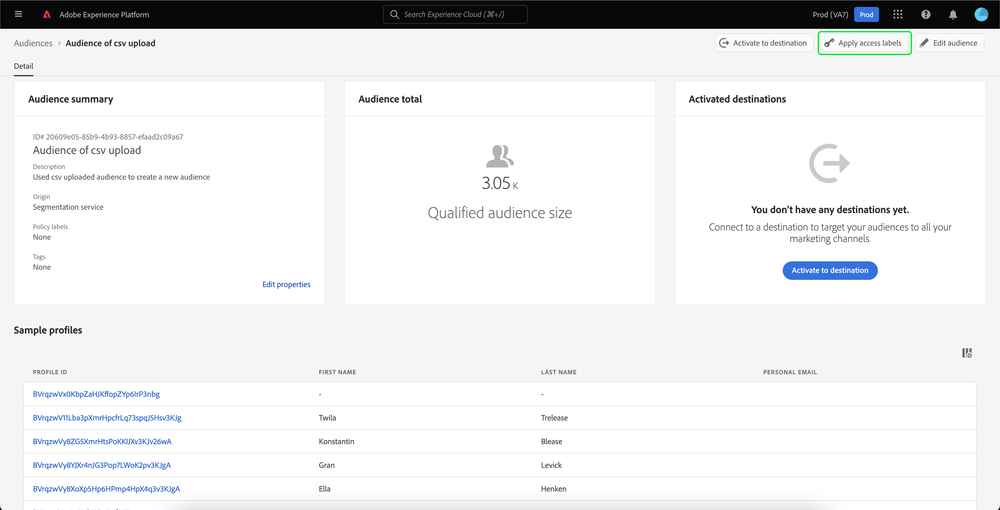
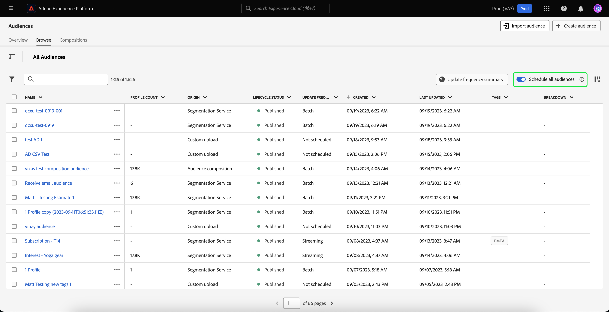

# Panoramica di Audience Portal

Audience Portal è un hub centrale, all’interno di Adobe Experience Platform, che consente di visualizzare, gestire e creare tipi di pubblico.

In Audience Portal, puoi eseguire le seguenti attività:

- [Visualizzare un elenco dei tipi di pubblico](#audience-list)
   - [Utilizzare le azioni rapide per i tipi di pubblico](#quick-actions)
   - [Personalizza le proprietà visualizzate nell’elenco dei tipi di pubblico](#customize)
   - [Utilizzare filtri, cartelle e tag per organizzare i tipi di pubblico](#manage-audiences)
- [Visualizzare i dettagli sul pubblico](#audience-details)
   - [Visualizza un riepilogo sul pubblico](#audience-summary)
- [Abilita i tipi di pubblico per la segmentazione pianificata](#scheduled-segmentation)
- [Creazione di un pubblico](#create-audience)
   - [Utilizza Segment Builder (Generatore di segmenti) per creare un pubblico](#segment-builder)
   - [Utilizzare la composizione del pubblico per creare un pubblico](#audience-composition)
- [Importare tipi di pubblico generati esternamente](#import-audience)

Per aprire Audience Portal, seleziona la **[!UICONTROL Sfoglia]** all’interno della sezione Segmentazione.

## Elenco del pubblico {#list}

>[!CONTEXTUALHELP]
>id="platform_segments_browse_churncolumnname"
>title="Abbandono"
>abstract="L’abbandono rappresenta la percentuale di profili che cambiano all’interno di un pubblico rispetto all’ultima esecuzione del processo di segmentazione."

>[!CONTEXTUALHELP]
>id="platform_segments_browse_evaluationmethodcolumnname"
>title="Metodo di valutazione"
>abstract="I metodi di valutazione per i tipi di pubblico includono batch, streaming e Edge."

Per impostazione predefinita, Audience Portal visualizza un elenco di tutti i tipi di pubblico nell’organizzazione e nella sandbox, inclusi il conteggio dei profili, l’origine, la data di creazione, la data dell’ultima modifica, i tag e il raggruppamento.

### Azioni rapide {#quick-actions}

Accanto a ogni pubblico è presente un’icona con i puntini di sospensione. Selezionando questa opzione viene visualizzato un elenco delle azioni rapide disponibili per il pubblico. Questo elenco di azioni è diverso in base all’origine del pubblico.

![Viene visualizzato l’elenco delle azioni rapide per i tipi di pubblico con origine [!UICONTROL Composizione del pubblico].](../images/ui/audience-portal/browse-audience-composition-details.png)

| Azione | Origini | Descrizione |
| ------ | ------- | ----------- |
| [!UICONTROL Modifica] | Servizio di segmentazione | Apre Segment Builder (Generatore di segmenti) per modificare il pubblico. Tieni presente che se il pubblico è stato creato tramite l’API, **non** essere in grado di modificarlo utilizzando Segment Builder (Generatore di segmenti). Per ulteriori informazioni sull’utilizzo del Generatore di segmenti, consulta la sezione [Guida dell’interfaccia utente di Segment Builder](./segment-builder.md). |
| [!UICONTROL Apri composizione] | Composizione del pubblico | Apre la composizione Pubblico per visualizzare il pubblico. Per ulteriori informazioni sulla composizione del pubblico, leggi [guida dell’interfaccia utente per la composizione del pubblico](./audience-composition.md). |
| [!UICONTROL Attiva nella destinazione] | Servizio di segmentazione | Attiva il pubblico in una destinazione. Per informazioni più dettagliate sull’attivazione di un pubblico in una destinazione, consulta la sezione [panoramica sull’attivazione](../../destinations/ui/activation-overview.md). |
| [!UICONTROL Condividi con i partner] | Composizione del pubblico, caricamento personalizzato, servizio di segmentazione | Condivide il pubblico con altri utenti di Platform. Per ulteriori informazioni su questa funzione, leggere [Panoramica di Segment Match](./segment-match/overview.md). |
| [!UICONTROL Gestione tag] | Composizione del pubblico, caricamento personalizzato, servizio di segmentazione | Gestisce i tag definiti dall’utente che appartengono al pubblico. Per ulteriori informazioni su questa funzione, consulta la sezione su [filtraggio e assegnazione di tag](#manage-audiences). |
| [!UICONTROL Sposta nella cartella] | Composizione del pubblico, caricamento personalizzato, servizio di segmentazione | Gestisce la cartella a cui appartiene il pubblico. Per ulteriori informazioni su questa funzione, consulta la sezione su [filtraggio e assegnazione di tag](#manage-audiences). |
| [!UICONTROL Copia] | Servizio di segmentazione | Duplica il pubblico selezionato. Ulteriori informazioni su questa funzione sono disponibili nella [Domande frequenti sulla segmentazione](../faq.md#copy). |
| [!UICONTROL Applica etichette di accesso] | Composizione del pubblico, caricamento personalizzato, servizio di segmentazione | Gestisce le etichette di accesso che appartengono al pubblico. Per ulteriori informazioni sulle etichette di accesso, consulta la documentazione su [gestione delle etichette](../../access-control/abac/ui/labels.md). |
| [!UICONTROL Publish] | Caricamento personalizzato, servizio di segmentazione | Pubblica il pubblico selezionato. Per ulteriori informazioni sulla gestione dello stato del ciclo di vita, consultare [sezione lifecycle state (stato del ciclo di vita) nelle domande frequenti sulla segmentazione](../faq.md#lifecycle-states). |
| [!UICONTROL Disattivare] | Caricamento personalizzato, servizio di segmentazione | Disattiva il pubblico selezionato. Per ulteriori informazioni sulla gestione dello stato del ciclo di vita, consultare [sezione lifecycle state (stato del ciclo di vita) nelle domande frequenti sulla segmentazione](../faq.md#lifecycle-states). |
| [!UICONTROL Elimina] | Composizione del pubblico, caricamento personalizzato, servizio di segmentazione | Elimina il pubblico selezionato. Tipi di pubblico utilizzati nelle destinazioni a valle o dipendenti da altri tipi di pubblico **non può** essere soppressa. Per ulteriori informazioni sull’eliminazione del pubblico, consulta la sezione [domande frequenti sulla segmentazione](../faq.md#lifecycle-states). |
| [!UICONTROL Aggiungi al pacchetto] | Composizione del pubblico, caricamento personalizzato, servizio di segmentazione | Sposta il pubblico da una sandbox all’altra. Per ulteriori informazioni su questa funzione, leggere [guida agli strumenti sandbox](../../sandboxes/ui/sandbox-tooling.md). |

>[!IMPORTANT]
>
>Prima di eliminare il pubblico, assicurati che sia **non** utilizzato come componente in un pubblico basato su account o in Adobe Journey Optimizer.

Nella parte superiore della pagina sono presenti opzioni per aggiungere tutti i tipi di pubblico a una pianificazione, importare un pubblico, creare un nuovo pubblico e visualizzare un riepilogo della valutazione del pubblico.

Attivazione/disattivazione **[!UICONTROL Pianifica tutti i tipi di pubblico]** abiliterà la segmentazione pianificata. Ulteriori informazioni sulla segmentazione pianificata sono disponibili nella sezione [sezione segmentazione pianificata di questa guida utente](#scheduled-segmentation).

Selezione **[!UICONTROL Importa pubblico]** consente di importare un pubblico generato esternamente. Per ulteriori informazioni sull’importazione di tipi di pubblico, consulta la sezione su [importazione di un pubblico nella guida utente](#import-audience).

Selezione **[!UICONTROL Creare un pubblico]** ti consente di creare un pubblico. Per ulteriori informazioni sulla creazione di tipi di pubblico, consulta la sezione su [creazione di un pubblico nella guida utente](#create-audience).

Puoi selezionare **[!UICONTROL Riepilogo valutazione]** per visualizzare un grafico a torta che mostra un riepilogo delle valutazioni del pubblico.

Viene visualizzato il grafico a torta, con una suddivisione dei tipi di pubblico in base alla valutazione del pubblico. Il grafico mostra il numero totale di tipi di pubblico al centro e il tempo di valutazione batch giornaliero in UTC nella parte inferiore. Se passi il cursore del mouse sulle diverse parti del pubblico, viene visualizzato il numero di tipi di pubblico che appartengono a ciascun tipo di frequenza di aggiornamento.

### Personalizza {#customize}

Puoi aggiungere campi aggiuntivi a Audience Portal selezionando . Questi campi aggiuntivi includono lo stato del ciclo di vita, la frequenza di aggiornamento, l’ultimo aggiornamento di, la descrizione, creato da ed etichette di accesso.

| Campo | Descrizione |
| ----- | ----------- |
| [!UICONTROL Nome] | Il nome del pubblico. |
| [!UICONTROL Conteggio dei profili] | Il numero totale di profili idonei per il pubblico. |
| [!UICONTROL Origin] | L’origine del pubblico. Indica da dove proviene il pubblico. I valori possibili includono Servizio di segmentazione, Caricamento personalizzato, Composizione del pubblico e Audience Manager. |
| [!UICONTROL Stato del ciclo di vita] | Stato del pubblico. I valori possibili per questo campo includono `Draft`, `Inactive`, e `Published`. Ulteriori informazioni sugli stati del ciclo di vita, compreso cosa significano i diversi stati e come spostare i tipi di pubblico in diversi stati del ciclo di vita, leggi [sezione sullo stato del ciclo di vita nelle domande frequenti sulla segmentazione](../faq.md#lifecycle-status). |
| [!UICONTROL Frequenza di aggiornamento] | Valore che indica la frequenza con cui vengono aggiornati i dati del pubblico. I valori possibili per questo campo includono [!UICONTROL Batch], [!UICONTROL Streaming], [!UICONTROL Edge], e [!UICONTROL Non pianificato]. |
| [!UICONTROL Ultimo aggiornamento eseguito da] | Nome dell’ultima persona che ha aggiornato il pubblico. |
| [!UICONTROL Creato] | La data e l’ora in UTC in cui è stato creato il pubblico. |
| [!UICONTROL Ultimo aggiornamento] | La data e l’ora, in UTC, in cui il pubblico è stato aggiornato l’ultima volta. |
| [!UICONTROL Tag] | I tag definiti dall’utente che appartengono al pubblico. Ulteriori informazioni su questi tag sono disponibili nella sezione [sezione sui tag](#tags). |
| [!UICONTROL Descrizione] | Descrizione del pubblico. |
| [!UICONTROL Creato da] | Nome della persona che ha creato il pubblico. |
| [!UICONTROL Etichette di accesso] | Le etichette di accesso per il pubblico. Le etichette di accesso consentono di categorizzare set di dati e campi in base ai criteri di utilizzo applicabili a tali dati. Queste etichette possono essere applicate in qualsiasi momento, fornendo flessibilità nella scelta di come gestire i dati. Per ulteriori informazioni sulle etichette di accesso, consulta la documentazione su [gestione delle etichette](../../access-control/abac/ui/labels.md). |
| [!UICONTROL Raggruppamento] | Il raggruppamento dello stato del profilo per il pubblico. Di seguito è riportata una descrizione più dettagliata del raggruppamento dello stato del profilo. |

Se è selezionato il raggruppamento, la visualizzazione mostra un grafico a barre che illustra la percentuale di profili che appartengono a ciascuno dei seguenti stati di profilo calcolati: [!UICONTROL Realizzato], [!UICONTROL Esistente], e [!UICONTROL Uscita]. Inoltre, la suddivisione mostrata nella [!UICONTROL Sfoglia] Questa è la suddivisione più accurata dello stato di definizione del segmento. Se questo numero è diverso da quello riportato sulla [!UICONTROL Panoramica] , è necessario utilizzare i numeri della scheda [!UICONTROL Sfoglia] come fonte corretta di informazioni, poiché il [!UICONTROL Panoramica] i numeri di tabulazione vengono aggiornati solo una volta al giorno.

| Stato | Descrizione |
| ------ | ----------- |
| [!UICONTROL Realizzato] | Numero di profili che **qualificato** per il segmento nelle ultime 24 ore dall’esecuzione dell’ultimo processo di segmentazione batch. |
| [!UICONTROL Esistente] | Numero di profili che **rimasto** nel segmento nelle ultime 24 ore dall’esecuzione dell’ultimo processo di segmentazione batch. |
| [!UICONTROL Uscita] | Numero di profili che **uscita** il segmento nelle ultime 24 ore dall’ultima esecuzione del processo di segmentazione batch. |

Dopo aver selezionato i campi da visualizzare, è possibile ridimensionare anche la larghezza delle colonne visualizzate. Per eseguire questa operazione, trascina l’area tra le colonne oppure seleziona la  della colonna da ridimensionare, seguita da **[!UICONTROL Ridimensiona colonna]**.

### Filtraggio, cartelle e assegnazione tag {#manage-audiences}

Per migliorare l’efficienza del lavoro, puoi cercare i tipi di pubblico esistenti, aggiungere tag definiti dall’utente ai tipi di pubblico, inserire i tipi di pubblico nelle cartelle e filtrare quelli visualizzati.

#### Ricerca {#search}

Puoi cercare i tipi di pubblico esistenti in fino a 9 lingue diverse con [!DNL Unified Search].

Da utilizzare [!DNL Unified Search], aggiungi il termine che desideri cercare nella barra di ricerca evidenziata.

Per ulteriori informazioni su [!DNL Unified Search], incluse le funzionalità supportate, leggere [Documentazione di Unified Search](https://experienceleague.adobe.com/docs/core-services/interface/services/search-experience-cloud.html).

#### Tag {#tags}

Puoi aggiungere tag definiti dall’utente per descrivere, trovare e gestire meglio i tipi di pubblico.

Per aggiungere un tag, seleziona **[!UICONTROL Gestione tag]** sul pubblico a cui desideri assegnare il tag.

![Il [!UICONTROL Gestione tag] viene selezionato per un pubblico specificato.](../images/ui/audience-portal/browse-manage-tags.png)

Il **[!UICONTROL Gestione tag]** viene visualizzato popover. In questo popover è possibile selezionare un tag categorizzato o un tag non categorizzato.

| Tipo di tag | Descrizione |
| -------- | ----------- |
| Categorizzato | Tag creato e gestito dagli amministratori dell’organizzazione. |
| Non categorizzato | Un tag creato all’interno del [!UICONTROL Gestione tag] popover. Chiunque può creare o gestire questi tipi di tag. |

![Il [!UICONTROL Gestione tag] viene visualizzato popover. Vengono evidenziate le opzioni per scegliere una categoria o una non categorizzata.](../images/ui/audience-portal/create-tag.png)

Dopo aver aggiunto al pubblico tutti i tag che desideri allegare, seleziona **[!UICONTROL Salva]**.

![Il giorno [!UICONTROL Gestione tag] a comparsa, i tag aggiunti vengono evidenziati.](../images/ui/audience-portal/created-tags.png)

Per ulteriori informazioni sulla creazione e la gestione dei tag, consulta [Guida alla gestione dei tag](../../administrative-tags/ui/managing-tags.md).

#### Cartelle {#folders}

Puoi inserire i tipi di pubblico all’interno delle cartelle per una migliore gestione dell’audience.

Per spostare un pubblico in una cartella, seleziona **[!UICONTROL Sposta nella cartella]** sul pubblico che desideri spostare.

![Il [!UICONTROL Sposta nella cartella] viene selezionato per un pubblico specifico.](../images/ui/audience-portal/browse-move-to-folder.png)

Il **Sposta pubblico in cartella** viene visualizzato popover. Seleziona la cartella in cui desideri spostare il pubblico, quindi fai clic su **[!UICONTROL Salva]**.

Una volta che il pubblico si trova in una cartella, puoi scegliere di visualizzare solo i tipi di pubblico che appartengono a una cartella specifica.

#### Filtro {#filter}

Puoi anche filtrare i tipi di pubblico, in base a diverse impostazioni.

Per filtrare i tipi di pubblico disponibili, seleziona .

Viene visualizzato l’elenco dei filtri disponibili.

| Filtro | Descrizione |
| ------ | ----------- |
| [!UICONTROL Origin] | Consente di filtrare in base all’origine del pubblico. Le opzioni disponibili includono Segmentation Service (Servizio di segmentazione), Custom upload (Caricamento personalizzato), Audience composition (Composizione pubblico) e Audience Manager. |
| [!UICONTROL Ha qualsiasi tag] | Consente di filtrare per tag. Puoi scegliere tra **[!UICONTROL Ha qualsiasi tag]** e **[!UICONTROL Ha tutti i tag]**. Quando **[!UICONTROL Ha qualsiasi tag]** è selezionato, i tipi di pubblico filtrati includeranno **qualsiasi** dei tag aggiunti. Quando **[!UICONTROL Ha tutti i tag]** è selezionato, i tipi di pubblico filtrati devono includere **tutto** dei tag aggiunti. |
| [!UICONTROL Stato del ciclo di vita] | Consente di filtrare in base allo stato del ciclo di vita del pubblico. Le opzioni disponibili includono [!UICONTROL Eliminato], [!UICONTROL Bozza], [!UICONTROL Inattivo], e [!UICONTROL Pubblicato]. |
| [!UICONTROL Frequenza di aggiornamento] | Consente di filtrare in base alla frequenza di aggiornamento del pubblico (metodo di valutazione). Le opzioni disponibili includono [!UICONTROL Pianificato], [!UICONTROL Continuo], e [!UICONTROL On-demand]. |
| [!UICONTROL Creato da] | Consente di filtrare in base alla persona che ha creato il pubblico. |
| [!UICONTROL Data di creazione] | Consente di filtrare in base alla data di creazione del pubblico. Puoi scegliere un intervallo di date da filtrare al momento della creazione del pubblico. |
| [!UICONTROL Data di modifica] | Consente di filtrare in base all’ultima data modificata del pubblico. Puoi scegliere un intervallo di date per filtrare quando il pubblico è stato modificato l’ultima volta. |

#### Azioni in blocco {#bulk-actions}

Inoltre, puoi selezionare fino a 25 tipi di pubblico diversi ed eseguire varie azioni su di essi. Queste azioni includono [spostamento in una cartella](#folders), [modifica o applicazione di un tag](#tags), [applicazione delle etichette di accesso](../../access-control/abac/ui/labels.md), e [eliminazione](#browse).

Quando applichi azioni in blocco a questi tipi di pubblico, si applicano le seguenti condizioni:

- Tu **può** seleziona i tipi di pubblico da pagine diverse.
- Tu **non può** elimina un pubblico utilizzato in un’attivazione di destinazione.
- Se selezioni un filtro, il pubblico selezionato **will** ripristina.

## Dettagli del pubblico {#audience-details}

Per visualizzare ulteriori dettagli su un pubblico specifico, seleziona il nome di un pubblico in **[!UICONTROL Sfoglia]** scheda.

Viene visualizzata la pagina dei dettagli del pubblico. In alto è riportato un riepilogo del pubblico, informazioni sulle dimensioni del pubblico qualificato e le destinazioni per le quali il segmento viene attivato.

### Riepilogo del pubblico {#audience-summary}

Il **[!UICONTROL Riepilogo del pubblico]** fornisce informazioni quali ID, nome, descrizione, origine e dettagli degli attributi.

Inoltre, puoi attivare il pubblico su una destinazione, applicare etichette di accesso o modificare/aggiornare il pubblico.

Selezione **[!UICONTROL Attiva nella destinazione]** consente di attivare il pubblico in una destinazione. Per informazioni più dettagliate sull’attivazione di un pubblico in una destinazione, consulta la sezione [panoramica sull’attivazione](../../destinations/ui/activation-overview.md).

Selezione **[!UICONTROL Applica etichette di accesso]** consente di gestire le etichette di accesso che appartengono al pubblico. Per ulteriori informazioni sulle etichette di accesso, consulta la documentazione su [gestione delle etichette](../../access-control/abac/ui/labels.md).

>[!BEGINTABS]

>[!TAB Composizione del pubblico]

![Viene visualizzata la pagina dei dettagli del pubblico, con [!UICONTROL Apri composizione] pulsante evidenziato.](../images/ui/audience-portal/audience-details-open-composition.png)

Selezione **[!UICONTROL Apri composizione]** consente di visualizzare il pubblico in Composizione pubblico. Per ulteriori informazioni sulla composizione del pubblico, leggi [Guida dell’interfaccia utente di Audience Composition](./audience-composition.md).

>[!TAB Caricamento personalizzato]

![Viene visualizzata la pagina dei dettagli del pubblico, con [!UICONTROL Aggiorna pubblico] pulsante evidenziato.](../images/ui/audience-portal/audience-details-update-audience.png)

Selezione **[!UICONTROL Aggiorna pubblico]** consente di ricaricare un pubblico generato esternamente. Per ulteriori informazioni sull’importazione di un pubblico generato esternamente, consulta la sezione su [importazione di un pubblico](#import-audience).

>[!TAB Servizio di segmentazione]

![Viene visualizzata la pagina dei dettagli del pubblico, con [!UICONTROL Modifica pubblico] pulsante evidenziato.](../images/ui/audience-portal/audience-details-edit-audience.png)

Selezione **[!UICONTROL Modifica pubblico]** consente di modificare il pubblico nel Generatore di segmenti. Per informazioni più dettagliate sull&#39;utilizzo di [!DNL Segment Builder] Workspace, leggi il [[!DNL Segment Builder] guida utente](./segment-builder.md).

>[!ENDTABS]

Selezione **[!UICONTROL Modifica proprietà]** consente di modificare i dettagli di base del pubblico, come il nome, la descrizione e i tag.

### Totale pubblico {#audience-total}

Il **[!UICONTROL Totale pubblico]** mostra il numero totale di profili idonei per il pubblico.

Le stime vengono generate utilizzando una dimensione campione dei dati di campionamento di quel giorno. Se nell’archivio Profili sono presenti meno di 1 milione di entità, viene utilizzato l’intero set di dati; per un numero di entità compreso tra 1 e 20 milioni, vengono utilizzate 1 milione di entità; e per più di 20 milioni di entità, viene utilizzato il 5% del totale delle entità. Ulteriori informazioni sulla generazione delle stime sono disponibili nella sezione [sezione generazione della stima](../tutorials/create-a-segment.md#estimate-and-preview-an-audience) dell’esercitazione sulla creazione di tipi di pubblico.

### Destinazioni attivate {#activated-destinations}

Il **[!UICONTROL Destinazioni attivate]** mostra le destinazioni per le quali è attivato questo pubblico.

>[!NOTE]
>
> Le destinazioni sono una funzione disponibile con [!DNL Adobe Real-Time Customer Data Platform]e ti consentono di esportare dati su piattaforme esterne. Per ulteriori informazioni sulle destinazioni, consulta [panoramica sulle destinazioni](../../destinations/home.md). Per informazioni su come attivare un segmento in una destinazione, consulta [panoramica sull’attivazione](../../destinations/ui/activation-overview.md).

### Esempi di profilo {#profile-samples}

Di seguito è riportato un campionamento dei profili idonei per il segmento, con informazioni dettagliate che includono [!DNL Profile] ID, nome, cognome e indirizzo e-mail personale.

Il modo in cui viene attivato il campionamento dei dati dipende dal metodo di acquisizione.

Per l’acquisizione batch, l’archivio profili viene analizzato automaticamente ogni quindici minuti per verificare se un nuovo batch è stato correttamente acquisito dall’esecuzione dell’ultimo processo di campionamento. In questo caso, l’archivio Profili viene successivamente analizzato per verificare se è stata registrata una modifica di almeno il 5% nel numero di record. Se queste condizioni vengono soddisfatte, viene attivato un nuovo processo di campionamento.

Per l’acquisizione in streaming, l’archivio profili viene analizzato automaticamente ogni ora per verificare se si è verificata una modifica di almeno il 5% nel numero di record. Se questa condizione viene soddisfatta, viene attivato un nuovo processo di campionamento.

La dimensione del campione della scansione dipende dal numero complessivo di entità nell’archivio profili. Queste dimensioni di esempio sono rappresentate nella tabella seguente:

| Entità nell&#39;archivio profili | Dimensione campione |
| ------------------------- | ----------- |
| Meno di 1 milione | Set di dati completo |
| Da 1 a 20 milioni | 1 milione |
| Oltre 20 milioni | 5% del totale |

Informazioni più dettagliate su ciascuno [!DNL Profile] può essere visualizzato selezionando la [!DNL Profile] ID Per ulteriori informazioni sui dettagli di un profilo, consulta [[!DNL Real-Time Customer Profile] guida utente](../../profile/ui/user-guide.md#profile-detail).

## Segmentazione pianificata {#scheduled-segmentation}

>[!CONTEXTUALHELP]
>id="platform_segments_browse_addallsegmentstoschedule"
>title="Aggiungi tutti i tipi di pubblico alla pianificazione"
>abstract="Abilita questa opzione per includere tutti i tipi di pubblico valutati utilizzando la segmentazione in batch nell’aggiornamento pianificato giornaliero. Disabilita questa opzione per rimuovere tutti i tipi di pubblico dall’aggiornamento pianificato."

Una volta creati i tipi di pubblico, puoi valutarli tramite valutazione on-demand o pianificata (continua). Valutazione significa spostamento [!DNL Real-Time Customer Profile] dati attraverso processi di segmentazione per produrre tipi di pubblico corrispondenti. Una volta creati, i tipi di pubblico vengono salvati e memorizzati in modo che possano essere esportati utilizzando [!DNL Experience Platform] API.

La valutazione on-demand comporta l’utilizzo dell’API per eseguire valutazioni e generare tipi di pubblico in base alle esigenze, mentre la valutazione pianificata (nota anche come &quot;segmentazione pianificata&quot;) consente di creare una pianificazione ricorrente per valutare i tipi di pubblico in un momento specifico (al massimo, una volta al giorno).

### Abilita segmentazione pianificata {#enable-scheduled-segmentation}

Abilitare i tipi di pubblico per la valutazione pianificata può essere fatto utilizzando l’interfaccia utente o l’API. Nell’interfaccia utente, torna a **[!UICONTROL Sfoglia]** scheda in **[!UICONTROL Tipi di pubblico]** e attivare **[!UICONTROL Pianifica tutti i tipi di pubblico]**. In questo modo tutti i tipi di pubblico verranno valutati in base alla pianificazione impostata dall’organizzazione.

>[!NOTE]
>
>La valutazione pianificata può essere abilitata per le sandbox con un massimo di cinque (5) criteri di unione per [!DNL XDM Individual Profile]. Se nell’organizzazione sono presenti più di cinque criteri di unione per [!DNL XDM Individual Profile] in un singolo ambiente sandbox non puoi utilizzare la valutazione pianificata.

Al momento è possibile creare pianificazioni solo utilizzando l’API. Per i passaggi dettagliati sulla creazione, la modifica e l’utilizzo delle pianificazioni utilizzando l’API, segui il tutorial per valutare e accedere ai risultati della segmentazione, in particolare la sezione su [valutazione pianificata tramite l’API](../tutorials/evaluate-a-segment.md#scheduled-evaluation).

## Creazione di un pubblico {#create-audience}

Puoi selezionare **[!UICONTROL Creare un pubblico]** per creare un pubblico.

Viene visualizzato un popover che consente di scegliere se comporre un pubblico o creare regole.

### Composizione del pubblico {#audience-composition}

Selezione **[!UICONTROL Componi tipi di pubblico]** ti porta a Composizione del pubblico. Questa area di lavoro offre controlli intuitivi per la creazione e la modifica di tipi di pubblico, ad esempio il trascinamento della selezione utilizzato per rappresentare azioni diverse. Per ulteriori informazioni sulla creazione di tipi di pubblico, consulta [Guida alla composizione del pubblico](./audience-composition.md).

### Segment Builder {#segment-builder}

Selezione **[!UICONTROL Genera regola]** ti porta al Generatore di segmenti. Questa area di lavoro fornisce controlli intuitivi per la creazione e la modifica delle definizioni dei segmenti, ad esempio le tessere trascinate utilizzate per rappresentare le proprietà dei dati. Per ulteriori informazioni sulla creazione delle definizioni dei segmenti, consulta [Guida al Generatore di segmenti](./segment-builder.md)

## Importazione di un pubblico {#import-audience}

>[!IMPORTANT]
>
>Per importare un pubblico generato esternamente, devi **deve** dispone delle seguenti autorizzazioni: [!UICONTROL Visualizzare i segmenti], [!UICONTROL Gestire i segmenti], e [!UICONTROL Importa pubblico]. Per ulteriori informazioni su queste autorizzazioni, leggere [panoramica sul controllo degli accessi](../../access-control/home.md#permissions).

Puoi selezionare **[!UICONTROL Importa pubblico]** per importare un pubblico generato esternamente.

Il **[!UICONTROL Importa CSV pubblico]** viene visualizzato workflow. Puoi selezionare un file CSV da importare come pubblico generato esternamente.

![In [!UICONTROL Importa CSV pubblico] flusso di lavoro, [!UICONTROL Trascinare i file] viene evidenziata, mostrando dove puoi caricare il pubblico generato esternamente.](../images/ui/audience-portal/import-audience-csv.png)

>[!NOTE]
>
>Il pubblico generato esterno **deve** essere in formato CSV, avere **massimo** di 25 colonne e deve essere inferiore a 1 GB.

Dopo aver selezionato il file CSV da importare, viene visualizzato un elenco di dati di esempio per questo pubblico generato esternamente. Dopo aver verificato la correttezza dei dati di esempio, seleziona **[!UICONTROL Successivo]**.

Il **[!UICONTROL Dettagli del pubblico]** viene visualizzata. Puoi aggiungere informazioni sul pubblico, tra cui nome, descrizione, identità primaria e valore dello spazio dei nomi dell’identità.

Quando importi il pubblico generato esternamente, devi selezionare una delle colonne da usare come campo di identità principale e specificare il valore dello spazio dei nomi. Si prega di notare che tutti i campi rimanenti verranno considerati **attributi payload**. Questi attributi vengono considerati **non durevole**, poiché saranno associate a questo pubblico solo a scopo di personalizzazione e sono **non** connesso al profilo.

![Il [!UICONTROL Dettagli del pubblico] viene visualizzata.](../images/ui/audience-portal/import-audience-audience-details.png)

Facoltativamente, puoi anche aggiungere alcuni dettagli aggiuntivi al pubblico generato esternamente, ad esempio assegnargli un ID, definirne il criterio di unione o modificarne il tipo di dati di colonna.

>[!NOTE]
>
>Se utilizzi un ID pubblico esterno personalizzato, questo deve rispettare le seguenti linee guida:
>
> - It **deve** inizia con una lettera (a-z o A-Z), un carattere di sottolineatura (_) o un simbolo del dollaro ($).
> - Tutti i caratteri successivi possono essere alfanumerici (a-z, A-Z, 0-9), trattini bassi (_) o segni di dollaro ($).

Dopo aver inserito i dettagli del pubblico, seleziona **[!UICONTROL Successivo]**.

![Il [!UICONTROL Successivo] viene evidenziato sulla [!UICONTROL Dettagli del pubblico] pagina.](../images/ui/audience-portal/import-audience-filled-details.png)

Il **[!UICONTROL Revisione]** viene visualizzata. Puoi rivedere i dettagli del pubblico appena importato generato esternamente.

![Il [!UICONTROL Revisione] viene visualizzata una pagina che mostra i dettagli del pubblico generato esternamente appena importato.](../images/ui/audience-portal/import-audience-review-details.png)

Dopo aver confermato la correttezza dei dettagli, seleziona **[!UICONTROL Fine]** per importare in Adobe Experience Platform il pubblico generato esternamente.

>[!IMPORTANT]
>
>Per impostazione predefinita, i tipi di pubblico generati esternamente hanno una scadenza dei dati di 30 giorni. La scadenza dei dati viene reimpostata se il pubblico viene aggiornato o modificato in qualsiasi modo.
>
>Inoltre, se il pubblico generato esternamente contiene informazioni sensibili e/o relative all’assistenza sanitaria, **deve** applica le etichette di utilizzo dei dati necessarie prima di attivarla in qualsiasi destinazione. Poiché le variabili provenienti da tipi di pubblico generati esternamente vengono memorizzate nel data lake anziché nel profilo cliente in tempo reale, è necessario **non** includi i dati sul consenso nel file CSV. Per ulteriori informazioni sull’applicazione delle etichette di utilizzo dei dati, consulta la documentazione su [gestione delle etichette](../../access-control/abac/ui/labels.md).

## Passaggi successivi

Dopo aver letto questa panoramica, dovresti poter utilizzare Audience Portal per gestire, creare e importare in modo efficace i tipi di pubblico in Adobe Experience Platform.

Per ulteriori informazioni sull’utilizzo dell’interfaccia utente del servizio di segmentazione, consulta [Panoramica dell’interfaccia utente del servizio di segmentazione](./overview.md).

Per scoprire le domande frequenti su Audience Portal, leggi [domande frequenti](../faq.md).
