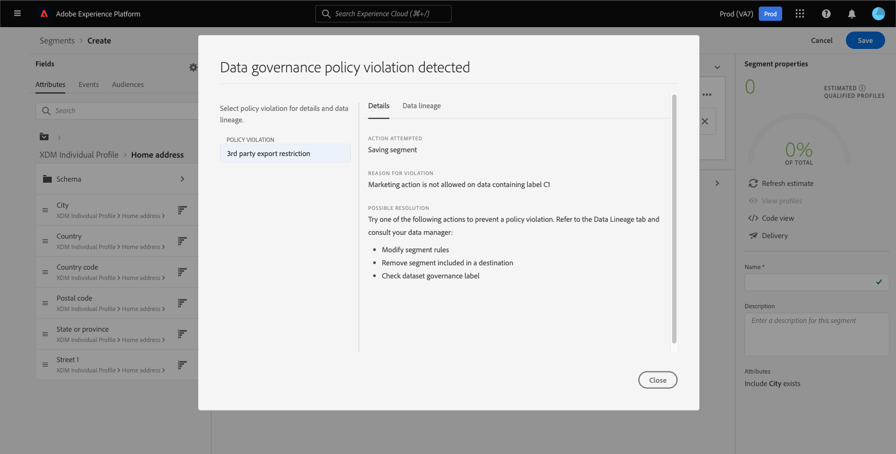

# Guida all’interfaccia utente del servizio di segmentazione

[!DNL Adobe Experience Platform Segmentation Service] fornisce un’interfaccia utente per la creazione e la gestione delle definizioni dei segmenti.

## Introduzione

Per lavorare con le definizioni dei segmenti è necessario comprendere i vari [!DNL Experience Platform] servizi coinvolti nella segmentazione. Prima di leggere questa guida utente, consulta la documentazione relativa ai seguenti servizi:

- [[!DNL Segmentation Service]](../home.md): [!DNL Segmentation Service] consente di dividere i dati memorizzati in [!DNL Experience Platform] che si riferisce a singoli utenti (come clienti, potenziali clienti, utenti o organizzazioni) in gruppi più piccoli.
- [[!DNL Real-time Customer Profile]](../../profile/home.md): Fornisce un profilo di consumatore unificato e in tempo reale basato su dati aggregati provenienti da più origini.
- [[!DNL Adobe Experience Platform Identity Service]](../../identity-service/home.md): Consente la creazione di profili cliente tramite il collegamento di identità provenienti da fonti di dati diverse in cui viene effettuato l’acquisizione [!DNL Platform].
- [[!DNL Experience Data Model (XDM)]](../../xdm/home.md): Il quadro standardizzato [!DNL Platform] organizza i dati sulla customer experience. Per utilizzare al meglio la segmentazione, assicurati che i tuoi dati vengano acquisiti come profili ed eventi in base alla [best practice per la modellazione dei dati](../../xdm/schema/best-practices.md).

È inoltre importante conoscere due termini chiave utilizzati nel presente documento e comprendere la differenza tra questi:
- **Definizione del segmento**: Il set di regole utilizzato per descrivere le caratteristiche o i comportamenti chiave di un pubblico target.
- **Pubblico**: Il set risultante di profili che soddisfano i criteri di una definizione di segmento.

## Panoramica

Nell’interfaccia utente di Experience Platform, seleziona **[!UICONTROL Segmenti]** nel menu di navigazione a sinistra per aprire **[!UICONTROL Panoramica]** scheda che mostra la [!UICONTROL Segmenti] dashboard.

>[!NOTE]
>
>Se la tua organizzazione è nuova di Platform e non dispone ancora di set di dati di profilo attivi o di criteri di unione creati, la [!UICONTROL Segmenti] dashboard non è visibile. Invece, [!UICONTROL Panoramica] visualizza collegamenti e documentazione per aiutarti a iniziare con i segmenti.

### [!UICONTROL Segmenti] dashboard {#segments-dashboard}

La **[!UICONTROL Segmenti]** Il dashboard delinea le metriche chiave correlate ai dati dei segmenti della tua organizzazione.

Per ulteriori informazioni, visita il [guida al dashboard dei segmenti](../../dashboards/guides/segments.md).

## Sfogliare {#browse}

>[!CONTEXTUALHELP]
>id="platform_segments_browse_churncolumnname"
>title="Abbandono"
>abstract="L’abbandono rappresenta la percentuale di profili che cambiano all’interno di una definizione di segmento rispetto all’ultima esecuzione del processo di segmento."

>[!CONTEXTUALHELP]
>id="platform_segments_browse_evaluationmethodcolumnname"
>title="Metodo di valutazione"
>abstract="I metodi di valutazione per i segmenti includono batch, streaming e edge."

>[!CONTEXTUALHELP]
>id="platform_segments_browse_addallsegmentstoschedule"
>title="Aggiungi tutti i segmenti alla pianificazione"
>abstract="Abilitare l’inclusione di tutti i segmenti di valutazione batch nell’aggiornamento pianificato giornaliero alle 3:30 UTC. Disabilita la rimozione di tutti i segmenti dall&#39;aggiornamento pianificato."

Seleziona la **[!UICONTROL Sfoglia]** per visualizzare un elenco di tutte le definizioni di segmenti per l’organizzazione IMS.

Questa visualizzazione elenca informazioni sulla definizione del segmento, tra cui suddivisione, abbandono, conteggio dei profili, metodo di valutazione, data di creazione e data dell’ultima modifica.

La suddivisione mostra un grafico a barre che mostra la percentuale di profili che appartengono a ciascuno dei seguenti stati: [!UICONTROL Realizzato], [!UICONTROL Esistente]e [!UICONTROL Uscita]. Inoltre, la suddivisione mostrata nella sezione [!UICONTROL Sfoglia] è la suddivisione più accurata dello stato del segmento. Se questo numero è diverso da quello indicato nella [!UICONTROL Panoramica] è necessario utilizzare i numeri nella scheda [!UICONTROL Sfoglia] come origine corretta delle informazioni, dal momento che [!UICONTROL Panoramica] i numeri di scheda vengono aggiornati solo una volta al giorno.

| Stato | Descrizione |
| ------ | ----------- |
| Realizzato | Un nuovo profilo all’interno del segmento. |
| Esistente | Un profilo esistente rimasto all’interno del segmento. |
| Uscita | Un profilo esistente che sta lasciando il segmento. |

L’abbandono rappresenta la percentuale di profili che cambiano all’interno di una definizione di segmento rispetto all’ultima esecuzione del processo di segmento, mentre il conteggio del profilo rappresenta il numero totale di profili idonei per il segmento.

Il metodo di valutazione può essere in streaming, batch o edge. I segmenti in streaming vengono valutati costantemente man mano che i dati entrano nel sistema. I segmenti batch vengono valutati in base a una pianificazione impostata. I segmenti Edge vengono valutati in tempo reale, consentendo gli stessi casi di utilizzo per la personalizzazione della pagina e di quella successiva.

Nella parte superiore della pagina sono disponibili le opzioni per aggiungere tutti i segmenti a una pianificazione e per creare un nuovo segmento.

Attiva/disattiva **[!UICONTROL Aggiungi tutti i segmenti alla pianificazione]** attiverà la segmentazione pianificata. Ulteriori informazioni sulla segmentazione pianificata sono disponibili nella sezione [sezione segmentazione pianificata di questa guida utente](#scheduled-segmentation).

Selezione **[!UICONTROL Creare un segmento]** ti porterà al Generatore di segmenti. Per ulteriori informazioni sulla creazione di segmenti, consulta la sezione su [creazione di un segmento nella guida utente](#create-segment).

La barra laterale destra contiene informazioni su tutti i segmenti all’interno dell’organizzazione IMS, elencando il numero totale di segmenti, la data dell’ultima valutazione, la data della valutazione successiva e una suddivisione dei segmenti in base al metodo di valutazione.

Selezionando la riga della definizione del segmento viene fornito un riepilogo della definizione del segmento, che include opzioni per modificare o eliminare il segmento, attivare il segmento in una destinazione, il pubblico qualificato per il segmento, la dimensione totale del pubblico, oltre al nome, alla descrizione, al metodo di valutazione, alla data di creazione e all’ultima data di modifica del segmento.

>[!NOTE]
>
> Sarà **not** puoi eliminare un segmento utilizzato in un’attivazione di destinazione.

## Dettagli della definizione del segmento {#segment-details}

Per visualizzare ulteriori dettagli su una definizione di segmento specifica, seleziona il nome di un segmento all’interno di **[!UICONTROL Sfoglia]** scheda .

Viene visualizzata la pagina dei dettagli del segmento. Nella parte superiore, è presente un riepilogo della definizione del segmento, delle informazioni sulla dimensione del pubblico qualificato e delle destinazioni per le quali il segmento viene attivato.

### Riepilogo del segmento

La **[!UICONTROL Riepilogo del segmento]** fornisce informazioni quali ID, nome, descrizione e dettagli degli attributi.

Inoltre, puoi attivare il segmento in una destinazione o modificarlo. Selezione **[!UICONTROL Attiva a destinazione]** ti consente di attivare il segmento in una destinazione. Per informazioni più dettagliate sull’attivazione di un segmento a una destinazione, consulta la sezione [panoramica di attivazione](../../destinations/ui/activation-overview.md).

Selezione **[!UICONTROL Modifica segmento]** ti porterà al [!DNL Segment Builder]. Per informazioni più dettagliate sull&#39;utilizzo di [!DNL Segment Builder] area di lavoro, leggere [[!DNL Segment Builder] guida utente](./segment-builder.md).

### Pubblico totale nel segmento

La **[!UICONTROL Pubblico totale nel segmento]** mostra il numero totale di profili idonei per il segmento.

Le stime vengono generate utilizzando una dimensione del campione dei dati di esempio del giorno in questione. Se nell’archivio dei profili sono presenti meno di 1 milione di entità, viene utilizzato l’intero set di dati; tra 1 e 20 milioni di entità sono utilizzate 1 milione di entità; e per più di 20 milioni di entità viene utilizzato il 5% del totale delle entità. Ulteriori informazioni sulla generazione di stime dei segmenti sono disponibili nella sezione [sezione sulla generazione di stime](../tutorials/create-a-segment.md#estimate-and-preview-an-audience) dell’esercitazione sulla creazione dei segmenti.

### Destinazioni attivate

La **[!UICONTROL Destinazioni attivate]** mostra le destinazioni per le quali questo segmento è attivato.

>[!NOTE]
>
> Le destinazioni sono una funzionalità disponibile con [!DNL Real-time Customer Data Platform]e ti consentono di esportare i dati su piattaforme esterne. Per ulteriori informazioni sulle destinazioni, consulta il [panoramica sulle destinazioni](../../destinations/home.md). Per scoprire come attivare un segmento a una destinazione, consulta [panoramica di attivazione](../../destinations/ui/activation-overview.md).

### Esempi di profilo

Sotto è presente un campionamento dei profili idonei per il segmento, che fornisce informazioni dettagliate, tra cui [!DNL Profile] ID, nome, cognome ed e-mail personale.

Il modo in cui viene attivato il campionamento dei dati dipende dal metodo di acquisizione.

Per l’acquisizione batch, l’archivio dei profili viene analizzato automaticamente ogni quindici minuti per verificare se un nuovo batch è stato acquisito correttamente dall’ultima esecuzione del processo di campionamento. In questo caso, l’archivio dei profili viene successivamente analizzato per verificare se vi è stato almeno un cambiamento del 5% nel numero di record. Se queste condizioni vengono soddisfatte, viene attivato un nuovo processo di campionamento.

Per l’acquisizione in streaming, l’archivio dei profili viene analizzato automaticamente ogni ora per verificare se vi è stato almeno un cambiamento del 5% nel numero di record. Se questa condizione viene soddisfatta, viene attivato un nuovo processo di campionamento.

La dimensione del campione della scansione dipende dal numero complessivo di entità nell’archivio dei profili. Le dimensioni dei campioni sono rappresentate nella tabella seguente:

| Entità nell’archivio profili | Dimensione del campione |
| ------------------------- | ----------- |
| Meno di 1 milione | Set di dati completo |
| Da 1 a 20 milioni | 1 milione |
| Oltre 20 milioni | 5% del totale |

Informazioni più dettagliate su ogni [!DNL Profile] può essere visualizzato selezionando la [!DNL Profile] ID. Per ulteriori informazioni sui dettagli di un profilo, consulta il [[!DNL Real-time Customer Profile] guida utente](../../profile/ui/user-guide.md#profile-detail).

## Creazione di un segmento {#create-segment}

Selezione **[!UICONTROL Creare un segmento]** nell’angolo in alto a destra si apre il [!DNL Segment Builder] area di lavoro, in cui puoi iniziare a creare una definizione di segmento.

### [!DNL Segment Builder] workspace

[!DNL Segment Builder] offre un’area di lavoro ricca che consente di interagire con [!DNL Profile] elementi dati. L’area di lavoro fornisce controlli intuitivi per la creazione e la modifica di regole, ad esempio riquadri drag-and-drop utilizzati per rappresentare le proprietà dei dati.

Per informazioni più dettagliate sull&#39;utilizzo di [!DNL Segment Builder] area di lavoro, leggere [[!DNL Segment Builder] guida utente](./segment-builder.md).

## Segmentazione pianificata {#scheduled-segmentation}

Una volta create le definizioni dei segmenti, puoi valutarle tramite valutazione on-demand o pianificata (continua). Valutazione significa spostare [!DNL Real-time Customer Profile] i dati attraverso le definizioni dei segmenti per produrre i tipi di pubblico corrispondenti. Una volta creati, i tipi di pubblico vengono salvati e memorizzati in modo che possano essere esportati utilizzando [!DNL Experience Platform] API.

La valutazione su richiesta comporta l’utilizzo dell’API per eseguire valutazioni e generare tipi di pubblico in base alle esigenze, mentre la valutazione pianificata (nota anche come &quot;segmentazione pianificata&quot;) consente di creare una pianificazione periodica per valutare le definizioni dei segmenti in un momento specifico (al massimo una volta al giorno).

### Abilita segmentazione pianificata {#enable-scheduled-segmentation}

Puoi abilitare le definizioni dei segmenti per la valutazione pianificata utilizzando l’interfaccia utente o l’API. Nell’interfaccia utente, torna alla sezione **[!UICONTROL Sfoglia]** scheda in **[!UICONTROL Segmenti]** e attivare **[!UICONTROL Aggiungi tutti i segmenti alla pianificazione]**. In questo modo tutti i segmenti verranno valutati in base alla pianificazione impostata dall’organizzazione.

>[!NOTE]
>
>La valutazione pianificata può essere abilitata per le sandbox con un massimo di cinque (5) criteri di unione per [!DNL XDM Individual Profile]. Se l&#39;organizzazione dispone di più di cinque criteri di unione per [!DNL XDM Individual Profile] in un unico ambiente sandbox, non potrai utilizzare valutazioni pianificate.

Attualmente le pianificazioni possono essere create solo utilizzando l’API . Per passaggi dettagliati sulla creazione, la modifica e l’utilizzo delle pianificazioni tramite l’API, segui l’esercitazione per valutare e accedere ai risultati dei segmenti, in particolare la sezione su [valutazione pianificata utilizzando l’API](../tutorials/evaluate-a-segment.md#scheduled-evaluation).

## Segmentazione streaming {#streaming-segmentation}

La segmentazione in streaming è la capacità di eseguire la segmentazione su [!DNL Platform] in tempo quasi reale, concentrandosi sulla ricchezza di dati. Con la segmentazione in streaming, la qualificazione dei segmenti avviene ora quando i dati arrivano in [!DNL Platform], per ridurre la necessità di pianificare ed eseguire processi di segmentazione.

Ulteriori informazioni sulla segmentazione in streaming sono disponibili nella sezione [guida utente alla segmentazione in streaming](./streaming-segmentation.md).

>[!NOTE]
>
>Affinché la segmentazione in streaming funzioni, è necessario abilitare la segmentazione pianificata per l’organizzazione. Per informazioni dettagliate sull’abilitazione della segmentazione pianificata, consulta [la sezione segmentazione in streaming in questa guida utente](#scheduled-segmentation).

## Segmentazione degli spigoli {#edge-segmentation}

La segmentazione dei bordi è la capacità di valutare istantaneamente i segmenti in Platform sul bordo, abilitando casi d’uso di personalizzazione della pagina e della stessa pagina.

Ulteriori informazioni sulla segmentazione dei bordi sono disponibili nella sezione [guida all’interfaccia utente per la segmentazione dei bordi](./edge-segmentation.md)

## Violazioni dei criteri

>[!NOTE]
>
>Le violazioni dei criteri si applicano solo se si crea un segmento assegnato a una destinazione.

Dopo aver creato il segmento, questo viene analizzato dalla governance dei dati di Adobe Experience Platform per garantire che non vi siano violazioni dei criteri all’interno del segmento. Consulta la sezione [Panoramica sulla governance dei dati](../../data-governance/home.md) per ulteriori informazioni.

## Passaggi successivi e risorse aggiuntive {#next-steps}

La [!DNL Segmentation Service] L’interfaccia utente offre un flusso di lavoro avanzato che consente di isolare il pubblico commerciabile da [!DNL Real-time Customer Profile] dati.

Per ulteriori informazioni [!DNL Segmentation Service], continua a leggere la documentazione. Per scoprire come utilizzare il [!DNL Segmentation Service] API, leggi [[!DNL Segmentation Service] guida per sviluppatori](../api/overview.md).
