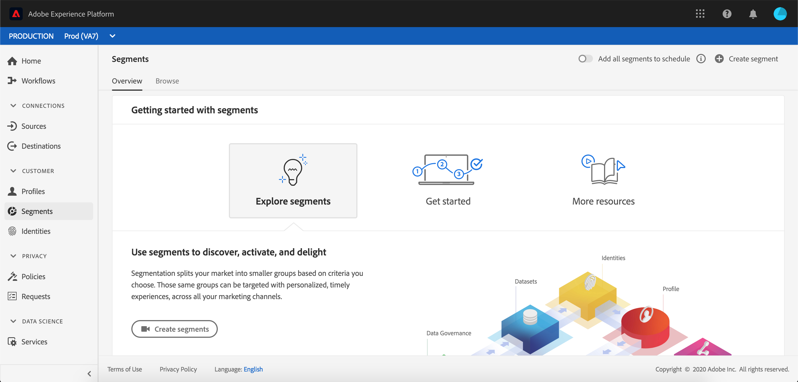

# [!UICONTROL Segmentation Service] guida utente

[!DNL Adobe Experience Platform Segmentation Service] fornisce un&#39;interfaccia utente per la creazione e la gestione delle definizioni dei segmenti.

## Introduzione

Per utilizzare le definizioni dei segmenti è necessario conoscere i diversi [!DNL Experience Platform] servizi coinvolti nella segmentazione. Prima di leggere questa guida utente, consulta la documentazione relativa ai seguenti servizi:

- [[!DNL Segmentation Service]](../home.md): [!DNL Segmentation Service] consente di dividere in gruppi più piccoli i dati memorizzati in [!DNL Experience Platform] relazione a individui (come clienti, potenziali, utenti o organizzazioni).
- [[!DNL Profilo cliente in tempo reale]](../../profile/home.md): Fornisce un profilo di consumo unificato e in tempo reale basato su dati aggregati provenienti da più origini.
- [[!DNL Adobe Experience Platform Identity Service]](../../identity-service/home.md): Consente la creazione di profili cliente collegando le identità di origini dati diverse in cui viene eseguito il caricamento [!DNL Platform].
- [[!DNL Experience Data Model (XDM)]](../../xdm/home.md): Il framework standard con cui [!DNL Platform] organizzare i dati relativi all&#39;esperienza del cliente.

È inoltre importante conoscere due termini chiave utilizzati in questo documento e comprendere la differenza tra questi:
- **Definizione** segmento: Set di regole utilizzato per descrivere le caratteristiche o i comportamenti chiave di un&#39;audience di destinazione.
- **Pubblico**: Set di profili risultante che soddisfano i criteri di una definizione di segmento.

## Panoramica

Nell’ [[!DNL Experience Platform] interfaccia](http://platform.adobe.com/), selezionate **[!UICONTROL Segments]** nel menu di navigazione a sinistra per aprire la **[!UICONTROL Overview]** scheda. Questa scheda fornisce collegamenti alla documentazione e ai video per agevolare la comprensione e l&#39;utilizzo dei segmenti.

## Sfoglia

Selezionate la **[!UICONTROL Browse]** scheda per visualizzare un elenco di tutte le definizioni di segmento per la vostra organizzazione IMS.

Questa visualizzazione elenca informazioni sulla definizione del segmento, incluso il metodo di valutazione, la data di creazione e l’ultima data di modifica.

Il metodo di valutazione può essere in streaming o batch. I segmenti di streaming vengono valutati costantemente quando i dati entrano nel sistema. I segmenti batch vengono valutati in base a una pianificazione prestabilita.

Nella parte superiore della pagina sono disponibili opzioni per aggiungere tutti i segmenti a una pianificazione e per creare un nuovo segmento.

Attiva/disattiva **[!UICONTROL Add all segments to schedule]** la segmentazione pianificata. Ulteriori informazioni sulla segmentazione pianificata sono disponibili nella sezione della segmentazione [pianificata di questa guida](#scheduled-segmentation)utente.

Selezionando **[!UICONTROL Create segment]** potrai accedere al Generatore di segmenti. Per ulteriori informazioni sulla creazione di segmenti, consulta la sezione sulla [creazione di un segmento nella guida](#create-segment)utente.

La barra laterale destra contiene informazioni su tutti i segmenti all’interno dell’organizzazione IMS, in cui sono elencati il numero totale di segmenti, l’ultima data di valutazione, la data di valutazione successiva e una suddivisione dei segmenti per metodo di valutazione.

La selezione della riga della definizione del segmento fornisce un riepilogo della definizione del segmento, con le opzioni per modificare o eliminare il segmento, l&#39;audience qualificata per il segmento, la dimensione totale dell&#39;audience, oltre al nome del segmento, alla descrizione, al metodo di valutazione, alla data di creazione e all&#39;ultima data modificata.

## Dettagli definizione segmento {#segment-details}

Per visualizzare ulteriori dettagli su una definizione di segmento specifica, seleziona il nome di un segmento nella **[!UICONTROL Browse]** scheda.

Viene visualizzata la pagina dei dettagli del segmento. In alto, è disponibile un riepilogo della definizione del segmento, delle informazioni sulla dimensione del pubblico qualificata e delle destinazioni per le quali il segmento è attivato.

### Riepilogo segmento

La **[!UICONTROL Segment summary]** sezione contiene informazioni quali l’ID, il nome, la descrizione e i dettagli degli attributi.

Inoltre, potete modificare il segmento. Selezionando **[!UICONTROL Edit segment]** potrai accedere al [!DNL Segment Builder]sito. Per informazioni più dettagliate sull’utilizzo dell’ [!DNL Segment Builder] area di lavoro, consultate la guida [[!DNL Segment Builder] ](./segment-builder.md)utente.

### Totale pubblico nel segmento

La **[!UICONTROL Total audience in segment]** sezione mostra il numero totale di profili idonei per il segmento.

Le stime vengono generate utilizzando una dimensione di esempio dei dati di quel giorno. Se nell&#39;archivio profili sono presenti meno di 1 milione di entità, viene utilizzato l&#39;intero set di dati; per un periodo compreso tra 1 e 20 milioni di entità, sono utilizzate 1 milione di entità; e per oltre 20 milioni di entità, viene utilizzato il 5% del totale delle entità. Ulteriori informazioni sulla generazione delle stime dei segmenti sono disponibili nella sezione [Generazione delle](../tutorials/create-a-segment.md#estimate-and-preview-an-audience) stime dell’esercitazione sulla creazione dei segmenti.

### Destinazioni attivate

La **[!UICONTROL Activated destinations]** sezione mostra le destinazioni per le quali questo segmento è attivato.

>[!NOTE]
>
> Le destinazioni sono una funzione disponibile con [!DNL Real-time Customer Data Platform]e consentono di esportare i dati su piattaforme esterne. Per ulteriori informazioni sulle destinazioni, consulta la panoramica [delle](../../rtcdp/destinations/destinations-overview.md)destinazioni. Per informazioni su come attivare un segmento a una destinazione, consulta la [guida sull’attivazione dei segmenti a una destinazione](../../rtcdp/destinations/activate-destinations.md).

### Esempi di profilo

Sotto è presente un esempio di profili idonei per il segmento, con informazioni dettagliate quali [!DNL Profile] ID, nome, cognome ed e-mail personali.

Il modo in cui viene attivato il campionamento dei dati dipende dal metodo di assimilazione.

Per l’assimilazione batch, lo store del profilo viene analizzato automaticamente ogni quindici minuti per verificare se un nuovo batch è stato correttamente assimilato dall’ultima esecuzione del processo di campionamento. In tal caso, lo store del profilo viene successivamente analizzato per verificare se il numero di record è stato modificato almeno del 5%. Se tali condizioni sono soddisfatte, viene attivato un nuovo processo di campionamento.

Per l&#39;assimilazione in streaming, lo store del profilo viene automaticamente analizzato ogni ora per verificare se il numero di record è cambiato almeno del 5%. Se questa condizione viene soddisfatta, viene attivato un nuovo processo di campionamento.

La dimensione del campione della scansione dipende dal numero complessivo di entità nell&#39;archivio profili. Queste dimensioni di campione sono rappresentate nella seguente tabella:

| Entità nell&#39;archivio profili | Dimensione del campione |
| ------------------------- | ----------- |
| Meno di 1 milione | Set di dati completo |
| Da 1 a 20 milioni | 1 milione |
| Oltre 20 milioni | 5% del totale |

Per informazioni più dettagliate su ciascuna di esse, [!DNL Profile] selezionate l’ [!DNL Profile] ID. Per ulteriori informazioni sui dettagli di un profilo, consulta la guida [[!DNL Real-time Customer Profile] ](../../profile/ui/user-guide.md#profile-detail)utente.

## Creazione di un segmento {#create-segment}

Selezionando **[!UICONTROL Create segment]** [!DNL Segment Builder] nell’angolo superiore destro, si apre l’area di lavoro, dove è possibile iniziare a creare una definizione di segmento.

### [!DNL Segment Builder] workspace

[!DNL Segment Builder] offre un’area di lavoro completa che consente di interagire con gli elementi [!DNL Profile] dati. L’area di lavoro offre controlli intuitivi per la creazione e la modifica di regole, come le sezioni di trascinamento utilizzate per rappresentare le proprietà dei dati.

Per informazioni più dettagliate sull’utilizzo dell’ [!DNL Segment Builder] area di lavoro, consultate la guida [[!DNL Segment Builder] ](./segment-builder.md)utente.

## Segmentazione pianificata {#scheduled-segmentation}

Una volta create le definizioni dei segmenti, potete valutarle tramite una valutazione su richiesta o pianificata (continua). Valutazione significa spostare [!DNL Real-time Customer Profile] i dati attraverso le definizioni dei segmenti per produrre audience corrispondenti. Una volta creati, i tipi di pubblico vengono salvati e memorizzati in modo che possano essere esportati tramite [!DNL Experience Platform] le API.

La valutazione su richiesta prevede l&#39;utilizzo dell&#39;API per eseguire la valutazione e generare audience in base alle esigenze, mentre la valutazione programmata (nota anche come &quot;segmentazione pianificata&quot;) consente di creare una pianificazione periodica per valutare le definizioni dei segmenti in un momento specifico (al massimo, una volta al giorno).

### Abilita segmentazione pianificata {#enable-scheduled-segmentation}

Per abilitare le definizioni dei segmenti per la valutazione pianificata, puoi utilizzare l’interfaccia utente o l’API. Nell’interfaccia utente, tornate alla **[!UICONTROL Browse]** scheda all’interno **[!UICONTROL Segments]** e attivate **[!UICONTROL Add all segments to schedule]**. In questo modo tutti i segmenti verranno valutati in base alla pianificazione impostata dall&#39;organizzazione.

>[!NOTE]
>
>La valutazione pianificata può essere abilitata per le sandbox con un massimo di cinque (5) criteri di unione per [!DNL XDM Individual Profile]. Se l&#39;organizzazione dispone di più di cinque criteri di unione per [!DNL XDM Individual Profile] un unico ambiente sandbox, non sarà possibile utilizzare la valutazione pianificata.

Le pianificazioni al momento possono essere create solo tramite l&#39;API. Per informazioni dettagliate sulla creazione, la modifica e l&#39;utilizzo delle pianificazioni tramite l&#39;API, seguite l&#39;esercitazione per valutare e accedere ai risultati dei segmenti, in particolare la sezione sulla valutazione [pianificata tramite l&#39;API](../tutorials/evaluate-a-segment.md#scheduled-evaluation).

## Segmentazione in streaming {#streaming-segmentation}

La segmentazione in streaming è la capacità di eseguire la segmentazione [!DNL Platform] in tempo quasi reale, concentrandosi sulla ricchezza dei dati. Con la segmentazione in streaming, la qualificazione del segmento ora avviene con l&#39;arrivo dei dati, [!DNL Platform]riducendo la necessità di pianificare ed eseguire processi di segmentazione.

Ulteriori informazioni sulla segmentazione in streaming sono disponibili nella guida [utente per la segmentazione](./streaming-segmentation.md)in streaming.

>[!NOTE]
>
>Per consentire il funzionamento della segmentazione in streaming, è necessario abilitare la segmentazione pianificata per l&#39;organizzazione. Per informazioni dettagliate sull&#39;abilitazione della segmentazione pianificata, consultate [la sezione relativa alla segmentazione in streaming in questa guida](#scheduled-segmentation)utente.

## DULE violazioni dei criteri

>[!NOTE]
>
>Le violazioni dei criteri DULE si applicano solo se si crea un segmento assegnato a una destinazione.

Dopo aver creato il segmento, questo verrà analizzato [!DNL Data Governance] per assicurarsi che non vi siano violazioni dei criteri all&#39;interno del segmento. Per informazioni dettagliate sulle violazioni DULE e dei criteri, fare riferimento alla panoramica [delle etichette di utilizzo dei](../../data-governance/labels/overview.md)dati.

## Passaggi successivi e risorse aggiuntive {#next-steps}

L&#39; [!DNL Segmentation Service] interfaccia utente offre un flusso di lavoro avanzato che consente di isolare i tipi di pubblico commerciabili dai [!DNL Real-time Customer Profile] dati.

Per saperne di più [!DNL Segmentation Service], continua a leggere la documentazione. Per informazioni sull&#39;utilizzo dell&#39; [!DNL Segmentation Service] API, consultate la guida [[!DNL Segmentation Service] ](../api/overview.md)per gli sviluppatori.
