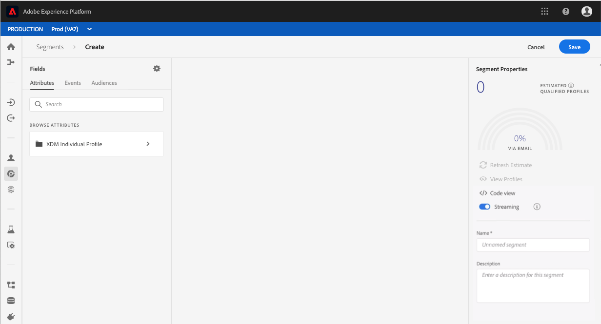

# [!DNL Segment Builder] guida utente

[!DNL Adobe Experience Platform Segmentation Service] fornisce un&#39;API RESTful e un&#39;interfaccia utente per la creazione delle definizioni dei segmenti dai [!DNL Real-time Customer Profile] dati.

## Introduzione

Per utilizzare le definizioni dei segmenti è necessario conoscere i vari [!DNL Experience Platform] servizi coinvolti nella segmentazione. Prima di leggere questa guida utente, consulta la documentazione relativa ai seguenti servizi:

- [!DNL Segmentation Service](../home.md): Il servizio di segmentazione consente di dividere i dati memorizzati in [!DNL Experience Platform] relazione a individui (come clienti, potenziali, utenti o organizzazioni) in gruppi più piccoli che condividono caratteristiche simili e risponderanno in modo simile alle strategie di marketing.
- [!DNL Real-time Customer Profile](../../profile/home.md): Fornisce un profilo di consumo unificato e in tempo reale basato su dati aggregati provenienti da più origini.
- [!DNL Identity Service](../../identity-service/home.md): Consente [!DNL Real-time Customer Profile] di collegare identità da origini dati diverse che vengono caricate in Platform.
- [!DNL Experience Data Model (XDM)](../../xdm/home.md): Il framework standard con cui [!DNL Platform] organizzare i dati relativi all&#39;esperienza del cliente.

È inoltre importante conoscere due termini chiave utilizzati in questo documento e comprendere la differenza tra questi:
- **Definizione** segmento: Set di regole utilizzato per descrivere le caratteristiche o i comportamenti chiave di un&#39;audience di destinazione.
- **Pubblico**: Set di profili risultante che soddisfano i criteri di una definizione di segmento.

## Accesso alle definizioni dei segmenti

Per iniziare a lavorare con le definizioni dei segmenti in [!DNL Adobe Experience Platform], fai clic **[!UICONTROL Segments]** nella barra di navigazione a sinistra. Per visualizzare tutte le definizioni di segmento per la tua organizzazione, fai clic sulla *[!UICONTROL Browse]* scheda. Questa visualizzazione elenca informazioni sulla definizione del segmento, incluso il metodo di valutazione, la data di creazione e l’ultima data di modifica.

Il metodo di valutazione può essere in streaming o batch. I segmenti di streaming vengono valutati costantemente quando i dati entrano nel sistema. I segmenti batch vengono valutati in base a una pianificazione prestabilita.

I segmenti batch presentano informazioni aggiuntive, che mostrano sia la data dell&#39;ultima valutazione, sia la data della valutazione successiva per il batch.

Facendo clic **[!UICONTROL Create segment]** nell’angolo in alto a destra si apre l’area di lavoro Generatore di segmenti, in cui potete iniziare a creare una definizione di segmento.

## [!DNL Segment Builder] workspace

[!DNL Segment Builder] offre un’area di lavoro completa che consente di interagire con gli elementi [!DNL Profile] dati. L’area di lavoro offre controlli intuitivi per la creazione e la modifica di regole, come le sezioni di trascinamento utilizzate per rappresentare le proprietà dei dati.

## Blocchi di generazione delle definizioni dei segmenti

I mattoni base delle definizioni dei segmenti sono **[!UICONTROL Attributes]** e **[!UICONTROL Events]**. Inoltre, gli attributi e gli eventi contenuti in esistenti **[!UICONTROL Audiences]** possono essere utilizzati anche come componenti per nuove definizioni.

Potete vedere questi blocchi nella *[!UICONTROL Fields]* sezione sul lato sinistro dell’ [!DNL Segment Builder] area di lavoro. *[!UICONTROL Fields]* contiene una scheda per ciascuno dei blocchi di generazione principali: **[!UICONTROL Attributes]**, **[!UICONTROL Events]** e **[!UICONTROL Audiences]**.

### Attributi

La **[!UICONTROL Attributes]** scheda consente di esplorare [!DNL Profile] gli attributi appartenenti alla [!DNL XDM Individual Profile] classe. Ogni cartella può essere espansa per rivelare altri attributi, in cui ogni attributo è una sezione che può essere trascinata sul quadro del generatore di regole al centro dell’area di lavoro. Il quadro del generatore di [regole](#rule-builder-canvas) viene discusso più dettagliatamente più avanti in questa guida.

### Eventi

La **[!UICONTROL Events]** scheda consente di creare un&#39;audience basata su eventi o azioni che si sono verificati utilizzando gli elementi di dati XDM ExperienceEvent. Potete anche trovare i tipi di evento nella **[!UICONTROL Events]** scheda, una raccolta di eventi di uso comune che consente di creare i segmenti più rapidamente.

Oltre a poter individuare [!DNL ExperienceEvent] gli elementi, potete anche cercare i tipi di evento. I tipi di evento utilizzano la stessa logica di codifica utilizzata [!DNL ExperienceEvents], senza che sia necessario eseguire ricerche nella [!DNL XDM ExperienceEvent] classe alla ricerca dell&#39;evento corretto. Ad esempio, utilizzando la barra di ricerca per cercare &quot;carrello&quot; vengono restituiti i tipi di evento &quot;[!UICONTROL AddCart]&quot; e &quot;[!UICONTROL RemoveCart]&quot;, due azioni carrello utilizzate di frequente per la creazione delle definizioni dei segmenti.

Per cercare qualsiasi tipo di componente, digitatene il nome nella barra di ricerca, che utilizza la sintassi [di ricerca di](https://docs.microsoft.com/en-us/azure/search/query-lucene-syntax)Lucene. I risultati della ricerca iniziano a essere compilati man mano che vengono inserite parole intere. Ad esempio, per creare una regola basata sul campo XDM `ExperienceEvent.commerce.productViews`, iniziate a digitare &quot;product views&quot; nel campo di ricerca. Una volta digitata la parola &quot;prodotto&quot;, i risultati della ricerca iniziano a comparire. Ogni risultato include la gerarchia di oggetti alla quale appartiene.

>[!NOTE]
>
>I campi dello schema personalizzato definiti dall&#39;organizzazione possono richiedere fino a 24 ore per essere visualizzati e diventare disponibili per l&#39;uso nelle regole di creazione.

Puoi quindi trascinare [!DNL ExperienceEvents] e rilasciare facilmente i segmenti e [!UICONTROL Event Types] inserirli nella definizione del segmento.

Per impostazione predefinita, vengono visualizzati solo i campi dello schema compilati dall&#39;archivio dati. Ciò include [!UICONTROL Event Types]. Se l’ [!UICONTROL Event Types] elenco non è visibile, oppure è possibile selezionare &quot;[!UICONTROL Any]&quot; solo come [!UICONTROL Event Type], fare clic sull’icona a forma di ingranaggio accanto a *[!UICONTROL Fields]*, quindi selezionare **[!UICONTROL Show full XDM schema]** sotto *[!UICONTROL Available Fields]*. Fare di nuovo clic sull&#39;icona a forma di ingranaggio per tornare alla *[!UICONTROL Fields]* scheda ed è ora possibile visualizzare più campi [!UICONTROL Event Types] e di schema, indipendentemente dal fatto che contengano o meno dati.

### Tipi di pubblico

La **[!UICONTROL Audiences]** scheda elenca tutte le audience importate da origini esterne, come  Adobe Audience Manager, nonché quelle create all&#39;interno [!DNL Experience Platform].

Nella [!UICONTROL Audiences] scheda è possibile visualizzare tutte le origini disponibili come un gruppo di cartelle. Facendo clic su queste cartelle, è possibile visualizzare le sottocartelle e le audience disponibili. Inoltre, potete fare clic sull’icona della cartella (come illustrato nell’immagine all’estrema destra) per visualizzare la struttura delle cartelle (un segno di spunta indica la cartella in cui ci si trova attualmente) e navigare facilmente tra le cartelle facendo clic sul nome di una cartella nella struttura.

Puoi passare il cursore del mouse sul ⓘ accanto a un&#39;audience per visualizzare le informazioni relative a quest&#39;ultima, inclusi il relativo ID, la descrizione e la gerarchia di cartelle per individuare l&#39;audience.

Potete anche cercare [!UICONTROL Audiences] utilizzando la barra di ricerca, che utilizza la sintassi [di ricerca di](https://docs.microsoft.com/en-us/azure/search/query-lucene-syntax)Lucene. Nella *[!UICONTROL Audiences]* scheda, se si seleziona una cartella di livello principale viene visualizzata la barra di ricerca, che consente di effettuare ricerche all’interno della cartella. I risultati della ricerca iniziano a essere compilati solo dopo l&#39;immissione di intere parole. Ad esempio, per trovare un [!UICONTROL Audience] nome `Online Shoppers`, iniziate a digitare &quot;Online&quot; nella barra di ricerca. Una volta digitata la parola &quot;Online&quot;, vengono visualizzati i risultati della ricerca contenenti la parola &quot;Online&quot;.

## Area di lavoro del generatore di regole {#rule-builder-canvas}

Una definizione di segmento è una raccolta di regole utilizzate per descrivere le caratteristiche o il comportamento chiave di un&#39;audience target. Queste regole vengono create utilizzando il *[!UICONTROL rule builder canvas]*, situato al centro di [!DNL Segment Builder].

Per aggiungere una nuova regola alla definizione del segmento, trascinate una sezione dalla *[!UICONTROL Fields]* scheda e rilasciatela nell’area di lavoro del generatore di regole. Verranno quindi presentate opzioni specifiche per il contesto in base al tipo di dati aggiunto. I tipi di dati disponibili includono: stringhe, date, [!DNL ExperienceEvents][!UICONTROL Event Types]e [!UICONTROL Audiences].

### Aggiunta di audience

Puoi trascinare un&#39;audience dalla *[!UICONTROL Audience]* scheda nell&#39;area di lavoro del generatore di regole per fare riferimento all&#39;appartenenza all&#39;audience nella nuova definizione di segmento. Questo consente di includere o escludere l&#39;appartenenza all&#39;audience come attributo nella nuova regola del segmento.

Per [!DNL Platform] i tipi di pubblico creati utilizzando [!DNL Segment Builder], viene offerta l&#39;opzione per convertire l&#39;audience in un set di regole utilizzate nella definizione del segmento per quell&#39;audience. Questa conversione crea una copia della logica della regola, che può essere modificata senza influenzare la definizione del segmento originale. Prima di convertire le modifiche recenti nella definizione del segmento in logica regola, accertatevi di aver salvato le modifiche recenti.

>[!NOTE]
>
>Quando si aggiunge un&#39;audience da un&#39;origine esterna, viene fatto riferimento solo all&#39;appartenenza all&#39;audience. Non è possibile convertire l&#39;audience in regole, pertanto le regole utilizzate per creare l&#39;audience originale non possono essere modificate nella nuova definizione di segmento.

Se si verificano dei conflitti durante la conversione dei tipi di pubblico in regole, [!DNL Segment Builder] tenterà di mantenere al meglio le opzioni esistenti.

### Vista Codice

In alternativa, è possibile visualizzare una versione basata su codice di una regola creata in [!DNL Segment Builder]. Dopo aver creato la regola all&#39;interno del quadro del generatore di regole, potete selezionare **[!UICONTROL Code view]** per visualizzare il segmento come PQL.

La vista Codice fornisce un pulsante che consente di copiare il valore del segmento da utilizzare nelle chiamate API. Per ottenere la versione più recente del segmento, accertati di aver salvato le ultime modifiche al segmento.

## Contenitori

Le regole del segmento vengono valutate nell&#39;ordine in cui sono elencate. I contenitori consentono il controllo dell&#39;ordine di esecuzione mediante l&#39;uso di query nidificate.

Dopo aver aggiunto almeno una sezione al quadro del generatore di regole, potete iniziare ad aggiungere contenitori. Per creare un nuovo contenitore, fate clic sulle ellissi (...) nell’angolo superiore destro della sezione, quindi fate clic **[!UICONTROL Add container]**.

Un nuovo contenitore viene visualizzato come secondario del primo contenitore, ma è possibile regolare la gerarchia trascinando e spostando i contenitori. Il comportamento predefinito di un contenitore consiste nel &quot;[!UICONTROL Include]&quot; l&#39;attributo, l&#39;evento o l&#39;audience forniti. Potete impostare la regola su &quot;[!UICONTROL Exclude]&quot; profili che corrispondono ai criteri del contenitore facendo clic **[!UICONTROL Include]** nell&#39;angolo superiore sinistro della sezione e selezionando &quot;[!UICONTROL Exclude]&quot;.

È inoltre possibile estrarre e aggiungere un contenitore secondario al contenitore principale facendo clic su &quot;unwrapper contenitore&quot; nel contenitore secondario. Fate clic sulle ellissi (...) nell’angolo superiore destro del contenitore secondario per accedere a questa opzione.

Dopo aver fatto clic **[!UICONTROL Unwrap container]** sul contenitore secondario viene rimosso e i criteri vengono visualizzati in linea.

>[!NOTE]
>
>Quando si estrae un contenitore, prestate attenzione affinché la logica continui a soddisfare la definizione del segmento desiderata.

## Unisci criteri

[!DNL Experience Platform] consente di unire dati provenienti da più origini e combinarli per visualizzare una visione completa di ogni singolo cliente. Quando si uniscono questi dati, i criteri di unione sono le regole che [!DNL Platform] utilizzano per determinare in che modo i dati verranno classificati come priorità e quali dati verranno combinati per creare un profilo.

È possibile selezionare un criterio di unione che corrisponda al proprio scopo di marketing per questo pubblico o utilizzare il criterio di unione predefinito fornito da [!DNL Platform]. È possibile creare più criteri di unione univoci per l&#39;organizzazione, inclusa la creazione di criteri di unione predefiniti. Per istruzioni dettagliate sulla creazione di criteri di unione per l&#39;organizzazione, vedere l&#39;esercitazione sull&#39; [utilizzo dei criteri di unione nell&#39;interfaccia utente](../../profile/ui/merge-policies.md).

Per selezionare un criterio di unione per la definizione del segmento, fai clic sull&#39;icona a forma di ingranaggio nella *[!UICONTROL Fields]* scheda, quindi utilizza il menu *[!UICONTROL Merge Policy]*a discesa per selezionare il criterio di unione che desideri utilizzare.

## Proprietà dei segmenti

Quando si crea una definizione di segmento, la *[!UICONTROL Segment Properties]* sezione sul lato destro dell&#39;area di lavoro visualizza una stima della dimensione del segmento risultante, consentendo di regolare la definizione del segmento come necessario prima di creare il pubblico stesso.

La *[!UICONTROL Segment Properties]* sezione è anche il punto in cui potete specificare informazioni importanti sulla definizione del segmento, inclusi i relativi *[!UICONTROL Name]* e *[!UICONTROL Description]*. I nomi delle definizioni dei segmenti vengono utilizzati per identificare il segmento tra quelli definiti dall’organizzazione e devono pertanto essere descrittivi, concisi e univoci.

Mentre continuate a generare la definizione del segmento, potete visualizzare un&#39;anteprima impaginata del pubblico selezionando **[!UICONTROL View Profiles]**.

>[!NOTE]
>
>Le stime dell&#39;audience vengono generate utilizzando una dimensione di esempio dei dati di quel giorno. Se nell&#39;archivio profili sono presenti meno di 1 milione di entità, viene utilizzato l&#39;intero set di dati; per un periodo compreso tra 1 e 20 milioni di entità, sono utilizzate 1 milione di entità; e per oltre 20 milioni di entità, viene utilizzato il 5% del totale delle entità. Ulteriori informazioni sulla generazione delle stime dei segmenti sono disponibili nella sezione [Generazione delle](../tutorials/create-a-segment.md#estimate-and-preview-an-audience) stime dell’esercitazione sulla creazione dei segmenti.

## Abilita segmentazione pianificata {#enable-scheduled-segmentation}

Una volta create le definizioni dei segmenti, potete valutarle tramite una valutazione su richiesta o pianificata (continua). Valutazione significa spostare [!DNL Real-time Customer Profile] i dati attraverso le definizioni dei segmenti per produrre audience corrispondenti. Una volta creati, i tipi di pubblico vengono salvati e memorizzati in modo che possano essere esportati tramite [!DNL Experience Platform] le API.

La valutazione su richiesta prevede l&#39;utilizzo dell&#39;API per eseguire la valutazione e generare audience in base alle esigenze, mentre la valutazione programmata (nota anche come &quot;segmentazione pianificata&quot;) consente di creare una pianificazione periodica per valutare le definizioni dei segmenti in un momento specifico (al massimo, una volta al giorno).

Per abilitare le definizioni dei segmenti per la valutazione pianificata, puoi utilizzare l’interfaccia utente o l’API. Nell’interfaccia utente, tornate alla *[!UICONTROL Browse]* scheda all’interno **[!UICONTROL Segments]** e attivate **[!UICONTROL Evaluate all segments]**. In questo modo tutti i segmenti verranno valutati in base alla pianificazione impostata dall&#39;organizzazione.

>[!NOTE]
>
>La valutazione pianificata può essere abilitata per le sandbox con un massimo di cinque (5) criteri di unione per [!DNL XDM Individual Profile]. Se l&#39;organizzazione dispone di più di cinque criteri di unione per [!DNL XDM Individual Profile] un unico ambiente sandbox, non sarà possibile utilizzare la valutazione pianificata.

Le pianificazioni al momento possono essere create solo tramite l&#39;API. Per informazioni dettagliate sulla creazione, la modifica e l&#39;utilizzo delle pianificazioni tramite l&#39;API, seguite l&#39;esercitazione per valutare e accedere ai risultati dei segmenti, in particolare la sezione sulla valutazione [pianificata tramite l&#39;API](../tutorials/evaluate-a-segment.md#scheduled-evaluation).

## Segmentazione in streaming {#streaming-segmentation}

>[!NOTE]
>
>Affinché la segmentazione in streaming possa funzionare, il cliente dovrà attivare la segmentazione pianificata per l’organizzazione. Per informazioni dettagliate sull&#39;abilitazione della segmentazione pianificata, consultate [la sezione precedente in questa guida](#enable-scheduled-segmentation)utente.

Una query verrà valutata automaticamente con segmentazione in streaming se soddisfa uno dei seguenti criteri:

| Tipo di query | Dettagli | Esempio |
| ---------- | ------- | ------- |
| hit in ingresso | Definizione di segmento che fa riferimento a un singolo evento in arrivo senza limitazioni temporali. |  |
| Hit in arrivo all’interno di una finestra temporale relativa | Definizione di segmento che fa riferimento a un singolo evento in arrivo **negli ultimi sette giorni**. |  |
| Hit in arrivo che fa riferimento a un profilo | Definizione di segmento che fa riferimento a un singolo evento in arrivo, senza limitazioni temporali, e uno o più attributi di profilo. |  |
| Hit in arrivo che fa riferimento a un profilo all’interno di una finestra temporale relativa | Definizione di segmento che fa riferimento a un singolo evento in arrivo e a uno o più attributi di profilo, **negli ultimi sette giorni**. |  |
| Più eventi che fanno riferimento a un profilo | Qualsiasi definizione di segmento che fa riferimento a più eventi **nelle ultime 24 ore** e (facoltativamente) ha uno o più attributi di profilo. |  |

Nella sezione seguente sono elencati alcuni esempi di definizione del segmento che **non** saranno abilitati per la segmentazione in streaming.

| Tipo di query | Dettagli |
| ---------- | ------- | 
| Hit in arrivo all’interno di una finestra temporale relativa | Se la definizione del segmento si riferisce a un evento in arrivo **non** entro l’ **ultimo periodo** di sette giorni. Ad esempio, entro le **ultime due settimane**. |  |
| Hit in arrivo che fa riferimento a un profilo all’interno di una finestra relativa | Le seguenti opzioni **non** supportano la segmentazione in streaming:<ul><li>Un evento in arrivo **non** entro l&#39; **ultimo periodo** di sette giorni.</li><li>Definizione del segmento che include [!DNL Adobe Audience Manager (AAM)] segmenti o caratteristiche.</li></ul> |  |
| Più eventi che fanno riferimento a un profilo | Le seguenti opzioni **non** supportano la segmentazione in streaming:<ul><li>Un evento che **non** si verifica entro **le ultime 24 ore**.</li><li>Definizione del segmento che include segmenti o caratteristiche  Adobe Audience Manager (AAM).</li></ul> |  |
| Query con più entità | Nel complesso, le query con più entità **non** sono supportate dalla segmentazione in streaming. |  |

Inoltre, durante la segmentazione in streaming si applicano alcune linee guida:

| Tipo di query | Indirizzo |
| ---------- | -------- |
| Query evento singolo | La finestra di look-back è limitata a **sette giorni**. |
| Query con cronologia eventi | <ul><li>La finestra di look-back è limitata a **un giorno**.</li><li>Tra gli eventi **deve** esistere una condizione di ordine di tempo restrittivo.</li><li>Sono consentiti solo gli ordini temporali semplici (prima e dopo) tra gli eventi.</li><li>I singoli eventi **non possono** essere negati. Tuttavia, l’intera query **può** essere negata.</li></ul> |

### Monitoraggio della segmentazione in streaming

Dopo aver creato un segmento abilitato per lo streaming, potete monitorare i dettagli di tale segmento.

Nello specifico, *[!UICONTROL total qualified audience size]* vengono visualizzati i dettagli relativi all&#39;evento. Se un processo è stato eseguito nelle ultime 24 ore, viene visualizzato il **[!UICONTROL Total Audience Size]** modulo dal processo, oltre a un grafico a linee per l’audience aggiunta. In caso contrario, **[!UICONTROL Estimated Audience Size]** viene visualizzato, oltre a una linea di tendenza della visualizzazione.

Ulteriori informazioni sulla valutazione dell’ultimo segmento sono reperibili facendo clic sulla bolla delle informazioni.

### Video dimostrativo sulla segmentazione in streaming

Il seguente video è pensato per comprendere meglio la segmentazione in streaming. Mostra un esempio di esperienza del cliente seguito da una breve presentazione delle funzioni chiave nell&#39; [!DNL Platform] interfaccia.

>[!VIDEO](https://video.tv.adobe.com/v/36184?quality=12&learn=on)

## DULE violazioni dei criteri

>[!NOTE]
>
>Le violazioni dei criteri DULE si applicano solo se si crea un segmento assegnato a una destinazione.

Dopo aver creato il segmento, questo verrà analizzato [!DNL Data Governance] per assicurarsi che non vi siano violazioni dei criteri all&#39;interno del segmento. Per informazioni dettagliate sulle violazioni DULE e dei criteri, fare riferimento alla panoramica [delle etichette di utilizzo dei](../../data-governance/labels/overview.md)dati.

## Passaggi successivi e risorse aggiuntive {#next-steps}

Segment Builder (Generatore di segmenti) offre un flusso di lavoro avanzato che consente di isolare i tipi di pubblico commerciabili dai [!DNL Real-time Customer Profile] dati. Dopo aver letto questa guida, è ora possibile:

- Crea le definizioni dei segmenti utilizzando una combinazione di attributi, eventi e audience esistenti come elementi costitutivi.
- Utilizzate l&#39;area di lavoro e i contenitori del generatore di regole per controllare l&#39;ordine in cui vengono eseguite le regole del segmento.
- Visualizzare le stime del pubblico potenziale, per regolare le definizioni dei segmenti in base alle esigenze.
- Abilita tutte le definizioni di segmento per la segmentazione pianificata.
- Abilita le definizioni di segmento specificate per la segmentazione in streaming.

Per saperne di più [!DNL Segmentation Service], continuate a leggere la documentazione e completate le vostre lezioni guardando i video qui sotto. Per istruzioni dettagliate sull&#39;utilizzo [!DNL Segmentation Service] dell&#39; [!DNL Segmentation Service] API, vedete l&#39;esercitazione sulla [creazione di segmenti di pubblico tramite API](../tutorials/create-a-segment.md) .

>[!WARNING]
>
> L’ [!DNL Platform] interfaccia utente mostrata nei video seguenti è obsoleta. Per informazioni sulle ultime funzionalità e videate dell’interfaccia, consulta la documentazione precedente.

**Crea un segmento:**

>[!VIDEO](https://video.tv.adobe.com/v/27254?quality=12&learn=on)

**Crea un segmento dinamico:**

>[!VIDEO](https://video.tv.adobe.com/v/27428?quality=12&learn=on)
