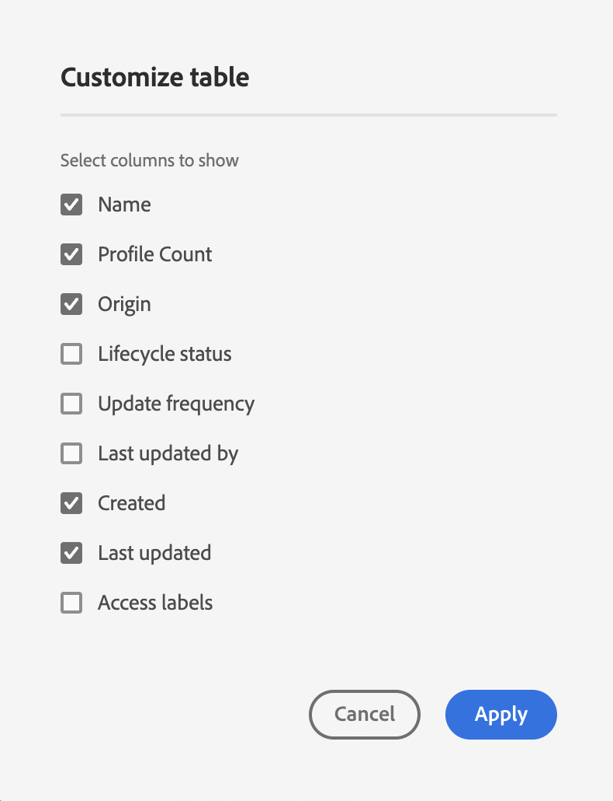

# Guida dell’interfaccia utente di Segmentation Service

[!DNL Adobe Experience Platform Segmentation Service] fornisce un’interfaccia utente per la creazione e la gestione delle definizioni dei segmenti.

## Introduzione

L’utilizzo delle definizioni dei segmenti richiede una comprensione dei vari [!DNL Experience Platform] servizi coinvolti nella segmentazione. Prima di leggere questa guida utente, consulta la documentazione dei seguenti servizi:

- [[!DNL Segmentation Service]](../home.md): [!DNL Segmentation Service] consente di suddividere i dati memorizzati in [!DNL Experience Platform] che si riferisce a singoli utenti (come clienti, potenziali clienti, utenti o organizzazioni) in gruppi più piccoli.
- [[!DNL Real-Time Customer Profile]](../../profile/home.md): fornisce un profilo consumer unificato e in tempo reale basato su dati aggregati provenienti da più origini.
- [[!DNL Adobe Experience Platform Identity Service]](../../identity-service/home.md): consente la creazione di profili cliente collegando le identità da diverse origini dati acquisite in [!DNL Platform].
- [[!DNL Experience Data Model (XDM)]](../../xdm/home.md): il quadro standardizzato mediante il quale [!DNL Platform] organizza i dati sull’esperienza del cliente. Per utilizzare al meglio la segmentazione, assicurati che i dati vengano acquisiti come profili ed eventi in base alla [best practice per la modellazione dei dati](../../xdm/schema/best-practices.md).

È inoltre importante conoscere due termini chiave utilizzati in questo documento e comprenderne la differenza:
- **Definizione del segmento**: set di regole utilizzato per descrivere le caratteristiche o i comportamenti chiave di un pubblico target.
- **Pubblico**: il set di profili risultante che soddisfa i criteri di una definizione di segmento. Può essere creato tramite Adobe Experience Platform (pubblico generato da Platform) o da una sorgente esterna (pubblico generato esternamente).

## Panoramica

Nell’interfaccia utente di Experience Platform, seleziona **[!UICONTROL Segmenti]** nel menu di navigazione a sinistra per aprire **[!UICONTROL Panoramica]** scheda che visualizza [!UICONTROL Segmenti] dashboard.

>[!NOTE]
>
>Se la tua organizzazione non utilizza ancora Platform e non dispone ancora di set di dati di profilo attivi o criteri di unione creati, il [!UICONTROL Segmenti] dashboard non visibile. Al contrario, [!UICONTROL Panoramica] Nella scheda vengono visualizzati collegamenti e documentazione per aiutarti a iniziare a utilizzare i segmenti.

### [!UICONTROL Segmenti] dashboard {#segments-dashboard}

Il **[!UICONTROL Segmenti]** la dashboard illustra le metriche chiave relative ai dati dei segmenti della tua organizzazione.

Per ulteriori informazioni, visita [guida del dashboard segmenti](../../dashboards/guides/segments.md).

## Sfogliare {#browse}

>[!CONTEXTUALHELP]
>id="platform_segments_browse_churncolumnname"
>title="Abbandono"
>abstract="L’abbandono rappresenta la percentuale di profili che cambiano all’interno di una definizione di segmento rispetto all’ultima esecuzione del processo di segmento."

>[!CONTEXTUALHELP]
>id="platform_segments_browse_evaluationmethodcolumnname"
>title="Metodo di valutazione"
>abstract="I metodi di valutazione per i segmenti includono batch, streaming ed Edge."

>[!CONTEXTUALHELP]
>id="platform_segments_browse_addallsegmentstoschedule"
>title="Aggiungi tutti i segmenti alla pianificazione"
>abstract="Abilita questa opzione per includere tutti i segmenti di valutazione in batch nell’aggiornamento giornaliero pianificato. Disabilita questa opzione per rimuovere tutti i segmenti dall’aggiornamento pianificato."

Seleziona la **[!UICONTROL Sfoglia]** per visualizzare un elenco di tutte le definizioni di segmenti per la tua organizzazione.

Questa vista elenca informazioni sulla definizione del segmento, tra cui il conteggio dei profili, la data di creazione e la data dell’ultima modifica.

Puoi aggiungere altri campi a questa visualizzazione selezionando . Questi campi aggiuntivi includono suddivisione, metodo di valutazione e ID processo.

Se è selezionato il raggruppamento, la visualizzazione mostra un grafico a barre che illustra la percentuale di profili che appartengono a ciascuno dei seguenti stati di profilo calcolati: [!UICONTROL Realizzato], [!UICONTROL Esistente], e [!UICONTROL Uscita]. Inoltre, la suddivisione mostrata nella [!UICONTROL Sfoglia] Questa è la suddivisione più accurata dello stato del segmento. Se questo numero è diverso da quello riportato sulla [!UICONTROL Panoramica] , è necessario utilizzare i numeri della scheda [!UICONTROL Sfoglia] come fonte corretta di informazioni, poiché il [!UICONTROL Panoramica] i numeri di tabulazione vengono aggiornati solo una volta al giorno.

| Stato | Descrizione |
| ------ | ----------- |
| [!UICONTROL Realizzato] | Numero di profili che **qualificato** per il segmento nelle ultime 24 ore dall’esecuzione dell’ultimo processo di segmentazione batch. |
| [!UICONTROL Esistente] | Numero di profili che **rimasto** nel segmento nelle ultime 24 ore dall’esecuzione dell’ultimo processo di segmentazione batch. |
| [!UICONTROL Uscita] | Numero di profili che **uscita** il segmento nelle ultime 24 ore dall’ultima esecuzione del processo di segmentazione batch. |

Il metodo di valutazione può essere in streaming, in batch o Edge. I segmenti in streaming vengono costantemente valutati al momento dell’ingresso dei dati nel sistema. I segmenti batch vengono valutati in base a una pianificazione impostata. I segmenti Edge vengono valutati in tempo reale, che consentono casi di utilizzo di personalizzazione della stessa pagina e della pagina successiva.

Nella parte superiore della pagina sono presenti opzioni per aggiungere tutti i segmenti a una pianificazione e per creare un nuovo segmento.

Attivazione/disattivazione **[!UICONTROL Aggiungi tutti i segmenti alla pianificazione]** abiliterà la segmentazione pianificata. Ulteriori informazioni sulla segmentazione pianificata sono disponibili nella sezione [sezione segmentazione pianificata di questa guida utente](#scheduled-segmentation).

Selezione **[!UICONTROL Crea segmento]** ti porterà al Generatore di segmenti. Per ulteriori informazioni sulla creazione dei segmenti, consulta la sezione su [creazione di un segmento nella guida utente](#create-segment).

La barra laterale a destra contiene informazioni su tutti i segmenti all’interno dell’organizzazione, elencando il numero totale di segmenti, la data dell’ultima valutazione, la data della valutazione successiva, nonché una suddivisione dei segmenti per metodo di valutazione.

Selezionando la riga della definizione del segmento viene fornito un riepilogo della definizione del segmento, incluse le opzioni per modificare o eliminare il segmento, attivarlo in una destinazione, il pubblico idoneo per il segmento, la dimensione del pubblico totale, oltre al nome del segmento, alla descrizione, al metodo di valutazione, alla data di creazione e alla data dell’ultima modifica.

>[!NOTE]
>
> Lo farai **non** essere in grado di eliminare un segmento utilizzato in un’attivazione di destinazione.

## Dettagli della definizione del segmento {#segment-details}

Per visualizzare ulteriori dettagli su una definizione di segmento specifica, seleziona il nome di un segmento all’interno di **[!UICONTROL Sfoglia]** scheda.

Viene visualizzata la pagina dei dettagli del segmento. In alto è riportato un riepilogo della definizione del segmento, informazioni sulla dimensione del pubblico idoneo e sulle destinazioni per le quali il segmento viene attivato.

### Riepilogo segmenti {#segment-summary}

Il **[!UICONTROL Riepilogo segmenti]** fornisce informazioni quali ID, nome, descrizione e dettagli degli attributi.

Inoltre, puoi attivare il segmento in una destinazione o modificarlo. Selezione **[!UICONTROL Attiva nella destinazione]** ti consente di attivare il segmento in una destinazione. Per informazioni più dettagliate sull’attivazione di un segmento in una destinazione, consulta la sezione [panoramica sull’attivazione](../../destinations/ui/activation-overview.md).

Selezione **[!UICONTROL Modifica segmento]** ti porterà al [!DNL Segment Builder]. Per informazioni più dettagliate sull&#39;utilizzo di [!DNL Segment Builder] Workspace, leggi il [[!DNL Segment Builder] guida utente](./segment-builder.md).

### Pubblico totale nel segmento

Il **[!UICONTROL Pubblico totale nel segmento]** mostra il numero totale di profili idonei per il segmento.

Le stime vengono generate utilizzando una dimensione campione dei dati di campionamento di quel giorno. Se nell’archivio dei profili sono presenti meno di 1 milione di entità, viene utilizzato l’intero set di dati; per un numero di entità compreso tra 1 e 20 milioni, vengono utilizzate 1 milione di entità e per più di 20 milioni di entità, viene utilizzato il 5% del totale delle entità. Ulteriori informazioni sulla generazione delle stime dei segmenti sono disponibili nella sezione [sezione generazione della stima](../tutorials/create-a-segment.md#estimate-and-preview-an-audience) dell’esercitazione sulla creazione dei segmenti.

### Destinazioni attivate

Il **[!UICONTROL Destinazioni attivate]** mostra le destinazioni per le quali è attivato questo segmento.

>[!NOTE]
>
> Le destinazioni sono una funzione disponibile con [!DNL Adobe Real-Time Customer Data Platform]e ti consentono di esportare dati su piattaforme esterne. Per ulteriori informazioni sulle destinazioni, consulta [panoramica sulle destinazioni](../../destinations/home.md). Per informazioni su come attivare un segmento in una destinazione, consulta [panoramica sull’attivazione](../../destinations/ui/activation-overview.md).

### Esempi di profilo

Di seguito è riportato un campionamento dei profili idonei per il segmento, con informazioni dettagliate che includono [!DNL Profile] ID, nome, cognome e indirizzo e-mail personale.

Il modo in cui viene attivato il campionamento dei dati dipende dal metodo di acquisizione.

Per l’acquisizione batch, l’archivio profili viene analizzato automaticamente ogni quindici minuti per verificare se un nuovo batch è stato correttamente acquisito dall’ultima esecuzione del processo di campionamento. In questo caso, l’archivio profili viene successivamente analizzato per verificare se è stata registrata una modifica di almeno il 5% nel numero di record. Se queste condizioni vengono soddisfatte, viene attivato un nuovo processo di campionamento.

Per l’acquisizione in streaming, l’archivio profili viene analizzato automaticamente ogni ora per verificare se si è verificata una modifica di almeno il 5% nel numero di record. Se questa condizione viene soddisfatta, viene attivato un nuovo processo di campionamento.

La dimensione del campione della scansione dipende dal numero complessivo di entità nell’archivio profili. Queste dimensioni di esempio sono rappresentate nella tabella seguente:

| Entità nell’archivio profili | Dimensione campione |
| ------------------------- | ----------- |
| Meno di 1 milione | Set di dati completo |
| Da 1 a 20 milioni | 1 milione |
| Oltre 20 milioni | 5% del totale |

Informazioni più dettagliate su ciascuno [!DNL Profile] può essere visualizzato selezionando la [!DNL Profile] ID Per ulteriori informazioni sui dettagli di un profilo, consulta [[!DNL Real-Time Customer Profile] guida utente](../../profile/ui/user-guide.md#profile-detail).

## Creazione di un segmento {#create-segment}

Selezione **[!UICONTROL Crea segmento]** nell’angolo in alto a destra apre la [!DNL Segment Builder] workspace, da cui è possibile iniziare a creare una definizione di segmento.

### [!DNL Segment Builder] workspace

[!DNL Segment Builder] fornisce un’area di lavoro ricca che consente di interagire con [!DNL Profile] elementi dati. L’area di lavoro fornisce controlli intuitivi per la creazione e la modifica di regole, ad esempio le tessere trascinate utilizzate per rappresentare le proprietà dei dati.

Per informazioni più dettagliate sull&#39;utilizzo di [!DNL Segment Builder] Workspace, leggi il [[!DNL Segment Builder] guida utente](./segment-builder.md).

## Segmentazione pianificata {#scheduled-segmentation}

Una volta create le definizioni dei segmenti, puoi valutarle tramite valutazione on-demand o programmata (continua). Valutazione significa spostamento [!DNL Real-Time Customer Profile] tramite le definizioni dei segmenti per produrre tipi di pubblico corrispondenti. Una volta creati, i tipi di pubblico vengono salvati e memorizzati in modo che possano essere esportati utilizzando [!DNL Experience Platform] API.

La valutazione on-demand comporta l’utilizzo dell’API per eseguire valutazioni e generare tipi di pubblico in base alle esigenze, mentre la valutazione pianificata (nota anche come &quot;segmentazione pianificata&quot;) consente di creare una pianificazione ricorrente per valutare le definizioni dei segmenti in un momento specifico (al massimo, una volta al giorno).

### Abilita segmentazione pianificata {#enable-scheduled-segmentation}

L’abilitazione delle definizioni dei segmenti per la valutazione pianificata può essere eseguita utilizzando l’interfaccia utente o l’API. Nell’interfaccia utente, torna a **[!UICONTROL Sfoglia]** scheda in **[!UICONTROL Segmenti]** e attivare **[!UICONTROL Aggiungi tutti i segmenti alla pianificazione]**. In questo modo tutti i segmenti verranno valutati in base alla pianificazione impostata dall’organizzazione.

>[!NOTE]
>
>La valutazione pianificata può essere abilitata per le sandbox con un massimo di cinque (5) criteri di unione per [!DNL XDM Individual Profile]. Se nell’organizzazione sono presenti più di cinque criteri di unione per [!DNL XDM Individual Profile] in un singolo ambiente sandbox non puoi utilizzare la valutazione pianificata.

Al momento è possibile creare pianificazioni solo utilizzando l’API. Per i passaggi dettagliati sulla creazione, la modifica e l’utilizzo delle pianificazioni utilizzando l’API, segui il tutorial per valutare e accedere ai risultati dei segmenti, in particolare la sezione su [valutazione pianificata tramite l’API](../tutorials/evaluate-a-segment.md#scheduled-evaluation).

## Tipi di pubblico {#audiences}

>[!IMPORTANT]
>
>La funzionalità audience è attualmente in versione beta limitata e non è disponibile per tutti gli utenti. La documentazione e le funzionalità sono soggette a modifiche.

Seleziona la **[!UICONTROL Tipi di pubblico]** per visualizzare un elenco di tutti i tipi di pubblico per la tua organizzazione.

Per impostazione predefinita, questa visualizzazione elenca informazioni sui tipi di pubblico, tra cui nome, conteggio dei profili, origine, data di creazione e data dell’ultima modifica.

È possibile selezionare  per modificare i campi visualizzati.

Viene visualizzato un popover che elenca tutti i campi che possono essere visualizzati nella tabella.

| Campo | Descrizione |
| ----- | ----------- | 
| [!UICONTROL Nome] | Il nome del pubblico. |
| [!UICONTROL Conteggio dei profili] | Il numero totale di profili idonei per il pubblico. |
| [!UICONTROL Origin] | L’origine del pubblico. Se questo pubblico è stato generato da Platform, avrà un’origine del servizio di segmentazione. |
| [!UICONTROL Stato del ciclo di vita] | Stato del pubblico. I valori possibili per questo campo includono `Draft`, `Published`, e `Archived`. |
| [!UICONTROL Frequenza di aggiornamento] | Valore che indica la frequenza con cui vengono aggiornati i dati del pubblico. I valori possibili per questo campo includono `On Demand`, `Scheduled`, e `Continuous`. |
| [!UICONTROL Ultimo aggiornamento eseguito da] | Nome dell’ultima persona che ha aggiornato il pubblico. |
| [!UICONTROL Creato] | L’ora e la data di creazione del pubblico. |
| [!UICONTROL Ultimo aggiornamento] | L’ora e la data dell’ultima creazione del pubblico. |
| [!UICONTROL Etichette di accesso] | Le etichette di accesso per il pubblico. Le etichette di accesso consentono di categorizzare set di dati e campi in base ai criteri di utilizzo applicabili a tali dati. Queste etichette possono essere applicate in qualsiasi momento, fornendo flessibilità nella scelta di come gestire i dati. Per ulteriori informazioni sulle etichette di accesso, consulta la documentazione su [gestione delle etichette](../../access-control/abac/ui/labels.md). |

Puoi selezionare **[!UICONTROL Crea pubblico]** per creare un pubblico.

Viene visualizzato un popover che consente di scegliere se comporre un pubblico o creare regole.

Selezione **[!UICONTROL Componi tipi di pubblico]** ti porta al Generatore di pubblico. Per ulteriori informazioni sulla creazione di tipi di pubblico, consulta [Guida di Audience Builder](./audience-builder.md).

Selezione **[!UICONTROL Genera regola]** ti porta al Generatore di segmenti. Per ulteriori informazioni sulla creazione dei segmenti, leggi [Guida al Generatore di segmenti](./segment-builder.md)

## Dettagli del pubblico {#audience-details}

Per visualizzare ulteriori dettagli su un pubblico specifico, seleziona il nome di un pubblico in [!UICONTROL Tipi di pubblico] scheda.

Viene visualizzata la pagina dei dettagli del pubblico. Questa pagina differisce nei dettagli a seconda che il pubblico sia stato generato con Adobe Experience Platform o da una sorgente esterna come Audience Orchestration.

### Pubblico generato dalla piattaforma

Per ulteriori informazioni sui tipi di pubblico generati da Platform, consulta [sezione riepilogo segmenti](#segment-summary).

### Pubblico generato esternamente

Nella parte superiore della pagina dei dettagli del pubblico si trova un riepilogo del pubblico e i dettagli sul set di dati in cui il pubblico viene salvato.

Il **[!UICONTROL Riepilogo del pubblico]** fornisce informazioni quali ID, nome, descrizione e dettagli degli attributi.

Il **[!UICONTROL Dettagli del set di dati]** fornisce informazioni quali nome, descrizione, nome della tabella, origine e schema. Puoi selezionare **[!UICONTROL Visualizza set di dati]** per visualizzare ulteriori informazioni sul set di dati.

| Campo | Descrizione |
| ----- | ----------- |
| [!UICONTROL Nome] | Nome del set di dati. |
| [!UICONTROL Descrizione] | Descrizione del set di dati. |
| [!UICONTROL Nome tabella] | Nome della tabella del set di dati. |
| [!UICONTROL Origine] | L’origine del set di dati. Per i tipi di pubblico generati esternamente, questo valore sarà **Schema**. |
| [!UICONTROL Schema] | Il tipo di schema XDM a cui corrisponde il set di dati. |

Per ulteriori informazioni sui set di dati, consulta [panoramica del set di dati](../../catalog/datasets/overview.md).

## Segmentazione in streaming {#streaming-segmentation}

La segmentazione in streaming è la capacità di eseguire la segmentazione su [!DNL Platform] quasi in tempo reale, concentrandosi sulla ricchezza dei dati. Con la segmentazione in streaming, la qualificazione dei segmenti ora avviene quando i dati arrivano in [!DNL Platform], riducendo la necessità di pianificare ed eseguire processi di segmentazione.

Ulteriori informazioni sulla segmentazione dello streaming sono disponibili nella sezione [guida utente sulla segmentazione in streaming](./streaming-segmentation.md).

>[!NOTE]
>
>Affinché la segmentazione in streaming funzioni, devi abilitare la segmentazione pianificata per l’organizzazione. Per informazioni dettagliate sull’abilitazione della segmentazione pianificata, consulta [la sezione segmentazione streaming in questa guida utente](#scheduled-segmentation).

## Segmentazione Edge {#edge-segmentation}

La segmentazione Edge consente di valutare i segmenti in Platform istantaneamente al limite, abilitando casi d’uso di personalizzazione della pagina corrente e successiva.

Ulteriori informazioni sulla segmentazione Edge sono disponibili nella sezione [guida dell’interfaccia utente per la segmentazione Edge](./edge-segmentation.md)

## Violazioni dei criteri

>[!NOTE]
>
>Le violazioni dei criteri si applicano solo se si crea un segmento assegnato a una destinazione.

Dopo aver completato la creazione del segmento, quest’ultimo verrà analizzato da Governance dei dati di Adobe Experience Platform per garantire che non vi siano violazioni dei criteri all’interno del segmento. Consulta la [Panoramica sulla governance dei dati](../../data-governance/home.md) per ulteriori informazioni.

## Passaggi successivi e risorse aggiuntive {#next-steps}

Il [!DNL Segmentation Service] L’interfaccia utente offre un flusso di lavoro avanzato che consente di isolare i tipi di pubblico commerciabili da [!DNL Real-Time Customer Profile] dati.

Per ulteriori informazioni su [!DNL Segmentation Service], continua a leggere la documentazione. Per scoprire come utilizzare il [!DNL Segmentation Service] API, leggi le [[!DNL Segmentation Service] guida per sviluppatori](../api/overview.md).
