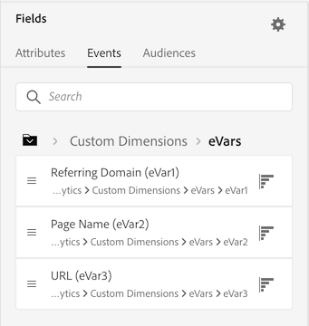
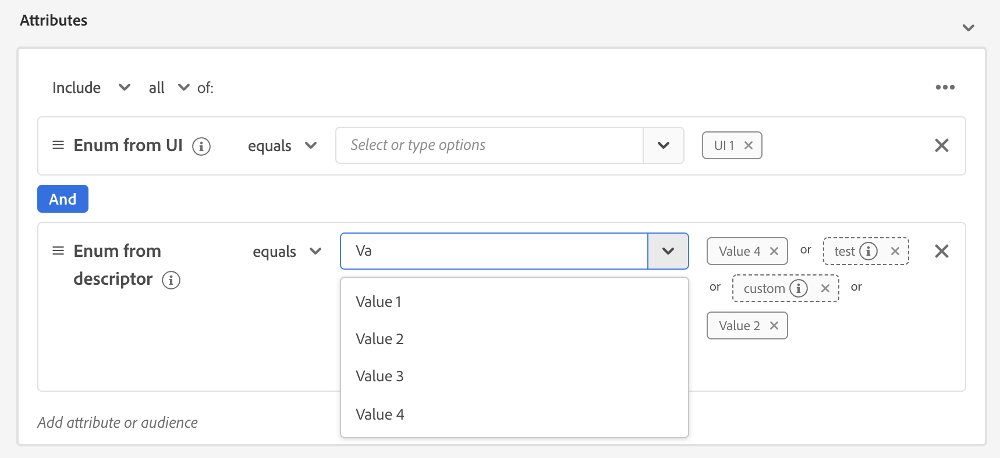

# [!DNL Segment Builder] Guida all’interfaccia utente

[!DNL Segment Builder] offre un’area di lavoro ricca che consente di interagire con [!DNL Profile] elementi dati. L’area di lavoro fornisce controlli intuitivi per la creazione e la modifica di regole, ad esempio riquadri drag-and-drop utilizzati per rappresentare le proprietà dei dati.

## Blocchi di generazione della definizione del segmento {#building-blocks}

>[!CONTEXTUALHELP]
>id="platform_segments_createsegment_segmentbuilder_fields"
>title="Campi"
>abstract="I tre tipi di campi che compongono un segmento sono attributi, eventi e tipi di pubblico. Gli attributi consentono di utilizzare gli attributi di profilo che appartengono alla classe Profilo individuale XDM, gli eventi ti consentono di creare un pubblico basato su azioni o eventi che hanno luogo utilizzando gli elementi dati XDM ExperienceEvent e i tipi di pubblico consentono di utilizzare i tipi di pubblico importati da fonti esterne."

Gli elementi di base delle definizioni dei segmenti sono attributi ed eventi. Inoltre, gli attributi e gli eventi contenuti nei tipi di pubblico esistenti possono essere utilizzati come componenti per nuove definizioni.

Puoi vedere questi blocchi predefiniti nel **[!UICONTROL Campi]** sul lato sinistro del [!DNL Segment Builder] workspace. **[!UICONTROL Campi]** contiene una scheda per ciascuno dei blocchi predefiniti principali: &quot;[!UICONTROL Attributi]&quot;, &quot;[!UICONTROL Eventi]&quot;, e &quot;[!UICONTROL Tipi di pubblico]&quot;.

### Attributi

La **[!UICONTROL Attributi]** scheda consente di sfogliare [!DNL Profile] gli attributi appartenenti al [!DNL XDM Individual Profile] classe. Ogni cartella può essere espansa per visualizzare attributi aggiuntivi, in cui ogni attributo è un riquadro che può essere trascinato sull’area di lavoro del generatore di regole al centro dell’area di lavoro. La [area di lavoro del generatore di regole](#rule-builder-canvas) viene discusso più avanti in questa guida.

### Eventi

La **[!UICONTROL Eventi]** La scheda ti consente di creare un pubblico basato su eventi o azioni che hanno avuto luogo utilizzando [!DNL XDM ExperienceEvent] elementi dati. Puoi anche trovare i Tipi di evento nel **[!UICONTROL Eventi]** , una raccolta di eventi comunemente utilizzati per consentire di creare i segmenti più rapidamente.

Oltre a essere in grado di cercare [!DNL ExperienceEvent] È inoltre possibile cercare i tipi di evento. I tipi di evento utilizzano la stessa logica di codifica [!DNL ExperienceEvents], senza che sia necessario eseguire ricerche nel [!DNL XDM ExperienceEvent] classe che cerca l&#39;evento corretto. Ad esempio, utilizzando la barra di ricerca per cercare &quot;carrello&quot; restituisce i tipi di evento &quot;[!UICONTROL AddCart]&quot; e &quot;[!UICONTROL RimuoviCarrello]&quot;, due azioni carrello molto comunemente utilizzate durante la creazione delle definizioni dei segmenti.

È possibile cercare qualsiasi tipo di componente digitandone il nome nella barra di ricerca, che utilizza [Sintassi di ricerca di Lucene](https://docs.microsoft.com/en-us/azure/search/query-lucene-syntax). I risultati della ricerca iniziano a popolarsi man mano che vengono inserite parole intere. Ad esempio, per creare una regola basata sul campo XDM `ExperienceEvent.commerce.productViews`, inizia a digitare &quot;product view&quot; nel campo di ricerca. Una volta digitata la parola &quot;prodotto&quot;, iniziano ad apparire i risultati della ricerca. Ogni risultato include la gerarchia di oggetti a cui appartiene.

>[!NOTE]
>
>I campi dello schema personalizzato definiti dall&#39;organizzazione possono richiedere fino a 24 ore per essere visualizzati e diventare disponibili per l&#39;utilizzo nella creazione delle regole.

È quindi possibile trascinare e rilasciare facilmente [!DNL ExperienceEvents] e &quot;[!UICONTROL Tipi di eventi]&quot; nella definizione del segmento.

Per impostazione predefinita, vengono visualizzati solo i campi dello schema compilati dall’archivio dati. Ciò include &quot;[!UICONTROL Tipi di eventi]&quot;. Se &quot;[!UICONTROL Tipi di eventi]&quot; elenco non visibile oppure è possibile selezionare solo &quot;[!UICONTROL Qualsiasi]&quot; come &quot;[!UICONTROL Tipo evento]&quot;, seleziona la **icona ingranaggio** accanto a **[!UICONTROL Campi]**, quindi seleziona **[!UICONTROL Mostra schema XDM completo]** sotto **[!UICONTROL Campi disponibili]**. Seleziona la **icona ingranaggio** di nuovo per tornare al **[!UICONTROL Campi]** e ora dovresti essere in grado di visualizzare più &quot;[!UICONTROL Tipi di eventi]&quot; e i campi dello schema, indipendentemente dal fatto che contengano o meno dati.

#### Set di dati suite di rapporti Adobe Analytics

Puoi utilizzare i dati da una o più suite di rapporti Adobe Analytics come eventi all’interno della segmentazione.

Quando si utilizzano dati da una singola suite di rapporti di Analytics, Platform aggiunge automaticamente descrittori e nomi descrittivi agli eVar, facilitando la ricerca di tali campi all’interno di [!DNL Segment Builder].

Quando si utilizzano dati provenienti da più suite di rapporti di Analytics, Platform **impossibile** aggiungi automaticamente descrittori o nomi descrittivi alle eVar. Di conseguenza, prima di utilizzare i dati delle suite di rapporti di Analytics, è necessario eseguire la mappatura sui campi XDM. Ulteriori informazioni sulla mappatura delle variabili Analytics a XDM sono disponibili nella sezione [Guida alla connessione sorgente di Adobe Analytics](../../sources/tutorials/ui/create/adobe-applications/analytics.md#mapping).

Ad esempio, considera una situazione in cui disponi di due suite di rapporti con le seguenti variabili:

| Campo | Schema suite di rapporti A | Schema suite di rapporti B |
| ----- | --------------------- | --------------------- |
| eVar1 | Dominio di riferimento | Accesso Y/N |
| eVar2 | Nome pagina | ID fedeltà membro |
| eVar3 | URL | Nome pagina |
| eVar4 | Termini di ricerca | Nome del prodotto |
| event1 | Clic | Page Views |
| event2 | Page Views | Aggiunte carrello |
| event3 | Aggiunte carrello | Pagamenti |
| event4 | Acquisti | Acquisti |

In questo caso, puoi mappare le due suite di rapporti con il seguente schema:

>[!NOTE]
>
>Anche se i valori di eVar generici vengono ancora compilati, è necessario **not** utilizzali nelle definizioni dei segmenti (se possibile), in quanto i valori potrebbero significare cose diverse da quelle originariamente presenti nei rapporti.

Una volta mappate le suite di rapporti, puoi utilizzare questi campi appena mappati nei flussi di lavoro e nella segmentazione relativi al profilo.

| Scenario | Esperienza con schema unione | Variabile generica di segmentazione | Variabile mappata per segmentazione |
| -------- | ----------------------- | ----------------------------- | ---------------------------- |
| Suite di rapporti singola | Il descrittore di nome descrittivo è incluso con variabili generiche.   **Esempio:** Nome pagina (eVar2) | <ul><li>Descrittore del nome descrittivo incluso con variabili generiche</li><li>Le query utilizzano i dati del set di dati specifico, in quanto è l’unico</li></ul> | Le query possono utilizzare dati Adobe Analytics e potenzialmente altre origini. |
| Suite di rapporti multiple | Non sono inclusi descrittori di nomi descrittivi con variabili generiche.   **Esempio:** eVar 2 | <ul><li>Qualsiasi campo con più descrittori viene visualizzato come generico. Ciò significa che nell’interfaccia utente non vengono visualizzati nomi descrittivi.</li><li>Le query possono utilizzare i dati di qualsiasi set di dati contenente l’eVar, il che può causare risultati misti o non corretti.</li></ul> | Le query utilizzano risultati combinati correttamente da più set di dati. |

### Tipi di pubblico

La **[!UICONTROL Tipi di pubblico]** elenca tutti i tipi di pubblico importati da origini esterne, ad esempio Adobe Audience Manager, e quelli creati in [!DNL Experience Platform].

Sulla **[!UICONTROL Tipi di pubblico]** è possibile visualizzare tutte le origini disponibili come gruppo di cartelle. Quando selezioni le cartelle, puoi vedere le sottocartelle e i tipi di pubblico disponibili. Inoltre, è possibile selezionare l’icona della cartella (come mostrato nell’immagine all’estrema destra) per visualizzare la struttura della cartella (un segno di spunta indica la cartella in cui ci si trova attualmente) e navigare facilmente tra le cartelle selezionando il nome di una cartella nella struttura.

Puoi passare il cursore sul ⓘ accanto a un pubblico per visualizzare informazioni sul pubblico, tra cui il suo ID, la sua descrizione e la gerarchia delle cartelle per individuare il pubblico.

Puoi anche cercare il pubblico utilizzando la barra di ricerca, che utilizza [Sintassi di ricerca di Lucene](https://docs.microsoft.com/en-us/azure/search/query-lucene-syntax). Sulla **[!UICONTROL Tipi di pubblico]** se si seleziona una cartella di livello superiore, la barra di ricerca viene visualizzata e consente di eseguire ricerche all’interno della cartella. I risultati della ricerca iniziano a compilarsi solo una volta inserite intere parole. Ad esempio, per trovare un pubblico denominato `Online Shoppers`, inizia a digitare &quot;Online&quot; nella barra di ricerca. Una volta digitata la parola &quot;Online&quot;, vengono visualizzati i risultati della ricerca contenenti la parola &quot;Online&quot;.

## Area di lavoro del generatore di regole {#rule-builder-canvas}

Una definizione di segmento è una raccolta di regole utilizzate per descrivere le caratteristiche o il comportamento chiave di un pubblico target. Queste regole vengono create utilizzando l&#39;area di lavoro del generatore di regole, situata al centro di [!DNL Segment Builder].

Per aggiungere una nuova regola alla definizione del segmento, trascina un riquadro da **[!UICONTROL Campi]** e rilasciarlo nell’area di lavoro del generatore di regole. Verranno quindi presentate opzioni specifiche per il contesto in base al tipo di dati aggiunti. I tipi di dati disponibili includono: stringhe, date, [!DNL ExperienceEvents], &quot;[!UICONTROL Tipi di eventi]&quot; e tipi di pubblico.

>[!IMPORTANT]
>
>Le ultime modifiche apportate a Adobe Experience Platform hanno aggiornato l’utilizzo del `OR` e `AND` operatori logici tra eventi. Questi aggiornamenti non avranno alcun impatto sui segmenti esistenti. Tuttavia, questi cambiamenti interesseranno tutti gli aggiornamenti successivi ai segmenti esistenti e alle nuove creazioni di segmenti. Per piacere, leggi le [aggiornamento delle costanti temporali](./segment-refactoring.md) per ulteriori informazioni.

Quando selezioni un valore per l&#39;attributo, viene visualizzato un elenco di valori enum che l&#39;attributo può essere.

Se selezioni un valore da questo elenco di enum, il valore viene evidenziato con un bordo pieno. Tuttavia, per i campi che utilizzano `meta:enum` (soft) enum, puoi anche selezionare un valore che è **not** dall&#39;elenco degli enum. Se crei un valore personalizzato, questo verrà evidenziato con un bordo punteggiato e verrà visualizzato un messaggio di avviso che segnala che tale valore non è presente nell’elenco di enum.

Se crei più valori, puoi aggiungerli tutti contemporaneamente utilizzando il caricamento in serie. Seleziona la  per mostrare **[!UICONTROL Aggiungi valori in blocco]** popover.

Sulla **[!UICONTROL Aggiungi valori in blocco]** popover, puoi caricare un file CSV o TSV.

In alternativa, puoi aggiungere manualmente valori separati da virgole.

È consentito un massimo di 250 valori. Se si supera questo importo, è necessario rimuovere alcuni valori prima di aggiungerne altri.

### Aggiunta di tipi di pubblico

Puoi trascinare un pubblico da **[!UICONTROL Pubblico]** nell’area di lavoro del generatore di regole per fare riferimento all’appartenenza al pubblico nella nuova definizione del segmento. Questo ti consente di includere o escludere l’appartenenza al pubblico come attributo nella nuova regola del segmento.

Per [!DNL Platform] tipi di pubblico creati utilizzando [!DNL Segment Builder], ti viene data la possibilità di convertire il pubblico nel set di regole utilizzate nella definizione del segmento per quel pubblico. Questa conversione crea una copia della logica della regola, che può quindi essere modificata senza influire sulla definizione originale del segmento. Assicurati di aver salvato le modifiche recenti alla definizione del segmento prima di convertirlo in logica di regola.

>[!NOTE]
>
>Quando si aggiunge un pubblico da un’origine esterna, viene fatto riferimento solo all’appartenenza al pubblico. Non è possibile convertire il pubblico in regole e pertanto le regole utilizzate per creare il pubblico originale non possono essere modificate nella nuova definizione del segmento.

In caso di conflitti durante la conversione di tipi di pubblico in regole, [!DNL Segment Builder] cercherà di preservare al meglio le opzioni esistenti.

### Vista Codice

In alternativa, puoi visualizzare una versione basata su codice di una regola creata in [!DNL Segment Builder]. Dopo aver creato la regola nell&#39;area di lavoro del generatore di regole, puoi selezionare **[!UICONTROL Vista Codice]** per visualizzare il segmento come PQL.

La vista Codice fornisce un pulsante che consente di copiare il valore del segmento da utilizzare nelle chiamate API. Per ottenere la versione più recente del segmento, accertati di aver salvato le modifiche più recenti al segmento.

### Funzioni di aggregazione

Un’aggregazione in [!DNL Segment Builder] è un calcolo su un gruppo di attributi XDM il cui tipo di dati è un numero (doppio o intero). Le quattro funzioni di aggregazione supportate nel Generatore di segmenti sono SUM, MEDIA, MIN e MAX.

Per creare una funzione di aggregazione, seleziona un evento dalla barra a sinistra e inseriscilo nel [!UICONTROL Eventi] contenitore.

Dopo aver posizionato l’evento all’interno del contenitore Eventi, seleziona l’icona dei puntini di sospensione (...), seguita da **[!UICONTROL Aggregato]**.

L’aggregazione viene ora aggiunta. Ora puoi selezionare la funzione di aggregazione, scegliere l&#39;attributo da aggregare, la funzione di uguaglianza e il valore. Per l’esempio seguente, questo segmento qualificherebbe qualsiasi profilo con una somma di valori acquistati maggiore di $100, anche se ogni singolo acquisto è inferiore a $100.

### Funzioni di conteggio {#count-functions}

Le funzioni di conteggio nel Generatore di segmenti vengono utilizzate per cercare eventi specifici e contare il numero di volte in cui vengono eseguiti. Le funzioni di conteggio supportate nel Generatore di segmenti sono &quot;Almeno&quot;, &quot;Al massimo&quot;, &quot;Esattamente&quot;, &quot;Tra&quot; e &quot;Tutto&quot;.

Per creare una funzione di conteggio, seleziona un evento dalla barra a sinistra e inseriscilo nel [!UICONTROL Eventi] contenitore.

Dopo aver posizionato l’evento all’interno del contenitore Eventi, seleziona la [!UICONTROL Almeno 1] pulsante .

La funzione di conteggio viene ora aggiunta. Ora puoi selezionare la funzione di conteggio e il valore della funzione. L’esempio seguente includerebbe qualsiasi evento con almeno un clic.

## Contenitori

Le regole dei segmenti vengono valutate nell’ordine in cui sono elencate. I contenitori consentono il controllo dell’ordine di esecuzione tramite l’utilizzo di query nidificate.

Dopo aver aggiunto almeno un riquadro all’area di lavoro del generatore di regole, puoi iniziare ad aggiungere contenitori. Per creare un nuovo contenitore, seleziona i puntini di sospensione (...) nell’angolo in alto a destra della tessera, quindi seleziona **[!UICONTROL Aggiungi contenitore]**.

Un nuovo contenitore viene visualizzato come secondario del primo contenitore, ma è possibile regolare la gerarchia trascinando e spostando i contenitori. Il comportamento predefinito di un contenitore è &quot;[!UICONTROL Includi]&quot; l&#39;attributo, l&#39;evento o il pubblico fornito. Puoi impostare la regola su &quot;[!UICONTROL Escludi]&quot; profili che corrispondono ai criteri del contenitore selezionando **[!UICONTROL Includi]** nell’angolo in alto a sinistra della tessera e selezionando &quot;[!UICONTROL Escludi]&quot;.

È inoltre possibile estrarre un contenitore secondario e aggiungerlo in linea al contenitore principale selezionando &quot;estrae il contenitore&quot; dal contenitore secondario. Seleziona i puntini di sospensione (...) nell’angolo in alto a destra del contenitore secondario per accedere a questa opzione.

Dopo aver selezionato **[!UICONTROL Annulla racchiudi in un contenitore]** il contenitore figlio viene rimosso e i criteri vengono visualizzati in linea.

>[!NOTE]
>
>Quando scompili i contenitori, fai attenzione a che la logica continui a soddisfare la definizione del segmento desiderata.

## Unisci criteri

[!DNL Experience Platform] consente di unire dati provenienti da più sorgenti e combinarli per visualizzare una visualizzazione completa di ciascuno dei singoli clienti. Quando si uniscono questi dati, i criteri di unione sono regole che [!DNL Platform] utilizza per determinare come assegnare una priorità ai dati e quali saranno i dati combinati per creare un profilo.

È possibile selezionare un criterio di unione che corrisponda al proprio scopo di marketing per questo pubblico o utilizzare il criterio di unione predefinito fornito da [!DNL Platform]. È possibile creare più criteri di unione univoci per l&#39;organizzazione, inclusa la creazione di un criterio di unione predefinito. Per istruzioni dettagliate sulla creazione di criteri di unione per l&#39;organizzazione, leggere innanzitutto il [panoramica dei criteri di unione](../../profile/merge-policies/overview.md).

Per selezionare un criterio di unione per la definizione del segmento, seleziona l’icona a forma di ingranaggio **[!UICONTROL Campi]** , quindi utilizza la **[!UICONTROL Criteri di unione]** menu a discesa per selezionare il criterio di unione che si desidera utilizzare.

## Proprietà del segmento {#segment-properties}

>[!CONTEXTUALHELP]
>id="platform_segments_createsegment_segmentbuilder_segmentproperties"
>title="Proprietà del segmento"
>abstract="Nella sezione delle proprietà del segmento viene visualizzata una stima delle dimensioni del segmento risultante, che mostra il numero di profili qualificati rispetto al numero totale di profili. Ciò ti consente di regolare la definizione del segmento in base alle necessità prima di creare il pubblico stesso."

>[!CONTEXTUALHELP]
>id="platform_segments_createsegment_segmentbuilder_refreshestimate"
>title="Aggiorna stime"
>abstract="Puoi aggiornare le stime del segmento per visualizzare immediatamente un’anteprima del numero di profili idonei per il segmento proposto. Le stime del pubblico sono generate utilizzando una dimensione del campione dei dati di esempio del giorno in questione."
>additional-url="https://experienceleague.adobe.com/docs/experience-platform/segmentation/tutorials/create-a-segment.html?lang=en#estimate-and-preview-an-audience" text="Stimare e visualizzare in anteprima un pubblico"

Quando si crea una definizione di segmento, la **[!UICONTROL Proprietà segmento]** nella sezione a destra dell’area di lavoro viene visualizzata una stima della dimensione del segmento risultante, che consente di regolare la definizione del segmento in base alle esigenze prima di creare il pubblico stesso.

La **[!UICONTROL Proprietà segmento]** è inoltre possibile specificare informazioni importanti sulla definizione del segmento, compresi nome, descrizione e tipo di valutazione. I nomi delle definizioni dei segmenti vengono utilizzati per identificare il segmento tra quelli definiti dall’organizzazione e devono quindi essere descrittivi, concisi e univoci.

Man mano che crei la definizione del segmento, puoi visualizzare un’anteprima impaginata del pubblico selezionando **[!UICONTROL Visualizza profili]**.

>[!NOTE]
>
>Le stime del pubblico sono generate utilizzando una dimensione del campione dei dati di esempio del giorno in questione. Se nell’archivio dei profili sono presenti meno di 1 milione di entità, viene utilizzato l’intero set di dati; tra 1 e 20 milioni di entità sono utilizzate 1 milione di entità; e per più di 20 milioni di entità viene utilizzato il 5% del totale delle entità. Ulteriori informazioni sulla generazione di stime dei segmenti sono disponibili nella sezione [sezione sulla generazione di stime](../tutorials/create-a-segment.md#estimate-and-preview-an-audience) dell’esercitazione sulla creazione dei segmenti.

È inoltre possibile selezionare il metodo di valutazione. Se si conosce il metodo di valutazione da utilizzare, è possibile selezionare il metodo di valutazione desiderato utilizzando l&#39;elenco a discesa. Se desideri conoscere i tipi di valutazione per i quali questo segmento si qualifica, puoi selezionare l’icona Sfoglia  per visualizzare un elenco dei metodi di valutazione dei segmenti disponibili.

La [!UICONTROL Ammissibilità del metodo di valutazione] appare il puntatore. Questo pover visualizza i metodi di valutazione disponibili, ovvero batch, streaming e edge. L&#39;indicatore mostra quali metodi di valutazione sono ammissibili e non ammissibili. A seconda dei parametri utilizzati nella definizione del segmento, potrebbe non essere idoneo per alcuni metodi di valutazione. Per ulteriori informazioni sui requisiti di ciascun metodo di valutazione, consultare il [segmentazione in streaming](./streaming-segmentation.md#query-types) o [segmentazione dei bordi](./edge-segmentation.md#query-types) panorami.

Se selezioni un metodo di valutazione non valido, ti verrà richiesto di modificare le regole di definizione del segmento o il metodo di valutazione.

Ulteriori informazioni sui diversi metodi di valutazione della definizione del segmento sono disponibili nella sezione [panoramica sulla segmentazione](../home.md#evaluate-segments).

## Passaggi successivi {#next-steps}

Il Generatore di segmenti offre un flusso di lavoro avanzato che consente di isolare i tipi di pubblico negoziabili da [!DNL Real-Time Customer Profile] dati. Dopo aver letto questa guida, ora dovresti essere in grado di:

- Crea definizioni di segmenti utilizzando una combinazione di attributi, eventi e tipi di pubblico esistenti come blocchi predefiniti.
- Utilizza l’area di lavoro e i contenitori del generatore di regole per controllare l’ordine in cui vengono eseguite le regole del segmento.
- Visualizza le stime del pubblico potenziale, che consentono di regolare le definizioni dei segmenti in base alle esigenze.
- Abilita tutte le definizioni dei segmenti per la segmentazione pianificata.
- Abilita definizioni di segmenti specifiche per la segmentazione in streaming.

Per ulteriori informazioni [!DNL Segmentation Service], continua a leggere la documentazione e completa il tuo apprendimento guardando i relativi video. Per ulteriori informazioni sulle altre parti del [!DNL Segmentation Service] Interfaccia utente, leggere [[!DNL Segmentation Service] guida utente](./overview.md)
