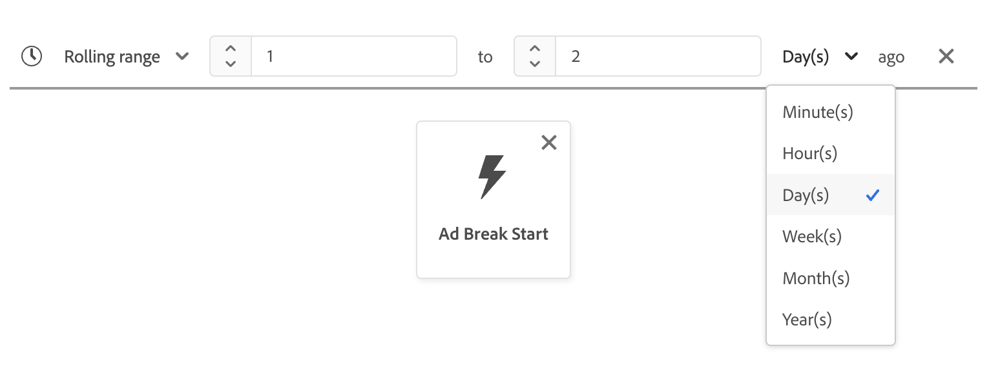

# Guida dell&#39;interfaccia utente di [!DNL Segment Builder]

>[!NOTE]
>
>Questa guida spiega come creare tipi di pubblico tramite **definizioni di segmenti** utilizzando il Generatore di segmenti. Per informazioni su come creare tipi di pubblico utilizzando Composizione pubblico, consulta la [guida dell&#39;interfaccia utente Composizione pubblico](./audience-composition.md).

[!DNL Segment Builder] fornisce un&#39;area di lavoro avanzata che consente di interagire con gli elementi dati [!DNL Profile]. L’area di lavoro fornisce controlli intuitivi per la creazione e la modifica di regole, ad esempio le tessere trascinate utilizzate per rappresentare le proprietà dei dati.

## Blocchi predefiniti di definizione del segmento {#building-blocks}

>[!CONTEXTUALHELP]
>id="platform_segments_createsegment_segmentbuilder_fields"
>title="Campi"
>abstract="I tre tipi di campi che compongono una definizione di segmento sono attributi, eventi e pubblico. Gli attributi consentono di utilizzare gli attributi di profilo che appartengono alla classe XDM Profilo individuale; gli eventi consentono di creare un pubblico basato su azioni o eventi che hanno luogo utilizzando gli elementi di dati XDM ExperienceEvent; i tipi di pubblico consentono di utilizzare tipi di pubblico importati da origini esterne."

Gli elementi di base per le definizioni dei segmenti sono attributi ed eventi. Inoltre, gli attributi e gli eventi contenuti nei tipi di pubblico esistenti possono essere utilizzati come componenti per nuove definizioni.

>[!CONTEXTUALHELP]
>id="platform_segments_createsegment_segmentbuilder_summarydata"
>title="Dati di riepilogo"
>abstract="I dati di riepilogo vengono visualizzati solo per gli attributi del profilo e <b>non</b> per gli attributi evento o pubblico.  I dati di riepilogo per gli attributi del profilo potrebbero non essere visualizzati nelle seguenti circostanze: <ol><li>Alcuni valori dell’attributo contengono più di 100 caratteri.</li><li>L’attributo contiene più di 3000 valori univoci.</li></ol>"

>[!NOTE]
>
>Se si seleziona la bolla di informazioni di un attributo, è possibile visualizzare la distribuzione dei valori del campo, nota anche come dati di riepilogo. Questi sono **solo** disponibili nella scheda Attributi e non sono disponibili per l&#39;utilizzo nella scheda Eventi o Tipi di pubblico.
>
>I dati di riepilogo verranno visualizzati se l&#39;attributo soddisfa i criteri seguenti: Tutti i valori dell&#39;attributo sono composti da un massimo di 100 caratteri e l&#39;attributo contiene un massimo di 3000 valori univoci.
>
>Tuttavia, un attributo **non** avrà dati di riepilogo se si tratta di dati con più entità collegati al profilo tramite una relazione. Ad esempio, se si dispone di uno schema personalizzato denominato `Vehicle`, le **proprietà** nello schema `Vehicle` **non** avranno dati di riepilogo.

Questi blocchi predefiniti sono disponibili nella sezione **[!UICONTROL Fields]** sul lato sinistro dell&#39;area di lavoro [!DNL Segment Builder]. **[!UICONTROL I campi]** contengono una scheda per ciascuno dei blocchi predefiniti principali: &quot;[!UICONTROL Attributi]&quot;, &quot;[!UICONTROL Eventi]&quot; e &quot;[!UICONTROL Tipi di pubblico]&quot;.

### Attributi

La scheda **[!UICONTROL Attributi]** consente di sfogliare gli attributi [!DNL Profile] appartenenti alla classe [!DNL XDM Individual Profile]. Ogni cartella può essere espansa per visualizzare attributi aggiuntivi, dove ogni attributo è una sezione che può essere trascinata nell’area di lavoro del generatore di regole al centro dell’area di lavoro. L&#39;area di lavoro del generatore di regole  viene discussa più avanti in questa guida.

### Eventi

La scheda **[!UICONTROL Eventi]** ti consente di creare un pubblico in base a eventi o azioni che si sono verificati utilizzando elementi dati [!DNL XDM ExperienceEvent]. Nella scheda **[!UICONTROL Eventi]** è inoltre possibile trovare i tipi di evento, ovvero una raccolta di eventi di uso comune che consente di creare più rapidamente le definizioni dei segmenti.

Oltre a poter cercare gli elementi [!DNL ExperienceEvent], è possibile cercare anche i tipi di evento. I tipi di evento utilizzano la stessa logica di codifica di [!DNL ExperienceEvents], senza richiedere di eseguire ricerche nella classe [!DNL XDM ExperienceEvent] alla ricerca dell&#39;evento corretto. Ad esempio, se si utilizza la barra di ricerca per cercare il &quot;carrello&quot;, vengono restituiti i tipi di evento &quot;[!UICONTROL AddCart]&quot; e &quot;[!UICONTROL RemoveCart]&quot;, che sono due azioni del carrello molto comuni durante la creazione delle definizioni dei segmenti.

Qualsiasi tipo di componente può essere cercato digitandone il nome nella barra di ricerca, che utilizza la sintassi di ricerca di [Lucene](https://docs.microsoft.com/en-us/azure/search/query-lucene-syntax). I risultati della ricerca iniziano a essere compilati quando vengono immesse parole intere. Ad esempio, per generare una regola basata sul campo XDM `ExperienceEvent.commerce.productViews`, inizia a digitare &quot;visualizzazioni prodotto&quot; nel campo di ricerca. Una volta digitata la parola &quot;product&quot;, i risultati della ricerca iniziano a comparire. Ogni risultato include la gerarchia di oggetti a cui appartiene.

>[!NOTE]
>
>La visualizzazione dei campi dello schema personalizzati definiti dall’organizzazione può richiedere fino a 24 ore e diventare disponibili per l’utilizzo nella creazione di regole.

Puoi quindi trascinare facilmente [!DNL ExperienceEvents] e &quot;[!UICONTROL Tipi di evento]&quot; nella definizione del segmento.

Per impostazione predefinita, vengono visualizzati solo i campi schema compilati dell’archivio dati. Sono inclusi &quot;[!UICONTROL Tipi di evento]&quot;. Se l&#39;elenco &quot;[!UICONTROL Tipi di evento]&quot; non è visibile o è possibile selezionare solo &quot;[!UICONTROL Qualsiasi]&quot; come &quot;[!UICONTROL Tipo di evento]&quot;, selezionare l&#39;**icona ingranaggio** accanto a **[!UICONTROL Campi]**, quindi selezionare **[!UICONTROL Mostra schema XDM completo]** in **[!UICONTROL Campi disponibili]**. Seleziona di nuovo l&#39;**icona a forma di ingranaggio** per tornare alla scheda **[!UICONTROL Campi]** e dovresti essere in grado di visualizzare più &quot;[!UICONTROL Tipi di evento]&quot; e campi dello schema, indipendentemente dal fatto che contengano o meno dati.

#### Set di dati della suite di rapporti di Adobe Analytics

Puoi utilizzare i dati di una singola o più suite di rapporti di Adobe Analytics come eventi all’interno della segmentazione.

Quando si utilizzano dati da una singola suite di rapporti di Analytics, Platform aggiungerà automaticamente descrittori e nomi descrittivi alle eVar, semplificando la ricerca di tali campi in [!DNL Segment Builder].

Quando si utilizzano dati provenienti da più suite di rapporti di Analytics, Platform **non può** aggiungere automaticamente descrittori o nomi descrittivi alle eVar. Di conseguenza, prima di utilizzare i dati delle suite di rapporti di Analytics, devi eseguirne il mapping ai campi XDM. Ulteriori informazioni sulla mappatura delle variabili di Analytics a XDM sono disponibili nella [guida alla connessione di origine di Adobe Analytics](../../sources/tutorials/ui/create/adobe-applications/analytics.md#mapping).

Ad esempio, considera una situazione in cui disponevi di due suite di rapporti con le seguenti variabili:

| Campo | Schema suite di rapporti A | Schema B suite di rapporti |
| ----- | --------------------- | --------------------- |
| EVAR 1 | Dominio di riferimento | Accesso effettuato S/N |
| EVAR 2 | Nome pagina | ID fedeltà membro |
| EVAR 3 | URL | Nome pagina |
| EVAR 4 | Termini di ricerca | nome del prodotto |
| event1 | Clic | Page Views |
| event2 | Page Views | Aggiunte al carrello |
| event3 | Aggiunte al carrello | Pagamenti |
| event4 | Acquisti | Acquisti |

In questo caso, puoi mappare le due suite di rapporti con il seguente schema:

>[!NOTE]
>
>Anche se i valori eVar generici vengono comunque popolati, è necessario **non** utilizzarli nelle definizioni dei segmenti (se possibile), poiché i valori potrebbero avere un significato diverso rispetto a quello originale nei rapporti.

Una volta mappate le suite di rapporti, puoi utilizzare questi campi appena mappati all’interno dei flussi di lavoro e della segmentazione relativi al profilo.

| Scenario | Esperienza schema di unione | Segmentazione variabile generica | Segmentazione mappata variabile |
| -------- | ----------------------- | ----------------------------- | ---------------------------- |
| Suite di rapporti singola | Il descrittore di nome descrittivo è incluso nelle variabili generiche.   **Esempio:** Nome pagina (eVar2) | <ul><li>Descrittore di nome intuitivo incluso con variabili generiche</li><li>Le query utilizzano i dati del set di dati specifico, in quanto è l’unico</li></ul> | Le query possono utilizzare dati di Adobe Analytics e potenzialmente altre origini. |
| Più suite di rapporti | Con le variabili generiche non sono inclusi descrittori di nomi descrittivi.   **Esempio:** eVar 2 | <ul><li>Qualsiasi campo con più descrittori viene visualizzato come generico. Ciò significa che nell’interfaccia utente non vengono visualizzati nomi descrittivi.</li><li>Le query possono utilizzare dati di qualsiasi set di dati che contiene l’eVar, il che può causare risultati misti o errati.</li></ul> | Le query utilizzano correttamente i risultati combinati da più set di dati. |

### Tipi di pubblico

>[!CONTEXTUALHELP]
>id="platform_segmentation_segmentBuilder_b2b_decomposition"
>title="Valutazione complessa"
>abstract="L’espressione seguente è troppo complicata per essere espressa come un singolo pubblico. Per utilizzare sia le regole B2B che gli eventi basati sulle persone nella stessa definizione di segmento, segui i passaggi riportati di seguito.<ol><li>Crea una definizione di segmento che si riferisca solo agli eventi basati sulle persone e salvala come una definizione di segmento propria.</li><li>In una nuova definizione di segmento, importa la definizione di segmento creata in precedenza facendo riferimento alle regole B2B.</li></ol>"

>[!NOTE]
>
>Per i tipi di pubblico creati all&#39;interno di Platform, verranno visualizzati solo i tipi di pubblico con il criterio di unione **same**.

Nella scheda **[!UICONTROL Tipi di pubblico]** sono elencati tutti i tipi di pubblico importati da origini esterne, ad esempio Adobe Audience Manager o Customer Journey Analytics, nonché quelli creati in [!DNL Experience Platform].

Nella scheda **[!UICONTROL Tipi di pubblico]**, puoi visualizzare tutte le origini disponibili come un gruppo di cartelle. Quando selezioni le cartelle, puoi visualizzare le sottocartelle e i tipi di pubblico disponibili. Inoltre, è possibile selezionare l&#39;icona della cartella (come mostrato nell&#39;immagine a destra) per visualizzare la struttura della cartella (un segno di spunta indica la cartella in cui ci si trova attualmente) e tornare facilmente alle cartelle selezionando il nome di una cartella nella struttura.

Puoi passare il cursore del mouse sull’ⓘ accanto a un pubblico per visualizzare informazioni su di esso, tra cui l’ID, la descrizione e la gerarchia delle cartelle per individuare il pubblico.

## Area di lavoro del generatore di regole {#rule-builder-canvas}

>[!IMPORTANT]
>
>A partire dalla versione di giugno 2024, i vincoli di tempo &quot;Questo mese&quot; e &quot;Quest’anno&quot; rappresentano rispettivamente &quot;mese corrente&quot; e &quot;anno corrente&quot;. Ad esempio, se hai creato un pubblico il 18 luglio cercando &quot;tutti i clienti il cui compleanno cade in questo mese&quot;, il pubblico riceverà tutti i clienti il cui compleanno cade dal 1° luglio al 31 luglio. Il 1° agosto, questo pubblico riceverebbe tutti i clienti che compiono gli anni dal 1° al 31 agosto.
>
>In precedenza, &quot;This month&quot; (Questo mese) e &quot;this year&quot; (Quest’anno) rappresentavano rispettivamente 30 giorni e 365 giorni, che non sono stati contabilizzati per mesi con 31 giorni e anni bisestili.
>
>Per aggiornare la logica dei tipi di pubblico, salva di nuovo quelli creati in precedenza.

Una definizione di segmento è una raccolta di regole utilizzate per descrivere le caratteristiche o il comportamento chiave di un pubblico target. Queste regole vengono create utilizzando l&#39;area di lavoro del generatore di regole, situata al centro di [!DNL Segment Builder].

Per aggiungere una nuova regola alla definizione del segmento, trascina un riquadro dalla scheda **[!UICONTROL Campi]** e rilascialo nell&#39;area di lavoro del generatore di regole. Verranno quindi visualizzate opzioni specifiche per il contesto in base al tipo di dati aggiunti. I tipi di dati disponibili includono: stringhe, date, [!DNL ExperienceEvents], &quot;[!UICONTROL Tipi di evento]&quot; e tipi di pubblico.

>[!IMPORTANT]
>
>Le ultime modifiche apportate a Adobe Experience Platform hanno aggiornato l&#39;utilizzo degli operatori logici `OR` e `AND` tra gli eventi. Questi aggiornamenti non influiranno sulle definizioni dei segmenti esistenti. Tuttavia, queste modifiche interesseranno tutti gli aggiornamenti successivi alle definizioni di segmenti esistenti e alle nuove definizioni di segmenti create. Per ulteriori informazioni, leggere l&#39;[aggiornamento costanti di tempo](./segment-refactoring.md).

Quando selezioni un valore per l’attributo, visualizzerai un elenco di valori enum possibili per l’attributo.

Se si seleziona un valore da questo elenco di enumerazioni, il valore viene evidenziato con un bordo solido. Tuttavia, per i campi che utilizzano le enumerazioni `meta:enum` (soft), è anche possibile selezionare un valore **not** dall&#39;elenco delle enumerazioni. Se si crea un valore personalizzato, questo verrà evidenziato con un bordo punteggiato e un&#39;avvertenza che indica che il valore non è incluso nell&#39;elenco enumerazione.

Se crei più valori, puoi aggiungerli tutti contemporaneamente utilizzando il caricamento in blocco. Seleziona l&#39;icona  per visualizzare il popover **[!UICONTROL Aggiungi valori in blocco]**.

Nel popover **[!UICONTROL Aggiungi valori in blocco]**, puoi caricare un file CSV o TSV.

In alternativa, puoi aggiungere manualmente valori separati da virgole.

È consentito un massimo di 250 valori. Se superi questo limite, rimuovi alcuni valori prima di aggiungerne altri.

### Aggiunta di tipi di pubblico

>[!CONTEXTUALHELP]
>id="platform_segmentation_segmentbuilder_addaudiences"
>title="Cercare aggiornamenti"
>abstract="Il sistema di ricerca esistente è stato aggiornato per utilizzare la ricerca unificata. La ricerca unificata consente di cercare in modo più semplice e deciso i tipi di pubblico per l’appartenenza a un segmento."

Puoi trascinare un pubblico dalla scheda **[!UICONTROL Pubblico]** nell&#39;area di lavoro del generatore di regole per fare riferimento all&#39;appartenenza al pubblico nella nuova definizione del segmento. Ciò ti consente di includere o escludere l’iscrizione al pubblico come attributo nelle nuove regole di definizione del segmento.

Per i tipi di pubblico [!DNL Platform] creati con [!DNL Segment Builder], è possibile convertire il pubblico nel set di regole utilizzato nella definizione del segmento per tale pubblico. Questa conversione crea una copia della logica della regola, che può quindi essere modificata senza influire sulla definizione del segmento originale. Assicurati di aver salvato le modifiche recenti alla definizione del segmento prima di convertirla nella logica della regola.

>[!NOTE]
>
>Quando si aggiunge un pubblico da un’origine esterna, viene fatto riferimento solo all’iscrizione al pubblico. Non è possibile convertire il pubblico in regole e pertanto le regole utilizzate per creare il pubblico originale non possono essere modificate nella nuova definizione del segmento.

Se si verificano conflitti durante la conversione dei tipi di pubblico in regole, [!DNL Segment Builder] tenterà di mantenere le opzioni esistenti al meglio delle proprie possibilità.

### Vista Codice

In alternativa, è possibile visualizzare una versione basata su codice di una regola creata in [!DNL Segment Builder]. Dopo aver creato la regola nell&#39;area di lavoro del generatore di regole, puoi selezionare **[!UICONTROL Vista Codice]** per visualizzare la definizione del segmento come PQL.

La vista Codice fornisce un pulsante che consente di copiare il valore della definizione del segmento da utilizzare nelle chiamate API. Per ottenere la versione più recente della definizione del segmento, assicurati di aver salvato le modifiche più recenti alla definizione del segmento.

### Funzioni di aggregazione

Un&#39;aggregazione in [!DNL Segment Builder] è un calcolo su un gruppo di attributi XDM il cui tipo di dati è un numero (doppio o intero). Le quattro funzioni di aggregazione supportate nel Generatore di segmenti sono SUM, AVERAGE, MIN e MAX.

Per creare una funzione di aggregazione, selezionare un evento dalla barra a sinistra e inserirlo nel contenitore [!UICONTROL Eventi].

Dopo aver inserito l&#39;evento all&#39;interno del contenitore Eventi, seleziona l&#39;icona con i puntini di sospensione (...), seguita da **[!UICONTROL Aggregate]**.

L’aggregazione viene ora aggiunta. È ora possibile selezionare la funzione di aggregazione, scegliere l&#39;attributo da aggregare, la funzione di uguaglianza e il valore. Per l’esempio seguente, questa definizione del segmento qualificherebbe qualsiasi profilo con una somma di valori acquistati superiore a $ 100, anche se ogni singolo acquisto è inferiore a $ 100.

### Funzioni di conteggio {#count-functions}

Le funzioni di conteggio nel Generatore di segmenti vengono utilizzate per cercare eventi specifici e contare quante volte vengono eseguite. Le funzioni di conteggio supportate nel Generatore di segmenti sono &quot;Almeno&quot;, &quot;Al massimo&quot;, &quot;Esattamente&quot;, &quot;Tra&quot; e &quot;Tutto&quot;.

Per creare una funzione di conteggio, seleziona un evento dalla barra a sinistra e inseriscilo nel contenitore [!UICONTROL Eventi].

Dopo aver inserito l&#39;evento nel contenitore Eventi, selezionare il pulsante [!UICONTROL Almeno 1].

Viene aggiunta la funzione conteggio. È ora possibile selezionare la funzione count e il valore della funzione. L’esempio seguente consiste nell’includere qualsiasi evento con almeno un clic.

### Vincoli temporali {#time-constraints}

I vincoli di tempo consentono di applicare restrizioni temporali agli attributi basati sul tempo, agli eventi e alla sequenza tra gli eventi.

>[!IMPORTANT]
>
>Se hai creato una definizione del segmento con i vincoli di tempo &quot;Questo mese&quot; o &quot;Quest’anno&quot; prima di giugno 2024, dovrai salvare nuovamente le definizioni del segmento. Prima di giugno 2024, &quot;This month&quot; era basato su 30 giorni e &quot;This year&quot; era basato su 365 giorni.

L&#39;elenco dei vincoli di tempo disponibili è il seguente:

+++ Limiti di tempo disponibili

>[!NOTE]
>
>Tutti i vincoli di tempo sono basati su UTC.
>
>Inoltre, se la casella di controllo [!UICONTROL Ignora anno] è abilitata, l&#39;anno **non** verrà confrontato come parte della valutazione della definizione del segmento.

| Attività Time constraint | Descrizione | Abilita ignora anno | Esempio |
| --------------- | ----------- | ------------------- | ------- |
| Oggi | L&#39;attributo o l&#39;evento confrontato **deve** si verifica oggi. | Sì | {width="100" zoomable="yes"} |
| Ieri | L&#39;attributo o l&#39;evento confrontato **must** si verifica ieri. | Sì | {width="100" zoomable="yes"} |
| Questo mese | L&#39;attributo o l&#39;evento confrontato **must** si verifica questo mese di calendario. | Sì | {width="100" zoomable="yes"} |
| Quest’anno | L&#39;attributo o l&#39;evento da confrontare **must** si verifica in questo anno di calendario. | No | {width="100" zoomable="yes"} |
| Data personalizzata | L&#39;attributo o l&#39;evento confrontato **deve** verificarsi alla data specificata. | Sì | {width="100" zoomable="yes"} |
| Nell’ultimo/a | L&#39;attributo o l&#39;evento confrontato **deve** verificarsi nell&#39;ultimo periodo di tempo scelto. Questo periodo di tempo è **inclusivo** fino al momento della valutazione. | No | {width="100" zoomable="yes"} |
| Da (a) | L&#39;attributo o l&#39;evento confrontato **deve** verificarsi entro le due date di calendario scelte. Questo periodo di tempo è **inclusivo** di entrambe le date. | Sì, se la data personalizzata | {width="100" zoomable="yes"} |
| Durante | L&#39;attributo o l&#39;evento confrontato **deve** verificarsi entro il mese o l&#39;anno selezionato. Se è selezionato un mese, è necessario scegliere sia il mese che l&#39;anno in cui si è verificato l&#39;attributo o l&#39;evento.  Se è selezionato un anno, è sufficiente scegliere l&#39;anno in cui si è verificato l&#39;attributo o l&#39;evento. Se selezioni un mese, puoi anche abilitare la casella di controllo [!UICONTROL Ignora anno]. | Sì | {width="100" zoomable="yes"} |
| Entro (+/-) | L&#39;attributo o l&#39;evento confrontato **deve** verificarsi entro giorni, settimane, mesi o anni dalla data selezionata. Questo periodo di tempo è **inclusivo** di entrambe le date. La data selezionata può essere oggi, ieri o un’altra data personalizzata a tua scelta. | Sì | {width="100" zoomable="yes"} |
| Prima di | L&#39;attributo o l&#39;evento confrontato **deve** verificarsi prima della data selezionata. La data selezionata può essere una data personalizzata a tua scelta o una selezione tra giorni, settimane, mesi o anni fa. | Sì | {width="100" zoomable="yes"} |
| Dopo | L&#39;attributo o l&#39;evento confrontato **deve** verificarsi dopo la data selezionata. La data selezionata può essere una data personalizzata a tua scelta o una selezione tra giorni, settimane, mesi o anni fa. | Sì | {width="100" zoomable="yes"} |
| Intervallo continuo | L’attributo o l’evento confrontato deve verificarsi tra le due date relative. Le date possono essere rappresentate in secondi, minuti, ore, giorni, settimane, mesi o anni. | No | {width="100" zoomable="yes"} |
| In avanti | L’attributo o l’evento confrontato deve verificarsi nel periodo di tempo successivo selezionato. I periodi di tempo selezionati includono minuti, ore, giorni, settimane, mesi e anni. | No | {width="100" zoomable="yes"} |
| Esiste | L’attributo esiste già. | No | {width="100" zoomable="yes"} |
| Non esiste | L&#39;attributo non esiste. | No | {width="100" zoomable="yes"} |

+++

Quando applichi un vincolo di tempo a un evento, puoi applicarlo a livello di area di lavoro, a livello di scheda o tra eventi.

#### Vincolo a livello di area di lavoro

Per applicare un vincolo di tempo a livello di area di lavoro, selezionare l&#39;icona dell&#39;orologio visualizzata sopra la sequenza temporale degli eventi.

Quando applichi un vincolo di tempo a livello di area di lavoro, questo si applica a **tutti** gli eventi nel pubblico.

#### Vincolo a livello di scheda

Per applicare un vincolo a livello di scheda, seleziona la scheda su cui desideri applicare il vincolo di tempo, seguito dall&#39;icona con i puntini di sospensione e **[!UICONTROL Applica regola temporale]**. Questo consente di selezionare un vincolo di tempo all&#39;interno del contenitore **[!UICONTROL Regole evento]**.

Quando applichi un vincolo di tempo a livello di scheda, questo applica il vincolo di tempo all&#39;evento **specified** nel pubblico.

#### Vincolo tra eventi

Per applicare un vincolo di tempo tra gli eventi, selezionare l&#39;icona dell&#39;orologio tra i due eventi su cui si desidera applicare il vincolo di tempo.

Quando applichi un vincolo di tempo tra gli eventi, questo applica il vincolo di tempo al tempo **tra** gli eventi.

L&#39;elenco dei vincoli di tempo disponibili per questa operazione differisce dall&#39;elenco principale dei vincoli di tempo e sono i seguenti:

+++ Limiti di tempo disponibili

| Attività Time constraint | Descrizione |
| --------------- | ----------- |
| Dopo | L&#39;ultimo evento **deve avere luogo almeno** dopo l&#39;evento precedente. |
| Entro | I due eventi **must** si verificano durante il periodo di tempo indicato nel vincolo di tempo. |

>[!NOTE]
>
>Quando si utilizza il vincolo di tempo &quot;After&quot; (Dopo), quest’ultimo evento può verificarsi più del tempo elencato all’interno del vincolo di tempo. >
>Ad esempio, se disponi di un evento Visualizzazione pagina e di un evento Pagamento e tra questi due eventi si inserisce il vincolo di tempo &quot;Dopo 1 ora&quot;, si qualificherà una definizione del segmento con un evento Pagamento 2 ore dopo l’evento Visualizzazione pagina.
>
>Inoltre, questi due vincoli temporali possono essere utilizzati in coordinamento tra loro.
>
>Ad esempio, se disponi di un evento Visualizzazione pagina e di un evento Pagamento e imposti entrambi i vincoli di tempo &quot;Dopo 1 ora&quot; ed &quot;Entro 24 ore&quot;, una definizione di segmento con un evento Pagamento 12 ore dopo l’evento Visualizzazione pagina sarà idonea, ma una definizione di segmento con un evento Pagamento 36 ore dopo l’evento Visualizzazione pagina non sarà idonea.

+++

## Contenitori

Le regole dei segmenti vengono valutate nell’ordine in cui sono elencate. I contenitori consentono di controllare l’ordine di esecuzione tramite l’utilizzo di query nidificate.

Dopo aver aggiunto almeno una sezione all’area di lavoro del generatore di regole, puoi iniziare ad aggiungere contenitori. Per creare un nuovo contenitore, seleziona i puntini di sospensione (...) nell&#39;angolo superiore destro del riquadro, quindi seleziona **[!UICONTROL Aggiungi contenitore]**.

Un nuovo contenitore viene visualizzato come figlio del primo contenitore, ma è possibile regolare la gerarchia trascinando e spostando i contenitori. Il comportamento predefinito di un contenitore è &quot;[!UICONTROL Includere]&quot; l&#39;attributo, l&#39;evento o il pubblico fornito. Puoi impostare la regola su &quot;[!UICONTROL Escludi]&quot; profili che corrispondono ai criteri del contenitore selezionando **[!UICONTROL Includi]** nell&#39;angolo superiore sinistro del riquadro e selezionando &quot;[!UICONTROL Escludi]&quot;.

È inoltre possibile estrarre un contenitore figlio e aggiungerlo in linea al contenitore padre selezionando &quot;unwrap container&quot; (Annulla wrapping contenitore) sul contenitore figlio. Seleziona i puntini di sospensione (...) nell’angolo in alto a destra del contenitore secondario per accedere a questa opzione.

Dopo aver selezionato **[!UICONTROL Annulla wrapping contenitore]**, il contenitore figlio viene rimosso e i criteri vengono visualizzati in linea.

>[!NOTE]
>
>Quando rimuovi il wrapping dei contenitori, fai attenzione a che la logica continui a soddisfare la definizione del segmento desiderata.

## Criteri di unione

>[!CONTEXTUALHELP]
>id="platform_segmentation_createSegment_segmentBuilder_mergePolicies"
>title="Criteri di unione"
>abstract="Un criterio di unione consente l’unione di set di dati diversi per formare il profilo. Platform ha fornito un criterio di unione predefinito, in alternativa puoi crearne uno nuovo in Profili. Scegli un criterio di unione che corrisponda allo scopo di marketing per questo pubblico."

[!DNL Experience Platform] consente di unire dati provenienti da più origini e combinarli per ottenere una visualizzazione completa di ogni singolo cliente. Quando si riuniscono questi dati, i criteri di unione sono le regole utilizzate da [!DNL Platform] per determinare la priorità dei dati e i dati che verranno combinati per creare un profilo.

È possibile selezionare un criterio di unione corrispondente allo scopo di marketing per questo pubblico o utilizzare il criterio di unione predefinito fornito da [!DNL Platform]. È possibile creare più criteri di unione specifici per l’organizzazione, inclusa la creazione di un criterio di unione predefinito. Per istruzioni dettagliate sulla creazione di criteri di unione per l&#39;organizzazione, leggere la [panoramica dei criteri di unione](../../profile/merge-policies/overview.md).

Per selezionare un criterio di unione per la definizione del segmento, seleziona l&#39;icona a forma di ingranaggio nella scheda **[!UICONTROL Campi]**, quindi utilizza il menu a discesa **[!UICONTROL Criterio di unione]** per selezionare il criterio di unione da utilizzare.

## Proprietà della definizione di segmento {#segment-properties}

>[!CONTEXTUALHELP]
>id="platform_segments_createsegment_segmentbuilder_segmentproperties"
>title="Proprietà della definizione di segmento"
>abstract="Nella sezione Proprietà della definizione di segmento viene visualizzata una stima della dimensione del segmento risultante, con il numero di profili qualificati rispetto al numero totale di profili. Questo consente di regolare la definizione del segmento in base alle tue esigenze prima di creare il pubblico stesso."

>[!CONTEXTUALHELP]
>id="platform_segments_createsegment_segmentbuilder_refreshestimate"
>title="Aggiornare le stime"
>abstract="Puoi aggiornare le stime della definizione di segmento per visualizzare subito un’anteprima del numero di profili idonei per la definizione di segmento proposta. Le stime del pubblico sono generate utilizzando una dimensione del campione dei dati di esempio del giorno in questione."
>additional-url="https://experienceleague.adobe.com/docs/experience-platform/segmentation/tutorials/create-a-segment.html?lang=it#estimate-and-preview-an-audience" text="Stimare e visualizzare in anteprima un pubblico"

Durante la creazione di una definizione del segmento, la sezione **[!UICONTROL Proprietà pubblico]** sul lato destro dell&#39;area di lavoro visualizza una stima delle dimensioni della definizione del segmento risultante, che consente di regolare la definizione del segmento secondo necessità prima di creare il pubblico stesso.

**[!UICONTROL Profili qualificati]** indica il numero **effettivo** di profili che corrispondono alle regole della definizione del segmento. Questo numero viene aggiornato ogni 24 ore, dopo l’esecuzione del processo di valutazione del segmento.

Il timestamp per i profili qualificati indica il processo di valutazione del segmento **batch** più recente ed è **non** visualizzato per le definizioni dei segmenti valutate utilizzando lo streaming o la segmentazione Edge. Se modifichi la definizione del segmento, il numero di profili idonei rimarrà invariato fino all’esecuzione del processo di valutazione del segmento successivo.

**[!UICONTROL Profili stimati]** indica un numero **approssimativo** di profili in base al **processo di esempio**. Puoi visualizzare una versione aggiornata di questo valore dopo aver aggiunto le nuove regole o condizioni e aver selezionato **[!UICONTROL Aggiorna stima]**. Selezionando la bolla di informazioni si ottiene la soglia di errore e il tempo del processo di campionamento più recente.

Nella sezione **[!UICONTROL Proprietà pubblico]** è inoltre possibile specificare informazioni importanti sulla definizione del segmento, tra cui nome, descrizione e tipo di valutazione. I nomi delle definizioni dei segmenti vengono utilizzati per identificare la definizione del segmento tra quelle definite dall’organizzazione e devono quindi essere descrittivi, concisi e univoci.

Mentre continui a creare la definizione del segmento, puoi visualizzare un&#39;anteprima impaginata del pubblico selezionando **[!UICONTROL Visualizza profili]**.

>[!NOTE]
>
>Le stime del pubblico vengono generate utilizzando una dimensione campione dei dati di campionamento di quel giorno. Se nell’archivio Profili sono presenti meno di 1 milione di entità, viene utilizzato l’intero set di dati; per un numero di entità compreso tra 1 e 20 milioni, vengono utilizzate 1 milione di entità; e per più di 20 milioni di entità, viene utilizzato il 5% del totale delle entità.
>
>Inoltre, questa stima si basa su quando è stato eseguito l’ultimo processo di esempio del profilo. Ciò significa che se utilizzi una funzione data relativa, ad esempio &quot;Oggi&quot; o &quot;Questa settimana&quot;, la stima baserà i suoi calcoli sull’ultimo tempo di esecuzione del processo di esempio del profilo. Ad esempio, se oggi è il 24 gennaio e l’ultimo processo di esempio del profilo è stato eseguito il 22 gennaio, la funzione di data relativa &quot;Ieri&quot; si baserà sul 21 gennaio e non sul 23 gennaio.
>
>Ulteriori informazioni sulla generazione di stime per le definizioni dei segmenti sono disponibili nella [sezione sulla generazione di stime](../tutorials/create-a-segment.md#estimate-and-preview-an-audience) dell&#39;esercitazione sulla creazione delle definizioni dei segmenti.

Puoi anche selezionare il metodo di valutazione. Se si conosce il metodo di valutazione da utilizzare, è possibile selezionare il metodo di valutazione desiderato utilizzando l&#39;elenco a discesa. Se si desidera conoscere i tipi di valutazione per i quali questa definizione di segmento è idonea, è possibile selezionare l&#39;icona Sfoglia  per visualizzare un elenco dei metodi di valutazione della definizione di segmento disponibili.

Viene visualizzato il popover [!UICONTROL Idoneità al metodo di valutazione]. In questo popover vengono visualizzati i metodi di valutazione disponibili, ovvero batch, streaming e edge. Il popover mostra quali metodi di valutazione sono idonei e non idonei. A seconda dei parametri utilizzati nella definizione del segmento, questo potrebbe non essere idoneo per alcuni metodi di valutazione. Per ulteriori informazioni sui requisiti per ciascun metodo di valutazione, leggi le [panoramiche di segmentazione in streaming](./streaming-segmentation.md#query-types) o [segmentazione Edge](./edge-segmentation.md#query-types).

Puoi anche modificare il metodo di valutazione della definizione del segmento al termine della creazione. Se modifichi il metodo di valutazione da Edge o Streaming a Batch, **non** potrà ripristinarlo in Edge o Streaming. La modifica al metodo di valutazione avrà effetto **solo** dopo aver selezionato **[!UICONTROL Salva]** nel popover. L&#39;annullamento della finestra di dialogo **manterrà** il metodo di valutazione originale.

Se selezioni un metodo di valutazione non valido, ti verrà richiesto di modificare le regole di definizione del segmento o il metodo di valutazione.

Ulteriori informazioni sui diversi metodi di valutazione delle definizioni dei segmenti sono disponibili nella [panoramica sulla segmentazione](../home.md#evaluate-segments).

## Passaggi successivi {#next-steps}

Segment Builder offre un flusso di lavoro avanzato che consente di isolare i tipi di pubblico commerciabili dai dati di [!DNL Real-Time Customer Profile]. Dopo aver letto questa guida, ora dovresti essere in grado di:

- Crea definizioni di segmenti utilizzando una combinazione di attributi, eventi e tipi di pubblico esistenti come blocchi predefiniti.
- Utilizza l’area di lavoro e i contenitori del generatore di regole per controllare l’ordine in cui vengono eseguite le regole dei segmenti.
- Visualizza le stime del tuo pubblico potenziale, consentendoti di regolare le definizioni dei segmenti in base alle esigenze.
- Abilita tutte le definizioni dei segmenti per la segmentazione pianificata.
- Abilita le definizioni di segmenti specificate per la segmentazione in streaming.

Per ulteriori informazioni su [!DNL Segmentation Service], continuare a leggere la documentazione e completare le attività di apprendimento guardando i video correlati. Per ulteriori informazioni sulle altre parti dell&#39;interfaccia utente di [!DNL Segmentation Service], leggere la [[!DNL Segmentation Service] guida utente](./overview.md)
