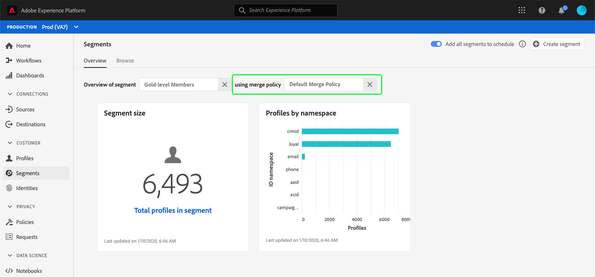

# (Alfa) Pannello segmento {#segment-dashboard}

>[!IMPORTANT]
>
>La funzionalità del dashboard descritta in questo documento è attualmente in alfa e non è disponibile per tutti gli utenti. La documentazione e le funzionalità sono soggette a modifiche.

L’interfaccia utente di Adobe Experience Platform (interfaccia utente) fornisce un dashboard attraverso il quale è possibile visualizzare informazioni importanti sui segmenti, come acquisito durante un’istantanea giornaliera. Questa guida descrive come accedere e utilizzare il dashboard dei segmenti nell’interfaccia utente e fornisce ulteriori informazioni sulle visualizzazioni visualizzate nel dashboard.

Per una panoramica di tutte le funzioni del servizio di segmentazione Adobe Experience Platform nell&#39;interfaccia utente della piattaforma, visitare la [Guida dell&#39;interfaccia utente del servizio di segmentazione](overview.md).

## Segmentazione dei dati del dashboard

Il dashboard del segmento visualizza un&#39;istantanea dei dati attributo (record) di cui dispone l&#39;organizzazione all&#39;interno dell&#39;archivio dei profili in  Experience Platform. Lo snapshot non include dati di eventi (serie temporali).

I dati attributo nello snapshot mostrano esattamente come appaiono nel momento in cui è stata scattata l&#39;istantanea. In altre parole, l&#39;istantanea non è un&#39;approssimazione o un esempio dei dati e il dashboard del segmento non viene aggiornato in tempo reale.

>[!NOTE]
>
>Eventuali modifiche o aggiornamenti apportati ai dati dopo l&#39;acquisizione dell&#39;istantanea non verranno visualizzati nel dashboard fino all&#39;acquisizione dell&#39;istantanea successiva.

## Esplorazione del dashboard dei segmenti

Per passare al dashboard dei segmenti nell&#39;interfaccia utente della piattaforma, seleziona **[!UICONTROL Segments]** nella barra a sinistra, quindi seleziona la scheda **[!UICONTROL Overview]** per visualizzare il dashboard.

### Selezionare un segmento

Per selezionare un segmento da visualizzare nel dashboard, scegliere il selettore della finestra di dialogo per la casella di testo **[!UICONTROL Select segment]**.

>[!NOTE]
>
>Se un segmento è già selezionato, utilizzate il simbolo `X` per rimuovere prima il segmento, quindi viene visualizzato il selettore della finestra di dialogo.
>
>

Viene visualizzata la finestra di dialogo **[!UICONTROL Select segment]**, che consente di scegliere il segmento da visualizzare. Dopo aver scelto il segmento desiderato, utilizzate **[!UICONTROL Select]** per tornare al dashboard.

### Unisci criterio

Dopo aver selezionato un segmento, la casella di testo del criterio di unione si popolerà automaticamente con il criterio di unione relativo a tale segmento.

Per ulteriori informazioni sulla creazione di segmenti in  Experience Platform, visitare la [Guida all&#39;interfaccia utente di Generatore di segmenti](segment-builder.md). Per ulteriori informazioni sui criteri di unione, consultare la [Panoramica sul profilo cliente in tempo reale](../../profile/home.md).

### Widget e metriche

Il dashboard dei segmenti è composto da widget, che sono metriche di sola lettura e forniscono informazioni importanti sul segmento selezionato. La data e l’ora dell’&quot;ultimo aggiornamento&quot; del widget mostrano quando è stata scattata l’ultima istantanea dei dati.

## widget disponibili

 Experience Platform fornisce più widget che potete utilizzare per visualizzare diverse metriche correlate al segmento. Seleziona il nome di un widget qui sotto per saperne di più:

* [[!UICONTROL Segment size]](#segment-size)
* [[!UICONTROL Profiles by namespace]](#profiles-by-namespace)

### [!UICONTROL Segment size] {#segment-size}

Il widget **[!UICONTROL Segment size]** visualizza il numero totale di profili uniti all&#39;interno del segmento selezionato al momento dell&#39;acquisizione dello snapshot. Questo numero è il risultato dell&#39;applicazione del criterio di unione dei segmenti ai dati del profilo per unire insieme i frammenti del profilo e creare un unico profilo per ogni individuo del segmento.

Per ulteriori informazioni sui frammenti e i profili uniti, consultare la [Panoramica sul profilo cliente in tempo reale](../home.md).

### [!UICONTROL Profiles by namespace] {#profiles-by-namespace}

Il widget **[!UICONTROL Profiles by namespace]** visualizza la suddivisione degli spazi dei nomi in tutti i profili uniti nel segmento selezionato. Il numero totale di profili per [!UICONTROL ID namespace] (in altre parole, aggiungendo insieme i valori mostrati per ogni spazio dei nomi) in genere sarà superiore al numero totale di profili nel segmento, perché a un profilo potrebbero essere associati più spazi dei nomi. Ad esempio, se un cliente interagisce con il tuo marchio su più di un canale, è possibile associare più spazi dei nomi a quel singolo cliente.

Per ulteriori informazioni sugli spazi dei nomi di identità, consultare la [documentazione del servizio Adobe Experience Platform Identity](../../identity-service/home.md).

## Dashboard aggiuntivi

L&#39;interfaccia utente della piattaforma offre dashboard aggiuntivi per visualizzare istantanee dei dati all&#39;interno  Experience Platform. Questi dashboard includono Profilo cliente in tempo reale e [!UICONTROL License usage]. Per ulteriori informazioni su queste dashboard aggiuntive, seleziona i seguenti collegamenti:

* [[!DNL Profile] dashboard](../../profile/ui/profile-dashboard.md)
* [[!UICONTROL License usage] dashboard](../../landing/license-usage-dashboard.md)

## Passaggi successivi

Seguendo questo documento, ora dovresti essere in grado di individuare il dashboard dei segmenti e selezionare un segmento da visualizzare. È inoltre necessario comprendere le metriche visualizzate nei widget disponibili. Per ulteriori informazioni sull&#39;utilizzo dei segmenti nell&#39;interfaccia utente del Experience Platform , fare riferimento alla [Guida all&#39;interfaccia utente del servizio di segmentazione](overview.md).