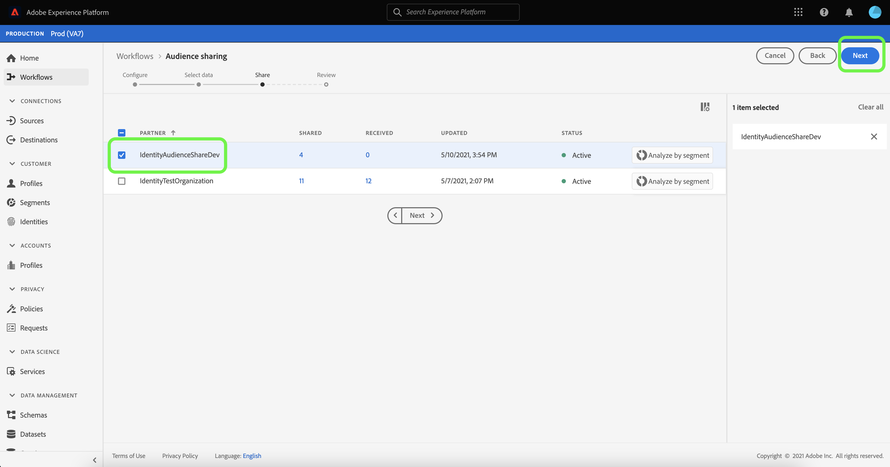

# (Beta) Panoramica di [!DNL Segment Match]

>[!IMPORTANT]
>
>[!DNL Segment Match] è attualmente in versione beta. La documentazione e le funzionalità sono soggette a modifiche.

Adobe Experience Platform Segment Match è un servizio di condivisione dei segmenti che consente a due o più utenti di Platform di scambiare dati sui segmenti in modo sicuro, gestito e rispettoso della privacy. [!DNL Segment Match] utilizza gli standard sulla privacy di Platform e gli identificatori personali come e-mail con hash, numeri di telefono con hash e identificatori dei dispositivi come IDFA e GAID.

Con [!DNL Segment Match] puoi:

* Gestisci il processo di sovrapposizione delle identità.
* Visualizzare le stime preliminari alla condivisione.
* Applica le etichette di utilizzo dei dati per controllare se i dati possono essere condivisi con i partner.
* Gestisci la gestione del ciclo di vita del pubblico condiviso dopo la pubblicazione di un feed e continua uno scambio dinamico di dati attraverso le capacità di aggiungere, eliminare e annullare la condivisione.

[!DNL Segment Match] utilizza un processo di sovrapposizione delle identità per garantire che la condivisione dei segmenti venga eseguita in modo sicuro e incentrato sulla privacy. Un **identità sovrapposta** è un&#39;identità che ha una corrispondenza sia nel segmento che nel segmento del partner selezionato. Prima di condividere un segmento tra un mittente e un destinatario, il processo di sovrapposizione delle identità verifica la presenza di una sovrapposizione nei namespace e nei controlli del consenso tra il mittente e il/i destinatario/i. Affinché un segmento possa essere condiviso, è necessario che entrambi i controlli di sovrapposizione passino.

Le sezioni seguenti forniscono ulteriori informazioni su [!DNL Segment Match], inclusi dettagli sulla configurazione e sul relativo flusso di lavoro end-to-end.

## Configurazione

Le sezioni seguenti descrivono come impostare e configurare [!DNL Segment Match]:

### Configurare i dati di identità e i namespace {#namespaces}

Il primo passaggio da fare per iniziare a utilizzare [!DNL Segment Match] consiste nell’assicurarsi di acquisire dati dagli spazi dei nomi di identità supportati.

Gli spazi dei nomi di identità sono un componente di [Servizio Adobe Experience Platform Identity](../../identity-service/home.md). Ogni identità cliente contiene uno spazio dei nomi associato che indica il contesto dell&#39;identità. Ad esempio, uno spazio dei nomi può distinguere un valore di &quot;name@email.com&quot; come indirizzo e-mail o &quot;443522&quot; come ID CRM numerico.

Un&#39;identità completa include un valore ID e uno spazio dei nomi. Quando i dati dei record corrispondono a diversi frammenti di profilo (ad esempio quando [!DNL Real-time Customer Profile] unisce i dati di profilo), il valore dell’identità e lo spazio dei nomi devono corrispondere.

Nel contesto di [!DNL Segment Match], i namespace vengono utilizzati nel processo di sovrapposizione durante la condivisione dei dati.

L’elenco dei namespace supportati è il seguente:

| Namespace | Descrizione |
| --------- | ----------- |
| E-mail (SHA256, minuscolo) | Spazio dei nomi per l’indirizzo e-mail con hash predefinito. I valori forniti in questo namespace vengono convertiti in minuscole prima di eseguire l’hashing con SHA-256. È necessario tagliare gli spazi iniziali e finali prima di normalizzare l’indirizzo e-mail. Questa impostazione non può essere modificata retroattivamente. Per ulteriori informazioni, consulta il seguente documento sul [supporto di hashing SHA-256](https://experienceleague.adobe.com/docs/id-service/using/reference/hashing-support.html?lang=en#hashing-support) . |
| Telefono (SHA-256_E.164) | Uno spazio dei nomi che rappresenta i numeri di telefono non elaborati che devono essere contraddistinti da hash utilizzando sia il formato SHA256 che E.164. |
| ECID | Spazio dei nomi che rappresenta un valore Experience Cloud ID (ECID). Questo namespace può essere indicato anche dai seguenti alias: &quot;Adobe Marketing Cloud ID&quot;, &quot;Adobe Experience Cloud ID&quot;, &quot;Adobe Experience Platform ID&quot;. Per ulteriori informazioni, consulta la [panoramica ECID](../../identity-service/ecid.md) . |
| Apple IDFA (ID per inserzionisti) | Spazio dei nomi che rappresenta Apple ID per gli inserzionisti. Per ulteriori informazioni, consulta il seguente documento su [annunci basati su interessi](https://support.apple.com/en-us/HT202074) . |
| Google Ad ID | Uno spazio dei nomi che rappresenta un Google Advertising ID. Per ulteriori informazioni, consulta il seguente documento su [Google Advertising ID](https://support.google.com/googleplay/android-developer/answer/6048248?hl=en) . |

### Configurare la configurazione del consenso

Devi fornire una configurazione del consenso e impostarne il valore predefinito su `opt-in` o `opt-out` per un controllo del consenso.

Il controllo del consenso opt-in e opt-out determina se è possibile operare con il consenso per condividere i dati utente per impostazione predefinita. Se l’impostazione predefinita per la configurazione del consenso è `opt-in`, i dati utente possono essere condivisi, a meno che un utente non lo rifiuti esplicitamente. Se il valore predefinito è impostato su `opt-out`, i dati utente non possono essere condivisi, a meno che un utente non effettui esplicitamente il consenso.

La configurazione di consenso predefinita per [!DNL Segment Match] è impostata su `opt-out`. Per applicare un modello di consenso per i tuoi dati, invia una richiesta e-mail al tuo Adobe Account Manager.

Per ulteriori informazioni sull&#39;attributo `share` utilizzato per impostare il valore del consenso per la condivisione dei dati, consulta la seguente documentazione sul [gruppo di campi privacy e consenso](../../xdm/field-groups/profile/consents.md). Per informazioni sul gruppo di campi specifico utilizzato per acquisire il consenso dei consumatori per la raccolta e l’utilizzo dei dati relativi alla privacy, alla personalizzazione e alle preferenze di marketing, consulta il seguente [Consenso per Privacy, personalizzazione e marketing Preferenze GitHub esempio](https://github.com/adobe/xdm/blob/master/docs/reference/datatypes/consent/consent-preferences.schema.md).

### Configurare le etichette di utilizzo dei dati

L’ultimo prerequisito da stabilire è quello di configurare una nuova etichetta di utilizzo dei dati per impedire la condivisione dei dati. Tramite le etichette per l’utilizzo dei dati, puoi gestire i dati che possono essere condivisi tramite [!DNL Segment Match].

Le etichette di utilizzo dei dati ti consentono di classificare set di dati e campi in base ai criteri di utilizzo applicati a tali dati. Le etichette possono essere applicate in qualsiasi momento, fornendo flessibilità nella scelta della modalità di gestione dei dati. Le best practice incoraggiano l’etichettatura dei dati non appena vengono acquisiti in Experience Platform o non appena i dati diventano disponibili per l’utilizzo in Platform.

[!DNL Segment Match] utilizza l’etichetta C11, un’etichetta di contratto specifica per  [!DNL Segment Match] la quale puoi aggiungere manualmente qualsiasi set di dati o attributo per assicurarti che siano esclusi dal processo di condivisione dei  [!DNL Segment Match] partner. L’etichetta C11 indica i dati che non devono essere utilizzati nei processi [!DNL Segment Match]. Dopo aver determinato i set di dati e/o i campi da escludere da [!DNL Segment Match] e aggiunto di conseguenza l’etichetta C11, l’etichetta viene applicata automaticamente dal flusso di lavoro [!DNL Segment Match]. [!DNL Segment Match] abilita automaticamente i criteri di base  [!UICONTROL Limita ] condivisione dati. Per istruzioni specifiche su come applicare le etichette di utilizzo dei dati ai set di dati, consulta l’esercitazione sulla [gestione delle etichette di utilizzo dei dati nell’interfaccia utente](../../data-governance/labels/user-guide.md).

Per un elenco delle etichette per l&#39;uso dei dati e delle relative definizioni, vedere il [glossario delle etichette per l&#39;uso dei dati](../../data-governance/labels/reference.md). Per informazioni sui criteri di utilizzo dei dati, vedere la [panoramica dei criteri di utilizzo dei dati](../../data-governance/policies/overview.md).

## [!DNL Segment Match] flusso di lavoro end-to-end

Dopo aver impostato i dati e i namespace di identità, la configurazione del consenso e l’etichetta di utilizzo dei dati, puoi iniziare a lavorare con [!DNL Segment Match] e le relative funzioni.

### Gestisci partner

Nell’interfaccia utente di Platform, seleziona **[!UICONTROL Segmenti]** dalla navigazione a sinistra, quindi seleziona **[!UICONTROL Feed]** dall’intestazione superiore.

La pagina [!UICONTROL Feed] contiene un elenco di feed ricevuti dai partner e di feed condivisi. Per visualizzare un elenco dei partner esistenti o stabilire una connessione con un nuovo partner, selezionare **[!UICONTROL Gestisci partner]**.

Una connessione tra due partner è un &quot;handshake a due vie&quot; che funge da metodo self-service per gli utenti al fine di collegare le loro organizzazioni Platform a livello di sandbox. La connessione è necessaria per informare Platform che è stato stipulato un accordo e che Platform può facilitare i servizi di condivisione tra l’utente e i partner.

>[!NOTE]
>
>La &quot;stretta di mano bidirezionale&quot; tra te e il tuo partner è strettamente una connessione. Nessun dato viene scambiato durante questo processo.

È possibile visualizzare un elenco delle connessioni con i partner esistenti nell&#39;interfaccia principale della schermata [!UICONTROL Gestisci partner]. Nella barra a destra c&#39;è il pannello [!UICONTROL Condividi impostazione], che offre l&#39;opzione per generare un nuovo [!UICONTROL ID di connessione] e una casella di immissione in cui è possibile inserire l&#39; [!UICONTROL ID di connessione] di un partner.

Per creare un nuovo [!UICONTROL ID di connessione], seleziona **[!UICONTROL Rigenera]** in [!UICONTROL Condividi impostazione], quindi seleziona l&#39;icona di copia accanto all&#39;ID appena generato.

Per collegare un partner utilizzando il proprio [!UICONTROL ID di connessione], immetti il proprio valore ID univoco nella casella di input in [!UICONTROL Connetti partner], quindi seleziona **[!UICONTROL Richiesta]**.

### Creare un feed

Un **feed** è un raggruppamento di dati (segmenti), le regole per la modalità di esposizione o utilizzo di tali dati e le configurazioni che determinano la corrispondenza dei dati con i dati dei partner. Un feed può essere gestito in modo indipendente e scambiato con altri utenti di Platform tramite [!DNL Segment Match].

Per creare un nuovo feed, seleziona **[!UICONTROL Crea feed]** dal dashboard [!UICONTROL Feed].

L’impostazione di base di un feed include un nome, una descrizione e configurazioni relative ai casi di utilizzo del marketing e alle impostazioni di identità. Fornisci un nome e una descrizione per il feed, quindi applica i casi d’uso di marketing da cui vuoi escludere i dati. Puoi selezionare più di un caso d’uso da un elenco che include:

* [!UICONTROL Analytics]
* [!UICONTROL Combinare con PII]
* [!UICONTROL Targeting tra siti]
* [!UICONTROL Data Science]
* [!UICONTROL Targeting e-mail]
* [!UICONTROL Esportazione verso terzi]
* [!UICONTROL Pubblicità on-site]
* [!UICONTROL Personalizzazione on-site]
* [!UICONTROL Corrispondenza segmento]
* [!UICONTROL Personalizzazione a singola identità]

Infine, seleziona i namespace di identità appropriati per il feed. Per informazioni sugli spazi dei nomi specifici supportati da [!DNL Segment Match], vedere la [tabella dei dati di identità e dei namespace](#namespaces). Al termine, seleziona **[!UICONTROL Avanti]**.

Una volta stabilite le impostazioni del feed, seleziona i segmenti che desideri condividere dall’elenco dei segmenti di prime parti. Puoi selezionare più segmenti dall’elenco e utilizzare la barra a destra per gestire l’elenco dei segmenti selezionati. Al termine, seleziona **[!UICONTROL Avanti]**.

Viene visualizzata la pagina [!UICONTROL Condividi] , che fornisce un’interfaccia per selezionare i partner con cui condividere il feed. Durante questo passaggio, puoi anche visualizzare il rapporto delle stime della sovrapposizione pre-condivisione e vedere il numero di identità sovrapposte in base allo spazio dei nomi tra te e il tuo partner, il numero di identità sovrapposte che hanno il consenso per condividere i dati.

Seleziona **[!UICONTROL Analizza per segmento]** per visualizzare il rapporto sulle stime.

Il rapporto delle stime di sovrapposizione consente di gestire le verifiche di sovrapposizione e consenso per partner e per segmento prima di condividere il feed.

| Metriche | Descrizione |
| ------- | ----------- |
| Identità stimate con il consenso | Numero totale di identità sovrapposte che soddisfano i requisiti di consenso configurati per la tua organizzazione. |
| Identità stimate sovrapposte | Il numero di identità idonee per il segmento selezionato e che hanno anche una corrispondenza con il partner selezionato. Queste identità vengono visualizzate per namespace e non rappresentano singole identità di profilo. Le stime di sovrapposizione si basano sugli schizzi di profilo. |

Al termine, selezionare **[!UICONTROL Chiudi]**.

Dopo aver selezionato i partner e visualizzato il rapporto sulle stime di sovrapposizione, seleziona **[!UICONTROL Avanti]** per procedere.

Viene visualizzato il passaggio [!UICONTROL Rivedi], che consente di rivedere il nuovo feed prima che venga condiviso e pubblicato. Questo passaggio include dettagli sull’impostazione di identità applicata, nonché informazioni sui casi di utilizzo di marketing, sui segmenti e sui partner selezionati.

Selezionare **[!UICONTROL Fine]** per continuare.

### Aggiorna feed

Per aggiungere o rimuovere segmenti, seleziona **[!UICONTROL Crea feed]** dalla pagina [!UICONTROL Feed], quindi seleziona **[!UICONTROL Feed esistente]**. Nell&#39;elenco dei feed esistenti visualizzati, selezionare il feed da aggiornare, quindi selezionare **[!UICONTROL Avanti]**.

Viene visualizzato l’elenco dei segmenti. Da qui puoi aggiungere nuovi segmenti al feed e usare la barra a destra per rimuovere i segmenti di cui non hai più bisogno. Una volta completata la gestione dei segmenti nel feed, seleziona **[!UICONTROL Avanti]** e segui i passaggi descritti sopra per completare il feed aggiornato.

>[!NOTE]
>
>Quando aggiungi o rimuovi un segmento da un feed condiviso, il partner ricevente deve confermare la modifica riabilitando l’interruttore [!DNL Profile] nel proprio elenco di feed ricevuti.

### Accettare un feed in entrata

Per visualizzare un feed in entrata, seleziona **[!UICONTROL Ricevuto]** dall’intestazione della pagina [!UICONTROL Feed] , quindi seleziona il feed da visualizzare dall’elenco. Per accettare il feed, seleziona **[!UICONTROL Abilita per profilo]** e consenti per alcuni minuti l’aggiornamento dello stato da [!UICONTROL Pending] a [!UICONTROL Enabled].

Una volta accettato un feed condiviso, puoi iniziare a utilizzare i dati condivisi per creare nuovi segmenti.

## Passaggi successivi

Leggendo questo documento, hai acquisito una conoscenza di [!DNL Segment Match], delle sue funzionalità e del suo flusso di lavoro end-to-end. Per ulteriori informazioni su altri servizi Platform, consulta i seguenti documenti:

* [[!DNL Segmentation Service]](../home.md)
* [[!DNL Identity Service]](../../identity-service/home.md)
* [[!DNL Real-time Customer Profile] panoramica](../../profile/home.md)
