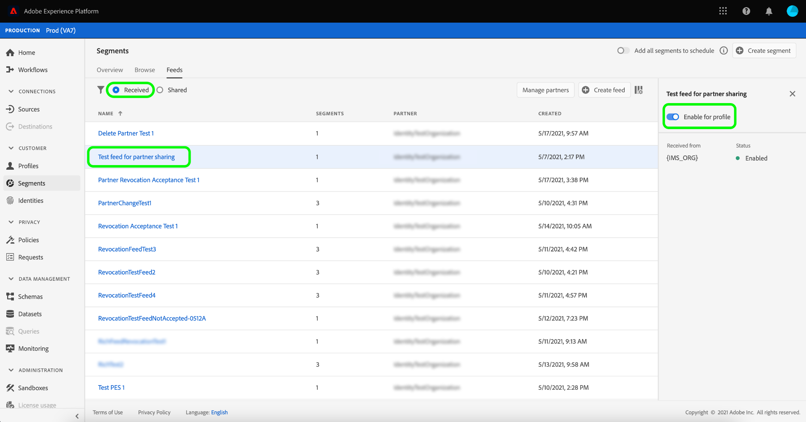

# Panoramica di [!DNL Segment Match]

Adobe Experience Platform Segment Match è un servizio di condivisione dei segmenti che consente a due o più utenti di Platform di scambiarsi i dati dei segmenti in modo sicuro, gestito e rispettoso della privacy. [!DNL Segment Match] utilizza gli standard di privacy di Platform e gli identificatori personali, ad esempio e-mail con hash, numeri di telefono con hash e identificatori di dispositivo come IDFA e GAID.

Con [!DNL Segment Match] è possibile:

* Gestisci il processo di sovrapposizione delle identità.
* Visualizzare le stime precedenti alla condivisione.
* Applica le etichette di utilizzo dei dati per controllare se i dati possono essere condivisi con i partner.
* Gestisci la gestione condivisa del ciclo di vita del pubblico dopo la pubblicazione di un feed e continua uno scambio dinamico di dati attraverso funzionalità di aggiunta, eliminazione e annullamento della condivisione.

[!DNL Segment Match] utilizza un processo di sovrapposizione delle identità per garantire che la condivisione dei segmenti avvenga in modo sicuro e incentrato sulla privacy. Un&#39;identità **sovrapposta** è un&#39;identità che ha una corrispondenza sia nel segmento dell&#39;utente che in quello del partner selezionato. Prima di condividere un segmento tra un mittente e un destinatario, il processo di sovrapposizione delle identità verifica la presenza di una sovrapposizione negli spazi dei nomi e nei controlli di consenso tra il mittente e il destinatario. Entrambi i controlli di sovrapposizione devono passare affinché un segmento possa essere condiviso.

Nelle sezioni seguenti vengono fornite ulteriori informazioni su [!DNL Segment Match], inclusi dettagli sulla configurazione e sul relativo flusso di lavoro end-to-end.

## Configurazione

Nelle sezioni seguenti viene descritto come impostare e configurare [!DNL Segment Match]:

### Configurare i dati di identità e gli spazi dei nomi {#namespaces}

Il primo passaggio per iniziare a utilizzare [!DNL Segment Match] consiste nell&#39;assicurarsi di acquisire dati in base agli spazi dei nomi di identità supportati.

Gli spazi dei nomi di identità sono un componente di [Adobe Experience Platform Identity Service](../../../identity-service/home.md). Ogni identità del cliente contiene uno spazio dei nomi associato che indica il contesto dell’identità. Ad esempio, uno spazio dei nomi può distinguere un valore di &quot;name@email.com&quot; come indirizzo e-mail o &quot;443522&quot; come ID CRM numerico.

Un’identità completa include un valore ID e uno spazio dei nomi. Quando si abbinano i dati dei record tra frammenti di profilo (ad esempio quando [!DNL Real-Time Customer Profile] unisce i dati di profilo), sia il valore di identità che lo spazio dei nomi devono corrispondere.

Nel contesto di [!DNL Segment Match], gli spazi dei nomi vengono utilizzati nel processo di sovrapposizione durante la condivisione dei dati.

L’elenco degli spazi dei nomi supportati è il seguente:

| Namespace | Descrizione |
| --------- | ----------- |
| E-mail (SHA256, in minuscolo) | Uno spazio dei nomi per l’indirizzo e-mail con hash predefinito. I valori forniti in questo spazio dei nomi vengono convertiti in minuscolo prima dell’hashing con SHA256. Gli spazi iniziali e finali devono essere tagliati prima che un indirizzo e-mail venga normalizzato. Questa impostazione non può essere modificata retroattivamente. Platform offre due metodi per supportare l&#39;hashing sulla raccolta dati, tramite [`setCustomerIDs`](https://experienceleague.adobe.com/docs/id-service/using/reference/hashing-support.html#hashing-support) e tramite [preparazione dati](../../../data-prep/functions.md#hashing). |
| Telefono (SHA256_E.164) | Uno spazio dei nomi che rappresenta i numeri di telefono non elaborati con hash che devono essere eseguiti utilizzando sia il formato SHA256 che il formato E.164. |
| ECID | Uno spazio dei nomi che rappresenta un valore ID Experience Cloud (ECID). A questo spazio dei nomi possono fare riferimento anche i seguenti alias: &quot;Adobe Marketing Cloud ID&quot;, &quot;Adobe Experience Cloud ID&quot;, &quot;Adobe Experience Platform ID&quot;. Per ulteriori informazioni, vedere [Panoramica ECID](../../../identity-service/features/ecid.md). |
| Apple IDFA (ID per inserzionisti) | Spazio dei nomi che rappresenta l’ID di Apple per gli inserzionisti. Per ulteriori informazioni, consulta il seguente documento sugli [annunci basati su interessi](https://support.apple.com/en-us/HT202074). |
| ID Google Ad | Uno spazio dei nomi che rappresenta un ID di Google Advertising. Per ulteriori informazioni, consulta il seguente documento su [Google Advertising ID](https://support.google.com/googleplay/android-developer/answer/6048248?hl=en). |

### Configurare la configurazione del consenso

È necessario fornire una configurazione del consenso e impostarne il valore predefinito su `opt-in` o `opt-out` per una verifica del consenso.

La verifica del consenso di consenso e rinuncia determina se puoi operare con il consenso alla condivisione dei dati utente per impostazione predefinita. Se la configurazione predefinita del consenso è impostata su `opt-out`, i dati utente possono essere condivisi, a meno che un utente non neghi esplicitamente la rinuncia. Se l&#39;impostazione predefinita è `opt-in`, i dati utente non possono essere condivisi, a meno che un utente non acconsenta esplicitamente.

La configurazione del consenso predefinita per [!DNL Segment Match] è impostata su `opt-out`. Per applicare un modello di consenso ai dati, invia una richiesta e-mail al team del tuo account Adobe.

Per ulteriori informazioni sull&#39;attributo `share` utilizzato per impostare il valore del consenso per la condivisione dei dati, vedere la seguente documentazione sul gruppo di campi [privacy e consensi](../../../xdm/field-groups/profile/consents.md). Per informazioni sul gruppo di campi specifico utilizzato per acquisire il consenso del consumatore alla raccolta e all&#39;utilizzo dei dati relativi alle preferenze di privacy, personalizzazione e marketing, vedi l&#39;esempio seguente di [consenso per la privacy, Personalization e preferenze di marketing su GitHub](https://github.com/adobe/xdm/blob/master/docs/reference/datatypes/consent/consent-preferences.schema.md).

### Configurare le etichette di utilizzo dei dati

L’ultimo prerequisito da stabilire è configurare una nuova etichetta di utilizzo dati per impedire la condivisione dei dati. Tramite le etichette di utilizzo dei dati è possibile gestire i dati che possono essere condivisi tramite [!DNL Segment Match].

Le etichette di utilizzo dei dati consentono di categorizzare set di dati e campi in base ai criteri di utilizzo applicabili a tali dati. Le etichette possono essere applicate in qualsiasi momento, offrendo flessibilità nella scelta di come gestire i dati. Le best practice incoraggiano i dati di etichettatura non appena vengono acquisiti in Experience Platform o non appena i dati diventano disponibili per l’utilizzo in Platform.

[!DNL Segment Match] utilizza l&#39;etichetta C11, un&#39;etichetta di contratto specifica di [!DNL Segment Match] che puoi aggiungere manualmente a qualsiasi set di dati o attributo per assicurarti che sia escluso dal processo di condivisione partner [!DNL Segment Match]. L&#39;etichetta C11 indica i dati che non devono essere utilizzati nei processi [!DNL Segment Match]. Dopo aver determinato i set di dati e/o i campi da escludere da [!DNL Segment Match] e aggiunto di conseguenza l&#39;etichetta C11, l&#39;etichetta viene automaticamente applicata dal flusso di lavoro [!DNL Segment Match]. [!DNL Segment Match] abilita automaticamente i criteri di base [!UICONTROL Limita condivisione dati]. Per istruzioni specifiche su come applicare le etichette di utilizzo dei dati ai set di dati, consulta l&#39;esercitazione su [gestione delle etichette di utilizzo dei dati nell&#39;interfaccia utente](../../../data-governance/labels/user-guide.md).

Per un elenco delle etichette di utilizzo dati e delle relative definizioni, vedere il glossario [etichette di utilizzo dati](../../../data-governance/labels/reference.md). Per informazioni sui criteri di utilizzo dei dati, vedere la [panoramica dei criteri di utilizzo dei dati](../../../data-governance/policies/overview.md).

### Informazioni sulle autorizzazioni [!DNL Segment Match]

A [!DNL Segment Match] sono associate due autorizzazioni:

| Autorizzazione | Descrizione |
| --- | --- |
| Gestire le connessioni di condivisione del pubblico | Questa autorizzazione consente di completare il processo di handshake del partner, che connette due organizzazioni per abilitare i flussi [!DNL Segment Match]. |
| Gestire le condivisioni di pubblico | Questa autorizzazione consente di creare, modificare e pubblicare feed (il pacchetto di dati utilizzato per [!DNL Segment Match]) con partner attivi (partner che sono stati collegati dall&#39;utente amministratore con accesso a **[!UICONTROL Audience Share Connections]**). |

Per ulteriori informazioni sul controllo di accesso e sulle autorizzazioni, vedere [panoramica sul controllo di accesso](../../../access-control/home.md).

## [!DNL Segment Match] flusso di lavoro end-to-end

Dopo aver configurato i dati di identità e gli spazi dei nomi, la configurazione del consenso e l&#39;etichetta di utilizzo dei dati, puoi iniziare a lavorare con [!DNL Segment Match] e le relative funzionalità.

### Gestisci partner

Nell&#39;interfaccia utente di Platform, seleziona **[!UICONTROL Segmenti]** dalla barra di navigazione a sinistra, quindi seleziona **[!UICONTROL Feed]** dall&#39;intestazione superiore.

La pagina [!UICONTROL Feed] contiene un elenco dei feed ricevuti dai partner e dei feed condivisi. Per visualizzare un elenco di partner esistenti o stabilire una connessione con un nuovo partner, selezionare **[!UICONTROL Gestisci partner]**.

Una connessione tra due partner è un &quot;handshake bidirezionale&quot; che funge da metodo self-service per consentire agli utenti di connettere le organizzazioni Platform a livello di sandbox. La connessione è necessaria per informare Platform che è stato stipulato un accordo e che Platform può facilitare la condivisione di servizi tra l’utente e i suoi partner.

>[!NOTE]
>
>La &quot;stretta di mano bidirezionale&quot; tra te e il tuo partner è strettamente una connessione. Durante questo processo non vengono scambiati dati.

Puoi visualizzare un elenco delle connessioni con i partner esistenti nell&#39;interfaccia principale della schermata [!UICONTROL Gestisci partner]. Nella barra a destra si trova il pannello [!UICONTROL Condividi impostazione], che consente di generare un nuovo [!UICONTROL ID connessione] e una casella di input in cui è possibile immettere il [!UICONTROL ID connessione] di un partner.

Per creare un nuovo [!UICONTROL ID connessione], seleziona **[!UICONTROL Rigenera]** in [!UICONTROL Impostazione condivisione], quindi seleziona l&#39;icona Copia accanto all&#39;ID appena generato.

Per connettere un partner utilizzando il relativo [!UICONTROL ID connessione], immettere il valore dell&#39;ID univoco nella casella di input in [!UICONTROL Partner connessione], quindi selezionare **[!UICONTROL Richiesta]**.

### Creare un feed {#create-feed}

>[!CONTEXTUALHELP]
>id="platform_segment_match_marketing"
>title="Casi d’uso di marketing con restrizioni"
>abstract="I casi d’uso di marketing con restrizioni forniscono indicazioni ai partner per garantire che i segmenti condivisi vengano utilizzati correttamente in base alle restrizioni di governance dei dati."
>text="Learn more in documentation"

Un **feed** è un raggruppamento di dati (segmenti), le regole per l&#39;esposizione o l&#39;utilizzo di tali dati e le configurazioni che determinano la corrispondenza dei dati con i dati dei partner. Un feed può essere gestito in modo indipendente e scambiato con altri utenti di Platform tramite [!DNL Segment Match].

Per creare un nuovo feed, selezionare **[!UICONTROL Crea feed]** dal dashboard [!UICONTROL Feed].

La configurazione di base di un feed include un nome, una descrizione e configurazioni relative a casi di utilizzo marketing e impostazioni di identità. Specifica un nome e una descrizione per il feed, quindi applica i casi di utilizzo di marketing da cui desideri escludere i dati. È possibile selezionare più casi d’uso da un elenco che include:

* [!UICONTROL Analytics]
* [!UICONTROL Combina con PII]
* [!UICONTROL Targeting intersito]
* [!UICONTROL Data Science]
* [!UICONTROL Destinazione e-mail]
* [!UICONTROL Esporta a terze parti]
* [!UICONTROL Pubblicità in loco]
* [!UICONTROL Personalizzazione in loco]
* [!UICONTROL Corrispondenza segmento]
* [!UICONTROL Personalizzazione identità singola]

Infine, seleziona gli spazi dei nomi di identità appropriati per il feed. Per informazioni sugli spazi dei nomi specifici supportati da [!DNL Segment Match], vedere la [tabella dei dati di identità e degli spazi dei nomi](#namespaces). Al termine, selezionare **[!UICONTROL Avanti]**.

Dopo aver stabilito le impostazioni del feed, seleziona i segmenti da condividere dall’elenco dei segmenti di prime parti. Puoi selezionare più segmenti dall’elenco e utilizzare la barra a destra per gestire l’elenco dei segmenti selezionati. Al termine, seleziona **[!UICONTROL Avanti]**.

Viene visualizzata la pagina [!UICONTROL Condividi] che fornisce un&#39;interfaccia per selezionare i partner con cui si desidera condividere il feed. Durante questo passaggio, puoi anche visualizzare il rapporto delle stime di sovrapposizione pre-condivisione e vedere il numero di identità sovrapposte per spazio dei nomi tra te e il tuo partner, il numero di identità sovrapposte che hanno il consenso per la condivisione dei dati.

Seleziona **[!UICONTROL Analizza per segmento]** per visualizzare il rapporto delle stime.

Il rapporto delle stime di sovrapposizione consente di gestire i controlli di sovrapposizione e consenso per partner e per segmento prima di condividere il feed.

| Metriche | Descrizione |
| ------- | ----------- |
| Identità stimate con il consenso | Il numero totale di identità sovrapposte che soddisfano i requisiti di consenso configurati per la tua organizzazione. |
| Identità sovrapposte stimate | Il numero di identità idonee per il segmento selezionato e con corrispondenza con il partner selezionato. Queste identità vengono visualizzate per spazio dei nomi e non rappresentano singole identità di profilo. Le stime di sovrapposizione si basano sugli schizzi di profilo. |

Al termine, selezionare **[!UICONTROL Chiudi]**.

Dopo aver selezionato i partner e visualizzato il rapporto delle stime di sovrapposizione, seleziona **[!UICONTROL Successivo]** per continuare.

Viene visualizzato il passaggio [!UICONTROL Rivedi], che consente di rivedere il nuovo feed prima che venga condiviso e pubblicato. Questo passaggio include dettagli sull’impostazione di identità applicata, nonché informazioni sui casi di utilizzo di marketing, sui segmenti e sui partner selezionati.

Selezionare **[!UICONTROL Fine]** per continuare.

### Aggiorna feed

Per aggiungere o rimuovere segmenti, selezionare **[!UICONTROL Crea feed]** dalla pagina [!UICONTROL Feed], quindi selezionare **[!UICONTROL Feed esistente]**. Nell&#39;elenco dei feed esistenti visualizzati, selezionare il feed che si desidera aggiornare, quindi selezionare **[!UICONTROL Avanti]**.

Viene visualizzato l’elenco dei segmenti. Da qui, puoi aggiungere nuovi segmenti al feed e utilizzare la barra a destra per rimuovere eventuali segmenti non più necessari. Dopo aver completato la gestione dei segmenti nel feed, seleziona **[!UICONTROL Successivo]**, quindi segui i passaggi descritti in precedenza per completare il feed aggiornato.

Aggiornamento 

>[!NOTE]
>
>Quando aggiungi o rimuovi un segmento da un feed condiviso, il partner ricevente deve confermare la modifica riabilitando l&#39;interruttore [!DNL Profile] nell&#39;elenco dei feed ricevuti.

### Accetta un feed in ingresso

Per visualizzare un feed in ingresso, selezionare **[!UICONTROL Ricevuto]** dall&#39;intestazione della pagina [!UICONTROL Feed], quindi selezionare dall&#39;elenco il feed che si desidera visualizzare. Per accettare il feed, selezionare **[!UICONTROL Attiva per il profilo]** e attendere alcuni istanti prima che lo stato venga aggiornato da [!UICONTROL In sospeso] a [!UICONTROL Abilitato].

Una volta accettato un feed condiviso, puoi iniziare a utilizzarlo per creare nuovi segmenti.

## Passaggi successivi

Leggendo questo documento, hai acquisito una conoscenza di [!DNL Segment Match], delle sue funzionalità e del relativo flusso di lavoro end-to-end. Per ulteriori informazioni su altri servizi di Platform, consulta i seguenti documenti:

* [[!DNL Segmentation Service]](../../home.md)
* [[!DNL Identity Service]](../../../identity-service/home.md)
* [Panoramica di [!DNL Real-Time Customer Profile]](../../../profile/home.md)
