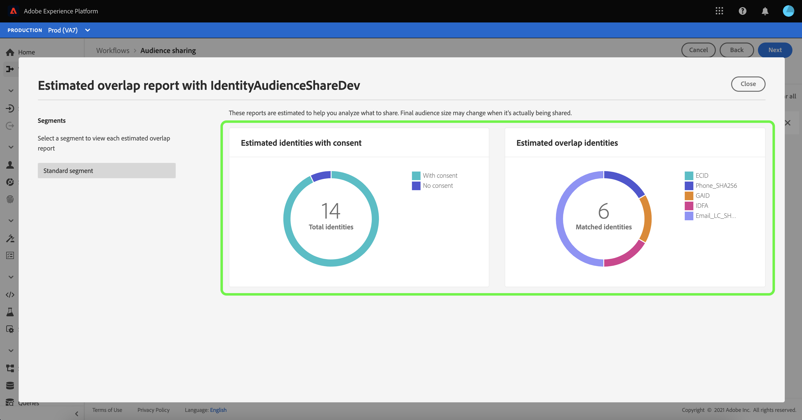

# [!DNL Segment Match] domande frequenti

Questa guida fornisce le risposte alle domande sulla privacy e legali spesso relative a Adobe Experience Platform Segment Match.

## Quali dati vengono condivisi durante le sovrapposizioni delle stime e come posso Adobe assicurarmi che queste metriche vengano ottenute in modo sicuro?

Per ottenere queste metriche di stima della sovrapposizione, non vengono spostati dati di clienti o segmenti tra le sandbox. Le identità applicabili selezionate dal cliente e con hash in qualsiasi sandbox vengono aggiunte a una struttura di dati probabilistica in cui gli ID stessi sono rappresentati in un formato con hash.

Si tratta di un processo unidirezionale, il che significa che gli identificatori prehash originali non sono esposti e non possono essere decodificati.

Queste strutture di dati hanno proprietà univoche che consentono agli ingegneri di eseguire operazioni di unione e intersezione tra di loro, anche se le informazioni codificate sono gravemente compresse o con hash. Queste operazioni consentono [!DNL Segment Match] per ottenere l’intersezione stimata di due strutture di dati composte da ID di due diverse sandbox senza dover confrontare i valori effettivi. Da [!DNL Segment Match] utilizza solo le strutture di dati, gli ID non lasciano mai gli archivi dei profili delle rispettive organizzazioni a scopo di stima. Questo consente ad Adobe di soddisfare i requisiti di privacy e sicurezza dei clienti, offrendo al tempo stesso strumenti di stima altamente precisi per guidare gli accordi di collaborazione sui dati.

## Qual è il processo per la designazione delle identità che ricevono gli ID del segmento condiviso?

[!DNL Segment Match] offre ai clienti un’opzione per configurare i namespace da utilizzare nel servizio. Questa selezione viene applicata sia al processo di stima descritto nella domanda precedente che al processo di trasferimento dei dati, nel caso in cui il cliente decida di pubblicare il feed in una sandbox partner.

Il processo di trasferimento dei dati tra le identità crittografate di due diverse organizzazioni viene eseguito in un ambiente di calcolo neutro. Il processo di trasferimento dei dati è di proprietà dell’Adobe e le organizzazioni coinvolte nella partnership non hanno accesso a questo ambiente, né hanno accesso a eventuali registri che possono essere il risultato del processo di trasferimento dei dati.

Solo l’appartenenza al segmento viene assimilata nei frammenti di profilo sovrapposti di un’organizzazione ricevente e non viene trasferita alcuna identità aggiuntiva dall’organizzazione mittente all’organizzazione ricevente. Il processo di trasferimento dei dati non legge informazioni di identificazione personale di testo normale perché [!DNL Segment Match] consente sovrapposizioni solo su spazi dei nomi crittografati SHA256 (e-mail/telefono) ogni volta che i dati sono PII. I risultati non vengono mai memorizzati nell’ambiente di calcolo.
