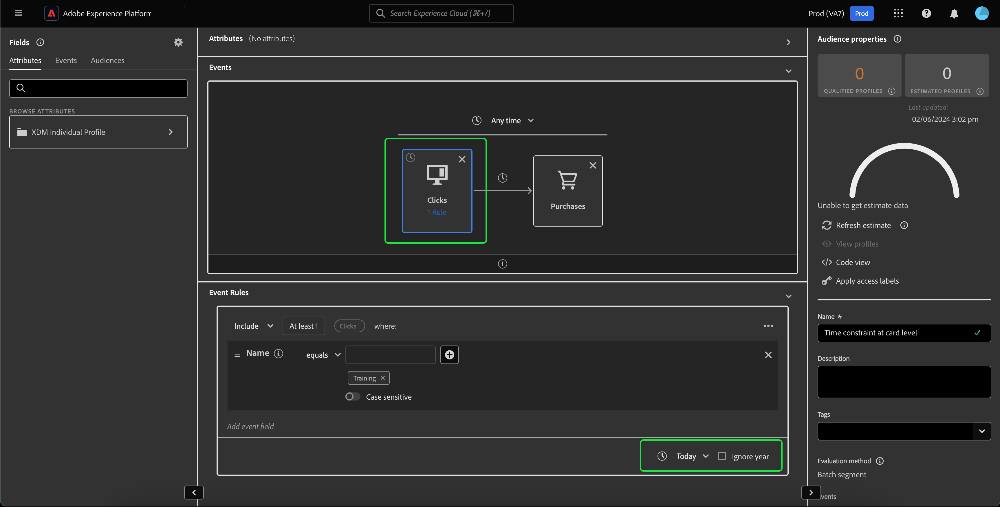

# Rifattorizzazione dei vincoli di tempo {#refactorization}

>[!CONTEXTUALHELP]
>id="platform_audiences_segmentBuilder_constraints"
>title="Rifattorizzazione dei vincoli di tempo"
>abstract="I vincoli di tempo a livello di regola e di gruppo sono stati rimossi per chiarire l’utilizzo del vincolo di tempo. Riscrivi il vincolo come vincolo di tempo a livello di area di lavoro o di scheda."

La versione di gennaio 2024 per Adobe Experience Platform ha introdotto modifiche al servizio di segmentazione di Adobe Experience Platform che aggiungono nuove restrizioni a dove è possibile definire i vincoli di tempo. Queste modifiche interessano i segmenti appena creati o modificati tramite l’interfaccia utente di Segment Builder (Generatore di segmenti). Questa guida spiega come mitigare queste modifiche.

Prima della versione di gennaio 2024, tutti i vincoli di tempo a livello di regola, di gruppo e di area di lavoro facevano riferimento in modo ridondante alla stessa marca temporale. Per chiarire l’utilizzo dei vincoli di tempo, sono stati rimossi i vincoli di tempo a livello di regola e di gruppo. Per adattarsi a questa modifica, tutti i vincoli temporali **deve** essere riscritto come **a livello di area di lavoro** o **a livello di scheda** vincoli di tempo.

In precedenza, a un singolo evento potevano essere associate più regole di vincoli di tempo. Con questo aggiornamento recente, il tentativo di aggiungere un vincolo di tempo a una regola determinerà **errore**.

I vincoli di tempo possono ora essere applicati solo a livello di area di lavoro o di scheda.

Quando applicate un vincolo di tempo a livello di area di lavoro, potete comunque selezionare tutti i vincoli di tempo disponibili.

>[!NOTE]
>
>Se è presente solo **uno** nell’area di lavoro, l’applicazione del vincolo di tempo alla scheda **equivalente** all&#39;applicazione del vincolo di tempo a livello di area di lavoro.
>
>Se sono presenti **multiplo** schede nell&#39;area di lavoro, l&#39;applicazione del vincolo di tempo a livello di area di lavoro applicherà tale vincolo di tempo a **tutto** schede sull&#39;area di lavoro.

Per applicare un vincolo di tempo a livello di scheda, selezionare la scheda a cui si desidera applicare il vincolo di tempo. Il **[!UICONTROL Regole evento]** viene visualizzato il contenitore. Ora puoi selezionare il vincolo di tempo da applicare alla scheda.

