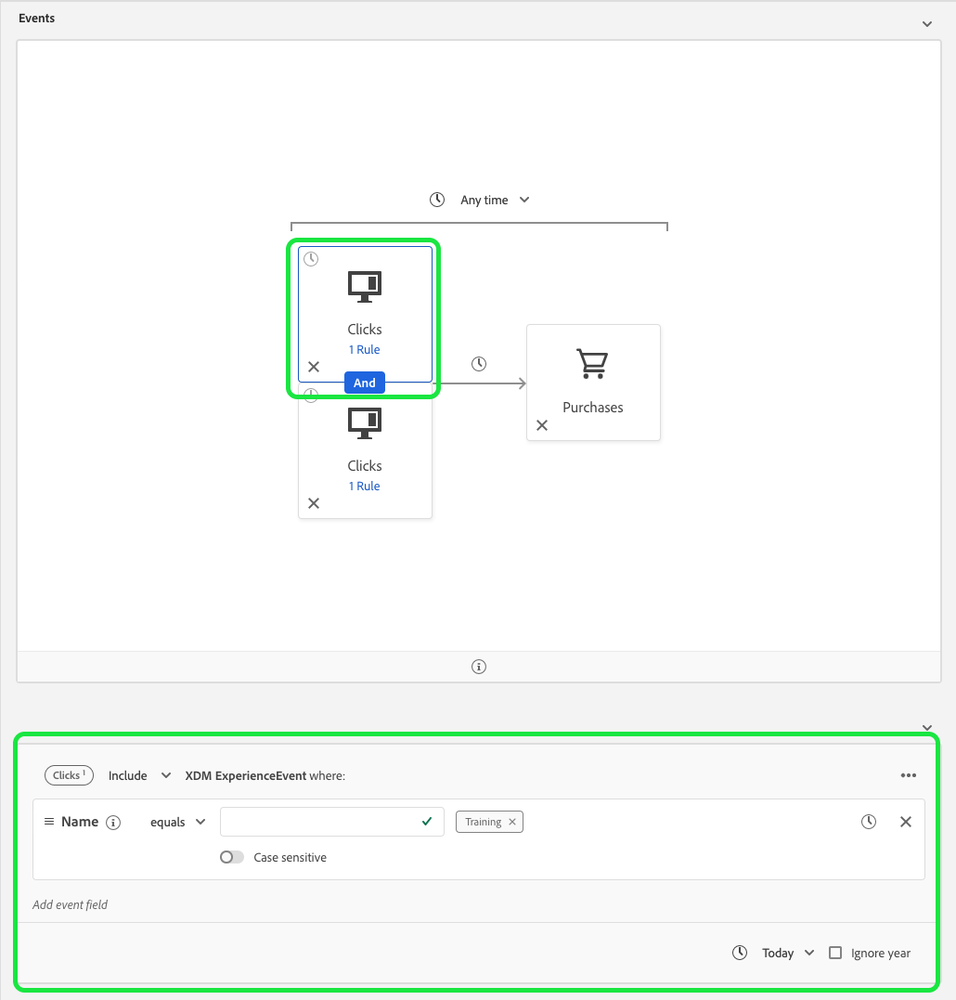

# Ripristino dei vincoli di tempo

La versione di ottobre 2020 per Adobe Experience Platform ha introdotto modifiche alle prestazioni del servizio di segmentazione Adobe Experience Platform che aggiungono nuove restrizioni all’utilizzo degli operatori logici OR e AND. Queste modifiche interesseranno i segmenti appena creati o modificati creati utilizzando l’interfaccia utente di Generatore di segmenti. Questa guida spiega come attenuare queste modifiche.

Prima della versione di ottobre 2020, tutti i vincoli di tempo a livello di regola, di gruppo e a livello di evento facevano riferimento in modo ridondante alla stessa marca temporale. Per chiarire l’utilizzo dei vincoli di tempo, i vincoli di tempo a livello di regola e di gruppo sono stati rimossi. Per adattarsi a questa modifica, tutti i vincoli di tempo devono essere riscritti come vincoli di tempo a livello di evento.

In precedenza, un singolo evento poteva avere più regole di vincolo di tempo associate ad esso.

Come puoi vedere, questo segmento ha due vincoli a livello di regola: Uno per &quot;[!UICONTROL Oggi]&quot; e l&#39;altro per &quot;[!UICONTROL Ieri]&quot;.

Il segmento precedente è equivalente al segmento seguente: entrambi i vincoli di tempo a livello di evento sono stati collegati utilizzando un operatore AND. Il primo vincolo di tempo a livello di evento fa riferimento a un evento click il cui nome è uguale a &quot;Training&quot; e si verifica oggi, mentre il secondo vincolo di tempo a livello di evento fa riferimento a un evento click il cui nome è uguale a &quot;Animali domestici&quot; ed è successo ieri.

 

Questo refactoring dei vincoli di tempo influisce anche sui vincoli di tempo collegati tramite un operatore OR.
