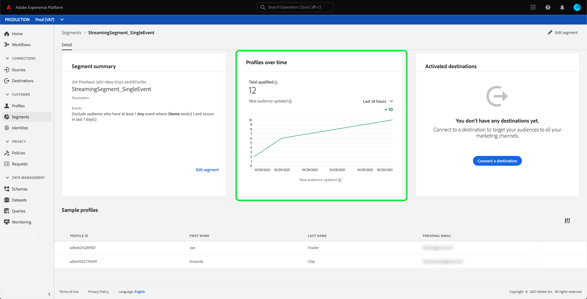

# Segmentazione streaming

>[!NOTE]
>
>Il seguente documento spiega come utilizzare la segmentazione in streaming utilizzando l’interfaccia utente. Per informazioni sull’utilizzo della segmentazione in streaming tramite API, consulta la [guida API per la segmentazione in streaming](../api/streaming-segmentation.md).

Segmentazione streaming su [!DNL Adobe Experience Platform] consente ai clienti di effettuare segmentazione in tempo quasi reale, concentrandosi sulla ricchezza dei dati. Con la segmentazione in streaming, la qualificazione dei segmenti ora avviene quando i dati in streaming arrivano in [!DNL Platform], per ridurre la necessità di pianificare ed eseguire processi di segmentazione. Con questa funzionalità, ora è possibile valutare la maggior parte delle regole di segmento quando i dati vengono trasmessi in [!DNL Platform], il che significa che l’appartenenza al segmento verrà mantenuta aggiornata senza eseguire processi di segmentazione pianificati.

>[!NOTE]
>
>La segmentazione in streaming funziona su tutti i dati acquisiti tramite un’origine streaming. I dati acquisiti utilizzando un’origine basata su batch verranno valutati ogni notte, anche se idonei per la segmentazione in streaming.
>
>Inoltre, i segmenti valutati con la segmentazione in streaming possono variare tra l’appartenenza ideale e l’appartenenza effettiva se il segmento è basato su un altro segmento valutato utilizzando la segmentazione in batch. Ad esempio, se il segmento A è basato sul segmento B e il segmento B viene valutato utilizzando la segmentazione batch, poiché il segmento B viene aggiornato solo ogni 24 ore, il segmento A si allontanerà ulteriormente dai dati effettivi fino a quando non viene sincronizzato nuovamente con l’aggiornamento del segmento B.

## Tipi di query per segmentazione in streaming {#query-types}

>[!NOTE]
>
>Affinché la segmentazione in streaming funzioni, è necessario abilitare la segmentazione pianificata per l’organizzazione. Per informazioni dettagliate sull’abilitazione della segmentazione pianificata, consulta [la sezione segmentazione in streaming nella guida utente Segmentazione](./overview.md#scheduled-segmentation).

Una query viene valutata automaticamente con la segmentazione in streaming se soddisfa uno dei seguenti criteri:

| Tipo di query | Dettagli | Esempio |
| ---------- | ------- | ------- |
| Evento singolo | Qualsiasi definizione di segmento che fa riferimento a un singolo evento in arrivo senza restrizioni temporali. |  |
| Singolo evento all’interno di una finestra temporale relativa | Qualsiasi definizione di segmento che fa riferimento a un singolo evento in arrivo. |  |
| Singolo evento con una finestra temporale | Qualsiasi definizione di segmento che fa riferimento a un singolo evento in arrivo con una finestra temporale. |  |
| Solo profilo | Qualsiasi definizione di segmento che fa riferimento solo a un attributo di profilo. |  |
| Singolo evento con un attributo di profilo | Qualsiasi definizione di segmento che fa riferimento a un singolo evento in arrivo, senza restrizioni di tempo, e a uno o più attributi di profilo. **Nota:** La query viene valutata immediatamente quando viene generato l’evento. Nel caso di un evento di profilo, tuttavia, deve attendere 24 ore per essere incorporato. |  |
| Singolo evento con un attributo di profilo in una finestra temporale relativa | Qualsiasi definizione di segmento che fa riferimento a un singolo evento in arrivo e a uno o più attributi di profilo. |  |
| Segmento di segmenti | Qualsiasi definizione di segmento che contiene uno o più segmenti in batch o in streaming. **Nota:** Se utilizzi un segmento, si verificherà l’annullamento della qualifica del profilo **ogni 24 ore**. |  |
| Eventi multipli con un attributo di profilo | Qualsiasi definizione di segmento che fa riferimento a più eventi **nelle ultime 24 ore** e (facoltativamente) ha uno o più attributi di profilo. |  |

Una definizione di segmento **not** è abilitata per la segmentazione in streaming nei seguenti scenari:

- La definizione del segmento include segmenti o caratteristiche Adobe Audience Manager (AAM).
- La definizione del segmento include più entità (query con più entità).

Durante la segmentazione in streaming si applicano le seguenti linee guida:

| Tipo di query | Indirizzo |
| ---------- | -------- |
| Query a evento singolo | Non ci sono limiti all’intervallo di lookback. |
| Query con cronologia eventi | <ul><li>L’intervallo di lookback è limitato a **un giorno**.</li><li>Una rigorosa condizione di ordinamento dei tempi **deve** esistono tra gli eventi.</li><li>Sono supportate le query con almeno un evento negato. Tuttavia, l&#39;intero evento **impossibile** sia una negazione.</li></ul> |

Se la definizione di un segmento viene modificata in modo da non soddisfare più i criteri per la segmentazione in streaming, la definizione del segmento passa automaticamente da &quot;Streaming&quot; a &quot;Batch&quot;.

Inoltre, l’annullamento della qualificazione dei segmenti, analogamente alla qualificazione dei segmenti, avviene in tempo reale. Di conseguenza, se un pubblico non è più idoneo per un segmento, verrà immediatamente non qualificato. Ad esempio, se la definizione del segmento richiede &quot;Tutti gli utenti che hanno acquistato scarpe rosse nelle ultime tre ore&quot;, dopo tre ore, tutti i profili inizialmente qualificati per la definizione del segmento non saranno qualificati.

## Dettagli dei segmenti di segmentazione in streaming

Dopo aver creato un segmento abilitato per lo streaming, puoi visualizzare i dettagli di tale segmento.

In particolare, **[!UICONTROL Totale qualificato]** viene visualizzata una metrica che mostra il numero totale di tipi di pubblico qualificati, in base a valutazioni batch e in streaming per questo segmento.

Sotto c’è un grafico a linee che mostra il numero di nuovi tipi di pubblico aggiornati nelle ultime 24 ore utilizzando il metodo di valutazione in streaming. Il menu a discesa può essere regolato in modo da visualizzare le ultime 24 ore, la settimana scorsa o gli ultimi 30 giorni. La **[!UICONTROL Nuovo pubblico aggiornato]** è basato sulla modifica della dimensione del pubblico durante l’intervallo di tempo selezionato, come valutato dalla segmentazione in streaming. Questa metrica non include il pubblico qualificato totale dalla valutazione batch di segmenti giornalieri.

>[!NOTE]
>
>Un segmento è considerato qualificato se va dall’assenza di stato alla realizzazione o se va dall’uscita alla realizzazione. Un segmento viene considerato non qualificato se va da realizzato a uscito o da esistente a esistente.
>
>Ulteriori informazioni su questi stati sono disponibili nella tabella di stato all’interno di [panoramica sulla segmentazione](./overview.md#browse).

Puoi trovare ulteriori informazioni sulla valutazione dell’ultimo segmento selezionando la bolla di informazioni accanto a **[!UICONTROL Totale qualificato]**.

Per ulteriori informazioni sulle definizioni dei segmenti, consulta la sezione precedente su [dettagli di definizione del segmento](#segment-details).

## Passaggi successivi

Questa guida utente spiega come funzionano le definizioni dei segmenti abilitate per lo streaming su Adobe Experience Platform e come monitorare i segmenti abilitati per lo streaming.

Per ulteriori informazioni sull’utilizzo dell’interfaccia utente di Adobe Experience Platform, consulta la sezione [Guida utente alla segmentazione](./overview.md).

## Appendice

Nella sezione seguente sono elencate le domande frequenti sulla segmentazione in streaming:

### La segmentazione in streaming avviene anche in tempo reale?

Per la maggior parte delle istanze, l’annullamento della segmentazione in streaming avviene in tempo reale. Tuttavia, i segmenti in streaming che utilizzano segmenti **not** non sono qualificati in tempo reale, ma non possono essere qualificati dopo 24 ore.

### Su quali dati funziona la segmentazione in streaming?

La segmentazione in streaming funziona su tutti i dati acquisiti tramite un’origine streaming. I segmenti acquisiti utilizzando un’origine basata su batch verranno valutati ogni notte, anche se idonei per la segmentazione in streaming. Gli eventi inviati in streaming nel sistema con una marca temporale superiore a 24 ore verranno elaborati nel successivo processo batch.

### Come vengono definiti i segmenti come segmentazione in batch o in streaming?

Un segmento è definito come segmentazione in batch o in streaming in base a una combinazione di tipo di query e durata della cronologia degli eventi. Un elenco dei segmenti che verranno valutati come segmento in streaming si trova nella sezione [sezione tipi di query per segmentazione in streaming](#query-types).

### Perché il numero di segmenti &quot;qualificati totali&quot; continua ad aumentare mentre il numero sotto &quot;Ultimi X giorni&quot; rimane a zero all’interno della sezione dei dettagli del segmento?

Il numero di segmenti qualificati totali viene ricavato dal processo di segmentazione giornaliera, che include i tipi di pubblico idonei per i segmenti batch e in streaming. Questo valore viene visualizzato sia per i segmenti batch che per quelli in streaming.

Il numero sotto &quot;Ultimi X giorni&quot; **only** include i tipi di pubblico qualificati nella segmentazione in streaming, e **only** aumenta se hai inviato dati in streaming nel sistema e conta verso tale definizione di streaming. Questo valore è **only** mostrata per i segmenti in streaming. Di conseguenza, questo valore **possono** viene visualizzato come 0 per i segmenti batch.

Di conseguenza, se vedi che il numero sotto &quot;Ultimi X giorni&quot; è zero, e il grafico a linee è anche pari a zero, hai **not** ha inviato in streaming nel sistema tutti i profili idonei per quel segmento.