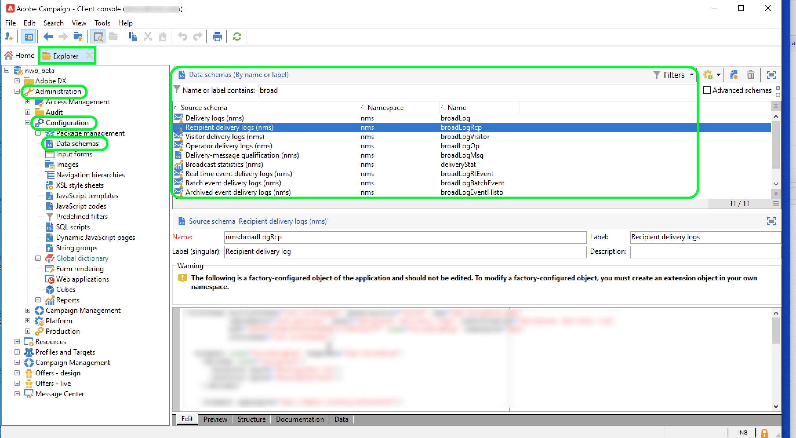

# Adobe Campaign Managed Cloud Services

Adobe Campaign Managed Cloud Services offre una piattaforma gestita per la progettazione di customer experience cross-channel, che supporta l’orchestrazione visiva delle campagne, la gestione delle interazioni in tempo reale e l’esecuzione cross-channel. Per ulteriori dettagli, consulta la [documentazione di Adobe Campaign v8](https://experienceleague.adobe.com/docs/campaign/campaign-v8/campaign-home.html?lang=it).

Il connettore di origine di Adobe Campaign Managed Cloud Services consente di acquisire i dati di registro di consegna e tracciamento da Adobe Campaign v8 in Adobe Experience Platform. Questo connettore funziona come origine batch all’interno di Platform.

## Prerequisiti

Prima di poter creare una connessione sorgente per portare Campaign v8 in Experience Platform, devi completare i seguenti prerequisiti:

* [Configurare l’importazione del registro eventi utilizzando la console client di Adobe Campaign](#view-delivery-and-tracking-log-data)
* [Creare uno schema XDM ExperienceEvent](#create-a-schema)
* [Creare un set di dati](#create-a-dataset)

### Visualizzare i dati di registro di consegna e tracciamento {#view-delivery-and-tracking-log-data}

>[!IMPORTANT]
>
>Per visualizzare i dati di registro in Campaign, devi avere accesso alla console client di Adobe Campaign v8. Per informazioni su come scaricare e installare la console client, visita la [documentazione di Campaign v8](https://experienceleague.adobe.com/docs/campaign/campaign-v8/deploy/connect.html).

Accedi all’istanza di Campaign v8 tramite la console client. Nella scheda [!DNL Explorer], selezionare [!DNL Administration], quindi [!DNL Configuration]. Selezionare [!DNL Data schemas], quindi applicare il filtro `broadLog` per il nome o l&#39;etichetta. Nell&#39;elenco visualizzato selezionare lo schema di origine dei registri di consegna dei destinatari con il nome `broadLogRcp`.

Selezionare quindi la scheda **Dati**.

Fate clic con il pulsante destro del mouse o premete un tasto nel pannello dati per aprire il menu contestuale. Selezionare **Configura elenco...**

Viene visualizzata la finestra di configurazione dell’elenco, che fornisce un’interfaccia in cui è possibile aggiungere eventuali campi desiderati all’elenco preesistente per visualizzare i dati nel pannello dati.

Ora puoi visualizzare i registri di consegna dei destinatari, inclusi i campi di configurazione aggiunti nel passaggio precedente.

>[!TIP]
>
>Puoi ripetere gli stessi passaggi, ma filtrare per `tracking` per visualizzare i dati del registro di tracciamento.

### Creare uno schema {#create-a-schema}

Quindi, crea uno schema XDM ExperienceEvent per i registri di consegna e di tracciamento. Devi applicare il gruppo di campi Registri di consegna campagna allo schema dei registri di consegna e il gruppo di campi Registri di tracciamento campagna allo schema dei registri di tracciamento. È inoltre necessario definire il campo `externalID` come identità primaria dello schema.

>[!NOTE]
>
>Per acquisire i dati di Campaign in [!DNL Real-Time Customer Profile], lo schema XDM ExperienceEvent deve essere abilitato per il profilo.

Per istruzioni dettagliate su come creare uno schema, consulta la guida su [creazione di uno schema XDM nell&#39;interfaccia utente](../../../xdm/tutorials/create-schema-ui.md).

### Creare un set di dati {#create-a-dataset}

Infine, devi creare un set di dati per gli schemi. Per istruzioni dettagliate su come creare un set di dati, consulta la guida su [creazione di un set di dati nell&#39;interfaccia utente](../../../catalog/datasets/user-guide.md).

## Latenza prevista per l’origine Adobe Campaign Managed Cloud Services {#latency}

La latenza end-to-end da un evento Campaign alla disponibilità dei dati in Experience Platform è in genere di 15-30 minuti nelle configurazioni standard (tra cui replica di 15 minuti, esportazione in micro-batch e un flusso di dati Experience Platform pianificato), presupponendo volumi di dati normali e nessun backlog. Si tratta di un processo quasi in tempo reale ottenuto attraverso la sincronizzazione pianificata micro-batch (di solito nell’ordine di decine di minuti), ma non è in streaming continuo.

| Scenario | Dettagli | Latenza prevista |
| --- | --- | --- |
| L’evento della campagna viene generato in un’istanza di mid-sourcing/centro messaggi | Un evento di consegna o tracciamento (invio, apertura, clic, ecc.) si verifica su un nodo di esecuzione di Campaign v8 (mid/centro messaggi). | In tempo reale all’interno del runtime di Campaign (attualmente non visibile in Experience Platform). |
| Replica dal database di marketing runtime al database di marketing Campaign | I dati evento vengono replicati dal centro messaggi/mid nel database di marketing di Campaign ([!DNL Snowflake] o [!DNL Postgres], a seconda delle dimensioni del cliente). I modelli di integrazione standard presuppongono un processo di replica regolare. | ~15 minuti, in base alla cadenza di replica standard di 15 minuti. |
| Esporta dal database di marketing di Campaign all’area di destinazione (ad esempio [!DNL Data Landing Zone], [!DNL Amazon S3] o [!DNL Azure Blob]) | Un flusso di lavoro di esportazione (servizio di esportazione) in Campaign viene eseguito secondo una pianificazione per estrarre nuovi/modificati registri di consegna e tracciamento e scriverli come microbatch in un’area di destinazione basata su file. | minuti, più l&#39;intervallo di pianificazione dell&#39;esportazione. |
| Il flusso di dati di origine di Experience Platform raccoglie i file esportati | L&#39;origine Adobe Campaign Managed Cloud Services è configurata come flusso di dati batch in Experience Platform [!DNL Flow Service]. Analizza periodicamente la zona di destinazione, acquisisce nuovi file e li scrive nei set di dati ExperienceEvent configurati. Il monitoraggio espone i &quot;batch riusciti&quot; e i &quot;batch non riusciti&quot;. | Minuti più l’intervallo di pianificazione del flusso di dati. |
| Dati disponibili nel data lake e nel profilo cliente in tempo reale | Una volta acquisito il batch, i record vengono inseriti nel data lake e (se il set di dati è abilitato per il profilo) inseriti nel profilo cliente in tempo reale. Sono applicabili gli SLA standard di Experience Platform per l’acquisizione in batch e l’acquisizione del profilo. | All’interno della stessa finestra di esecuzione del flusso di dati, ovvero poco dopo il completamento dell’esecuzione batch. In genere i record diventano disponibili in pochi minuti per i servizi a valle. |

{style="table-layout:auto"}

## Creare una connessione sorgente Adobe Campaign Managed Cloud Services utilizzando l’interfaccia utente di Experience Platform

Dopo aver effettuato l’accesso ai registri dati nella console client di Campaign, creato uno schema e un set di dati, ora puoi procedere con la creazione di una connessione di origine per portare i dati di Campaign Managed Services in Experience Platform.

Per istruzioni dettagliate su come trasferire i dati dei registri di consegna e di tracciamento di Campaign v8 in Experience Platform, consulta la guida in [creazione di una connessione sorgente di Campaign Managed Services nell’interfaccia utente](../../tutorials/ui/create/adobe-applications/campaign.md).

>[!IMPORTANT]
>
>Esiste un caso limite in cui l’interazione di un destinatario e-mail rimosso di recente con un’e-mail potrebbe riacquisire informazioni personali in Experience Platform. In alcuni casi, questo potrebbe riabilitare il marketing per tale utente.
>
>* Questo scenario è attivo solo tra il momento in cui una richiesta di accesso a dati personali viene eseguita in Experience Platform e il momento in cui viene eseguita in Adobe Campaign Classic. Dopo aver eseguito la richiesta in Campaign, viene eseguito un controllo per verificare che il record non venga esportato in Campaign. Per risolvere il problema, invia nuovamente una richiesta RGPD dopo 72 ore dall’esecuzione.
