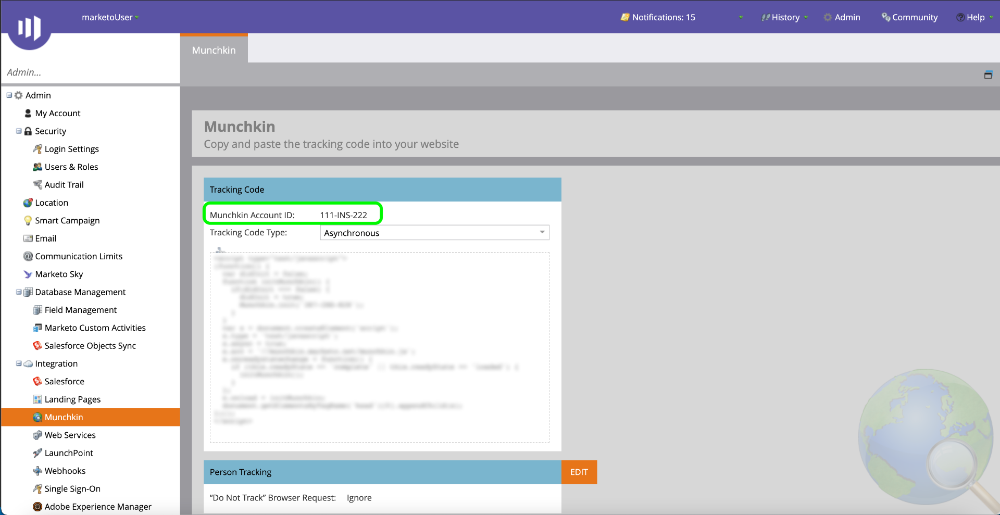

# Autentica il tuo [!DNL Marketo Engage] connettore di origine

Prima di creare un [!DNL Marketo Engage] (in appresso denominato &quot;[!DNL Marketo]&quot;) connettore di origine, devi prima impostare un servizio personalizzato tramite [!DNL Marketo] , nonché recuperare i valori per l&#39;ID Munchkin, l&#39;ID client e il segreto client.

La documentazione seguente fornisce passaggi su come acquisire le credenziali di autenticazione per creare un [!DNL Marketo] connettore di origine.

## Configurare un nuovo ruolo

Il primo passo per acquisire le credenziali di autenticazione è quello di impostare un nuovo ruolo tramite [[!DNL Marketo]](https://app-sjint.marketo.com/#MM0A1) interfaccia.

Accedi a [!DNL Marketo] e seleziona **[!DNL Admin]** dalla barra di navigazione superiore.

La *[!DNL Users & Role]s* contiene informazioni su utenti, ruoli e cronologia di accesso. Per creare un nuovo ruolo, seleziona **[!DNL Roles]** dall’intestazione superiore, quindi seleziona **[!DNL New Role]**.

Viene visualizzata la finestra di dialogo **[!DNL Create New Role]**. Immetti un nome e una descrizione, quindi seleziona le autorizzazioni da concedere per questo ruolo. Le autorizzazioni sono limitate a aree di lavoro specifiche e gli utenti possono eseguire azioni solo nelle aree di lavoro in cui dispongono delle autorizzazioni.

Dopo aver selezionato le autorizzazioni da concedere, seleziona **[!DNL Create]**.

Puoi gestire le autorizzazioni limitate sull’API durante la creazione di ruoli con [!DNL Marketo]. Invece di selezionare &quot;Access API&quot; (API di accesso), puoi fornire un ruolo con il livello minimo di accesso selezionando le seguenti autorizzazioni:

* [!DNL Read-Only Activity]
* [!DNL Read-Only Assets]
* [!DNL Read-Only Campaign]
* [!DNL Read-Only Company]
* [!DNL Read-Only Custom Object]
* [!DNL Read-Only Custom Object Type]
* [!DNL Read-Only Named Account]
* [!DNL Read-Only Named Account List]
* [!DNL Read-Only Opportunity]
* [!DNL Read-Only Person]
* [!DNL Read-Only Sales Person]

## Configurare un nuovo utente

Simile ai ruoli, puoi impostare un nuovo utente dalla **[!DNL Users & Roles]** pagina. La **[!DNL Users]** fornisce un elenco degli utenti attivi attualmente in provisioning in Marketo. Seleziona **[!DNL Invite New User]** per eseguire il provisioning di un nuovo utente.

Viene visualizzato un menu di dialogo di selezione. Fornisci le informazioni appropriate per l’e-mail, il nome, il cognome e il motivo. Durante questo passaggio, puoi anche stabilire una data di scadenza per l’accesso al nuovo account utente che stai invitando. Al termine, seleziona **[!DNL Next]**.

>[!IMPORTANT]
>
>Quando imposti un nuovo utente, devi assegnare l’accesso a un utente che è strettamente dedicato al servizio personalizzato che stai creando.

Seleziona i campi appropriati nel **[!DNL Permissions]** quindi seleziona la **[!DNL API Only]** per fornire un ruolo API al nuovo utente. Seleziona **[!DNL Next]** per procedere.

Per completare il processo, seleziona **[!DNL Send]**.

## Configurare un servizio personalizzato

Una volta stabilito un nuovo utente, puoi impostare un servizio personalizzato per recuperare le nuove credenziali. Dalla pagina di amministrazione, seleziona **[!DNL LaunchPoint]**.

La **[!DNL Installed services]** contiene un elenco dei servizi esistenti. Per creare un nuovo servizio personalizzato, seleziona **[!DNL New]** quindi seleziona **[!DNL New Service]**.

Fornisci al nuovo servizio un nome visualizzato descrittivo, quindi seleziona **[!DNL Custom]** dal **[!DNL Service]** menu a discesa. Fornisci una descrizione appropriata e seleziona l’utente a cui desideri eseguire il provisioning dal **[!DNL API Only User]** menu a discesa. Dopo aver compilato i dettagli necessari, seleziona **[!DNL Create]** per creare il nuovo servizio personalizzato.

## Ottieni il tuo ID client e il segreto client

Con la creazione di un nuovo servizio personalizzato, ora puoi recuperare i valori per l’ID client e il segreto client. Da **[!DNL Installed Services]** individuare il servizio personalizzato a cui si desidera accedere, quindi selezionare **[!DNL View Details]**.

Viene visualizzata una finestra di dialogo contenente l’ID client e il segreto client.

## Ottieni l&#39;ID Munchkin

Il passaggio finale da completare per autenticare il [!DNL Marketo] il connettore di origine recupera l&#39;ID Munchkin. Dalla pagina di amministrazione, seleziona **[!DNL Munchkin]** in **[!DNL Integration]** pannello.

La *[!DNL Munchkin]* viene visualizzata la pagina con il tuo ID Munchkin univoco elencato nella parte superiore del pannello.

Insieme all&#39;ID client e al segreto client, puoi usare il tuo ID Munchkin per configurare un nuovo account e [creare una nuova [!DNL Marketo] connessione sorgente](../../../tutorials/ui/create/adobe-applications/marketo.md) Experience Platform.
