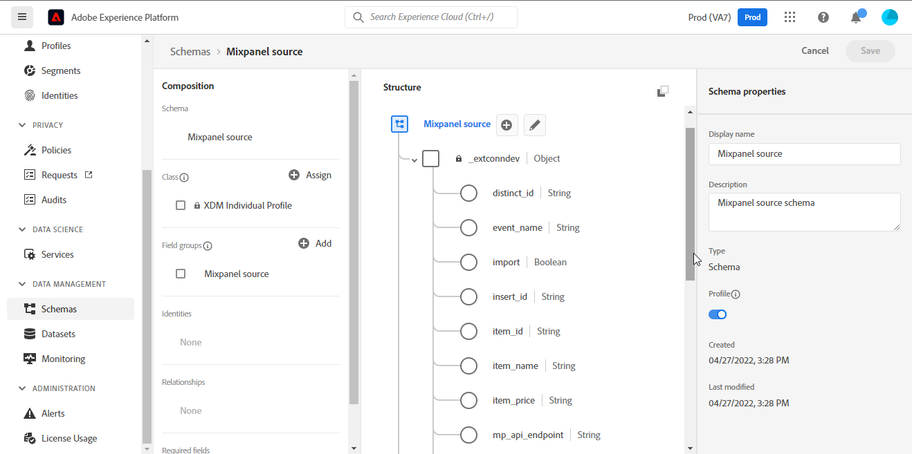

# (Beta) [!DNL Mixpanel]

>[!NOTE]
>
>La [!DNL Mixpanel] la sorgente è in versione beta. Consulta la sezione [panoramica di origini](../../home.md#terms-and-conditions) per ulteriori informazioni sull’utilizzo di origini con etichetta beta.

Adobe Experience Platform consente di acquisire dati da sorgenti esterne e allo stesso tempo di strutturare, etichettare e migliorare i dati in arrivo tramite i servizi Platform. È possibile acquisire dati da diverse sorgenti, come applicazioni di Adobe, archiviazione basata su cloud, database e molti altri.

Experience Platform fornisce il supporto per l’acquisizione di dati da un’applicazione di analisi di terze parti. Il supporto per i provider di analisi include [!DNL Mixpanel].

[[!DNL Mixpanel]](https://www.mixpanel.com) è uno strumento di analisi del prodotto che consente di acquisire dati sul modo in cui gli utenti interagiscono con un prodotto digitale. Mixpanel ti consente di analizzare questi dati del prodotto con report semplici e interattivi che ti consentono di eseguire query e visualizzare i dati con pochi clic.

Le sorgenti sfruttano [API di esportazione degli eventi del pannello multiplo > Scarica](https://developer.mixpanel.com/reference/raw-event-export) per scaricare i dati dell’evento così come vengono ricevuti e memorizzati in [!DNL Mixpanel], insieme a tutte le proprietà dell’evento (tra cui `distinct_id`) e la marca temporale esatta in cui l’evento è stato inviato in Experience Platform. Mixpanel utilizza i token portatori come meccanismo di autenticazione per comunicare con l’API di esportazione degli eventi Mixpanel.

## ELENCO CONSENTITI di indirizzo IP

Prima di utilizzare i connettori sorgente, è necessario aggiungere a un elenco consentiti un elenco di indirizzi IP. Se l’utente non aggiunge all’elenco consentiti gli indirizzi IP specifici per l’area geografica, potrebbero verificarsi errori o prestazioni non soddisfacenti durante l’utilizzo delle origini. Consulta la sezione [ELENCO CONSENTITI di indirizzo IP](../../ip-address-allow-list.md) per ulteriori informazioni.

## Autentica il tuo [!DNL Mixpanel] account

Questa sezione descrive i passaggi preliminari da completare per autenticare l’account e portare il [!DNL Mixpanel] a Platform.

Per creare un [!DNL Mixpanel] connessione di origine e flusso di dati, prima è necessario disporre di un [!DNL Mixpanel] conto. Se non si dispone di una [!DNL Mixpanel] l&#39;account [Registro dei pannelli misti](https://mixpanel.com/register/) per creare il tuo account.

Una volta creata correttamente una [!DNL Mixpanel] account, passa a [!DNL Project Details] nella scheda [!DNL Project Seettings] della pagina [!DNL Mixpanel] per recuperare l’ID del progetto e configurare il fuso orario.

Quindi, passa alla [!DNL Service Accounts] nella scheda [!DNL Project Settings] nella pagina [!DNL Mixpanel] Interfaccia utente per recuperare le credenziali dell’account del servizio.

>[!TIP]
>
>Per una best practice, seleziona un account di servizio che [non scade](https://developer.mixpanel.com/reference/service-accounts#service-account-expiration).

Infine, crea una piattaforma [schema](../../../xdm/schema/composition.md) necessari per [!DNL Mixpanel Event Export API]. Per ulteriori informazioni sulle mappature necessarie per lo schema, consulta la guida in [creazione di un [!DNL Mixpanel] connessione sorgente nell’interfaccia utente](../../tutorials/ui/create/analytics/mixpanel.md#additional-resources).

## Connetti [!DNL Mixpanel] su Platform tramite API

La documentazione seguente fornisce informazioni su come connettersi [!DNL Mixpanel] su Platform utilizzando le API o l’interfaccia utente:

* [Creare una connessione sorgente e un flusso di dati per [!DNL Mixpanel] utilizzo dell’API del servizio di flusso](../../tutorials/api/create/analytics/mixpanel.md)

## Connetti [!DNL Mixpanel] su Platform tramite l’interfaccia utente

* [Crea un [!DNL Mixpanel] connessione sorgente nell’interfaccia utente](../../tutorials/ui/create/analytics/mixpanel.md)
* [Creare un flusso di dati per una connessione sorgente con successo cliente nell’interfaccia utente](../../tutorials/ui/dataflow/analytics.md)
