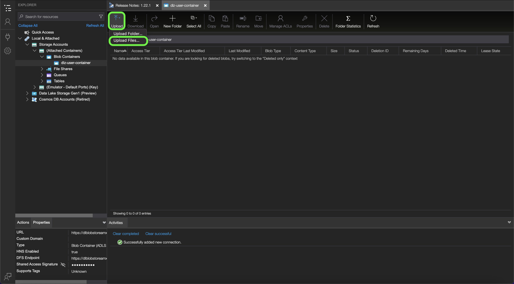

# [!DNL Data Landing Zone]

[!DNL Data Landing Zone] è un [!DNL Azure Blob] l’interfaccia di archiviazione fornita da Adobe Experience Platform consente di accedere a una struttura di archiviazione file sicura basata su cloud per l’importazione di file in Platform. Hai accesso a uno [!DNL Data Landing Zone] Il contenitore per sandbox e il volume totale di dati in tutti i contenitori è limitato ai dati totali forniti con la licenza Platform Products and Services . Tutti i clienti di Platform e dei relativi servizi applicativi, quali [!DNL Customer Journey Analytics], [!DNL Journey Orchestration], [!DNL Intelligent Services]e [!DNL Adobe Real-Time Customer Data Platform] dispongono di un provisioning [!DNL Data Landing Zone] contenitore per sandbox. È possibile leggere e scrivere file nel contenitore attraverso [!DNL Azure Storage Explorer] o l&#39;interfaccia della riga di comando.

[!DNL Data Landing Zone] supporta l’autenticazione basata su SAS e i relativi dati sono protetti con standard [!DNL Azure Blob] meccanismi di sicurezza dello stoccaggio a riposo e in transito. L&#39;autenticazione basata su SAS consente di accedere in modo sicuro ai [!DNL Data Landing Zone] container tramite una connessione internet pubblica. Non sono necessarie modifiche di rete per accedere al [!DNL Data Landing Zone] , il che significa che non è necessario configurare elenchi consentiti o configurazioni di più aree per la rete. Platform applica un TTL (time-to-live) di sette giorni su tutti i file caricati in un [!DNL Data Landing Zone] contenitore. Tutti i file vengono eliminati dopo sette giorni.

## Vincoli di denominazione per file e directory

Di seguito è riportato un elenco di vincoli di cui è necessario tenere conto per la denominazione dei file o delle directory di archiviazione cloud.

- I nomi dei componenti di directory e file non possono superare i 255 caratteri.
- I nomi di directory e file non possono terminare con una barra (`/`). Se fornito, verrà rimosso automaticamente.
- I seguenti caratteri URL riservati devono essere correttamente preceduti: `! ' ( ) ; @ & = + $ , % # [ ]`
- I seguenti caratteri non sono consentiti: `" \ / : | < > * ?`.
- Caratteri di percorso URL non validi. Punti di codice come `\uE000`, anche se valido nei nomi file NTFS, non sono caratteri Unicode validi. Inoltre, alcuni caratteri ASCII o Unicode, come i caratteri di controllo (come `0x00` a `0x1F`, `\u0081`, e così via), non sono consentiti. Per le regole che governano le stringhe Unicode in HTTP/1.1 vedi [RFC 2616, sezione 2.2: Regole di base](https://www.ietf.org/rfc/rfc2616.txt) e [RFC 3987](https://www.ietf.org/rfc/rfc3987.txt).
- I seguenti nomi di file non sono consentiti: LPT1, LPT2, LPT3, LPT4, LPT5, LPT6, LPT7, LPT8, LPT8, LPT9, COM1, COM2, COM3, COM4, COM5, COM6, COM7, COM8, COM9, PRN, AUX, NUL, CON, CLOCK$, carattere punto (..) e due caratteri punto (.).

## Gestire i contenuti [!DNL Data Landing Zone]

È possibile utilizzare [[!DNL Azure Storage Explorer]](https://azure.microsoft.com/en-us/features/storage-explorer/) per gestire i contenuti del [!DNL Data Landing Zone] contenitore.

In [!DNL Azure Storage Explorer] Nell’interfaccia utente, seleziona l’icona di connessione nel menu di navigazione a sinistra. La **Seleziona risorsa** viene visualizzata una finestra in cui sono disponibili le opzioni per la connessione. Seleziona **[!DNL Blob container]** per connettersi a [!DNL Data Landing Zone].


Quindi, seleziona **URL firma di accesso condiviso (SAS)** come metodo di connessione, quindi selezionare **Successivo**.


Dopo aver selezionato il metodo di connessione, è necessario fornire un **nome visualizzato** e **[!DNL Blob]URL SAS contenitore** che corrisponde al tuo [!DNL Data Landing Zone] contenitore.

>[!TIP]
>
>È possibile recuperare [!DNL Data Landing Zone] credenziali dal catalogo origini nell’interfaccia utente di Platform.

Fornisci le [!DNL Data Landing Zone] URL SAS, quindi selezionare **Successivo**


La **Riepilogo** viene visualizzata una finestra che fornisce una panoramica delle impostazioni, incluse informazioni sulle [!DNL Blob] endpoint e autorizzazioni. Quando è pronto, seleziona **Connetti**.


Una connessione corretta aggiorna la [!DNL Azure Storage Explorer] Interfaccia utente con [!DNL Data Landing Zone] contenitore.


Con il tuo [!DNL Data Landing Zone] contenitore collegato a [!DNL Azure Storage Explorer], ora puoi iniziare a caricare i file sul tuo [!DNL Data Landing Zone] contenitore. Per caricare, seleziona **Carica** quindi seleziona **Carica file**.



Dopo aver selezionato il file da caricare, devi identificare il [!DNL Blob] digita come e nella directory di destinazione desiderata. Al termine, seleziona **Carica**.

| [!DNL Blob] type | Descrizione |
| --- | --- |
| Blocco [!DNL Blob] | Blocco [!DNL Blobs] sono ottimizzati per caricare grandi quantità di dati in modo efficiente. Blocco [!DNL Blobs] sono l’opzione predefinita per [!DNL Data Landing Zone]. |
| Aggiungi [!DNL Blob] | Aggiungi [!DNL Blobs] sono ottimizzati per aggiungere dati alla fine del file. |


## Carica i file nel tuo [!DNL Data Landing Zone] utilizzo dell’interfaccia della riga di comando

Puoi anche utilizzare l&#39;interfaccia della riga di comando del tuo dispositivo e accedere ai file di caricamento sul tuo [!DNL Data Landing Zone].

### Caricare un file utilizzando Bash

L’esempio seguente utilizza Bash e cURL per caricare un file in un [!DNL Data Landing Zone] con [!DNL Azure Blob Storage] API REST:

```shell
# Set Azure Blob-related settings
DATE_NOW=$(date -Ru | sed 's/\+0000/GMT/')
AZ_VERSION="2018-03-28"
AZ_BLOB_URL="<URL TO BLOB ACCOUNT>"
AZ_BLOB_CONTAINER="<BLOB CONTAINER NAME>"
AZ_BLOB_TARGET="${AZ_BLOB_URL}/${AZ_BLOB_CONTAINER}"
AZ_SAS_TOKEN="<SAS TOKEN, STARTING WITH ? AND ENDING WITH %3D>"

# Path to the file we wish to upload
FILE_PATH="</PATH/TO/FILE>"
FILE_NAME=$(basename "$FILE_PATH")

# Execute HTTP PUT to upload file (remove '-v' flag to suppress verbose output)
curl -v -X PUT \
   -H "Content-Type: application/octet-stream" \
   -H "x-ms-date: ${DATE_NOW}" \
   -H "x-ms-version: ${AZ_VERSION}" \
   -H "x-ms-blob-type: BlockBlob" \
   --data-binary "@${FILE_PATH}" "${AZ_BLOB_TARGET}/${FILE_NAME}${AZ_SAS_TOKEN}"
```

### Caricare un file utilizzando Python

Nell&#39;esempio seguente viene utilizzato [!DNL Microsoft's] SDK Python v12 per caricare un file in un [!DNL Data Landing Zone]:

>[!TIP]
>
>Mentre l&#39;esempio seguente utilizza l&#39;URI SAS completo per connettersi a un [!DNL Azure Blob] è possibile utilizzare altri metodi e operazioni per l&#39;autenticazione. Vedi questo [[!DNL Microsoft] documento sull’SDK Python v12](https://docs.microsoft.com/en-us/azure/storage/blobs/storage-quickstart-blobs-python) per ulteriori informazioni.

```py
import os
from azure.storage.blob import ContainerClient

try:
    # Set Azure Blob-related settings
    sasUri = "<SAS URI>"
    srcFilePath = "<FULL PATH TO FILE>" 
    srcFileName = os.path.basename(srcFilePath)

    # Connect to container using SAS URI
    containerClient = ContainerClient.from_container_url(sasUri)

    # Upload file to Data Landing Zone with overwrite enabled
    with open(srcFilePath, "rb") as fileToUpload:
        containerClient.upload_blob(srcFileName, fileToUpload, overwrite=True)

except Exception as ex:
    print("Exception: " + ex.strerror)
```

### Caricare un file utilizzando [!DNL AzCopy]

Nell&#39;esempio seguente viene utilizzato [!DNL Microsoft's] [!DNL AzCopy] utilità per caricare un file in un [!DNL Data Landing Zone]:

>[!TIP]
>
>Mentre l’esempio seguente utilizza la variabile `copy` puoi utilizzare altri comandi e opzioni per caricare un file nel tuo [!DNL Data Landing Zone], utilizzando [!DNL AzCopy]. Vedi questo [[!DNL Microsoft AzCopy] documento](https://docs.microsoft.com/en-us/azure/storage/common/storage-ref-azcopy?toc=/azure/storage/blobs/toc.json) per ulteriori informazioni.

```bat
set sasUri=<FULL SAS URI, PROPERLY ESCAPED>
set srcFilePath=<PATH TO LOCAL FILE(S); WORKS WITH WILDCARD PATTERNS>

azcopy copy "%srcFilePath%" "%sasUri%" --overwrite=true --recursive=true
```

## Connetti [!DNL Data Landing Zone] a [!DNL Platform]

La documentazione seguente fornisce informazioni su come estrarre i dati dal tuo [!DNL Data Landing Zone] in Adobe Experience Platform utilizzando le API o l’interfaccia utente.

### Utilizzo delle API

- [Crea un [!DNL Data Landing Zone] connessione sorgente tramite l’API del servizio di flusso](../../tutorials/api/create/cloud-storage/data-landing-zone.md)
- [Creare un flusso di dati per un’origine di archiviazione cloud utilizzando l’API del servizio di flusso](../../tutorials/api/collect/cloud-storage.md)

### Utilizzo dell’interfaccia

- [Connetti [!DNL Data Landing Zone] su Platform tramite l’interfaccia utente](../../tutorials/ui/create/cloud-storage/data-landing-zone.md)
- [Creare un flusso di dati per una connessione di archiviazione cloud nell’interfaccia utente](../../tutorials/ui/dataflow/batch/cloud-storage.md)
