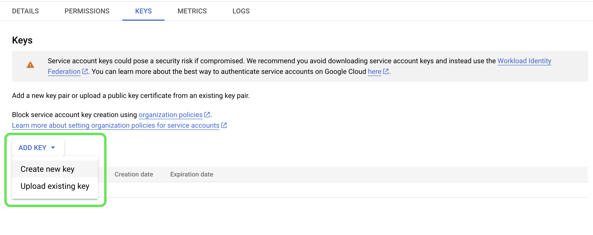

# Origine [!DNL Google PubSub]

>[!IMPORTANT]
>
>L&#39;origine [!DNL Google PubSub] è disponibile nel catalogo delle origini per gli utenti che hanno acquistato Real-time Customer Data Platform Ultimate.

Adobe Experience Platform fornisce connettività nativa per i provider di cloud come [!DNL AWS], [!DNL Google Cloud Platform] e [!DNL Azure], consentendo di inserire in Platform i dati di tali sistemi per utilizzarli nei servizi e nelle destinazioni downstream.

Le origini di archiviazione cloud possono inserire i dati in Platform senza dover scaricare, formattare o caricare. I dati acquisiti possono essere formattati come XDM JSON, XDM Parquet o delimitati. Ogni fase del processo viene integrata nel flusso di lavoro delle origini. Platform consente di inserire dati da [!DNL Google PubSub] in tempo reale.

## Prerequisiti {#prerequisites}

Questa sezione descrive i prerequisiti che è necessario completare prima di collegare l&#39;account [!DNL Google PubSub] all&#39;Experience Platform.

### Crea account del servizio {#create-service-account}

Un account del servizio **1} è un tipo di account spesso utilizzato da un&#39;applicazione o da un carico di lavoro di calcolo, anziché da una persona.** Un account di servizio è identificato dal relativo indirizzo e-mail, che è univoco per l’account.

* Da un lato, gli account del servizio sono **entità**. È possibile concedere agli account del servizio l&#39;accesso alle risorse [!DNL Google Cloud]. Ad esempio, è possibile concedere a un account di servizio il ruolo Amministratore di calcolo `(roles/compute.admin)` per un determinato progetto. Questo consente all’account del servizio di gestire le risorse del motore di calcolo in quel particolare progetto.
* D&#39;altra parte, gli account del servizio sono anche risorse: è possibile concedere ad altri utenti/gruppi/ruoli l&#39;autorizzazione per accedere all&#39;account del servizio. Ad esempio, è possibile concedere a un utente il ruolo Utente account di servizio `(roles/iam.serviceAccountUser)` per un account di servizio per consentire all&#39;utente di associare tale account di servizio alle risorse. In alternativa, è possibile concedere a un utente il ruolo di amministratore dell&#39;account di servizio `(roles/iam.serviceAccountAdmin)` per consentire all&#39;utente di completare attività quali visualizzare, modificare, disabilitare ed eliminare l&#39;account di servizio.

Per ulteriori informazioni sulla determinazione del tipo di autenticazione corretto per il caso d&#39;uso, leggere la [[!DNL Google] guida sui metodi di autenticazione](https://cloud.google.com/docs/authentication).

Per creare un account di servizio, attenersi alla procedura descritta di seguito.

Passare innanzitutto alla pagina [!DNL IAM] di [!DNL Google Developer Console] e quindi selezionare **[!DNL Create Service Account]**.

Immettere un nome visualizzato e un ID per l&#39;account del servizio, quindi selezionare **[!DNL Create and Continue]**.

### Genera chiavi account del servizio {#generate-service-account-keys}

Per generare le chiavi per l&#39;account di servizio, selezionare l&#39;intestazione delle chiavi nella pagina Account di servizio. Selezionare **[!DNL Add key]**, quindi **[!DNL Create new key]** dal menu a discesa. Puoi anche utilizzare questo pannello per caricare una chiave esistente.

Se l&#39;operazione ha esito positivo, verrà visualizzato un messaggio che indica che la chiave privata è stata salvata nel computer e che verrà scaricato un file. È quindi possibile utilizzare il contenuto del file come credenziali durante la creazione dell&#39;account [!DNL Google PubSub] in Experience Platform.

### Concedere le autorizzazioni a livello di argomento e di abbonamento {#grant-permissions}

Per concedere le autorizzazioni a livello di argomento e di sottoscrizione, passare alla pagina della console argomenti e selezionare **[!DNL Show info panel]**. Quindi, nella scheda [!DNL Permissions], selezionare [!DNL Add Principal] e aggiungere l&#39;entità account del servizio insieme alle autorizzazioni.

## Configurazioni per [!DNL Google PubSub usage] ottimale {#optimal-configurations}

Questa sezione descrive le configurazioni che si consiglia di effettuare per ottimizzare l&#39;utilizzo dell&#39;origine [!DNL Google PubSub] su Experience Platform.

### Proprietà abbonamento {#subscription-properties}

Utilizza [!DNL Google Developer Console] per **aumentare la scadenza della conferma**. Questo consente a [!DNL Google Publisher] di attendere in base al tempo configurato prima di inviare nuovamente il messaggio. Questo ritardo consente di ridurre il carico superfluo a livello di abbonato.

Abilita **[!DNL exactly one delivery]**. Questa configurazione informa [!DNL Google Publisher] per garantire che i messaggi inviati all&#39;abbonamento non vengano inviati nuovamente prima della scadenza della conferma. È possibile utilizzare questa impostazione per assicurarsi che i messaggi di conferma non vengano inviati nuovamente all&#39;abbonamento.

È possibile abilitare **[!DNL Retry after exponential backoff delay]** per ridurre il rischio di sovraccaricare ulteriormente il server. È possibile abilitare questa configurazione in [!DNL Google Developer Console] per mitigare meglio gli errori temporanei (errori temporanei che in genere si risolvono da soli), fornendo al sistema più tempo per il ripristino prima di tentare un&#39;altra connessione.

È necessario **impostare la durata di conservazione dei messaggi dell&#39;abbonamento su 24 ore o più** per evitare che i dati non riconosciuti vadano persi durante i picchi di carico. Inoltre, **abilita un argomento lettera non recapitabile** per garantire che la perdita di dati non si verifichi anche durante rari casi edge.

>[!IMPORTANT]
>
>È possibile creare un solo flusso di dati di origine per ogni sottoscrizione [!DNL Google PubSub]. Il riutilizzo di un abbonamento, anche tra sandbox diverse, comporta la perdita di dati.

## Connetti [!DNL Google PubSub] a Experience Platform

La documentazione seguente fornisce informazioni su come connettere [!DNL Google PubSub] a Platform tramite API o tramite l&#39;interfaccia utente:

### Utilizzo delle API

* [Creare una connessione sorgente PubSub di Google utilizzando l’API del servizio Flusso](../../tutorials/api/create/cloud-storage/google-pubsub.md)
* [Raccogliere dati in streaming utilizzando l’API del servizio Flusso](../../tutorials/api/collect/streaming.md)

### Utilizzo dell’interfaccia utente

* [Creare una connessione sorgente PubSub di Google nell’interfaccia utente](../../tutorials/ui/create/cloud-storage/google-pubsub.md)
* [Configurare un flusso di dati per una connessione all’archiviazione cloud nell’interfaccia utente](../../tutorials/ui/dataflow/streaming/cloud-storage-streaming.md)
