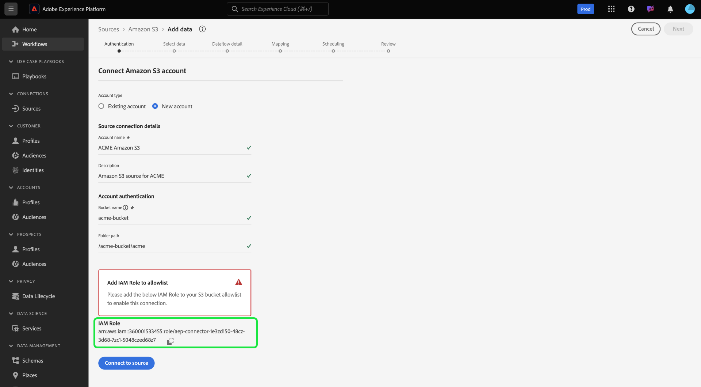

# Origine [!DNL Amazon S3]

>[!IMPORTANT]
>
>È ora possibile utilizzare l&#39;origine [!DNL Amazon S3] quando si esegue Adobe Experience Platform su Amazon Web Services (AWS). Experience Platform in esecuzione su AWS è attualmente disponibile per un numero limitato di clienti. Per ulteriori informazioni sull&#39;infrastruttura Experience Platform supportata, consulta la [Panoramica multi-cloud di Experience Platform](../../../landing/multi-cloud.md).

Adobe Experience Platform fornisce connettività nativa per i provider di cloud come AWS, [!DNL Google Cloud Platform] e [!DNL Azure]. Puoi inserire in Experience Platform i dati provenienti da questi sistemi.

Le origini di archiviazione cloud possono inserire i tuoi dati in Experience Platform senza dover scaricare, formattare o caricare. I dati acquisiti possono essere formattati come XDM JSON, XDM Parquet o delimitati. Ogni passaggio del processo viene integrato nel flusso di lavoro Origini. Experience Platform consente di inserire dati da S3 tramite batch.

## Configura l&#39;origine [!DNL Amazon S3] per Experience Platform su Azure {#azure}

Segui i passaggi seguenti per scoprire come configurare l&#39;account [!DNL Amazon S3] per Experience Platform su Azure.

### Indirizzo IP in cui è inserita nell&#39;elenco Consentiti la connessione in Azure

Prima di collegare le origini a Experience Platform in Azure, è necessario aggiungere al elenco Consentiti di indirizzi IP specifici per l’area geografica. Per ulteriori informazioni, leggere la guida in [inserire nell&#39;elenco Consentiti degli indirizzi IP per la connessione ad Experience Platform in Azure](../../ip-address-allow-list.md).

### Vincoli di denominazione per file e directory

Di seguito è riportato un elenco di vincoli di cui è necessario tenere conto per la denominazione del file di archiviazione cloud o della directory.

- I nomi dei componenti di directory e file non possono superare i 255 caratteri.
- I nomi di file e directory non possono terminare con una barra (`/`). Se fornito, verrà rimosso automaticamente.
- I seguenti caratteri URL riservati devono essere correttamente preceduti dall&#39;escape: `! ' ( ) ; @ & = + $ , % # [ ]`
- I seguenti caratteri non sono consentiti: `" \ / : | < > * ?`.
- Caratteri di percorso URL non validi non consentiti. I punti di codice come `\uE000`, sebbene validi nei nomi di file NTFS, non sono caratteri Unicode validi. Inoltre, alcuni caratteri ASCII o Unicode, come i caratteri di controllo (da 0x00 a 0x1F, \u0081, ecc.), non sono consentiti. Per le regole che regolano le stringhe Unicode in HTTP/1.1, vedere [RFC 2616, Sezione 2.2: Regole di base](https://www.ietf.org/rfc/rfc2616.txt) e [RFC 3987](https://www.ietf.org/rfc/rfc3987.txt).
- Non sono consentiti i seguenti nomi di file: LPT1, LPT2, LPT3, LPT4, LPT5, LPT6, LPT7, LPT8, LPT9, COM1, COM2, COM3, COM4, COM5, COM6, COM7, COM8, COM9, PRN, AUX, NUL, CON, CLOCK$, carattere punto (.) e due caratteri punto (..).

### Configura autorizzazioni su [!DNL Amazon S3]

Per acquisire una singola directory con S3, è necessario creare un utente [!DNL Identity and Access Management] (IAM) per Experience Platform nella console S3 e assegnare le autorizzazioni per le azioni seguenti:

- `s3:GetObject`
- `s3:GetObjectVersion`

Per esplorare e testare la connettività sono necessarie anche le seguenti autorizzazioni:

- `s3:ListAllMyBuckets`
- `s3:ListBucket`
- `s3:GetBucketLocation`

Un percorso di file come `myBucket/folder/subfolder/subsubfolder/abc.csv` può comportare l&#39;accesso solo a `subsubfolder/abc.csv`. Se desideri accedere alla sottocartella, puoi specificare il parametro `bucket` nella console S3 come `myBucket` e il `folderPath` come `folder/subfolder` per garantire che l&#39;esplorazione dei file inizi alle `subfolder` anziché alle `subsubfolder/abc.csv`.

### Usa credenziali di sicurezza temporanee per connettere [!DNL Amazon S3]

È possibile connettere [!DNL Amazon S3] con credenziali di sicurezza temporanee utilizzando `s3SessionToken`. Ciò consente di connettere [!DNL Amazon S3] ad Experience Platform senza dover creare credenziali IAM permanenti con [!DNL Amazon Web Services] o fornire l&#39;accesso al bucket [!DNL Amazon S3] agli utenti in ambienti non attendibili.

Le credenziali di sicurezza temporanee funzionano in modo simile alle normali credenziali chiave di accesso a lungo termine, tranne per il fatto che è possibile configurare una data di scadenza più breve per le credenziali temporanee. Le scadenze possono essere impostate su pochi minuti dopo l’attivazione o su diverse ore. Inoltre, le credenziali temporanee non sono contenute con l’utente. Ciò significa che è necessario richiedere un nuovo set di credenziali temporanee alla scadenza.

Per i passaggi su come generare il token di sessione temporaneo, consulta questo [[!DNL AWS] documento sui token di sessione temporanei](https://docs.aws.amazon.com/IAM/latest/UserGuide/id_credentials_temp_request.html#api_getsessiontoken).

## Configura l&#39;origine [!DNL Amazon S3] per Experience Platform su Amazon Web Services {#aws}

>[!AVAILABILITY]
>
>Questa sezione si applica alle implementazioni di Experience Platform in esecuzione su Amazon Web Services (AWS). Experience Platform in esecuzione su AWS è attualmente disponibile per un numero limitato di clienti. Per ulteriori informazioni sull&#39;infrastruttura Experience Platform supportata, consulta la [Panoramica multi-cloud di Experience Platform](../../../landing/multi-cloud.md).

Segui i passaggi seguenti per scoprire come configurare l&#39;account [!DNL Amazon S3] per Experience Platform su Amazon Web Services (AWS).

### Prerequisiti

Per connettere l&#39;account [!DNL Amazon S3] ad Experience Platform su AWS, è necessario disporre dei seguenti elementi:

- Un account AWS con accesso al bucket o alla cartella [!DNL Amazon S3] che si desidera connettere.
- Le autorizzazioni IAM necessarie che consentono `s3:GetObject` e `s3:ListBucket` azioni.

### Indirizzo IP da inserire nell&#39;elenco Consentiti per la connessione su AWS

Prima di collegare le origini a Experience Platform su AWS, è necessario aggiungere al elenco Consentiti di indirizzi IP specifici per l’area geografica. Per ulteriori informazioni, leggere la guida su [inserire nell&#39;elenco Consentiti degli indirizzi IP per la connessione ad Experience Platform su AWS](../../ip-address-allow-list.md).

### Accedere all&#39;origine [!DNL Amazon S3] nell&#39;interfaccia utente

- Passa al catalogo delle origini nell’interfaccia utente di Experience Platform.
- Selezionare [!DNL Amazon S3] e quindi **[!UICONTROL Nuovo account]**.
- Copiare il **Ruolo IAM** elencato in [!UICONTROL Aggiungi ruolo IAM al inserisco nell&#39;elenco Consentiti di]. In seguito utilizzerai questo ruolo IAM per impostare le autorizzazioni per il bucket [!DNL Amazon S3].



### Impostare le autorizzazioni

Devi configurare le autorizzazioni necessarie nel bucket [!DNL Amazon S3] per acquisire correttamente i dati da un&#39;area geografica di AWS. Il criterio del bucket a cui desideri accedere deve essere associato alle credenziali in uso.

Per aggiornare il bucket [!DNL Amazon S3], effettua le seguenti operazioni:

- Accedi al tuo account in [AWS Management Console](https://aws.amazon.com/).
- Passa al bucket [!DNL Amazon S3] e seleziona **[!DNL Permissions]**.
- Modifica il criterio bucket e aggiungi le seguenti autorizzazioni:

>[!TIP]
>
>Assicurarsi di aggiornare il valore per `AWS` con il proprio ruolo IAM e il valore per `Resource` con il bucket o la cartella [!DNL Amazon S3].

```json
{
    "Version": "2012-10-17",
    "Statement": [
        {
            "Sid": "AEP Get Object Related Policy Prod",
            "Effect": "Allow",
            "Principal": {
                "AWS": "{IAM_ROLE_TO_ALLOW_LIST}"
            },
            "Action": "s3:Get*",
            "Resource": "arn:aws:s3:::{YOUR_BUCKET_NAME}/{YOUR_FOLDER_NAME}"
        },
        {
            "Sid": "AEP List Bucket Prod",
            "Effect": "Allow",
            "Principal": {
                "AWS": "{IAM_ROLE_TO_ALLOW_LIST}"
            },
            "Action": "s3:ListBucket",
            "Resource": "arn:aws:s3:::{YOUR_BUCKET_NAME}"
        }
    ]
}  
```

### Fornisci i dettagli della connessione a [!DNL Amazon S3] e convalida e finalizza la connessione

Dopo aver configurato le autorizzazioni, torna al catalogo delle origini nell&#39;interfaccia utente di Experience Platform e passa alla pagina di configurazione dell&#39;origine [!DNL Amazon S3]. Specifica il nome del bucket [!DNL Amazon S3] a cui desideri connetterti e, se applicabile, fornisci il percorso della cartella specifica all&#39;interno del bucket. Per verificare la configurazione, selezionare **[!UICONTROL Verifica connessione]**. In caso di esito positivo, puoi quindi procedere e [creare un flusso di dati per acquisire i dati di archiviazione cloud in Experience Platform](../../tutorials/ui/dataflow/batch/cloud-storage.md).

## Passaggi successivi

La documentazione seguente fornisce informazioni su come connettere [!DNL Amazon S3] ad Experience Platform tramite API o tramite l&#39;interfaccia utente:

### Connetti [!DNL Amazon S3] ad Experience Platform utilizzando l&#39;API

- [Connettere Amazon S3 ad Experience Platform utilizzando l’API del servizio Flusso](../../tutorials/api/create/cloud-storage/s3.md)
- [Esplorare la struttura dati e il contenuto di un’origine di archiviazione cloud utilizzando l’API del servizio Flusso](../../tutorials/api/explore/cloud-storage.md)
- [Creare un flusso di dati per un’origine di archiviazione cloud utilizzando l’API del servizio Flusso](../../tutorials/api/collect/cloud-storage.md)

### Connetti [!DNL Amazon S3] ad Experience Platform tramite l&#39;interfaccia utente

- [Creare una connessione sorgente Amazon S3 nell’interfaccia utente](../../tutorials/ui/create/cloud-storage/s3.md)
- [Creare un flusso di dati per una connessione all’archiviazione cloud nell’interfaccia utente](../../tutorials/ui/dataflow/batch/cloud-storage.md)