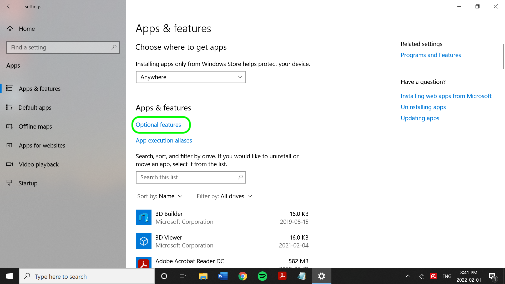

# Connettore SFTP

Adobe Experience Platform consente di acquisire i dati da origini esterne e allo stesso tempo di strutturare, etichettare e migliorare i dati in arrivo tramite i servizi di Platform. È possibile acquisire dati da diverse origini, ad esempio applicazioni Adobe, archiviazione basata su cloud, database e molte altre.

Leggere questo documento per i passaggi preliminari da completare per connettere correttamente l&#39;account [!DNL SFTP] all&#39;Experience Platform.

>[!TIP]
>
>Prima di connettersi, devi disattivare l’autenticazione interattiva da tastiera nella configurazione del server SFTP. La disattivazione dell’impostazione consente l’immissione manuale delle password anziché l’immissione tramite un servizio o un programma.

## Prerequisiti {#prerequisites}

Leggere questa sezione per i passaggi preliminari da completare per connettere correttamente l&#39;origine [!DNL SFTP] all&#39;Experience Platform.

### ELENCO CONSENTITI di indirizzo IP

Prima di utilizzare i connettori di origine, è necessario aggiungere un elenco di indirizzi IP a un elenco consentiti. La mancata aggiunta all’elenco consentiti degli indirizzi IP specifici per l’area geografica potrebbe causare errori o prestazioni non ottimali durante l’utilizzo delle origini. Per ulteriori informazioni, vedere la pagina [elenco consentiti indirizzo IP](../../ip-address-allow-list.md).

### Vincoli di denominazione per file e directory

Di seguito è riportato un elenco di vincoli di cui è necessario tenere conto per la denominazione del file di archiviazione cloud o della directory.

* I nomi dei componenti di directory e file non possono superare i 255 caratteri.
* I nomi di file e directory non possono terminare con una barra (`/`). Se fornito, verrà rimosso automaticamente.
* I seguenti caratteri URL riservati devono essere correttamente preceduti dall&#39;escape: `! ' ( ) ; @ & = + $ , % # [ ]`
* I seguenti caratteri non sono consentiti: `" \ / : | < > * ?`.
* Caratteri di percorso URL non validi non consentiti. I punti di codice come `\uE000`, sebbene validi nei nomi di file NTFS, non sono caratteri Unicode validi. Inoltre, alcuni caratteri ASCII o Unicode, come i caratteri di controllo (da 0x00 a 0x1F, \u0081, ecc.), non sono consentiti. Per le regole che regolano le stringhe Unicode in HTTP/1.1, vedere [RFC 2616, Sezione 2.2: Regole di base](https://www.ietf.org/rfc/rfc2616.txt) e [RFC 3987](https://www.ietf.org/rfc/rfc3987.txt).
* Non sono consentiti i seguenti nomi di file: LPT1, LPT2, LPT3, LPT4, LPT5, LPT6, LPT7, LPT8, LPT9, COM1, COM2, COM3, COM4, COM5, COM6, COM7, COM8, COM9, PRN, AUX, NUL, CON, CLOCK$, carattere punto (.) e due caratteri punto (..).

### Imposta una chiave privata OpenSSH con codifica Base64 per [!DNL SFTP]

L&#39;origine [!DNL SFTP] supporta l&#39;autenticazione utilizzando la chiave privata OpenSSH con codifica [!DNL Base64]. Per informazioni su come generare la chiave privata OpenSSH con codifica Base64 e connettere [!DNL SFTP] a Platform, consulta i passaggi seguenti.

>[!BEGINTABS]

>[!TAB Windows]

### [!DNL Windows] utenti

Se utilizzi un computer [!DNL Windows], apri il menu **Avvia** e seleziona **Impostazioni**.


Dal menu **Impostazioni** visualizzato, selezionare **App**.


Selezionare **Funzioni facoltative**.



Viene visualizzato un elenco di feature facoltative. Se **OpenSSH Client** è già preinstallato nel computer, verrà incluso nell&#39;elenco **Funzioni installate** in **Funzioni facoltative**.


Se non è installato, selezionare **Installa**, quindi aprire **[!DNL Powershell]** ed eseguire il comando seguente per generare la chiave privata:

```shell
PS C:\Users\lucy> ssh-keygen -t rsa -m pem
Generating public/private rsa key pair.
Enter file in which to save the key (C:\Users\lucy/.ssh/id_rsa):
Enter passphrase (empty for no passphrase):
Enter same passphrase again:
Your identification has been saved in C:\Users\lucy/.ssh/id_rsa.
Your public key has been saved in C:\Users\lucy/.ssh/id_rsa.pub.
The key fingerprint is:
SHA256:osJ6Lg0TqK8nekNQyZGMoYwfyxNc+Wh0hYBtBylXuGk lucy@LAPTOP-FUJT1JEC
The key's randomart image is:
+---[RSA 3072]----+
|.=.*+B.o.        |
|=.O.O +          |
|+o+= B           |
|+o +E .          |
|.o=o  . S        |
|+... . .         |
| *o .            |
|o.B.             |
|=O..             |
+----[SHA256]-----+
```

Eseguire quindi il comando seguente durante l&#39;immissione del percorso del file della chiave privata, per codificare la chiave privata in [!DNL Base64]:

```shell
C:\Users\lucy> [convert]::ToBase64String((Get-Content -path "C:\Users\lucy\.ssh\id_rsa" -Encoding byte)) > C:\Users\lucy\.ssh\id_rsa_base64
```

Il comando precedente salva la chiave privata con codifica [!DNL Base64] nel percorso del file designato. È quindi possibile utilizzare la chiave privata per l&#39;autenticazione in [!DNL SFTP] e la connessione a Platform.

>[!TAB Mac]

### [!DNL Mac] utenti

Se si utilizza un [!DNL Mac], aprire **Terminal** ed eseguire il comando seguente per generare la chiave privata (in questo caso, la chiave privata verrà salvata in `/Documents/id_rsa`):

```shell
ssh-keygen -t rsa -m pem -f ~/Documents/id_rsa
Generating public/private rsa key pair.
Enter passphrase (empty for no passphrase):
Enter same passphrase again:
Your identification has been saved in /Users/vrana/Documents/id_rsa.
Your public key has been saved in /Users/vrana/Documents/id_rsa.pub.
The key fingerprint is:
SHA256:s49PCaO4a0Ee8I7OOeSyhQAGc+pSUQnRii9+5S7pp1M vrana@vrana-macOS
The key's randomart image is:
+---[RSA 2048]----+
|o ==..           |
|.+..o            |
|oo.+             |
|=.. +            |
|oo = .  S        |
|+.+ +E . = .     |
|o*..*.. . o      |
|.o*=.+   +       |
|.oo=Oo  ..o      |
+----[SHA256]-----+
```

Eseguire quindi il comando seguente per codificare la chiave privata in [!DNL Base64]:

```shell
base64 ~/Documents/id_rsa > ~/Documents/id_rsa_base64
 
 
# Print Content of base64 encoded file
cat ~/Documents/id_rsa_base64
LS0tLS1CRUdJTiBPUEVOU1NIIFBSSVZBVEUgS0VZLS0tLS0KYjNCbGJuTnphQzFyWlhrdGRqRUFBQUFBQkc1dmJtVUFBQUFFYm05dVpRQUFBQUFBQUFBQkFBQUJGd0FBQUFkemMyZ3RjbgpOaEFBQUFBd0VBQVFBQUFRRUF0cWFYczlXOUF1ZmtWazUwSXpwNXNLTDlOMU9VYklaYXVxbVM0Q0ZaenI1NjNxUGFuN244CmFxZWdvQTlCZnVnWDJsTVpGSFl5elEzbnp6NXdXMkdZa1hkdjFjakd0elVyNyt1NnBUeWRneGxrOGRXZWZsSzBpUlpYWW4KVFRwS0E5c2xXaHhjTXg3R2x5ejdGeDhWSzI3MmdNSzNqY1d1Q0VIU3lLSFR5SFFwekw0MEVKbGZJY1RGR1h1dW1LQjI5SwpEakhwT1grSDdGcG5Gd1pabTA4Uzc2UHJveTVaMndFalcyd1lYcTlyUDFhL0E4ejFoM1ZLdllzcG53c2tCcHFQSkQ1V3haCjczZ3M2OG9sVllIdnhWajNjS3ZsRlFqQlVFNWRNUnB2M0I5QWZ0SWlrYmNJeUNDaXV3UnJmbHk5eVNPQ2VlSEc0Z2tUcGwKL3V4YXNOT0h1d0FBQThqNnF6R1YrcXN4bFFBQUFBZHpjMmd0Y25OaEFBQUJBUUMycHBlejFiMEM1K1JXVG5Rak9ubXdvdgowM1U1UnNobHE2cVpMZ0lWbk92bnJlbzlxZnVmeHFwNkNnRDBGKzZCZmFVeGtVZGpMTkRlZlBQbkJiWVppUmQyL1Z5TWEzCk5TdnY2N3FsUEoyREdXVHgxWjUrVXJTSkZsZGlkTk9rb0QyeVZhSEZ3ekhzYVhMUHNYSHhVcmJ2YUF3cmVOeGE0SVFkTEkKb2RQSWRDbk12alFRbVY4aHhNVVplNjZZb0hiMG9PTWVrNWY0ZnNXbWNYQmxtYlR4THZvK3VqTGxuYkFTTmJiQmhlcjJzLwpWcjhEelBXSGRVcTlpeW1mQ3lRR21vOGtQbGJGbnZlQ3pyeWlWVmdlL0ZXUGR3cStVVkNNRlFUbDB4R20vY0gwQiswaUtSCnR3aklJS0s3Qkd0K1hMM0pJNEo1NGNiaUNST21YKzdGcXcwNGU3QUFBQUF3RUFBUUFBQVFBcGs0WllzMENSRnNRTk9WS0sKYWxjazlCVDdzUlRLRjFNenhrSGVydmpJYk9kL0lvRXpkcHlVa28rbm41RmpGK1hHRnNCUXZnOFdTaUlJTk1oU3BNYWI1agpvWXlka2gvd0ovWElOaDlZaE5QVXlURi9NNkFnMkNYd21KS2RxN1VKWjZyNjloV3V0VVN6U05QbkVYWTZLc29GeVUwTEFvCko0OHJMT1pMZldtMHFhWDBLNUgzNmJPaHFXSWJwMDNoZk94eno5M0MrSDM5MFJkRkp4bzJVZ0FVY3UvdHREb0REVldBdmEKVkVyMWEzak9LenVHbThrK21WeXpPZERjVFY4ckZIT0pwRnRBU3l6Q24yVld1MjV0TWtrcGRPRjNKcVdMZHdOY3loeG1URApXZGVDNWh4V0Fiano0WDZ5WXpHcFcwTmptVkFoWUVVZGNBSVlXWWM3OGEvQkFBQUFnRm8wakl4aGhwZkJ6QjF6b09FMDJBClpjTC9hcUNuYysrdmJ1a2V0aFg5Zzhlb0xQMTQyeUgzdlpLczl3c1RtbVVsZ0prZURaN2hUcklwOGY2eEwzdDRlMXByY1kKb2ZLd0gwckNGOTFyaldPbGZOUmxEempoR1NTTEVMczZoNlNzMEdBQXE2Z0ZQTVF2dTB4TDlQUTlGQ21YZVVKazJpRm1MWgpEWWJGc0NyVUxEQUFBQWdRRGF0a1pMamJaSTBFM0ZuY2dTOVF5Y3lVWmtkZ1dVNjBQcG9ud3BMQXdUdHRpOG1EQXE5cHYwClEvUlk1WE9UeGF3VXNHa0tYMjNtV1BYR0grdUlBSzhrelVVM2dGM1dRWGVkTWw4NHVCVFZCTEtUdStvVVAvZmIvMEE0dE0KSE9BSythbXZPMkZuYzFiSmVwd05USTE2cjZXWk9sZWV2ZklJQVpXcEgxVVpIdkVRQUFBSUVBMWNwcStDNUVXSFJwbnVPZQpiNHE4T0tKTlJhSUxIRUN6U0twWlFpZDFhRmJYWlVKUXpIQU85YzhINVZMcjBNUjFkcW1ORkNja2ZsZzI2Y3BEUEl3TjBYCm5HMFBxcmhKbXp0U3ZQZ3NGdkNPallncXF6U0RYUjkxd1JQTEN5cU8zcGMyM2kzZnp2WkhtMGhIdWdoNVJqV0loUlFZVkwKZUpDWHRqM08vY3p1SWdzQUFBQVJkbkpoYm1GQWRuSmhibUV0YldGalQxTUJBZz09Ci0tLS0tRU5EIE9QRU5TU0ggUFJJVkFURSBLRVktLS0tLQo=
```

Una volta salvata la chiave privata con codifica [!DNL Base64] nella cartella designata, è necessario aggiungere il contenuto del file della chiave pubblica a una nuova riga nelle chiavi autorizzate dell&#39;host [!DNL SFTP]. Esegui il comando seguente sulla riga di comando:

```shell
cat ~/id_rsa.pub >> ~/.ssh/authorized_keys
```

Per verificare se la chiave pubblica è stata aggiunta correttamente, è possibile eseguire la procedura seguente sulla riga di comando:

```shell
more ~/.ssh/authorized_keys
```

>[!ENDTABS]

### Raccogli le credenziali richieste {#credentials}

Per connettere il server [!DNL SFTP] a Experience Platform, è necessario fornire i valori per le credenziali seguenti.

>[!BEGINTABS]

>[!TAB Autenticazione di base]

Specificare i valori appropriati per le credenziali seguenti per autenticare il server [!DNL SFTP] utilizzando l&#39;autenticazione di base.

| Credenziali | Descrizione |
| ---------- | ----------- |
| `host` | Il nome o l&#39;indirizzo IP associato al server [!DNL SFTP]. |
| `port` | Porta del server [!DNL SFTP] a cui ti stai connettendo. Se non specificato, il valore predefinito è `22`. |
| `username` | Il nome utente con accesso al server [!DNL SFTP]. |
| `password` | La password per il server [!DNL SFTP]. |
| `maxConcurrentConnections` | Questo parametro consente di specificare un limite massimo per il numero di connessioni simultanee che Platform creerà durante la connessione al server SFTP. Devi impostare questo valore su un valore inferiore al limite impostato da SFTP. **Nota**: quando questa impostazione è abilitata per un account SFTP esistente, influirà solo sui flussi di dati futuri e non su quelli esistenti. |
| `folderPath` | Percorso della cartella a cui desideri fornire l’accesso. Origine [!DNL SFTP], è possibile specificare il percorso della cartella per specificare l&#39;accesso utente alla sottocartella desiderata. |
| `disableChunking` | Durante l&#39;acquisizione dei dati, l&#39;origine [!DNL SFTP] può recuperare prima la lunghezza del file, dividerlo in più parti e quindi leggerlo in parallelo. È possibile abilitare o disabilitare questo valore per specificare se il server [!DNL SFTP] può recuperare le lunghezze dei file o leggere i dati da un offset specifico. |
| `connectionSpec.id` | (Solo API) La specifica di connessione restituisce le proprietà del connettore di un&#39;origine, incluse le specifiche di autenticazione relative alla creazione delle connessioni di base e di origine. ID della specifica di connessione per [!DNL SFTP]: `b7bf2577-4520-42c9-bae9-cad01560f7bc`. |

>[!TAB Autenticazione chiave pubblica SSH]

Specificare i valori appropriati per le credenziali seguenti per autenticare il server [!DNL SFTP] tramite l&#39;autenticazione a chiave pubblica SSH.

| Credenziali | Descrizione |
| ---------- | ----------- |
| `host` | Il nome o l&#39;indirizzo IP associato al server [!DNL SFTP]. |
| `port` | Porta del server [!DNL SFTP] a cui ti stai connettendo. Se non specificato, il valore predefinito è `22`. |
| `username` | Il nome utente con accesso al server [!DNL SFTP]. |
| `password` | La password per il server [!DNL SFTP]. |
| `privateKeyContent` | Il contenuto della chiave privata SSH con codifica Base64. Il tipo di chiave OpenSSH deve essere classificato come RSA o DSA. |
| `passPhrase` | La passphrase o password per decrittografare la chiave privata se il file di chiave o il contenuto della chiave è protetto da una passphrase. Se PrivateKeyContent è protetto da password, questo parametro deve essere utilizzato con la passphrase di PrivateKeyContent come valore. |
| `maxConcurrentConnections` | Questo parametro consente di specificare un limite massimo per il numero di connessioni simultanee che Platform creerà durante la connessione al server SFTP. Devi impostare questo valore su un valore inferiore al limite impostato da SFTP. **Nota**: quando questa impostazione è abilitata per un account SFTP esistente, influirà solo sui flussi di dati futuri e non su quelli esistenti. |
| `folderPath` | Percorso della cartella a cui desideri fornire l’accesso. Origine [!DNL SFTP], è possibile specificare il percorso della cartella per specificare l&#39;accesso utente alla sottocartella desiderata. |
| `disableChunking` | Durante l&#39;acquisizione dei dati, l&#39;origine [!DNL SFTP] può recuperare prima la lunghezza del file, dividerlo in più parti e quindi leggerlo in parallelo. È possibile abilitare o disabilitare questo valore per specificare se il server [!DNL SFTP] può recuperare le lunghezze dei file o leggere i dati da un offset specifico. |
| `connectionSpec.id` | (Solo API) La specifica di connessione restituisce le proprietà del connettore di un&#39;origine, incluse le specifiche di autenticazione relative alla creazione delle connessioni di base e di origine. ID della specifica di connessione per [!DNL SFTP]: `b7bf2577-4520-42c9-bae9-cad01560f7bc`. |

>[!ENDTABS]

## Connettere SFTP a Experience Platform

La documentazione seguente fornisce informazioni su come collegare un server SFTP ad Experience Platform utilizzando le API o l’interfaccia utente:

### Utilizzo delle API di

* [Creare una connessione di base SFTP utilizzando l’API del servizio Flusso](../../tutorials/api/create/cloud-storage/sftp.md)
* [Esplorare la struttura dati e il contenuto di un’origine di archiviazione cloud utilizzando l’API del servizio Flusso](../../tutorials/api/explore/cloud-storage.md)
* [Creare un flusso di dati per un’origine di archiviazione cloud utilizzando l’API del servizio Flusso](../../tutorials/api/collect/cloud-storage.md)

### Utilizzo dell’interfaccia utente

* [Creare una connessione sorgente SFTP nell’interfaccia utente](../../tutorials/ui/create/cloud-storage/sftp.md)
* [Creare un flusso di dati per una connessione all’archiviazione cloud nell’interfaccia utente](../../tutorials/ui/dataflow/batch/cloud-storage.md)
