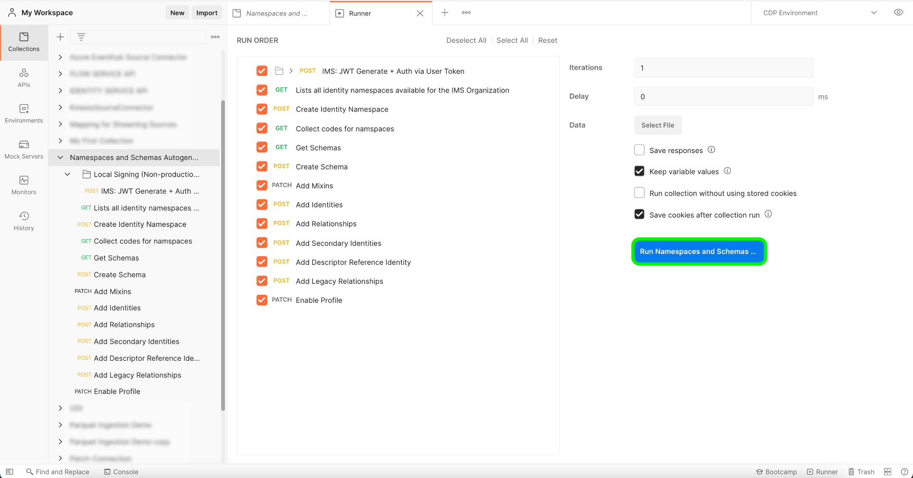

# [!DNL Salesforce] connettore

Adobe Experience Platform consente di acquisire dati da sorgenti esterne e allo stesso tempo di strutturare, etichettare e migliorare i dati in arrivo tramite i servizi Platform. È possibile acquisire dati da diverse sorgenti, come applicazioni di Adobe, archiviazione basata su cloud, database e molti altri.

Experience Platform fornisce il supporto per l’acquisizione di dati da un sistema CRM di terze parti. Il supporto per i provider di gestione delle relazioni con i clienti include [!DNL Salesforce].

## ELENCO CONSENTITI di indirizzo IP

Prima di utilizzare i connettori sorgente, è necessario aggiungere a un elenco consentiti un elenco di indirizzi IP. Se l’utente non aggiunge all’elenco consentiti gli indirizzi IP specifici per l’area geografica, potrebbero verificarsi errori o prestazioni non soddisfacenti durante l’utilizzo delle origini. Consulta la sezione [ELENCO CONSENTITI di indirizzo IP](../../ip-address-allow-list.md) per ulteriori informazioni.

## Mappatura del campo da [!DNL Salesforce] a XDM

Per stabilire una connessione sorgente tra [!DNL Salesforce] e la piattaforma [!DNL Salesforce] i campi dei dati di origine devono essere mappati sui campi XDM di destinazione appropriati prima di essere acquisiti in Platform.

Per informazioni dettagliate sulle regole di mappatura dei campi tra [!DNL Salesforce] set di dati e piattaforma:

- [Contatti](../adobe-applications/mapping/salesforce.md#contact)
- [Lead](../adobe-applications/mapping/salesforce.md#lead)
- [Account](../adobe-applications/mapping/salesforce.md#account)
- [Opportunità](../adobe-applications/mapping/salesforce.md#opportunity)
- [Ruoli di contatto opportunità](../adobe-applications/mapping/salesforce.md#opportunity-contact-role)
- [Campagne](../adobe-applications/mapping/salesforce.md#campaign)
- [Membri della campagna](../adobe-applications/mapping/salesforce.md#campaign-member)

## Imposta la [!DNL Salesforce] utilità di generazione automatica dello spazio dei nomi e dello schema

Per utilizzare [!DNL Salesforce] come parte di [!DNL B2B-CDP], devi prima impostare un [!DNL Postman] utilità per generare automaticamente il tuo [!DNL Salesforce] namespace e schemi. La seguente documentazione fornisce informazioni aggiuntive sulla configurazione del [!DNL Postman] utilità:

- È possibile scaricare lo spazio dei nomi e lo schema di generazione automatica dell&#39;utilità raccolta e l&#39;ambiente da questo [Archivio GitHub](https://github.com/adobe/experience-platform-postman-samples/tree/master/Postman%20Collections/CDP%20Namespaces%20and%20Schemas%20Utility).
- Per informazioni sull’utilizzo delle API di Platform, compresi i dettagli su come raccogliere i valori per le intestazioni richieste e leggere chiamate API di esempio, consulta la guida su [guida introduttiva alle API di Platform](../../../landing/api-guide.md).
- Per informazioni su come generare le credenziali per le API di Platform, consulta l’esercitazione su [autenticazione e accesso alle API di Experience Platform](../../../landing/api-authentication.md).
- Per informazioni su come impostare [!DNL Postman] per le API di Platform, consulta l’esercitazione su [configurazione di Developer Console e [!DNL Postman]](../../../landing/postman.md).

Con una console per sviluppatori Platform e [!DNL Postman] è ora possibile iniziare ad applicare i valori di ambiente appropriati al [!DNL Postman] ambiente.

La tabella seguente contiene valori di esempio e informazioni aggiuntive sulla compilazione [!DNL Postman] ambiente:

| Variable | Descrizione | Esempio |
| --- | --- | --- |
| `CLIENT_SECRET` | Un identificatore univoco utilizzato per generare il `{ACCESS_TOKEN}`. Guarda l’esercitazione su [autenticazione e accesso alle API di Experience Platform](../../../landing/api-authentication.md) per informazioni su come recuperare `{CLIENT_SECRET}`. | `{CLIENT_SECRET}` |
| `JWT_TOKEN` | Il JSON Web Token (JWT) è una credenziale di autenticazione utilizzata per generare il tuo {ACCESS_TOKEN}. Guarda l’esercitazione su [autenticazione e accesso alle API di Experience Platform](../../../landing/api-authentication.md) per informazioni su come generare il `{JWT_TOKEN}`. | `{JWT_TOKEN}` |
| `API_KEY` | Identificatore univoco utilizzato per autenticare le chiamate alle API di Experience Platform. Guarda l’esercitazione su [autenticazione e accesso alle API di Experience Platform](../../../landing/api-authentication.md) per informazioni su come recuperare `{API_KEY}`. | `c8d9a2f5c1e03789bd22e8efdd1bdc1b` |
| `ACCESS_TOKEN` | Token di autorizzazione necessario per completare le chiamate alle API di Experience Platform. Guarda l’esercitazione su [autenticazione e accesso alle API di Experience Platform](../../../landing/api-authentication.md) per informazioni su come recuperare `{ACCESS_TOKEN}`. | `Bearer {ACCESS_TOKEN}` |
| `META_SCOPE` | Per quanto riguarda [!DNL Marketo], questo valore è fisso e viene sempre impostato su: `ent_dataservices_sdk`. | `ent_dataservices_sdk` |
| `CONTAINER_ID` | La `global` Il contenitore contiene tutte le classi standard fornite dal partner di Adobe e Experience Platform, i gruppi di campi di schema, i tipi di dati e gli schemi. Per quanto riguarda [!DNL Marketo], questo valore è fisso e viene sempre impostato su `global`. | `global` |
| `PRIVATE_KEY` | Credenziale utilizzata per autenticare il [!DNL Postman] istanza alle API di Experience Platform. Consulta l’esercitazione sulla configurazione di Developer Console e [configurazione di Developer Console e [!DNL Postman]](../../../landing/postman.md) per istruzioni su come recuperare il tuo {PRIVATE_KEY}. | `{PRIVATE_KEY}` |
| `TECHNICAL_ACCOUNT_ID` | Credenziale utilizzata per l’integrazione con Adobe I/O. | `D42AEVJZTTJC6LZADUBVPA15@techacct.adobe.com` |
| `IMS` | Il sistema Identity Management (IMS) fornisce il framework per l’autenticazione ai servizi Adobe. Per quanto riguarda [!DNL Marketo], questo valore è fisso e viene sempre impostato su: `ims-na1.adobelogin.com`. | `ims-na1.adobelogin.com` |
| `IMS_ORG` | Un&#39;entità aziendale che può possedere o concedere in licenza prodotti e servizi e consentire l&#39;accesso ai propri membri. Guarda l’esercitazione su [configurazione di Developer Console e [!DNL Postman]](../../../landing/postman.md) per istruzioni su come recuperare `{ORG_ID}` informazioni. | `ABCEH0D9KX6A7WA7ATQE0TE@adobeOrg` |
| `SANDBOX_NAME` | Nome della partizione sandbox virtuale in uso. | `prod` |
| `TENANT_ID` | Un ID utilizzato per garantire che le risorse create siano spaccate correttamente e contenute all’interno dell’organizzazione IMS. | `b2bcdpproductiontest` |
| `PLATFORM_URL` | L&#39;endpoint URL a cui si effettua la chiamata API. Questo valore è fisso e viene sempre impostato su: `http://platform.adobe.io/`. | `http://platform.adobe.io/` |
| `munchkinId` | L&#39;ID univoco per il tuo [!DNL Marketo] conto. Guarda l’esercitazione su [autenticazione [!DNL Marketo] istanza](../adobe-applications/marketo/marketo-auth.md) per informazioni su come recuperare `munchkinId`. | `123-ABC-456` |
| `sfdc_org_id` | ID organizzazione per [!DNL Salesforce] conto. Vedi quanto segue [[!DNL Salesforce] guida](https://help.salesforce.com/articleView?id=000325251&amp;type=1&amp;mode=1) per ulteriori informazioni sull&#39;acquisizione di [!DNL Salesforce] ID organizzazione. | `00D4W000000FgYJUA0` |
| `has_abm` | Un valore booleano che indica se sei abbonato a [!DNL Marketo Account-Based Marketing]. | `false` |
| `has_msi` | Un valore booleano che indica se sei abbonato a [!DNL Marketo Sales Insight]. | `false` |

{style=&quot;table-layout:auto&quot;}

### Esecuzione degli script

Con il tuo [!DNL Postman] insieme e configurazione dell&#39;ambiente, ora puoi eseguire lo script tramite [!DNL Postman] interfaccia.

In [!DNL Postman] interfaccia, selezionare la cartella principale dell&#39;utilità di generazione automatica e quindi selezionare **[!DNL Run]** dall’intestazione superiore.

La [!DNL Runner] viene visualizzata l&#39;interfaccia. Da qui, accertati che tutte le caselle di controllo siano selezionate, quindi seleziona **[!DNL Run Namespaces and Schemas Autogeneration Utility]**.

Una richiesta corretta crea i namespace e gli schemi B2B in base alle specifiche beta.

## Connetti [!DNL Salesforce] su Platform tramite API

La documentazione seguente fornisce informazioni su come connettersi [!DNL Salesforce] su Platform utilizzando le API o l’interfaccia utente:

- [Creare una connessione di base Salesforce utilizzando l’API del servizio di flusso](../../tutorials/api/create/crm/salesforce.md)
- [Esplorare le tabelle di dati utilizzando l’API del servizio di flusso](../../tutorials/api/explore/tabular.md)
- [Creare un flusso di dati per un’origine CRM utilizzando l’API del servizio di flusso](../../tutorials/api/collect/crm.md)

## Connetti [!DNL Salesforce] su Platform tramite l’interfaccia utente

- [Creare una connessione sorgente Salesforce nell’interfaccia utente](../../tutorials/ui/create/crm/salesforce.md)
- [Creare un flusso di dati per una connessione CRM nell&#39;interfaccia utente](../../tutorials/ui/dataflow/crm.md)
