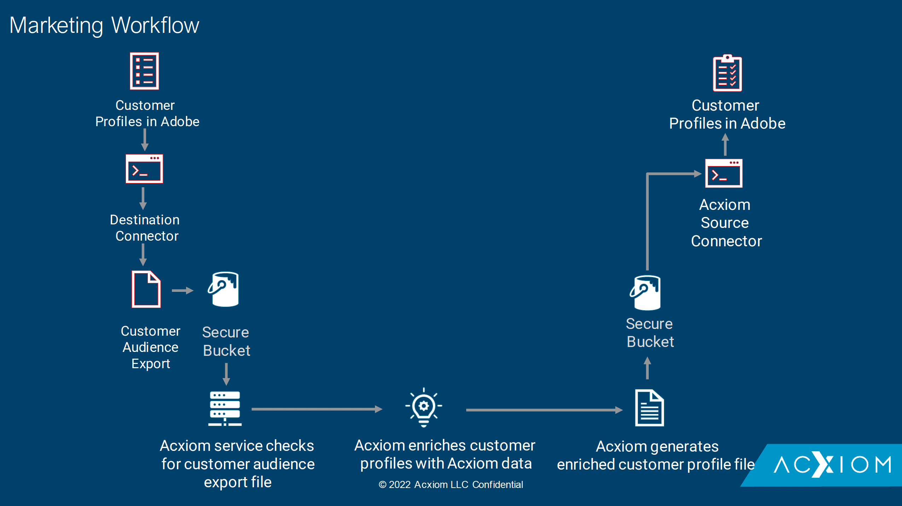

# [!DNL Acxiom Data Ingestion]

>[!NOTE]
>
>Il [!DNL Acxiom Prospecting Data Import] sorgente in versione beta. Leggi le [panoramica sulle origini](../../home.md#terms-and-conditions) per ulteriori informazioni sull’utilizzo di fonti etichettate beta.

Utilizza il [!DNL Acxiom Data Ingestion] origine da acquisire [!DNL Acxiom] Real-time Customer Data Platform e arricchire i profili di prime parti. Quindi, puoi utilizzare il [!DNL Acxiom]: profili di prime parti arricchiti per migliorare i tipi di pubblico e attivarli tra i canali di marketing.

Per informazioni su come impostare il [!DNL Acxiom Data Ingestion] account di origine.

## Prerequisiti {#prerequisites}

Per collegare il tuo [!DNL Acxiom Data Ingestion] account per Experience Platform, è necessario fornire i valori per le seguenti credenziali di autenticazione:

| Credenziali | Descrizione |
| --- | --- |
| [!DNL Acxiom] chiave di autenticazione | Chiave di autenticazione. Puoi recuperare questo valore da [!DNL Acxiom] team. |
| [!DNL Amazon S3] chiave di accesso | ID della chiave di accesso per il bucket. Puoi recuperare questo valore da [!DNL Acxiom] team. |
| [!DNL Amazon S3] chiave segreta | ID della chiave segreta del bucket. Puoi recuperare questo valore da [!DNL Acxiom] team. |
| Nome del bucket | Questo è il bucket in cui verranno condivisi i file. Puoi recuperare questo valore da [!DNL Acxiom] team. |

## ELENCO CONSENTITI di indirizzo IP

Prima di utilizzare i connettori di origine, è necessario aggiungere un elenco di indirizzi IP a un elenco consentiti. La mancata aggiunta all’elenco consentiti degli indirizzi IP specifici per l’area geografica potrebbe causare errori o prestazioni non ottimali durante l’utilizzo delle origini. Consulta la [ELENCO CONSENTITI di indirizzo IP](../../ip-address-allow-list.md) per ulteriori informazioni.

### Configurare le autorizzazioni su Experienci Platform

Devi avere entrambi **[!UICONTROL Visualizza origini]** e **[!UICONTROL Gestisci origini]** autorizzazioni abilitate per il tuo account per connettersi al tuo [!DNL Acxiom Data Ingestion] da Experience Platform. Contatta l’amministratore del prodotto per ottenere le autorizzazioni necessarie. Per ulteriori informazioni, leggere [guida all’interfaccia utente per il controllo degli accessi](../../../access-control/ui/overview.md).

### Vincoli di denominazione per file e directory

Quando si assegna un nome al file o alla directory di archiviazione cloud, è necessario tenere presenti le restrizioni elencate di seguito:

- I nomi dei componenti di directory e file non possono superare i 255 caratteri.
- I nomi di file e directory non possono terminare con una barra (`/`). Se fornito, verrà rimosso automaticamente.
- I seguenti caratteri URL riservati devono avere un escape corretto: `! ' ( ) ; @ & = + $ , % # [ ]`
- I seguenti caratteri non sono consentiti: `" \ / : | < > * ?`.
- Non sono consentiti caratteri di percorso URL non validi. Punti di codice come `\uE000`, anche se valido nei nomi di file NTFS, non è costituito da caratteri Unicode validi. Inoltre, alcuni caratteri ASCII o Unicode, come i caratteri di controllo (da 0x00 a 0x1F, \u0081, ecc.), non sono consentiti. Per le regole che disciplinano le stringhe Unicode in HTTP/1.1, consulta [RFC 2616, sezione 2.2: regole di base](https://www.ietf.org/rfc/rfc2616.txt) e [RFC 3987](https://www.ietf.org/rfc/rfc3987.txt).
- Non sono consentiti i seguenti nomi di file: LPT1, LPT2, LPT3, LPT4, LPT5, LPT6, LPT7, LPT8, LPT9, COM1, COM2, COM3, COM4, COM5, COM6, COM7, COM8, COM9, PRN, AUX, NUL, CON, CLOCK$, carattere punto (.) e due caratteri punto (..).

## Passaggi successivi

Una volta letto questo documento, avrai completato la configurazione dei prerequisiti necessaria per portare i dati dal tuo [!DNL Acxiom] da Experience Platform. Ora puoi passare alla guida su [connessione [!DNL Acxiom Data Ingestion] per Experienci Platform utilizzando l’interfaccia utente di](../../tutorials/ui/create/data-partners/acxiom-data-ingestion.md).

