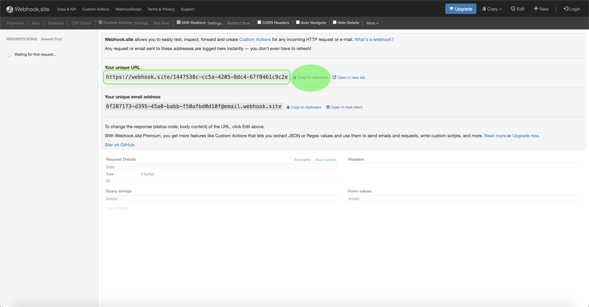

# Notifiche di esecuzione del flusso

Adobe Experience Platform consente l&#39;acquisizione di dati da origini esterne, fornendo al contempo la possibilità di strutturare, etichettare e migliorare i dati in arrivo tramite [!DNL Platform] i servizi. È possibile acquisire dati da origini diverse, come applicazioni  Adobe, storage basato su cloud, database e molti altri.

[[!DNL Adobe Experience Platform Flow Service]](https://www.adobe.io/apis/experienceplatform/home/api-reference.html#!acpdr/swagger-specs/flow-service.yaml) è utilizzato per raccogliere e centralizzare i dati dei clienti da varie fonti all&#39;interno [!DNL Platform]. Il servizio fornisce un&#39;interfaccia utente e RESTful API da cui sono collegate tutte le origini supportate.

Con  eventi I/O di Adobe, potete iscrivervi agli eventi e utilizzare i webhooks per ricevere notifiche sullo stato delle esecuzioni di flusso. Queste notifiche contengono informazioni sull&#39;esito positivo dell&#39;esecuzione di flusso o sugli errori che hanno contribuito al fallimento di un&#39;esecuzione.

In questo documento sono descritti i passaggi necessari per effettuare la sottoscrizione agli eventi, registrare i webhooks e ricevere le notifiche contenenti informazioni sullo stato delle esecuzioni di flusso.

## Introduzione

Questo documento richiede una buona conoscenza dei seguenti componenti di Adobe Experience Platform:

* [[!DNL Experience Data Model (XDM) System]](../xdm/home.md): Il framework standard con cui [!DNL Experience Platform] organizzare i dati relativi all&#39;esperienza del cliente.
* [[!DNL Profilo cliente in tempo reale]](../profile/home.md): Fornisce un profilo di consumo unificato e in tempo reale basato su dati aggregati provenienti da più origini.
* [[!DNL Adobe Experience Platform Data Assestation]](../ingestion/home.md): [!DNL Data Ingestion] rappresenta i metodi multipli mediante i quali [!DNL Platform] vengono acquisiti i dati da tali origini, nonché il modo in cui tali dati vengono memorizzati all&#39;interno del [!DNL Data Lake] sistema per essere utilizzati dai [!DNL Platform] servizi a valle.

Questo documento richiede anche una buona conoscenza dei webhooks e di come collegare un webhook da un&#39;applicazione all&#39;altra. Per ulteriori informazioni sui webhooks, consulta la seguente [documentazione](https://requestbin.com/blog/working-with-webhooks/) .

## Registrazione del webhook

Per ricevere le notifiche sullo stato dell&#39;esecuzione di flusso, dovete registrare un webhook specificando un URL webhook univoco come parte dei dettagli di registrazione dell&#39;evento. Per collegare un webhook all&#39; [!DNL I/O Events] iscrizione, visita il servizio [](https://webhook.site/) webhook e copia l&#39;URL univoco fornito.



## Iscriviti agli eventi

Dopo aver acquisito un URL webhook univoco, andate a [eventi](https://www.adobe.io/apis/experienceplatform/events.html) I/O di Adobe e seguite i passaggi descritti nel documento delle notifiche [di assimilazione dei](../ingestion/quality/subscribe-events.md) dati per iniziare a sottoscrivere gli eventi.

>[!IMPORTANT]
>Durante il processo di iscrizione, accertatevi di selezionare [!DNL Platform] le notifiche come fornitore dell&#39;evento e di selezionare le seguenti iscrizioni all&#39;evento:
>
>* **[!UICONTROL Experience Platform Source's Flow Run Succeeded]**
>* **[!UICONTROL Experience Platform Source's Flow Run Failed]**

>
>
Quando viene richiesto di fornire un indirizzo webhook, utilizza l’URL webhook acquisito in precedenza.

## Ricevere notifiche di esecuzione del flusso

Con il webhook collegato e l&#39;iscrizione all&#39;evento completata, puoi iniziare a ricevere notifiche di esecuzione del flusso tramite il dashboard del webhook.

Una notifica restituisce informazioni quali il numero di processi di assimilazione eseguiti, la dimensione del file ed errori. Una notifica restituisce anche un payload associato alla tua esecuzione di flusso in formato JSON. Il payload di risposta può essere classificato come `sources_flow_run_success` o `sources_flow_run_failure`.

>[!IMPORTANT]
>Se durante il processo di creazione del flusso è abilitata l’assimilazione parziale, un flusso che contiene sia l’assimilazione riuscita che quella non riuscita sarà contrassegnato come `sources_flow_run_success` solo se il numero di errori è inferiore alla percentuale di soglia di errore impostata durante il processo di creazione del flusso. Se un&#39;esecuzione di flusso corretta contiene errori, questi errori verranno comunque inclusi nel payload restituito.

### Operazione riuscita

Una risposta corretta restituisce un set di `metrics` elementi che definiscono le caratteristiche di un&#39;esecuzione di flusso specifica e `activities` che delineano il modo in cui i dati vengono trasformati.

```json
{
  "event_id": "aec55616-1715-487f-8044-ba648cc8ffee",
  "event": {
    "createdAt": 1597213529158,
    "updatedAt": 1597213530760,
    "createdBy": "{CREATED_BY}",
    "updatedBy": "{UPDATED_BY}",
    "createdClient": "{CREATED_CLIENT}",
    "updatedClient": "{UPDATED_CLIENT}",
    "sandboxId": "7127a4f0-def8-11e9-83ce-e79494b1c2a5",
    "sandboxName": "prod",
    "imsOrgId": "{IMS_ORG}",
    "id": "933cf9f4-cf01-4d75-bcf9-f4cf010d750a",
    "flowId": "1c6f1047-dcaf-48fe-af10-47dcaf08feaf",
    "providerRefId": "test1234",
    "etag": "\"5100ec97-0000-0200-0000-5f338b5b0000\"",
    "metrics": {
      "durationSummary": {
        "startedAtUTC": 1590512053,
        "completedAtUTC": 1590512053
      },
      "sizeSummary": {
        "inputBytes": 2048,
        "outputBytes": 1024
      },
      "recordSummary": {
        "inputRecordCount": 100,
        "outputRecordCount": 70
      },
      "fileSummary": {
        "inputFileCount": 10,
        "outputFileCount": 10
      },
      "statusSummary": {
        "status": "success"
      }
    },
    "activities": [
      {
        "id": "copyActivity",
        "updatedAtUTC": 87473822,
        "durationSummary": {
          "startedAtUTC": 1590512053,
          "completedAtUTC": 1590512053
        },
        "sizeSummary": {
          "inputBytes": 2048,
          "outputBytes": 1098
        },
        "recordSummary": {
          "inputRecordCount": 100,
          "outputRecordCount": 100
        },
        "fileSummary": {
          "inputFileCount": 10,
          "outputFileCount": 10
        },
        "statusSummary": {
          "status": "success",
          "extensions": {
            "adf/pipeline/id": "abcd",
            "adf/run/id": "1234"
          }
        },
        "sourceInfo": [
          {
            "id": "sourceConnectionId1",
            "type": "SourceConnection",
            "reference": {
              "type": "AdfRunId"
            }
          }
        ]
      },
      {
        "id": "promotionActivity",
        "updatedAtUTC": 87473822,
        "durationSummary": {
          "completedAtUTC": 1590512053
        },
        "sizeSummary": {
          "inputBytes": 1098,
          "outputBytes": 1024
        },
        "recordSummary": {},
        "fileSummary": {
          "inputFileCount": 10,
          "outputFileCount": 10,
          "extensions": {
            "manifest": {
              "fileInfo": "https://platform-int.adobe.io/data/foundation/export/batches/01E4TSJNM2H5M74J0XB8MFWDHK/meta?path=input_files"
            }
          }
        },
        "statusSummary": {
          "status": "success",
          "extensions": {
            "batchId": "b1",
            "acp_request_id": "1234"
          }
        },
        "targetInfo": [
          {
            "id": "targetConnectionId1",
            "type": "TargetConnection",
            "reference": {
              "type": "batch"
            }
          }
        ]
      }
    ],
    "slaCreatedAt": 1597213531124,
    "processStartTime": 1597213531213,
    "header": {
      "_adobeio": {
        "imsOrgId": "{IMS_ORG}",
        "providerMetadata": "platform_notifications",
        "eventCode": "sources_flow_run_success"
      }
    },
    "transformedTime": 1597213531214
  }
}
```

| Proprietà | Descrizione |
| -------- | ----------- |
| `metrics` | Definisce le caratteristiche dei dati nell&#39;esecuzione del flusso. |
| `activities` | Definisce i diversi passaggi e attività eseguiti per trasformare i dati. |
| `durationSummary` | Definisce l&#39;ora iniziale e finale dell&#39;esecuzione del flusso. |
| `sizeSummary` | Definisce il volume dei dati in byte. |
| `recordSummary` | Definisce il conteggio record dei dati. |
| `fileSummary` | Definisce il conteggio dei file dei dati. |
| `fileInfo` | Un URL che porta a una panoramica dei file acquisiti correttamente. |
| `statusSummary` | Definisce se l&#39;esecuzione del flusso è riuscita o meno. |

### Errore

La risposta seguente è un esempio di esecuzione di flusso non riuscita, con un errore che si verifica durante l&#39;elaborazione dei dati copiati. Gli errori possono verificarsi anche durante la copia dei dati dall&#39;origine. Un&#39;esecuzione di flusso non riuscita include informazioni sugli errori che hanno contribuito all&#39;errore dell&#39;esecuzione, incluso l&#39;errore e la descrizione.

```json
[
  {
    "messages": [
      {
        "msgType": "eventNotification",
        "version": "1.0",
        "timestamp": 1597434157622,
        "imsOrgId": "{IMS_ORG}",
        "schema": {
          "name": "run-notification",
          "version": "1.0"
        },
        "provider": "FlowService",
        "_eventNotificationMeta": {
          "category": "Platform Notifications",
          "type": "sources_flow_run_failed"
        },
        "value": {
          "createdAt": 1597434147259,
          "updatedAt": 1597434157567,
          "createdBy": "{CREATED_BY}",
          "updatedBy": "{UPDATED_BY}",
          "createdClient": "{CREATED_CLIENT}",
          "updatedClient": "{UPDATED_CLIENT}",
          "sandboxId": "e49ebb00-d0fa-11e9-b164-ed6a398c8b35",
          "sandboxName": "prod",
          "imsOrgId": "{IMS_ORG}",
          "id": "d9024c32-2174-4271-824c-322174627101",
          "flowId": "cf4fce79-8822-456d-8fce-798822556dc6",
          "etag": "\"0c003dbf-0000-0200-0000-5f36e92d0000\"",
          "metrics": {
            "durationSummary": {
              "startedAtUTC": 1597434147190
            },
            "sizeSummary": {
              "inputBytes": -1
            },
            "fileSummary": {
              "inputFileCount": -1
            },
            "statusSummary": {
              "status": "failed",
              "errors": [
                {
                  "code": "CONNECTOR-2001-500",
                  "message": "Error in processing (parsing, validation or transformation) the copied data."
                }
              ]
            }
          },
          "activities": [
            {
              "id": "promotionActivity",
              "updatedAtUTC": 1597434157529,
              "durationSummary": {
                "startedAtUTC": 1597434147190,
                "completedAtUTC": 1597434157212
              },
              "sizeSummary": {
                "inputBytes": -1
              },
              "recordSummary": {},
              "fileSummary": {
                "inputFileCount": -1,
                "extensions": {
                  "manifest": {
                    "fileInfo": "https://platform-stage.adobe.io/data/foundation/export/batches/6f6a900f-e40d-4f0e-9bb9-b614436c3465/meta?path=input_files"
                  }
                }
              },
              "statusSummary": {
                "status": "failed",
                "errors": [
                  {
                    "code": "CONNECTOR-2001-500",
                    "message": "Error in processing (parsing, validation or transformation) the copied data."
                  }
                ],
                "extensions": {
                  "errors": [
                    {
                      "code": "133",
                      "message": "We are unable to locate any files uploaded for this batch. Please upload files to ingest."
                    }
                  ]
                }
              },
              "targetInfo": [
                {
                  "id": "e88737aa-27b8-4795-8737-aa27b8f7959e",
                  "type": "TargetConnection",
                  "reference": {
                    "type": "Batch",
                    "ids": [
                      "6f6a900f-e40d-4f0e-9bb9-b614436c3465"
                    ]
                  }
                }
              ]
            }
          ]
        }
      }
    ]
  }
]
```

| Proprietà | Descrizione |
| ---------- | ----------- |
| `fileInfo` | Un URL che porta a una panoramica dei file che sono stati acquisiti con successo e non con successo. |

>[!NOTE]
>Per ulteriori informazioni sui messaggi di errore, vedere l&#39; [appendice](#errors) .

## Passaggi successivi

Ora puoi abbonarti agli eventi che ti consentono di ricevere notifiche in tempo reale sugli stati di esecuzione del flusso. Per ulteriori informazioni sulle esecuzioni di flusso e sulle origini, consulta la panoramica sulle [origini](./home.md).

## Appendice

Le sezioni seguenti forniscono informazioni aggiuntive per l&#39;utilizzo delle notifiche di esecuzione del flusso.

### Informazioni sui messaggi di errore {#errors}

Gli errori di inserimento possono verificarsi quando i dati vengono copiati dall&#39;origine o quando i dati copiati vengono elaborati in [!DNL Platform]. Per ulteriori informazioni su errori specifici, vedere la tabella seguente.

| Errore | Descrizione |
| ---------- | ----------- |
| `CONNECTOR-1001-500` | Errore durante la copia dei dati da un&#39;origine. |
| `CONNECTOR-2001-500` | Errore durante l&#39;elaborazione dei dati copiati in [!DNL Platform]. Questo errore può riguardare l&#39;analisi, la convalida o la trasformazione. |