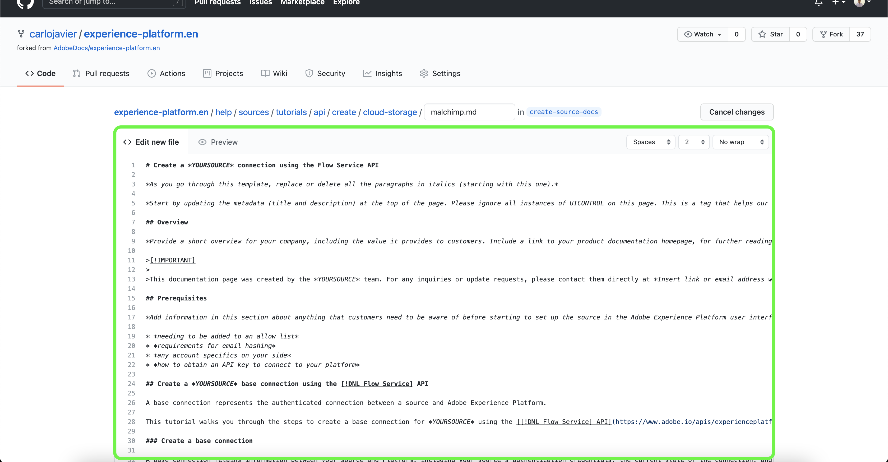

# Utilizza l’interfaccia web GitHub per creare una pagina di documentazione sorgente

Questo documento fornisce passaggi su come utilizzare l’interfaccia web GitHub per creare la documentazione e inviare una richiesta di pull (PR).

>[!TIP]
>
>Per supportare ulteriormente il processo di documentazione, puoi utilizzare i seguenti documenti della guida al contributo di Adobe: <ul><li>[Installare gli strumenti di creazione Git e Markdown](https://experienceleague.adobe.com/docs/contributor/contributor-guide/setup/install-tools.html?lang=en)</li><li>[Configurare localmente l’archivio Git per la documentazione](https://experienceleague.adobe.com/docs/contributor/contributor-guide/setup/local-repo.html?lang=en)</li><li>[Flusso di lavoro dei contributi GitHub per modifiche principali](https://experienceleague.adobe.com/docs/contributor/contributor-guide/setup/full-workflow.html?lang=en)</li></ul>

## Configurare l’ambiente GitHub

Il primo passaggio nella configurazione dell’ambiente GitHub consiste nell’accedere alla [Archivio GitHub Adobe Experience Platform](https://github.com/AdobeDocs/experience-platform.en).

Quindi, seleziona **Fork**.

Una volta completata la forchetta, seleziona **maestro** e inserisci un nome per il nuovo ramo nel menu a discesa visualizzato. Assicurati di fornire un nome descrittivo per il ramo in quanto verrà utilizzato per contenere il lavoro, quindi seleziona **crea ramo**.

Nella struttura di cartelle GitHub dell’archivio con fork, passa alla `experience-platform.en/help/sources/tutorials/api/create/` quindi selezionare la categoria appropriata per l&#39;origine dall&#39;elenco. Ad esempio, se stai creando documentazione per una nuova origine di archiviazione cloud, seleziona **cloud storage**.

Viene visualizzata una cartella delle origini di archiviazione cloud esistenti. Per aggiungere documentazione per una nuova sorgente, seleziona **Aggiungi file** quindi seleziona **Crea nuovo file** dal menu a discesa visualizzato.

Assegnare un nome al file sorgente `YOURSOURCE.md` dove YOURSOURCE è il nome della sorgente in Platform. Ad esempio, se la tua azienda è [!DNL Mailchimp], quindi il nome del file deve essere `mailchimp.md`.

## Creare la pagina della documentazione della sorgente

Per iniziare a documentare la nuova origine, incolla il contenuto della [modello di documentazione di origini](./template.md) nell’editor web GitHub. Puoi anche scaricare il modello [qui](../assets/template.zip).

Con il modello copiato nell’interfaccia dell’editor web GitHub, segui le istruzioni descritte nel modello e modifica i valori contenenti informazioni rilevanti per la tua origine.

Al termine, esegui il commit del file nel ramo.

## Invia la documentazione per la revisione

Una volta eseguito il commit del file, puoi aprire una richiesta di pull (PR) per unire il ramo di lavoro al ramo principale dell’archivio della documentazione di Adobe. Assicurati che il ramo su cui stai lavorando sia selezionato, quindi seleziona **Confronta e richiedi pull**.

Assicurati che i rami di base e di confronto siano corretti. Aggiungi una nota al PR, descrivendo l&#39;aggiornamento, quindi seleziona **Creare una richiesta di pull**. Viene aperto un PR per unire il ramo di lavoro del lavoro nel ramo principale dell’archivio Adobe.

>[!TIP]
>
>Lascia la **Consenti modifiche da parte dei manutentori** seleziona questa casella di controllo per assicurarti che il team della documentazione di Adobe possa apportare modifiche al PR.

A questo punto, viene visualizzata una notifica che richiede la firma del contratto di licenza da collaboratore (CLA) Adobe. Si tratta di un passaggio obbligatorio. Dopo aver firmato il Contratto di licenza da collaboratore, aggiorna la pagina PR e invia la richiesta di pull.

Puoi confermare che la richiesta di pull è stata inviata controllando la scheda delle richieste di pull in https://github.com/AdobeDocs/experience-platform.en.

