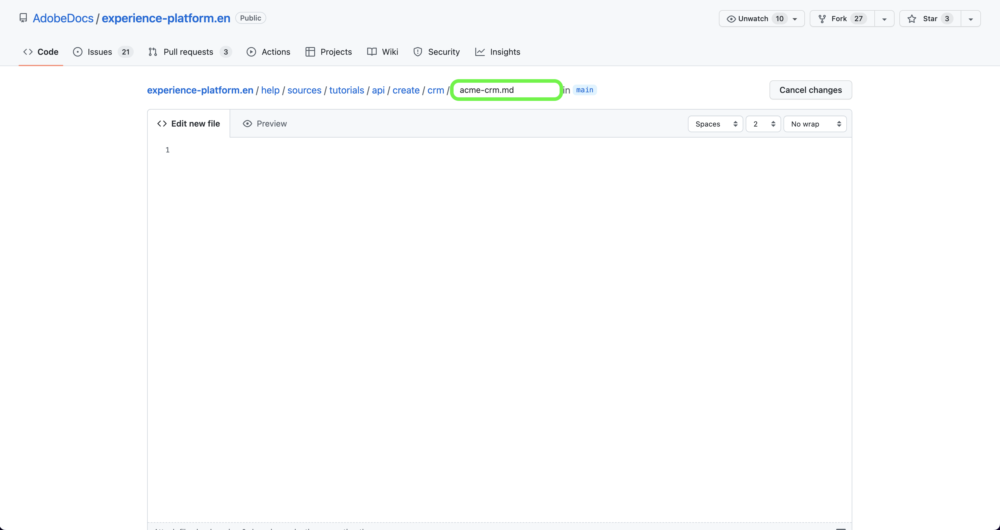

# Utilizza l’interfaccia web GitHub per creare una pagina della documentazione di origine

Questo documento descrive come utilizzare l’interfaccia web GitHub per creare la documentazione e inviare una richiesta di pull (PR).

>[!TIP]
>
>I seguenti documenti della guida introduttiva di Adobe possono essere utilizzati per supportare ulteriormente la procedura di documentazione: <ul><li>[Installare gli strumenti di creazione Git e Markdown](https://experienceleague.adobe.com/docs/contributor/contributor-guide/setup/install-tools.html?lang=en)</li><li>[Configurare localmente l’archivio Git per la documentazione](https://experienceleague.adobe.com/docs/contributor/contributor-guide/setup/local-repo.html?lang=en)</li><li>[Flusso di lavoro dei contributi GitHub per modifiche principali](https://experienceleague.adobe.com/docs/contributor/contributor-guide/setup/full-workflow.html?lang=en)</li></ul>

## Configurare l’ambiente GitHub

Il primo passaggio nella configurazione dell’ambiente GitHub consiste nel passare alla [Archivio GitHub Adobe Experience Platform](https://github.com/AdobeDocs/experience-platform.en).

Quindi, seleziona **Fork**.

Una volta che il fork è completo, seleziona **principale** e inserisci un nome per il nuovo ramo nel menu a discesa visualizzato. Assicurati di fornire un nome descrittivo per il ramo, in quanto verrà utilizzato per contenere il lavoro, quindi seleziona **crea ramo**.

Nella struttura di cartelle GitHub dell’archivio con fork, passa a [`experience-platform.en/help/sources/tutorials/api/create/`](https://github.com/AdobeDocs/experience-platform.en/tree/main/help/sources/tutorials/api/create) quindi selezionare la categoria appropriata per l&#39;origine dall&#39;elenco. Ad esempio, se stai creando la documentazione per una nuova origine CRM, seleziona **crm**.

>[!TIP]
>
>Se stai creando la documentazione per l’interfaccia utente, passa a [`experience-platform.en/help/sources/tutorials/ui/create/`](https://github.com/AdobeDocs/experience-platform.en/tree/main/help/sources/tutorials/ui/create) e seleziona la categoria appropriata per la tua origine. Per aggiungere le immagini, vai a [`experience-platform.en/help/sources/images/tutorials/create/sdk`](https://github.com/AdobeDocs/experience-platform.en/tree/main/help/sources/images/tutorials/create) quindi aggiungi le tue schermate al `sdk` cartella.

Viene visualizzata una cartella delle origini CRM esistenti. Per aggiungere la documentazione per una nuova origine, seleziona **Aggiungi file** e quindi seleziona **Crea nuovo file** dal menu a discesa visualizzato.

Denomina il file di origine `YOURSOURCE.md` dove YOURSOURCE è il nome della sorgente in Platform. Ad esempio, se la tua società è ACME CRM, il nome file deve essere `acme-crm.md`.

## Creare la pagina della documentazione per la sorgente

Per iniziare a documentare la nuova origine, incolla il contenuto della [modello di documentazione delle sorgenti](./template.md) nell’editor web GitHub. Puoi anche scaricare il modello [qui](../assets/api-template.zip).

Con il modello copiato nell’interfaccia dell’editor web GitHub, segui le istruzioni descritte nel modello e modifica i valori contenenti le informazioni rilevanti per la tua origine.

Al termine, esegui il commit del file nel ramo.

## Inviare la documentazione per la revisione

Una volta eseguito il commit del file, puoi aprire una richiesta di pull (PR) per unire il ramo di lavoro nel ramo principale dell’archivio della documentazione di Adobe. Assicurati che il ramo su cui stai lavorando sia selezionato, quindi seleziona **Confronta e richiedi**.

Assicurati che i rami di base e di confronto siano corretti. Aggiungi una nota alla PR, descrivendo l’aggiornamento, quindi seleziona **Creare una richiesta di pull**. Verrà aperta una PR per unire il ramo di lavoro nel ramo principale dell’archivio di Adobi.

>[!TIP]
>
>Lascia **Consenti modifiche da parte dei gestori** è stata selezionata una casella di controllo per garantire che il team della documentazione Adobe possa apportare modifiche alla PR.

A questo punto, viene visualizzata una notifica che richiede di firmare il Contratto di licenza da collaboratore (CLA) di Adobe. Questo è un passaggio obbligatorio. Dopo aver firmato il contratto di licenza, aggiorna la pagina PR e invia la richiesta di pull.

Puoi confermare che la richiesta di pull è stata inviata esaminando la scheda delle richieste di pull in https://github.com/AdobeDocs/experience-platform.en.

