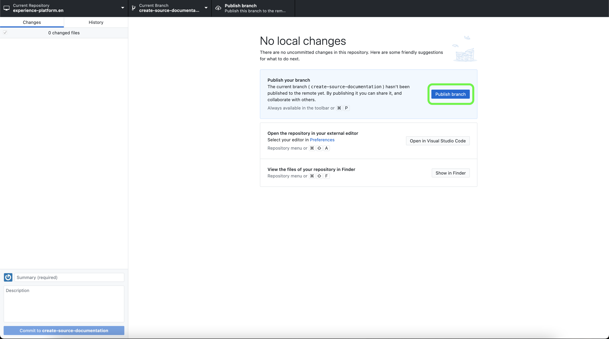
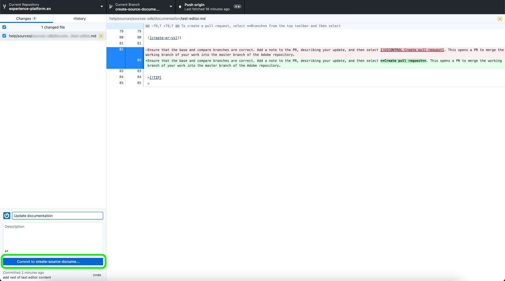

# Utilizza un editor di testo nel tuo ambiente locale per creare una pagina di documentazione di origini

Questo documento descrive come utilizzare l’ambiente locale per creare la documentazione relativa all’origine e inviare una richiesta di pull (PR).

>[!TIP]
>
>Per supportare ulteriormente il processo di documentazione, puoi utilizzare i seguenti documenti della guida al contributo di Adobe: <ul><li>[Installare gli strumenti di creazione Git e Markdown](https://experienceleague.adobe.com/docs/contributor/contributor-guide/setup/install-tools.html?lang=en)</li><li>[Configurare localmente l’archivio Git per la documentazione](https://experienceleague.adobe.com/docs/contributor/contributor-guide/setup/local-repo.html?lang=en)</li><li>[Flusso di lavoro dei contributi GitHub per modifiche principali](https://experienceleague.adobe.com/docs/contributor/contributor-guide/setup/full-workflow.html?lang=en)</li></ul>

## Prerequisiti

L’esercitazione seguente richiede l’installazione di GitHub Desktop nel computer locale. Se non disponi di GitHub Desktop, puoi scaricare l’applicazione [qui](https://desktop.github.com/).

## Connettersi a GitHub e configurare l’ambiente di authoring locale

Il primo passaggio nella configurazione dell’ambiente di authoring locale consiste nel passare alla [Archivio GitHub Adobe Experience Platform](https://github.com/AdobeDocs/experience-platform.en).

Nella pagina principale dell’archivio Platform GitHub, seleziona **Fork**.

Per duplicare l&#39;archivio nel computer locale, seleziona **Codice**. Dal menu a discesa visualizzato, seleziona **HTTPS** quindi seleziona **Apri con GitHub Desktop**.

>[!TIP]
>
>Per ulteriori informazioni, consulta l’esercitazione su [configurazione locale dell’archivio Git per la documentazione](https://experienceleague.adobe.com/docs/contributor/contributor-guide/setup/local-repo.html?lang=en#create-a-local-clone-of-the-repository).

Ora consenti a GitHub Desktop di duplicare il `experience-platform.en` archivio.

Una volta completato il processo di clonazione, passa a GitHub Desktop per creare un nuovo ramo. Seleziona **Master** dalla navigazione in alto, quindi seleziona **Nuovo ramo**

Nel pannello di selezione visualizzato, immettete un nome descrittivo per il ramo, quindi selezionate **Crea ramo**.

Quindi, seleziona **Pubblica ramo**.

## Creare la pagina della documentazione della sorgente

Con l’archivio clonato nel computer locale e creato un nuovo ramo, ora puoi iniziare a creare la pagina di documentazione per la nuova sorgente tramite [editor di testo desiderato](https://experienceleague.adobe.com/docs/contributor/contributor-guide/setup/install-tools.html?lang=en#understand-markdown-editors).

Adobe consiglia di utilizzare [Codice di Visual Studio](https://code.visualstudio.com/) e di installare l’estensione Adobe Markdown Authoring . Per installare l&#39;estensione, avviare Visual Studio Code e quindi selezionare la **Estensioni** da navigazione a sinistra.

Quindi, immetti `Adobe Markdown Authoring` nella barra di ricerca, quindi seleziona **Installa** dalla pagina visualizzata.

Con il computer locale pronto, scarica il [modello di documentazione di origini](../assets/template.zip) ed estrarre il file in `experience-platform.en/help/sources/tutorials/api/create/...` con [`...`] rappresenta la categoria scelta. Ad esempio, se si sta creando un&#39;origine di database, selezionare la cartella di database.

Infine, segui le istruzioni descritte nel modello e modifica il modello con le informazioni rilevanti relative alla tua origine.

## Invia la documentazione per la revisione

Per creare una richiesta di pull (PR) e inviare la documentazione per la revisione, salva prima il tuo lavoro in [!DNL Visual Studio Code] (o l&#39;editor di testo scelto). Successivamente, utilizzando GitHub Desktop, immetti un messaggio di commit e seleziona **Impegno a creare-sorgente-documentazione**.

Quindi, seleziona **Origine push** per caricare il lavoro sul ramo remoto.

Per creare una richiesta di pull, seleziona **Crea richiesta di pull**.

Assicurati che i rami di base e di confronto siano corretti. Aggiungi una nota al PR, descrivendo l&#39;aggiornamento, quindi seleziona **Creare una richiesta di pull**. Viene aperto un PR per unire il ramo di lavoro del lavoro nel ramo principale dell’archivio Adobe.

>[!TIP]
>
>Lascia la **Consenti modifiche da parte dei manutentori** seleziona questa casella di controllo per assicurarti che il team della documentazione di Adobe possa apportare modifiche al PR.

Puoi confermare che la richiesta di pull è stata inviata controllando la scheda delle richieste di pull in https://github.com/AdobeDocs/experience-platform.en.

