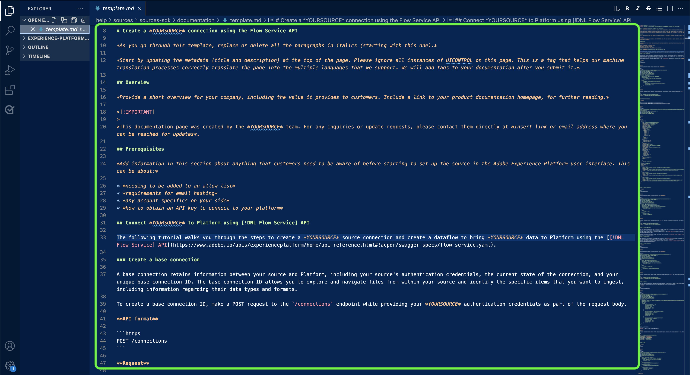

# Utilizza un editor di testo nell’ambiente locale per creare una pagina della documentazione delle sorgenti

Questo documento descrive come utilizzare l’ambiente locale per creare la documentazione per la tua origine e inviare una richiesta di pull (PR).

>[!TIP]
>
>I seguenti documenti della guida introduttiva di Adobe possono essere utilizzati per supportare ulteriormente la procedura di documentazione: <ul><li>[Installare gli strumenti di creazione Git e Markdown](https://experienceleague.adobe.com/docs/contributor/contributor-guide/setup/install-tools.html)</li><li>[Configurazione locale dell&#39;archivio Git per la documentazione](https://experienceleague.adobe.com/docs/contributor/contributor-guide/setup/local-repo.html)</li><li>[Flusso di lavoro contributi GitHub per modifiche principali](https://experienceleague.adobe.com/docs/contributor/contributor-guide/setup/full-workflow.html)</li></ul>

## Prerequisiti

Il seguente tutorial richiede che GitHub Desktop sia installato sul computer locale. Se non disponi di GitHub Desktop, puoi scaricare l&#39;applicazione [qui](https://desktop.github.com/).

## Connessione a GitHub e configurazione dell’ambiente di authoring locale

Il primo passaggio nella configurazione dell&#39;ambiente di authoring locale consiste nel passare all&#39;[archivio GitHub di Adobe Experience Platform](https://github.com/AdobeDocs/experience-platform.en).

Nella pagina principale dell&#39;archivio GitHub di Platform, seleziona **Fork**.

Per clonare l&#39;archivio nel computer locale, selezionare **Codice**. Dal menu a discesa visualizzato, selezionare **HTTPS** e quindi **Apri con GitHub Desktop**.

>[!TIP]
>
>Per ulteriori informazioni, consulta l&#39;esercitazione su [configurazione locale dell&#39;archivio Git per la documentazione](https://experienceleague.adobe.com/docs/contributor/contributor-guide/setup/local-repo.html#create-a-local-clone-of-the-repository).

Attendere qualche istante, quindi, per consentire a GitHub Desktop di clonare l&#39;archivio `experience-platform.en`.

Una volta completato il processo di clonazione, passa a GitHub Desktop per creare un nuovo ramo. Seleziona **Master** dalla navigazione superiore, quindi seleziona **Nuovo ramo**

Nel pannello popover visualizzato, immettere un nome descrittivo per il ramo, quindi selezionare **Crea ramo**.

Quindi, selezionare **Ramo Publish**.

## Creare la pagina della documentazione per la sorgente

Dopo aver clonato l&#39;archivio nel computer locale e creato un nuovo ramo, è ora possibile iniziare a creare la pagina della documentazione per la nuova origine tramite l&#39;[editor di testo desiderato](https://experienceleague.adobe.com/docs/contributor/contributor-guide/setup/install-tools.html#understand-markdown-editors).

L&#39;Adobe consiglia di utilizzare [Visual Studio Code](https://code.visualstudio.com/) e di installare l&#39;estensione di authoring Markdown dell&#39;Adobe. Per installare l&#39;estensione, avviare Visual Studio Code, quindi selezionare la scheda **Estensioni** dal menu di navigazione a sinistra.

Immettere `Adobe Markdown Authoring` nella barra di ricerca, quindi selezionare **Installa** dalla pagina visualizzata.

Quando il computer locale è pronto, scarica il modello di documentazione [sources](../assets/api-template.zip) ed estrai il file in `experience-platform.en/help/sources/tutorials/api/create/...` con [`...`] che rappresenta la categoria desiderata. Se ad esempio si sta creando un&#39;origine di database, selezionare la cartella del database.

Infine, segui le istruzioni descritte nel modello e modifica il modello con le informazioni pertinenti relative alla tua origine.

## Inviare la documentazione per la revisione

Per creare una richiesta di pull (PR) e inviare la documentazione per la revisione, salvare innanzitutto il lavoro in [!DNL Visual Studio Code] (o nell&#39;editor di testo scelto). Quindi, utilizzando GitHub Desktop, immetti un messaggio di commit e seleziona **Commit to create-source-documentation**.

Quindi, seleziona **Invia origine** per caricare il lavoro nel ramo remoto.

Per creare una richiesta pull, selezionare **Crea richiesta pull**.

Assicurati che i rami di base e di confronto siano corretti. Aggiungi una nota alla PR, descrivendo l&#39;aggiornamento, quindi seleziona **Crea richiesta di pull**. Verrà aperta una PR per unire il ramo di lavoro nel ramo principale dell’archivio di Adobi.

>[!TIP]
>
>Lascia selezionata la casella di controllo **Consenti modifiche da parte dei responsabili della manutenzione** per garantire che il team della documentazione di Adobe possa apportare modifiche alla PR.

Puoi confermare che la richiesta di pull è stata inviata esaminando la scheda delle richieste di pull in https://github.com/AdobeDocs/experience-platform.en.

