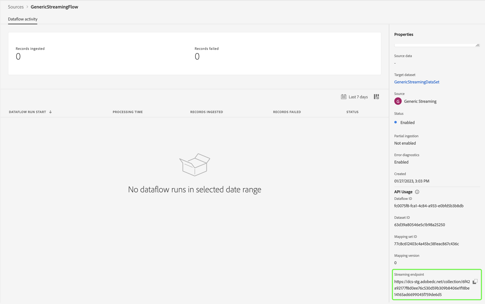

# Crea una connessione di origine e un flusso di dati per inviare in streaming i dati di *YOURSOURCE* tramite l&#39;interfaccia utente

*Sostituire o eliminare tutti i paragrafi in corsivo a partire da questo modello.*

*Per iniziare, aggiorna i metadati (titolo e descrizione) nella parte superiore della pagina. Ignora tutte le istanze di UICONTROL in questa pagina. Questo tag aiuta i nostri processi di traduzione automatica a tradurre correttamente la pagina nelle diverse lingue supportate. Dopo l&#39;invio aggiungeremo i tag alla documentazione.*

Questo tutorial descrive i passaggi per creare un connettore di origine *YOURSOURCE* tramite l&#39;interfaccia utente di Platform.

## Panoramica

*Fornisci una breve panoramica della tua azienda, compreso il valore che offre ai clienti. Includi un collegamento alla home page della documentazione del prodotto, per ulteriori informazioni.*

>[!IMPORTANT]
>
>Il connettore di origine e la pagina della documentazione vengono creati e gestiti dal team *YOURSOURCE*. Per eventuali richieste di informazioni o richieste di aggiornamento, è possibile contattarle direttamente all&#39;indirizzo *Inserire il collegamento o l&#39;indirizzo di posta elettronica a cui è possibile accedere per gli aggiornamenti*.

## Prerequisiti

*Aggiungere informazioni in questa sezione su qualsiasi elemento di cui i clienti devono essere a conoscenza prima di iniziare a configurare l&#39;origine nell&#39;interfaccia utente di Adobe Experience Platform. Informazioni su:*

* *da aggiungere a un elenco consentiti*
* *requisiti per l&#39;hashing delle e-mail*
* *qualsiasi specifica account sul tuo lato*
* *come ottenere le credenziali di autenticazione per connettersi alla piattaforma*

### Raccogli le credenziali richieste

Per connettere *YOURSOURCE* a Platform, è necessario fornire i valori per le proprietà di connessione seguenti:

| Credenziali | Descrizione | Esempio |
| --- | --- | --- |
| *credenziali uno* | *Aggiungere qui una breve descrizione alle credenziali di autenticazione dell&#39;origine* | *Aggiungi qui un esempio delle credenziali di autenticazione dell&#39;origine* |
| *credenziali due* | *Aggiungere qui una breve descrizione alle credenziali di autenticazione dell&#39;origine* | *Aggiungi qui un esempio delle credenziali di autenticazione dell&#39;origine* |
| *credenziali tre* | *Aggiungere qui una breve descrizione alle credenziali di autenticazione dell&#39;origine* | *Aggiungi qui un esempio delle credenziali di autenticazione dell&#39;origine* |

Per ulteriori informazioni su queste credenziali, vedere la documentazione relativa all&#39;autenticazione di *YOURSOURCE*. *Aggiungi qui il collegamento alla documentazione di autenticazione della tua piattaforma*.

### Integra *YOURSOURCE* con il tuo webhook

*L&#39;SDK di streaming richiede che l&#39;origine sia in grado di supportare i webhook per comunicare con Experience Platform. In questa sezione è necessario specificare i passaggi che gli utenti dovranno seguire per integrare YOURSOURCE con un webhook.*

## Connetti il tuo account *YOURSOURCE*

Nell&#39;interfaccia utente di Platform, seleziona **[!UICONTROL Origini]** dalla barra di navigazione a sinistra per accedere all&#39;area di lavoro [!UICONTROL Origini]. Nella schermata [!UICONTROL Catalogo] sono visualizzate diverse origini con cui è possibile creare un account.

Puoi selezionare la categoria appropriata dal catalogo sul lato sinistro dello schermo. In alternativa, è possibile trovare l’origine specifica che si desidera utilizzare utilizzando l’opzione di ricerca.

Nella categoria **Streaming** selezionare *YOURSOURCE*, quindi **[!UICONTROL Aggiungi dati]**.

>[!TIP]
>
>Di seguito sono riportati alcuni esempi di schermate. Durante la creazione della documentazione, sostituisci le immagini con le schermate della sorgente effettiva. È possibile utilizzare lo stesso motivo e colore di marcatura, nonché gli stessi nomi di file. Assicurati che la schermata acquisisca l’intera schermata dell’interfaccia utente di Platform. Per informazioni su come caricare le schermate, consulta la guida in [invio della documentazione per la revisione](../documentation/github.md).

## Selezionare i dati

Viene visualizzato il passaggio **[!UICONTROL Seleziona dati]**, che fornisce un&#39;interfaccia per la selezione dei dati da inserire in Platform.

* La parte sinistra dell’interfaccia è un browser che ti consente di visualizzare i flussi di dati disponibili all’interno del tuo account;
* La parte destra dell’interfaccia consente di visualizzare in anteprima fino a 100 righe di dati da un file JSON.

Seleziona **[!UICONTROL Carica file]** per caricare un file JSON dal sistema locale. In alternativa, puoi trascinare e rilasciare il file JSON da caricare nel pannello [!UICONTROL Trascina i file].

Una volta caricato il file, l’interfaccia di anteprima si aggiorna e mostra un’anteprima dello schema caricato. L’interfaccia di anteprima consente di esaminare il contenuto e la struttura di un file. È inoltre possibile utilizzare l&#39;utilità [!UICONTROL Cerca campo] per accedere a elementi specifici dallo schema.

Al termine, selezionare **[!UICONTROL Avanti]**.

## Dettaglio del flusso di dati

Viene visualizzato il passaggio **Dettagli flusso di dati** che fornisce le opzioni per utilizzare un set di dati esistente o stabilirne uno nuovo per il flusso di dati, nonché l&#39;opportunità di fornire un nome e una descrizione per il flusso di dati. Durante questo passaggio, puoi anche configurare le impostazioni per l’acquisizione del profilo, la diagnostica degli errori, l’acquisizione parziale e gli avvisi.

Al termine, selezionare **[!UICONTROL Avanti]**.

## Mappatura

Viene visualizzato il passaggio [!UICONTROL Mappatura] che fornisce un&#39;interfaccia per mappare i campi sorgente dallo schema sorgente ai campi XDM di destinazione appropriati nello schema di destinazione.

Platform fornisce consigli intelligenti per campi mappati automaticamente in base allo schema o al set di dati di destinazione selezionato. Puoi regolare manualmente le regole di mappatura in base ai tuoi casi d’uso. In base alle tue esigenze, puoi scegliere di mappare i campi direttamente o utilizzare le funzioni di preparazione dati per trasformare i dati sorgente in modo da derivare valori calcolati o calcolati. Per i passaggi completi sull&#39;utilizzo dell&#39;interfaccia mapper e dei campi calcolati, consulta la [guida dell&#39;interfaccia utente della preparazione dati](https://experienceleague.adobe.com/docs/experience-platform/data-prep/ui/mapping.html).

Una volta mappati correttamente i dati di origine, seleziona **[!UICONTROL Avanti]**.

## Controlla

Viene visualizzato il passaggio **[!UICONTROL Rivedi]**, che consente di rivedere il nuovo flusso di dati prima che venga creato. I dettagli sono raggruppati nelle seguenti categorie:

* **[!UICONTROL Connessione]**: mostra il tipo di origine, il percorso pertinente del file di origine scelto e la quantità di colonne all&#39;interno di tale file di origine.
* **[!UICONTROL Assegna set di dati e mappa i campi]**: mostra in quale set di dati vengono acquisiti i dati di origine, incluso lo schema a cui il set di dati aderisce.

Dopo aver rivisto il flusso di dati, fai clic su **[!UICONTROL Fine]** e attendi un po&#39; di tempo per la creazione del flusso di dati.

## Ottieni l’URL dell’endpoint di streaming

Una volta creato il flusso di dati di streaming, ora puoi recuperare l’URL dell’endpoint di streaming. Questo endpoint verrà utilizzato per abbonarsi al webhook, consentendo alla tua origine di streaming di comunicare con Experience Platform.

Per recuperare l&#39;endpoint di streaming, vai alla pagina [!UICONTROL Attività flusso di dati] del flusso di dati appena creato e copia l&#39;endpoint dalla parte inferiore del pannello [!UICONTROL Proprietà].

## Passaggi successivi

*I flussi di lavoro per i passaggi rimanenti della creazione di un flusso di dati sono modulari. In caso di chiamate specifiche che si desidera effettuare per quanto riguarda la propria origine, vedere la sezione Risorse aggiuntive di seguito.*

Seguendo questa esercitazione, hai stabilito una connessione al tuo account *YOURSOURCE*. Ora puoi continuare con l&#39;esercitazione successiva e [configurare un flusso di dati per inserire dati in Platform](https://experienceleague.adobe.com/docs/experience-platform/sources/ui-tutorials/dataflow/crm.html).

## Risorse aggiuntive

*Questa è una sezione facoltativa in cui puoi fornire ulteriori collegamenti alla documentazione del tuo prodotto o qualsiasi altro passaggio, schermata, sfumature che ritieni importanti per il successo del cliente. È possibile utilizzare questa sezione per aggiungere informazioni o suggerimenti sull&#39;intero flusso di lavoro dell&#39;origine, soprattutto se sono presenti particolari &quot;gotchas&quot; che un utente finale potrebbe incontrare.*
