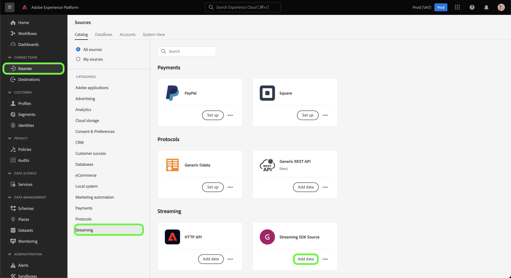

# Creare una connessione sorgente e un flusso di dati per lo streaming *GIOVANE* dati utilizzando l’interfaccia utente

*Passando al modello, sostituisci o elimina tutti i paragrafi in corsivo (a partire da questo).*

*Per iniziare, aggiorna i metadati (titolo e descrizione) nella parte superiore della pagina. Ignora tutte le istanze di UICONTROL in questa pagina. Questo è un tag che aiuta i nostri processi di traduzione automatica a tradurre correttamente la pagina nelle diverse lingue supportate. Dopo l’invio verranno aggiunti dei tag alla documentazione.*

Questa esercitazione fornisce i passaggi per la creazione di un *GIOVANE* connettore di origine tramite l’interfaccia utente di Platform.

## Panoramica

*Fornisci una breve panoramica della tua azienda, compreso il valore che fornisce ai clienti. Includi un collegamento alla pagina principale della documentazione del prodotto per ulteriori informazioni.*

>[!IMPORTANT]
>
>Questa pagina della documentazione è stata creata da *GIOVANE* squadra. Per qualsiasi richiesta di informazioni o di aggiornamento, contattali direttamente all&#39;indirizzo *Inserire un collegamento o un indirizzo e-mail dove è possibile ottenere gli aggiornamenti*.

## Prerequisiti

*Aggiungi in questa sezione informazioni su qualsiasi cosa i clienti devono sapere prima di iniziare a configurare l’origine nell’interfaccia utente di Adobe Experience Platform. Può trattarsi di:*

* *aggiunta a un elenco consentiti*
* *requisiti per l’hash delle e-mail*
* *tutte le specifiche dell&#39;account sul tuo lato*
* *come ottenere le credenziali di autenticazione per la connessione alla piattaforma*

### Raccogli credenziali richieste

Per connettersi *GIOVANE* in Platform, devi fornire valori per le seguenti proprietà di connessione:

| Credenziali | Descrizione | Esempio |
| --- | --- | --- |
| *credenziale uno* | *Aggiungi una breve descrizione alla credenziale di autenticazione della tua sorgente qui* | *Aggiungi un esempio della credenziale di autenticazione della tua origine qui* |
| *credenziale due* | *Aggiungi una breve descrizione alla credenziale di autenticazione della tua sorgente qui* | *Aggiungi un esempio della credenziale di autenticazione della tua origine qui* |
| *credenziale tre* | *Aggiungi una breve descrizione alla credenziale di autenticazione della tua sorgente qui* | *Aggiungi un esempio della credenziale di autenticazione della tua origine qui* |

Per ulteriori informazioni su queste credenziali, consulta la sezione *GIOVANE* documentazione sull’autenticazione. *Aggiungi un collegamento alla documentazione sull’autenticazione della piattaforma qui*.

### Integrare *GIOVANE* con il tuo gancio

*L&#39;SDK per lo streaming richiede che la tua origine sia in grado di supportare i webhook al fine di comunicare con Experience Platform. In questa sezione, devi fornire i passaggi che gli utenti dovranno seguire per integrare YOURSOURCE con un webhook.*

## Collega il tuo *GIOVANE* account

Nell’interfaccia utente di Platform, seleziona **[!UICONTROL Origini]** dalla barra di navigazione a sinistra per accedere al [!UICONTROL Origini] workspace. La [!UICONTROL Catalogo] in viene visualizzata una varietà di sorgenti con cui è possibile creare un account.

Puoi selezionare la categoria appropriata dal catalogo sul lato sinistro dello schermo. In alternativa, è possibile trovare la sorgente specifica con cui si desidera lavorare utilizzando l’opzione di ricerca.

Sotto la **Streaming** categoria, seleziona *GIOVANE*, quindi seleziona **[!UICONTROL Aggiungi dati]**.

>[!TIP]
>
>Le schermate utilizzate di seguito sono esempi. Quando crei la tua documentazione, sostituisci le immagini con le schermate della tua sorgente effettiva. È possibile utilizzare lo stesso pattern e lo stesso colore di contrassegno, nonché gli stessi nomi di file. Assicurati che lo screenshot acquisisca l&#39;intera schermata dell&#39;interfaccia utente di Platform. Per informazioni su come caricare le schermate, consulta la guida su [invio della documentazione per la revisione](../documentation/github.md).

## Seleziona dati

La **[!UICONTROL Seleziona dati]** viene visualizzato un passaggio che fornisce un’interfaccia per selezionare i dati inviati a Platform.

* La parte sinistra dell’interfaccia è un browser che ti consente di visualizzare i flussi di dati disponibili all’interno del tuo account;
* La parte destra dell’interfaccia ti consente di visualizzare in anteprima fino a 100 righe di dati da un file JSON.

Seleziona **[!UICONTROL Caricare file]** per caricare un file JSON dal tuo sistema locale. In alternativa, puoi trascinare e rilasciare il file JSON da caricare nel [!UICONTROL Trascinamento di file] pannello.

Una volta caricato il file, l&#39;interfaccia di anteprima si aggiorna per visualizzare un&#39;anteprima dello schema caricato. L’interfaccia di anteprima ti consente di esaminare il contenuto e la struttura di un file. È inoltre possibile utilizzare [!UICONTROL Campo di ricerca] utilità per accedere a elementi specifici dallo schema.

Al termine, seleziona **[!UICONTROL Successivo]**.

## Dettaglio flusso di dati

La **Dettaglio flusso di dati** viene visualizzato un passaggio che fornisce le opzioni per utilizzare un set di dati esistente o per stabilire un nuovo set di dati per il flusso di dati, nonché l’opportunità di fornire un nome e una descrizione per il flusso di dati. Durante questo passaggio, puoi anche configurare le impostazioni per l’acquisizione di profili, la diagnostica degli errori, l’acquisizione parziale e gli avvisi.

Al termine, seleziona **[!UICONTROL Successivo]**.

## Mappatura

La [!UICONTROL Mappatura] viene visualizzato un passaggio che fornisce un&#39;interfaccia per mappare i campi di origine dallo schema di origine ai campi XDM di destinazione appropriati nello schema di destinazione.

Platform fornisce consigli intelligenti per i campi mappati automaticamente in base allo schema o al set di dati di destinazione selezionato. Puoi regolare manualmente le regole di mappatura in base ai tuoi casi d’uso. In base alle tue esigenze, puoi scegliere di mappare direttamente i campi oppure utilizzare le funzioni di preparazione dei dati per trasformare i dati di origine in valori calcolati o calcolati. Per i passaggi completi sull’utilizzo dell’interfaccia di mappatura e dei campi calcolati, consulta la sezione [Guida all’interfaccia utente della preparazione dei dati](https://experienceleague.adobe.com/docs/experience-platform/data-prep/ui/mapping.html).

Una volta mappati correttamente i dati di origine, seleziona **[!UICONTROL Successivo]**.

## Revisione

La **[!UICONTROL Revisione]** viene visualizzato un passaggio che consente di rivedere il nuovo flusso di dati prima della creazione. I dettagli sono raggruppati nelle seguenti categorie:

* **[!UICONTROL Connessione]**: Mostra il tipo di origine, il percorso pertinente del file di origine scelto e la quantità di colonne all&#39;interno del file di origine.
* **[!UICONTROL Assegna set di dati e campi mappa]**: Mostra il set di dati in cui vengono acquisiti i dati di origine, incluso lo schema a cui il set di dati aderisce.

Dopo aver esaminato il flusso di dati, fai clic su **[!UICONTROL Fine]** e lascia un certo tempo per la creazione del flusso di dati.

## Ottieni l&#39;URL dell&#39;endpoint di streaming

Con il flusso di dati in streaming creato, ora puoi recuperare l’URL dell’endpoint in streaming. Questo endpoint verrà utilizzato per abbonarsi al tuo webhook, consentendo alla tua sorgente di streaming di comunicare con Experience Platform.

Per recuperare l’endpoint di streaming, vai a [!UICONTROL Attività del flusso di dati] della pagina del flusso di dati appena creato e copia l’endpoint dalla parte inferiore della sezione [!UICONTROL Proprietà] pannello.

## Passaggi successivi

*I flussi di lavoro per i passaggi rimanenti della creazione di un flusso di dati sono modularizzati. In caso di chiamate specifiche da effettuare per quanto riguarda la fonte, consulta la sezione delle risorse aggiuntive di seguito.*

Seguendo questa esercitazione, hai stabilito una connessione al tuo *GIOVANE* conto. Ora puoi passare all’esercitazione successiva e [configurare un flusso di dati per l’importazione di dati in Platform](https://experienceleague.adobe.com/docs/experience-platform/sources/ui-tutorials/dataflow/crm.html).

## Risorse aggiuntive

*Si tratta di una sezione facoltativa in cui puoi trovare ulteriori collegamenti alla documentazione del prodotto o a qualsiasi altro passaggio, schermata e sfumature che ritieni importante per il successo del cliente. Puoi utilizzare questa sezione per aggiungere informazioni o suggerimenti sull’intero flusso di lavoro della tua origine, specialmente se ci sono particolari &quot;gotchas&quot; che un utente finale potrebbe incontrare.*
